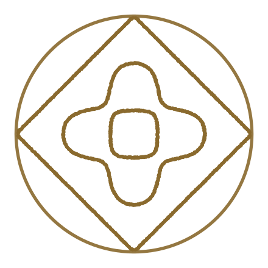

# The grain mark

A Chladni-plate resonance figure inside a circular frame. Grains sit
along the nodal lines of a square-plate eigenmode; on a mode change they
scatter and snap to the next figure. The name is literal — sand
organizing into structure under vibration is the visual metaphor for many
parallel agent processes converging into one deterministic workflow.



## What is where

| Path | What it is |
|---|---|
| `v2/pkg/ui/frontend/src/brand/grain-mark.js` | The renderer, and the one definition of the mark. Vendored from the design pack (build 35); its header lists the three deviations. `createGrainMark()` animates it, `renderStatic()` draws a still. No dependencies. |
| `v2/pkg/ui/frontend/src/components/GrainMark.jsx` | The React component the app uses. Picks between the still and the animation, and picks the tier; see below. |
| `v2/pkg/ui/frontend/scripts/export-brand-assets.mjs` | `npm run brand` in `v2/pkg/ui/frontend`. Regenerates everything below out of the renderer. |
| `v2/pkg/ui/frontend/public/grain-mark-{light,dark}.svg` | The fixed mark as the tiny-tier glyph, as stroke vectors. Scale-free: the favicon, and the still the sidebar shows. |
| `v2/pkg/ui/frontend/public/grain-mark-{light,dark}.png` | The same glyph at 128px. Favicon fallback only, for browsers with no SVG-favicon support (Safari before 16.4). |
| `docs/brand/grain-hero-2-3plus-{light,dark}.svg` | The fixed mark at hero scale, as grains. For a README, a slide, print. |

The assets are committed rather than generated during `npm run build`, so
a checkout builds without running the export. Change the mark or the
colours and you re-run `npm run brand` and commit what it writes.

## The math

Square-plate Chladni eigenfunction, domain normalized to the frame radius:

```
f(x, y) = cos(nπx)·cos(mπy) + s·cos(mπx)·cos(nπy)      s ∈ {−1, +1}
```

Nodal lines are the zero set. `s = −1` (antisymmetric) always contains the
diagonals; `s = +1` (symmetric) does not. Only **integer** `n, m` are real
resonances — fractional values pile up spurious zero-crossings, so never
interpolate a mode number to get between two figures. Scale is the free
parameter instead: the tiny tier reaches its figures by zooming the field
(0.78× and 1.5×) and filtering chains by radial extent, never by moving
`n` or `m`.

## The two states

The mark has exactly two jobs in the app, and the split between them is
the point of it:

**Fixed — 2·3 (+).** Everywhere an icon has to hold still: the favicon,
and the mark beside the wordmark in the sidebar whenever nothing is
running. Below 40px the pack zooms this figure 1.5× and keeps only the
chains inside 0.97 R, which crops the outer square off-frame and leaves
the **plus** and its centre ring — a figure that still reads at 16px,
where the un-zoomed nodal lines would be thinner than a pixel and wash
out to nothing. It ships as a stroke vector, so one file is sharp in
every slot from the 16px tab to a 180px installed shortcut.

**Animated — the cycle.** Shown while agents are actually working, which
in the UI means at least one task is in the `running` state. The pack
runs two cycles on one clock, and which one you see is the size you are
looking at:

| Slot | Full tier (≥ 40px) | Tiny tier (< 40px) |
|---|---|---|
| 0 | 1·4 (−) | X-and-arcs — 1·2 (−) |
| 1 | **2·3 (+)** | diamond — 1·2 (+) |
| 2 | 2·3 (−) | rosette — 2·3 (−) @ 0.78× |
| 3 | 1·4 (+) | **plus** — 2·3 (+) @ 1.5× |

The tiny figures are real eigenmodes too, chosen and cropped to survive
at icon size rather than simplified by hand. The sidebar mark is 24px,
so the tiny cycle is the working animation; `LoadingScreen` runs the
same clock at hero size and so shows the full one.

Both tiers hold the same rule: the animation **opens on the slot its own
tier draws the still with** — slot 3 for the sidebar, slot 1 for the
hero — so the mark comes to life on the figure it was already showing
rather than cutting to a different image. `GrainMark.jsx` looks those
slots up from `MODES`/`TINY_MODES` rather than hard-coding them.

A full loop is about 6.5s: 1.3s of flight between figures, 0.33s held on
each.

Two things suppress the animation and fall back to the still: a reader
who has asked for reduced motion, and an environment with no canvas to
paint on. A hidden tab pauses it.

## Colour

The grain colour is the app's accent, and everything else in the palette
is arranged under it (`v2/pkg/ui/frontend/src/style.css` for the custom
properties, `src/theme.js` for the MUI palette — the two carry the same
values and are edited together).

| | Grain / accent | Ground |
|---|---|---|
| Dark | `#D9A441` wheat | `#0F1013` canvas, `#14161A` surface |
| Light | `#8A6A2E` bronze | `#F7F6F3` canvas, `#FFFFFF` surface |

The gold washes out on white, which is why the light theme gets bronze
instead of the same value at a different opacity. The neutrals are warmed
to sit under both.

`running` is the accent itself rather than a colour of its own: the dot
in a task row and the animating mark in the sidebar are reporting the
same thing. `warning` is pulled off MUI's default bright orange to a
burnt one so it reads as the accent's louder cousin rather than fighting
it; `info` is the one cool tone left, gold's complement.

## Rendering rules by size

- **≥ 300px** — 2000 grains, 0.65% radius, 0.9px jitter (hero, splash)
- **80–300px** — 520 grains, 1.3% radius, no jitter (app icon, avatar)
- **40–80px** — 520 grains, 1.7% radius, no jitter (nav, toolbar)
- **< 40px** — the tiny cycle; 3.75 grains per pixel of width, ~1px
  radius (24px → 90 grains) (sidebar, favicon, badge)

These are keyed to **CSS pixels, not the canvas's backing pixels** —
that is the `sizePx` deviation in the vendored renderer, and it is not
just a density question. The pack tiers off `canvas.width`, so on a 2×
display a 24px mark backs onto a 48px canvas and would fall into the
40–80px tier: the full cycle's figures instead of the glyphs, which is
the wrong picture rather than a sharper one.

## Notes from the design session

- Grains are placed **evenly along the traced figure**, not by falling to
  the nearest zero — otherwise the diagonals (zero for every
  antisymmetric mode) hog nearly all the grains and the lobes vanish.
- Short line fragments that hug the frame edge without reaching inward
  are pruned; they were the "bumps" on the circle boundary.
- The circle frame replaced a hexagon late in the session. `shape: 'hex'`
  is still supported in the renderer if you want it back.
- The canvas particle system is a proof of concept; a version that ran
  the mark large and continuously should move it to a shader. At sidebar
  size it is 90 filled arcs a frame, which is why it is worth keeping
  here — and why it stops when the tab is hidden.
- Grains are allocated to chains **by length**, and chains shorter than
  ~1.5 grain spacings get none — they are marching-squares artifacts,
  and feeding them a minimum starves the real figure.
- The endpoint-matching quantum scales with the marching-squares cell
  (`step/8`). A fixed quantum shatters a 24px figure into sub-pixel
  crumbs.
- Wordmark: **Space Grotesk 600**, lowercase `grain`. The app itself
  ships no webfont and sets the wordmark in the system stack.
