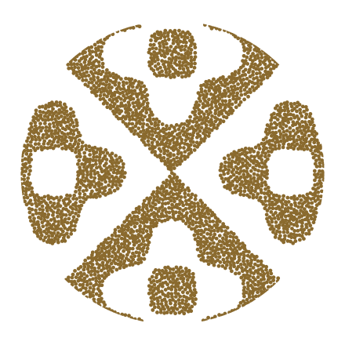

# The grain mark

Four glyphs cut from square-plate Chladni eigenmodes. Each one is a
region of the vibrating plate, stippled into grains; on a mode change
every grain scatters and flies to its place in the next glyph. The name
is literal — sand organizing into structure under vibration is the
visual metaphor for many parallel agent processes converging into one
deterministic workflow.

There is no ring. The circle is an invisible clip, so the shape itself
is the mark.



## What is where

| Path | What it is |
|---|---|
| `v2/pkg/ui/frontend/src/brand/grain-mark.js` | The renderer, and the one definition of the mark. A verbatim copy of the design pack (v2) — see its header. `createGrainMark()` animates it, `renderStatic()` draws a still. No dependencies. |
| `v2/pkg/ui/frontend/src/brand/grain-density.js` | How many grains grain draws, which below 48px is denser than the pack. Kept out of the vendored file so the deviation stays visible as one; see "Sizes". |
| `v2/pkg/ui/frontend/src/components/GrainMark.jsx` | The React component the app uses. Picks between the still and the animation; see below. |
| `v2/pkg/ui/frontend/scripts/export-brand-assets.mjs` | `npm run brand` in `v2/pkg/ui/frontend`. Regenerates everything below out of the renderer. |
| `v2/pkg/ui/frontend/public/grain-mark-{light,dark}.svg` | The static logo as a solid filled path. Scale-free: the favicon, and the still the app shows wherever the mark is not animating. |
| `v2/pkg/ui/frontend/public/grain-mark-{light,dark}.png` | The same fill at 128px. Favicon fallback only, for browsers with no SVG-favicon support (Safari before 16.4). |
| `docs/brand/grain-hero-2-3minus-{light,dark}.svg` | The static logo at hero scale, as grains. For a README, a slide, print. |

The assets are committed rather than generated during `npm run build`, so
a checkout builds without running the export. Change the mark or the
colours and you re-run `npm run brand` and commit what it writes.

## The math

Square-plate Chladni eigenfunction, domain normalized to the frame radius:

```
f(x, y) = cos(nπx)·cos(mπy) + s·cos(mπx)·cos(nπy)      s ∈ {−1, +1}
```

v1 of the mark drew the **nodal lines** — the zero set. v2 fills
**regions** instead: `fillScalar` is the scalar whose positive part is
solid, which for three of the four glyphs is `−f` (the negative lobes,
filled) and for 1·3 (+) is the last factor of `2ab(2a²+2b²−3)`, filling
the centre loop and the corner caps while the grid lines `a = 0`, `b = 0`
come back as stroke overlays. That change is why nothing from v1's
notes about tracing and pruning chains carries over.

Only **integer** `n, m` are real resonances — fractional values pile up
spurious features, so never interpolate a mode number to get between two
figures. Scale is the free parameter instead: two glyphs reach their
shape by zooming the field (`glyphZoom`), never by moving `n` or `m`.

## The glyphs

| Slot | Mode | Glyph | Treatment |
|---|---|---|---|
| 0 | 1·3 (+) | grid-and-loops | centre loop and corner caps filled; the grid lines are stroke overlays, with grain rows along them |
| 1 | 1·2 (+) | diamond | inverted fill |
| 2 | 2·3 (−) | **rosette — the static logo** | inverted fill, zoom 0.78 so the rosette sits inside the circle rather than running off it |
| 3 | 2·3 (+) | plus | inverted fill, zoom 1.5 so it fills the circle; keeps the centre ring |

Cycle order is 0 → 1 → 2 → 3 → 0.

## The two states

The mark has exactly two jobs in the app, and the split between them is
the point of it:

**Still — the 2·3 (−) rosette.** Everywhere an icon has to hold still:
the favicon, the mark beside the wordmark in the sidebar whenever
nothing is running, and a task row that is not currently running. It is
drawn as a **solid fill** rather than as grains, at every size — under
about 20px a grain is smaller than a pixel and the stipple washes out to
a smudge, and a still that switched treatment partway up the size range
would make the sidebar and the loading screen two different pictures of
the same mark. It ships as one scale-free vector, so a single file is
sharp from the 16px tab slot to a 180px installed shortcut.

**Animated — the cycle.** Shown while agents are actually working, which
in the UI means at least one task is in the `running` state. Grains
scatter and fly between the four glyphs on the pack's own clock: a full
loop is about 6.5s, 1.3s of flight between glyphs and 0.33s held on
each. Grains are matched to their targets by nearest free slot, so the
flight reads as sand reorganizing rather than as a crossfade.

The animation **opens on slot 2** — the rosette, the figure the still
was already showing — so the mark comes to life rather than cutting to a
different image. `GrainMark.jsx` reads that slot from the module's
`STATIC_SLOT` rather than hard-coding it.

Two things suppress the animation and fall back to the still: a reader
who has asked for reduced motion, and an environment with no canvas to
paint on. A hidden tab pauses it.

## Sizes

| Where | Size | Why |
|---|---|---|
| Task-row badge (`StateDot.jsx`) | 20px | The floor: below this the glyphs stop being shapes. Replaces an 11px dot, and the ~40px task row absorbs it. |
| Sidebar (`Sidebar.jsx`) | 32px | The four glyphs are clearly distinguishable here, which matters because this mark is a brand element people look at rather than a status light. |
| Loading screen (`LoadingScreen.jsx`) | 320px | Over the pack's 300px threshold, so it gets the full 3200 grains. |

The radius comes from the pack's `grainSpec()` at every size — it is
what keeps a grain a grain. The count does not.

**The pack's curve** scales with area, so density is flat across its
middle band:

- **≥ 300px** — 3200 grains, radius 0.55% of the width (hero, splash)
- **29–299px** — 140·(W/28)² grains, ~1.05px radius
- **≤ 28px** — 230·(W/28)² grains, ~0.85px radius

**Below 48px grain draws more** (`src/brand/grain-density.js`). Scaling
with area means a mark that halves keeps a quarter of its grains, which
is right for a hero and wrong for an icon: at the sidebar and badge
sizes there are too few grains to fill the glyph, and the rosette reads
as a hatched disc rather than as a shape. So under 48px the count stops
falling — a small mark keeps the **grain count of a 48px one**, 411, and
the shrinking area raises the density instead. A 20px badge goes from
117 grains to 411.

There is no seam at the threshold, because 411 is the pack's own count
at exactly that size; and there is no reason to push further, since past
about this count the grains are already touching and the picture stops
changing. What that buys is the behaviour these sizes want: the glyph
reads **solid at rest and grainy only in flight**, which is when the
grains separate anyway. It costs frame time rather than saving it —
several running task rows are several hundred filled arcs each — which
is why the animation still stops on a hidden tab.

`GrainMark.jsx` reads all of this at the mark's **CSS size, not the
canvas's backing size**. The module keys the spec off `canvas.width`, so
on a 2× display a 20px mark backing onto a 40px canvas would take four
times the grains at half the size — a finer stipple, not a sharper one.
The radius is a fraction of `canvas.width` and so scales itself; only
the count needs the correction. Count and radius are both plain options
on the module, so all of this costs the vendoring no deviation.

## Colour

The grain colour is the app's accent, and everything else in the palette
is arranged under it (`v2/pkg/ui/frontend/src/style.css` for the custom
properties, `src/theme.js` for the MUI palette — the two carry the same
values and are edited together).

| | Grain / accent | Ground |
|---|---|---|
| Dark | `#D9A441` wheat | `#0F1013` canvas, `#14161A` surface |
| Light | `#8A6A2E` bronze | `#F7F6F3` canvas, `#FFFFFF` surface |

The gold washes out on white, which is why the light theme gets bronze
instead of the same value at a different opacity. The neutrals are
warmed to sit under both.

`running` is the accent itself rather than a colour of its own: the dot
in a task row and the animating mark in the sidebar are reporting the
same thing. `warning` is pulled off MUI's default bright orange to a
burnt one so it reads as the accent's louder cousin rather than fighting
it; `info` is the one cool tone left, gold's complement.

## Notes on the assets

- The hero SVGs are the pack's own export reproduced: `npm run brand`
  writes the same 440px, seed-42 grain field the pack's `export-svg.mjs`
  does, byte for byte. That is what pins the vendoring — if the module
  drifts from the pack, those two files stop matching.
- The still's vector is traced out of `fillScalar` by marching squares
  and then simplified, because a filled region has no chains to export
  the way v1's line figure did. `grain-mark.test.js` compares the
  committed path back against the field, so a mark changed without
  `npm run brand` being re-run fails rather than leaving the tab showing
  the previous logo.
- The canvas particle system is a proof of concept; a version that ran
  the mark large and continuously should move it to a shader.
  `sampleGlyph()` and `fillScalar()` are pure geometry and port
  straight — evaluate `fillScalar` per pixel for the solid version, or
  drive a GPU particle system with `sampleGlyph` output. At the sizes
  the app uses it is a hundred-odd filled arcs a frame, which is why it
  is worth keeping here — and why it stops when the tab is hidden.
- Wordmark: **Space Grotesk 600**, lowercase `grain`. The app itself
  ships no webfont and sets the wordmark in the system stack.
