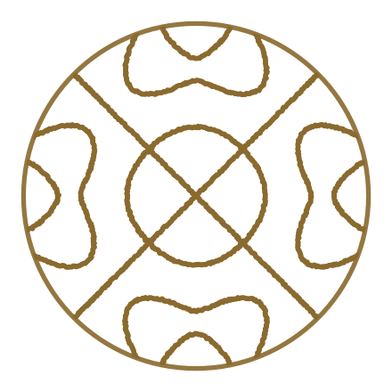

# The grain mark

A Chladni-plate resonance figure inside a circular frame. Grains sit
along the nodal lines of a square-plate eigenmode; on a mode change they
scatter and snap to the next figure. The name is literal — sand
organizing into structure under vibration is the visual metaphor for many
parallel agent processes converging into one deterministic workflow.



## What is where

| Path | What it is |
|---|---|
| `v2/pkg/ui/frontend/src/brand/grain-mark.js` | The renderer, and the one definition of the mark. `createGrainMark()` animates it, `renderStatic()` draws a still. No dependencies. |
| `v2/pkg/ui/frontend/src/components/GrainMark.jsx` | The React component the app uses. Picks between the still and the animation; see below. |
| `v2/pkg/ui/frontend/scripts/export-brand-assets.mjs` | `npm run brand` in `v2/pkg/ui/frontend`. Regenerates everything below out of the renderer. |
| `v2/pkg/ui/frontend/public/grain-mark-{light,dark}.png` | The fixed mark at 128px, filled. The favicon, and the still the sidebar shows. |
| `docs/brand/grain-1-4minus-{light,dark}.svg` | The fixed mark at hero scale, as grains. For a README, a slide, print. |

The assets are committed rather than generated during `npm run build`, so
a checkout builds without running the export. Change the mark or the
colours and you re-run `npm run brand` and commit what it writes.

## The math

Square-plate Chladni eigenfunction, domain normalized to the frame radius:

```
f(x, y) = cos(nπx)·cos(mπy) + s·cos(mπx)·cos(nπy)      s ∈ {−1, +1}
```

Nodal lines are the zero set. `s = −1` (antisymmetric) always contains the
diagonals; `s = +1` (symmetric) does not. Only **integer** `n, m` are real
resonances — fractional values pile up spurious zero-crossings.

## The two states

The mark has exactly two jobs in the app, and the split between them is
the point of it:

**Fixed — 1·4 (−).** Everywhere an icon has to hold still: the favicon,
and the mark beside the wordmark in the sidebar whenever nothing is
running. Drawn in the renderer's `filled` style, which paints the
positive region of the field rather than the nodal lines, because at
16–32px a nodal line is thinner than a pixel and washes out to nothing.

**Animated — the cycle.** Shown while agents are actually working, which
in the UI means at least one task is in the `running` state. The grains
scatter and snap around the four modes:

```
1·4 (−)  →  2·3 (+)  →  2·3 (−)  →  1·4 (+)
```

The cycle starts on 1·4 (−), so the animation begins on the figure the
still was showing and the change reads as the mark coming to life rather
than as a different image.

Two things suppress the animation and fall back to the still: a reader
who has asked for reduced motion, and an environment with no canvas to
paint on. A hidden tab pauses it.

## Colour

The grain colour is the app's accent, and everything else in the palette
is arranged under it (`v2/pkg/ui/frontend/src/style.css` for the custom
properties, `src/theme.js` for the MUI palette — the two carry the same
values and are edited together).

| | Grain / accent | Ground |
|---|---|---|
| Dark | `#D9A441` wheat | `#0F1013` canvas, `#14161A` surface |
| Light | `#8A6A2E` bronze | `#F7F6F3` canvas, `#FFFFFF` surface |

The gold washes out on white, which is why the light theme gets bronze
instead of the same value at a different opacity. The neutrals are warmed
to sit under both.

`running` is the accent itself rather than a colour of its own: the dot
in a task row and the animating mark in the sidebar are reporting the
same thing. `warning` is pulled off MUI's default bright orange to a
burnt one so it reads as the accent's louder cousin rather than fighting
it; `info` is the one cool tone left, gold's complement.

## Rendering rules by size

- **≥ 300px** — grains with jitter (hero, marketing, splash)
- **80–300px** — grains, no jitter, denser (app icon, avatar)
- **40–80px** — grains, no jitter, larger radius (nav, toolbar)
- **< 40px** — filled positive regions (favicon, tab, badge)

`GrainMark.jsx` keys these to CSS pixels rather than the canvas's own
backing pixels, so a mark reads the same on a 2x display as on a 1x one.

## Notes from the design session

- Grains are placed **evenly along the traced figure**, not by falling to
  the nearest zero — otherwise the diagonals (zero for every
  antisymmetric mode) hog nearly all the grains and the lobes vanish.
- Short line fragments that hug the frame edge without reaching inward
  are pruned; they were the "bumps" on the circle boundary.
- The circle frame replaced a hexagon late in the session. `shape: 'hex'`
  is still supported in the renderer if you want it back.
- The canvas particle system is a proof of concept; a version that ran
  the mark large and continuously should move it to a shader. At sidebar
  size it is a few hundred filled arcs a frame, which is why it is worth
  keeping here — and why it stops when the tab is hidden.
- Wordmark: **Space Grotesk 600**, lowercase `grain`. The app itself
  ships no webfont and sets the wordmark in the system stack.
