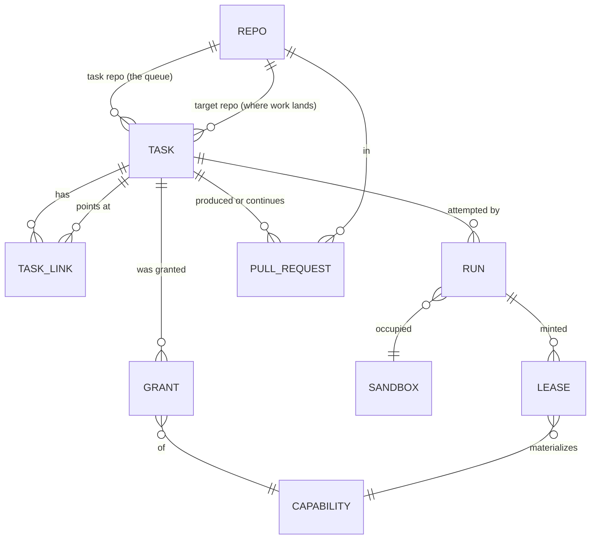

# The task data model

## Status

A design, not an implementation. Nothing in `grain/` changes with this
document; it names the entities the automation loop already manipulates,
states the invariants it already relies on, and proposes a shape that
makes the next few features cost less than the last few did. The
[migration](#migration) at the end is staged so that each stage is
shippable on its own and none of them changes what an operator sees on
GitHub.

The model covers **tasks and everything hanging off one**: the repos a
task names, the capabilities it is granted, the pull requests it produces
or continues, the sub-tasks it spawns, and the runs it takes to get
there. It deliberately does not cover the VM layer (`grain/adapter/`),
the git proxy, or the credential files — those have their own designs and
no task ever names one directly.

## The problem: the model is real, but it is not written down

Grain already has a task data model. It is spread across four places that
each hold a piece of it:

- **GitHub labels** hold a task's state — `trigger_label`,
  `in_progress_label`, `awaiting_reply_label`, `needs_approval_label`,
  `completed_label` — and its capability grants: `gemini_key_label`,
  `self_debug_label`, `self_repair_label`, `scratch_repo_label`,
  `grain-github-<name>`. `labels.py` is explicit that these are two
  different tiers and that a task is in exactly one state at a time, but
  that invariant is prose and a colour-lightness test, not a type.
- **The issue body** holds the rest, as slash directives: `/repo`, `/pr`,
  `/base`, `/auto-merge`, `/review`, `/depends` (`directives.py`).
- **`AutomationState`** holds what only grain knows: which sandbox is
  working which task, what got minted for it, what a poll should compare
  against next cycle.
- **`ResolvedTask`** holds the joined-up answer for exactly as long as one
  `_dispatch` call, and is then flattened onto an `Assignment`.

That arrangement works, and much of it is right for good reasons this
model keeps. What it costs is visible in the shape of the code:

**A new capability costs five edits in four files.** `gemini_key_label`
needed a field on `AutomationConfig`, a row in `labels._STYLES`, a branch
in `_resolve_target`, a field on `ResolvedTask`, a field on `Assignment`
*plus* its hand-written `load`/`save` pair, a revoke branch in
`sweeper._release`, and a reaper of its own in `core.py`. `gcp_key_id`
then repeated every one of those steps for a value that means the same
thing — *something was minted for this task and must be revoked when the
slot frees* — which is why `core.py` now carries `_reap_expired_gcp_keys`
and `_reap_expired_gemini_keys` side by side, two loops that differ only
in which client they call.

**One task is spread across five parallel dicts.** `AutomationState` keys
`assignments`, `pending_questions`, `open_pull_requests`,
`completed_issues`, and `proposed_task_issues` separately, each with its
own `record_*`/`clear_*` pair. They are five views of one entity, and
nothing structurally prevents two of them from disagreeing about the same
issue number.

**Relationships between tasks exist but are not represented.** Three of
them already do, and each is tracked differently:

| Relationship | How it exists today | Where it is stored |
|---|---|---|
| *blocked by* | `/depends 12,34` | re-parsed from the body every cycle |
| *fixes this PR* | `_suggest_fix` files a task | `OpenPullRequest.fix_issue` |
| *proposed while working on* | `_file_proposed_tasks` | an English sentence in the issue body |

The third is the sharpest example: `_file_proposed_tasks` writes
"Proposed by `owner/repo#N` while working on that task" into the body as
prose. The edge is real, grain created it deliberately, and nothing can
query it.

**A bare issue number is not an identity.** `Assignment.issue` is an
`int`, implicitly in whatever `AutomationConfig` currently names as the
task repo. `docs/next-session.md` records what that cost: repointing a
live controller at a different task repo left a stale `sandbox-0 → #201`
assignment that made `_requeue` throw an uncaught 404 and abort
`run_once` entirely. The fix caught the 404. The reason it was possible
is that the record could not tell anyone which repo its number belonged
to.

None of this is urgent. All of it gets worse with sub-tasks, which
multiply every one of the above by the number of children a task has.

## The one decision the rest follows from

**What is a record, and what is a derivation.** Grain already has a
doctrine here, stated in fragments across four module docstrings. Written
out, it is four rules, and the model is mostly just the consequence of
taking them seriously:

1. **GitHub is the system of record for anything a human touches.** A
   task exists because an issue exists. Its text, its state pill, its
   capability grants, and the approval that lets it run are all things a
   human reads and edits on GitHub. Grain never invents a task with no
   issue behind it — which is exactly why `_suggest_fix` and
   `_file_proposed_tasks` file real issues rather than queueing something
   internal.
2. **Grain's store is the record for what only grain knows.** Which
   sandbox holds which task, which key was minted, which comment id a
   poll is comparing against. None of that has a home on GitHub, and none
   of it is a human's to edit.
3. **Anything derivable is derived, never stored.** `branch_name(issue)`,
   `repo_for_sandbox(sandbox)`, `agent_label(sandbox)` are pure
   functions of something already in hand. `Assignment` records
   `branch` only for the PR-continuation case, where the name is the PR
   author's choice and there is nothing to derive it from. This is
   `docs/roadmap.md` item 2's "deterministic, not self-reported."
4. **Anything read from editable text is pinned once, at dispatch, and
   never re-read.** `Assignment.target_owner`, `.base`, `.auto_merge` are
   all on that dataclass for this one reason: an issue body can be edited
   mid-run, and an edit landing between dispatch and finish must not be
   able to redirect where the work lands.

Rule 4 has one deliberate exception, and it is worth naming because the
model has to keep it: **`/depends` is re-read every cycle on purpose.**
Whether a dependency is still open changes with nothing about the task
itself changing, so pinning it at dispatch would mean a task stayed
blocked after its blocker closed. Pinned-at-dispatch is the default;
"evaluated fresh" is a property some relationships have.

## Entities



Seven things. Four of them exist today under other names; three
(`TaskLink`, `Grant`, `Lease`) are the ones that turn repeated special
cases into rows.

### `RepoRef` and repo roles

`RepoRef` stays exactly as `directives.py` already defines it — an
`owner`/`name` pair kept together because nothing ever wants one half.
What the model adds is that a repo is always in a *role* relative to a
task, and the roles have genuinely different rules:

```python
class RepoRole(Enum):
    TASK = "task"        # the queue. One per deployment. Grain writes
                         # labels and comments here and nowhere else.
    TARGET = "target"    # where the clone, branch, and PR happen. Many.
                         # Must be allow-listed; never written to by the
                         # API side except to open and merge a PR.
    SCRATCH = "scratch"  # per-sandbox, derived from the sandbox name,
                         # resolvable only once a slot is assigned.
```

The task/target split is `config.py`'s existing distinction and this
changes nothing about it. Naming `SCRATCH` as a role rather than a
special case is what buys something: `_resolve_target` currently has to
handle "this task's target cannot be known until a sandbox exists" as an
exception to its own pinning discipline, because `repo_for_sandbox`
needs a sandbox name that dispatch has not chosen yet. Recording *how*
a target was bound makes that ordering explicit instead of implicit:

```python
class RepoBinding(Enum):
    DIRECTIVE = "directive"   # /repo owner/name — pinned before dispatch
    DEFAULT = "default"       # config.default_target_repo
    SCRATCH = "scratch"       # resolved at assignment, from the sandbox
    INHERITED = "inherited"   # a sub-task taking its parent's target
```

The allowlist is unchanged and stays where it is
(`/data/config/repo-allowlist.json`, enforced on both the API and
git-transport sides). It is a property of the deployment, not of a task,
and the model has no business copying it.

### `TaskRef` — identity

```python
@dataclass(frozen=True)
class TaskRef:
    repo: RepoRef   # the *task* repo — the queue, never the target
    number: int
```

Every stored reference to a task carries the repo its number is in. This
is a small change with one specific payoff: a record left over from a
different task repo becomes self-identifying. It does not 404, it does
not match anything current, and a reconciliation pass can drop it —
rather than the 404-catching workaround `_requeue` needs today.

Issues and PRs share one number sequence per repo on GitHub, so a
`TaskRef` is unambiguous even though a PR is also an issue. That is the
same property `Assignment.issue`'s comment already relies on.

### `Task` — the aggregate

```python
@dataclass(frozen=True)
class Task:
    ref: TaskRef
    intent: TaskIntent
    state: TaskState
    origin: TaskOrigin

    target: RepoRef | None          # None until a SCRATCH binding resolves
    binding: RepoBinding
    base: str | None                # /base, else the target's default

    grants: frozenset[Grant]
    links: tuple[TaskLink, ...]

    pull_request: PullRequestRef | None   # produced, continued, or reviewed
    auto_merge: bool

    tags: frozenset[str]            # e.g. a scheduled job's marker label

    created_at: datetime
    state_since: datetime
```

Four of those fields need their own vocabulary.

**`TaskIntent` — what finishing means.** This is `TriggerKind` widened
from three cases to four and moved onto the task, where it belongs: it is
a property of what was asked for, not of the run that attempts it.

```python
class TaskIntent(Enum):
    IMPLEMENT = "implement"  # fresh branch -> a new PR
    CONTINUE  = "continue"   # /pr — more commits on an existing branch
    REVIEW    = "review"     # /review — post a draft review, push nothing
    ANALYZE   = "analyze"    # answer in a comment; no branch expected
```

The first three are today's `TriggerKind.ISSUE`/`PR`/`REVIEW` and carry
their existing meaning: a successful finish is a new PR, new commits on
the named branch, or a posted draft review respectively.

`ANALYZE` is new *as a declaration*, though the behaviour is old. Grain
already supports analysis-only tasks, but it detects them after the fact:
`_finish_no_changes` runs when the branch never appeared and the agent
called `comment_on_issue`. That makes "no branch appeared" ambiguous
between *this was never going to produce one* and *the agent failed to
push*, which is the ambiguity `docs/roadmap.md` item 21 ("stop letting an
agent's own signal decide whether a PR opens") is about. A declared
intent resolves it from the other end: an `IMPLEMENT` task that produced
no branch has failed, and an `ANALYZE` task that produced one is a
surprise worth surfacing. The existing behaviour stays the default for a
task that declares nothing, so this costs no compatibility.

**`TaskState` — one at a time.**

```python
class TaskState(Enum):
    PROPOSED = "proposed"              # needs_approval_label
    QUEUED = "queued"                  # trigger_label
    RUNNING = "running"                # in_progress_label + agent_label
    AWAITING_REPLY = "awaiting_reply"  # awaiting_reply_label
    COMPLETED = "completed"            # completed_label
    CLOSED = "closed"                  # the issue itself is closed
```

`labels.py` already asserts that a task is in exactly one state, and
`_dispatch` already strips the old label as it applies the new one. As an
enum with a projection onto labels, that invariant is enforced by
construction: there is one place that writes state, and it cannot leave
two pills on an issue because it does not have a way to express that.

**Blocked is deliberately not a state.** `waiting_on_dependency_label` is
in the capability tier today, and `labels.py` gives the reason: a blocked
task is still queued, it is just visibly not runnable yet, so the label
must read as an annotation beside the state pill rather than replacing
it. The model keeps that exactly — `is_blocked` is derived from the
task's own links (`any(link.unresolved for link in task.links if
link.blocks)`), and the label is a projection of that derivation. No new
state, no change to what an operator sees.

**`TaskOrigin` — who asked.** Today this is inferable only from which
label a task was filed with, and only for two of the four cases.

```python
class TaskOrigin(Enum):
    HUMAN = "human"          # somebody filed and labelled an issue
    SCHEDULED = "scheduled"  # scheduled_jobs.py filed it from a template
    FIX = "fix"              # _suggest_fix filed it for a broken PR
    PROPOSED = "proposed"    # propose_task, or a parent decomposing
```

Origin matters because it decides the *default* landing state, which is
the whole trust model in one line: a `HUMAN` task lands `QUEUED`; `FIX`
and `PROPOSED` tasks land `PROPOSED` and wait for a human to apply
`trigger_label` or comment `/lgtm`. That is precisely the rule
`_suggest_fix` and `_file_proposed_tasks` each implement separately
today, and stating it once means a fifth origin cannot forget it.
`SCHEDULED` is the one origin that chooses per instance —
`ScheduledJob.needs_approval` already decides whether a firing lands
queued or waiting — which the model keeps as an override on the origin's
default rather than a fifth code path.

A scheduled job also carries a `marker_label` derived from its name,
which is neither a state nor a capability: it is an idempotency tag, the
thing `_scheduled_jobs` lists by to find out whether the previous firing
has finished. The model keeps it exactly as it is, as a `tags` set on the
task, precisely so it is not mistaken for either tier.

### `Capability`, `Grant`, `Lease`

The part with the most repetition to collapse, and the part where the
existing rules are most worth keeping intact.

A capability travels through four distinct moments, and today only the
Gemini key travels all four with code written for it at each step:

1. **Requested** — a label on the issue, or a directive in trusted text.
2. **Resolved** — can this deployment honour it? If not, the task parks
   with an explanation rather than running without it.
3. **Materialized** — something is minted, placed in the sandbox, and
   named in the agent's prompt.
4. **Revoked** — when the slot frees, or when a deadline passes.

```python
class GrantSource(Enum):
    LABEL = "label"          # a human applied it. The trust gate.
    DIRECTIVE = "directive"  # a trusted author wrote it in the body
    GRAIN = "grain"          # grain applies it to itself (blocked marker)

@dataclass(frozen=True)
class Capability:
    name: str                     # "gemini-key", "self-repair", ...
    label: str                    # the label that requests it
    source: GrantSource
    requires: str | None          # the deployment config it needs, if any
    materializes: bool            # does honouring it mint something?
    max_lease: timedelta | None   # revoke unconditionally after this
```

The registry replaces both `labels._STYLES`'s capability tier and the
per-capability branches in `_resolve_target`. Four properties are worth
stating as properties of the *model*, because each is a rule the current
code follows by convention and could stop following by accident:

- **A grant is never inferred from untrusted text.** `source` is `LABEL`
  for everything that carries no value, because applying a label already
  requires the write access that the trigger gate itself depends on. This
  is bwsalmon/agents#49's reasoning, unchanged: `/gemini-key` was
  rejected as a directive precisely because a label carries the same
  trust with less machinery. `DIRECTIVE` is reserved for grants that
  carry a *value* a label cannot (`/base`, `/pr`), and those are read only
  from authors in `_TRUSTED_REPLY_ASSOCIATIONS`.
- **Unhonourable means parked, never silently downgraded.** `requires`
  names the deployment config — `gemini_key_config`, `scratch_repo_config`,
  a `<name>.token` — whose absence parks the task with a comment saying
  what an operator would have to configure. Three capabilities do this
  today, each with its own hand-written message; the difference between
  them is which config is missing, which is a field, not a code path.
- **A grant is not a state.** The two-tier palette exists to keep a
  modifier from out-shouting the state pill, and `Grant` being a separate
  field from `state` is that same separation in the type.
- **Capabilities do not travel down.** A sub-task inherits its parent's
  *repo*, never its grants. See [sub-tasks](#sub-tasks-are-tasks).

A `Lease` is what materialization produced:

```python
@dataclass(frozen=True)
class Lease:
    capability: str          # which capability minted this
    resource: str            # gemini key name, gcp key id, ...
    issued_at: datetime
    expires_at: datetime | None
```

`Assignment.gemini_key_name` and `Assignment.gcp_key_id` both become
rows in `run.leases`. That single change collapses three pieces of
duplication: the two branches in `sweeper._release` become one loop, the
two reapers in `core.py` become one pass over leases with an
`expires_at`, and the two hand-written `load`/`save` field pairs in
`state.py` become one list. Revocation stays idempotent — a lease
revoked twice, or revoked for a resource already gone, is not an error —
because the reaper and the release path can both reach the same lease and
today already have to tolerate that.

### `TaskLink` — relationships, including sub-tasks

```python
class LinkKind(Enum):
    DEPENDS_ON = "depends-on"    # /depends. Blocks. Evaluated every cycle.
    CHILD_OF = "child-of"        # decomposition. Blocks the parent.
    FIXES = "fixes"              # -> a PullRequestRef, not a task
    PROPOSED_BY = "proposed-by"  # provenance only. Never blocks.

@dataclass(frozen=True)
class TaskLink:
    kind: LinkKind
    target: TaskRef | PullRequestRef
    blocks: bool          # derived from kind; stored for the projection
```

`DEPENDS_ON` is `/depends` with its existing semantics, including the
deliberate exception to pinning: it is evaluated fresh every cycle so a
task unblocks the moment its last dependency closes, with no reply
needed. `FIXES` is `OpenPullRequest.fix_issue` read from the other
direction. `PROPOSED_BY` is the English sentence `_file_proposed_tasks`
writes today, made queryable — it never blocks anything, it just answers
"where did this task come from" without parsing prose.

One rule the model adds because its absence is currently a silent trap:
**links form a DAG.** `/depends 12` on an issue that #12 already depends
on deadlocks both, forever, with no signal anywhere. A cycle should be
refused at the point the link is created, with the same parking comment
every other unusable directive gets.

### Sub-tasks are tasks

**A sub-task is an ordinary `Task` with a `CHILD_OF` link.** Not a new
entity, not a row in a parent's body, not an internal work item.

The reason is the same one that made `_suggest_fix` and
`_file_proposed_tasks` file real GitHub issues rather than queueing
something internal: a task that is not an issue is invisible to exactly
the people whose approval the entire trust model rests on. A human cannot
label it, comment on it, `/lgtm` it, or close it to cancel it — and every
one of those is a control grain depends on. The cost is real (a busy
decomposition fills the queue with issues) and it is the right cost.

Five rules, each of which is a decision that could go the other way:

**Children inherit the target repo and base, not the grants.** The common
decomposition is "same repo, smaller piece", so `RepoBinding.INHERITED`
is the default and an explicit `/repo` on the child overrides it.
Capabilities do *not* inherit, and this is the load-bearing one: an agent
granted `self-repair` once, whose children inherited it, would have
converted a single human grant into an unbounded number of uses of that
grant. Every child asks for its capabilities on its own issue, where a
human can see the request and decide — which is the same reason
`propose_task` files with `needs_approval_label` instead of
`trigger_label`.

**A parent is not complete while a child is open.** Otherwise the
completion signal means nothing: a parent could report done with the
majority of its work unstarted. This needs no new machinery — an open
child is an unresolved blocking link, which is exactly what `/depends`
already knows how to evaluate every cycle, so the parent simply stays
blocked and unblocks itself when the last child closes.

**Children land in `PROPOSED`, like every other grain-filed task.**
`TaskOrigin.PROPOSED`, `needs_approval_label`, promoted by a human or a
`/lgtm`. A deployment that finds this too slow can opt into
auto-approving children that request no capabilities and target the same
repo as their parent — but the safe default is the one that already
exists, and it should stay the default.

**Depth and fan-out are bounded.** A child of a child of a child is
almost always an agent looping, and the cheapest place to discover that
is at creation, as a refusal with an explanation, rather than in the
queue. A limit of 2 levels and a small fan-out cap per parent, both
configurable, are enough — the failure this prevents is a runaway, not a
legitimate deep tree.

**The parent's own PR is not the children's.** Each child that implements
something opens its own PR against the same base. Serializing children
onto one branch would make them undispatchable in parallel, which is the
entire reason to decompose in the first place.

### `PullRequestRef` and the tracked PR

```python
@dataclass(frozen=True)
class PullRequestRef:
    repo: RepoRef        # the *target* repo, never the task repo
    number: int

class PrHealth(Enum):
    UNKNOWN = "unknown"        # GitHub hasn't computed mergeability yet
    CLEAN = "clean"
    CONFLICTED = "conflicted"
    FAILING = "failing"
    MERGED = "merged"
    CLOSED = "closed"

@dataclass(frozen=True)
class TrackedPullRequest:
    ref: PullRequestRef
    task: TaskRef
    branch: str
    base: str
    auto_merge: bool
    health: PrHealth
    fix_task: TaskRef | None
```

This is `OpenPullRequest` with a repo-qualified identity and `_PrHealth`
folded in as an enum instead of a tri-state of booleans. `UNKNOWN` keeps
the distinction that matters and that `_close_finished_prs` already
depends on: GitHub computes mergeability asynchronously, so `None` right
after a push means *check again next cycle*, never *conflicted*.

**The wire types stay separate.** `PullRequestDetail`, `Issue`, and
`Comment` in `github.py` are projections of GitHub's records, shaped by
what GitHub's endpoints return, and `github.py`'s own docstrings already
argue for keeping `PullRequest` and `PullRequestDetail` apart rather than
widening one. Nothing here merges them: `TrackedPullRequest` is grain's
record *about* a PR, and it is refreshed from a `PullRequestDetail` read.

**A PR is an artifact, not a task.** The three PR-shaped relationships a
task can have — produced one, continues one (`/pr`), reviews one
(`/review`) — are `TaskIntent`, above. `TrackedPullRequest` exists for
the fourth thing: a PR grain opened and is still watching, so it can
close the task when the PR closes, merge it if `auto_merge`, or file a
fix task when it goes red.

### `Run` — one attempt

```python
@dataclass(frozen=True)
class Run:
    id: str
    task: TaskRef
    sandbox: str
    unit: str
    started_at: datetime
    finished_at: datetime | None    # None = live. This is the assignment.
    outcome: str | None
    leases: tuple[Lease, ...]
    attempt: int
```

`Assignment` and `SessionHistory`'s record are two shapes of the same
thing separated by whether it has finished. Making a live run a `Run`
with no `finished_at` — and `assignments` a `sandbox -> run_id` index
rather than a second copy of the data — removes the need to copy fields
from one into the other at release time, which is what `sweeper._release`
spends most of its length doing.

It also makes something answerable that is not answerable today: **how
many times has this task been attempted.** `_requeue` puts a task back in
the queue on a timeout, a lost sandbox, or an orphaned in-progress
label, and nothing counts. A task that has failed four times is almost
certainly not going to succeed on the fifth, and today the only way to
notice is for a human to read the issue's history.

## Invariants

Each of these is a rule the current code follows, and each is a test in
the model:

1. A task is in exactly one `TaskState`. Blocked is derived, not a state.
2. A task's target repo and base are pinned before its first push and not
   re-read from editable text afterwards.
3. `/depends` and child links are evaluated fresh every cycle — the one
   deliberate exception to (2), because their truth changes with nothing
   about the task changing.
4. Every lease has exactly one owning run; revocation is idempotent and
   happens on every path that frees a slot.
5. Task links form a DAG.
6. Every stored reference names its repo. A record from a repo this
   deployment no longer polls is droppable, not a 404.
7. Derived values are never stored: branch names, scratch repo names,
   agent labels.
8. A capability this deployment cannot honour parks the task with an
   explanation. It never runs the task without the capability.
9. A grain-filed task lands in `PROPOSED`, whatever filed it.

## What maps to what

| Today | In the model |
|---|---|
| `Assignment.issue` (bare int) | `TaskRef(repo, number)` |
| `Assignment` (live) | `Run` with `finished_at is None` |
| `SessionHistory` record | `Run` with `finished_at` set |
| `TriggerKind` | `TaskIntent`, on the task |
| `Assignment.gemini_key_name`, `.gcp_key_id` | `Run.leases` |
| `Assignment.target_owner/.target_repo/.base` | `Task.target`, `Task.base` |
| `ResolvedTask` | `Task`, persisted rather than per-dispatch |
| `OpenPullRequest` | `TrackedPullRequest` |
| `_PrHealth` | `PrHealth` |
| `PendingQuestion` | `Task` in `AWAITING_REPLY` + its baseline comment id |
| `CompletedIssue` | `Task` in `COMPLETED` + its baseline comment id |
| `proposed_task_issues` | `Task` in `PROPOSED` |
| `OpenPullRequest.fix_issue` | a `FIXES` link |
| "Proposed by X" prose in a body | a `PROPOSED_BY` link |
| `/depends` re-parsed each cycle | `DEPENDS_ON` links, still re-evaluated |
| `labels._STYLES` capability rows | the `Capability` registry |
| `_resolve_target`'s per-label branches | `Capability.requires` |
| `labels._STYLES` state rows | `TaskState`'s projection |
| `ScheduledJob.marker_label` | `Task.tags` — neither tier |
| `repo_for_sandbox`, `branch_name`, `agent_label` | unchanged, still derived |

The five state dicts become one store keyed by `TaskRef`, with the
existing durability discipline unchanged: atomic temp-file-and-rename,
written incrementally as the loop mutates it rather than once at the end
of `run_once`. A `version` field and the established
`.get()`-with-a-default convention carry an on-disk file forward.

## Migration

Four stages. Each ships on its own, and none changes a label, a
directive, or anything an operator sees.

1. **Identity and the store.** `TaskRef` everywhere, five dicts collapsed
   into one keyed store, behind the existing `AutomationState` method
   names so no call site moves. Load migrates an old file in place. This
   is the stage that pays for itself immediately — it retires the
   404-catching workaround and makes every later stage a local change.
2. **The capability registry.** `Capability` rows, `Grant`, `Lease`.
   `_resolve_target`'s per-label branches become a loop; `_release`'s two
   revoke branches become one; the two reapers become one. Behaviour
   identical, including every parking message.
3. **Links.** `DEPENDS_ON` and `FIXES` migrated off their current
   representations, `PROPOSED_BY` recorded instead of written as prose,
   DAG check added. Still no sub-tasks — this is the stage that makes
   them cheap.
4. **Sub-tasks and runs.** `CHILD_OF`, the depth and fan-out bounds, the
   parent-blocked-by-children rule, and `Run` replacing the
   assignment/history split with an attempt count.

## What this does not change

- **Labels stay the human interface.** Every state and grant is still
  visible on the issue, in the same two-tier palette, with the same
  colours and the same meanings.
- **GitHub stays the system of record.** No task exists without an issue.
- **No new service, no database.** One JSON file under `/data/state`,
  written the same atomic way.
- **The trust gate is untouched.** A task runs because a human labelled
  it. Directives are read only from authors who could have applied that
  label. Agents get no GitHub API access.

## Open questions

- **When does one JSON file stop working?** The store is rewritten whole
  on every save. At a few hundred tasks that is nothing; sub-tasks are
  the first feature that could multiply the count by an order of
  magnitude. Worth measuring before stage 4, not before stage 1.
- **Who wins when the store and the labels disagree?** Recommendation:
  the store is authoritative and the labels are a projection reconciled
  every cycle — `_refresh_agent_labels`'s existing self-healing loop
  ("reapply every cycle; it is a no-op once it is already there") is the
  precedent and it works. The exception is the trigger label itself,
  where a human's action is the input and the store must follow.
- **Should an approved parent auto-approve its children?** Recommendation
  above is no by default, with an opt-in for children that request no
  capabilities and inherit their parent's repo. If decomposition turns
  out to be common, this is the first knob to revisit.
- **Does `ANALYZE` need to be declarable, or is a fourth intent enough
  inferred?** Declaring it resolves roadmap item 21's ambiguity from the
  task's end; inferring it is what happens today and costs nothing new.
  The model supports both; the directive to declare it is a separate,
  smaller decision.
