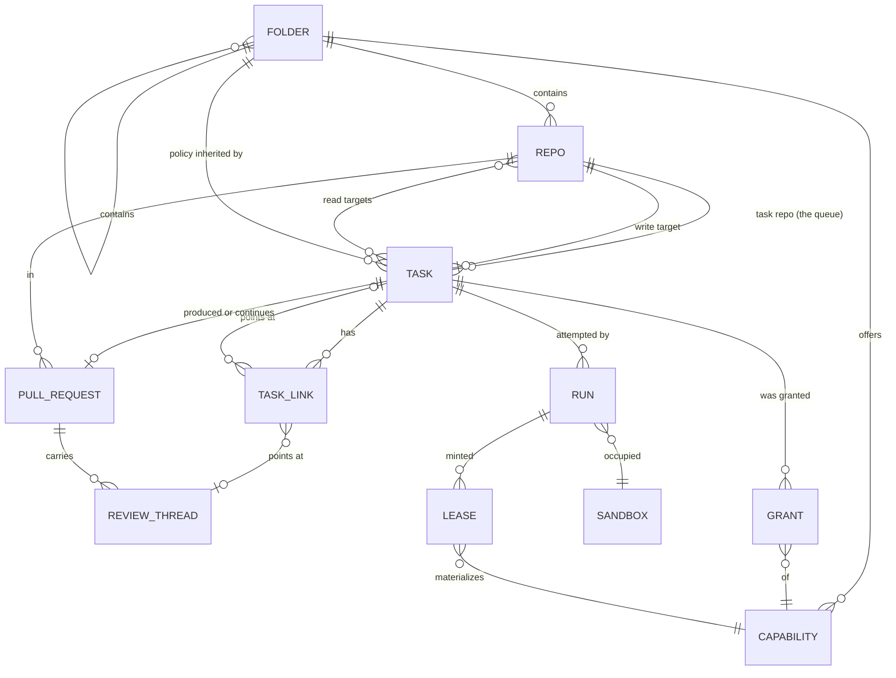

# The task data model

## Status

A design, not an implementation. Nothing in `grain/` changes with this
document. One question is
[decided](#decided-whoever-writes-it-owns-it) — three records, sorted by
who writes what — and one
[direction](#direction-the-declaration-moves-into-a-repo) is stated but
not settled: the declared half of the model moving out of issues and into
a repo, with [a first-party UI](#direction-a-first-party-ui) over it.
Everything below is written for tasks-as-issues and stays correct for
that; it names the entities the automation loop already manipulates,
states the invariants it already relies on, and proposes a shape that
makes the next few features cost less than the last few did. The
[migration](#migration) at the end is staged so that each stage is
shippable on its own and none of them changes what an operator sees on
GitHub.

The model covers **tasks and everything hanging off one**: the repos a
task reads and writes, the folder tree whose policy it inherits, the
capabilities it is granted, the pull requests it produces or continues,
the review threads it answers, the sub-tasks it spawns, and the runs it
takes to get there. It deliberately does not cover the VM layer (`grain/adapter/`),
the git proxy, or the credential files — those have their own designs and
no task ever names one directly.

## The problem: the model is real, but it is not written down

Grain already has a task data model. It is spread across four places that
each hold a piece of it:

- **GitHub labels** hold a task's state — `trigger_label`,
  `in_progress_label`, `awaiting_reply_label`, `needs_approval_label`,
  `completed_label` — and its capability grants: `gemini_key_label`,
  `self_debug_label`, `self_repair_label`, `scratch_repo_label`,
  `grain-github-<name>`. `labels.py` is explicit that these are two
  different tiers and that a task is in exactly one state at a time, but
  that invariant is prose and a colour-lightness test, not a type.
- **The issue body** holds the rest, as slash directives: `/repo`, `/pr`,
  `/base`, `/auto-merge`, `/review`, `/depends` (`directives.py`).
- **`AutomationState`** holds what only grain knows: which sandbox is
  working which task, what got minted for it, what a poll should compare
  against next cycle.
- **`ResolvedTask`** holds the joined-up answer for exactly as long as one
  `_dispatch` call, and is then flattened onto an `Assignment`.

That arrangement works, and much of it is right for good reasons this
model keeps. What it costs is visible in the shape of the code:

**A new capability costs five edits in four files.** `gemini_key_label`
needed a field on `AutomationConfig`, a row in `labels._STYLES`, a branch
in `_resolve_target`, a field on `ResolvedTask`, a field on `Assignment`
*plus* its hand-written `load`/`save` pair, a revoke branch in
`sweeper._release`, and a reaper of its own in `core.py`. `gcp_key_id`
then repeated every one of those steps for a value that means the same
thing — *something was minted for this task and must be revoked when the
slot frees* — which is why `core.py` now carries `_reap_expired_gcp_keys`
and `_reap_expired_gemini_keys` side by side, two loops that differ only
in which client they call.

**One task is spread across five parallel dicts.** `AutomationState` keys
`assignments`, `pending_questions`, `open_pull_requests`,
`completed_issues`, and `proposed_task_issues` separately, each with its
own `record_*`/`clear_*` pair. They are five views of one entity, and
nothing structurally prevents two of them from disagreeing about the same
issue number.

**Relationships between tasks exist but are not represented.** Three of
them already do, and each is tracked differently:

| Relationship | How it exists today | Where it is stored |
|---|---|---|
| *blocked by* | `/depends 12,34` | re-parsed from the body every cycle |
| *fixes this PR* | `_suggest_fix` files a task | `OpenPullRequest.fix_issue` |
| *proposed while working on* | `_file_proposed_tasks` | an English sentence in the issue body |

The third is the sharpest example: `_file_proposed_tasks` writes
"Proposed by `owner/repo#N` while working on that task" into the body as
prose. The edge is real, grain created it deliberately, and nothing can
query it.

**A bare issue number is not an identity.** `Assignment.issue` is an
`int`, implicitly in whatever `AutomationConfig` currently names as the
task repo. `docs/next-session.md` records what that cost: repointing a
live controller at a different task repo left a stale `sandbox-0 → #201`
assignment that made `_requeue` throw an uncaught 404 and abort
`run_once` entirely. The fix caught the 404. The reason it was possible
is that the record could not tell anyone which repo its number belonged
to.

None of this is urgent. All of it gets worse with sub-tasks, which
multiply every one of the above by the number of children a task has.

## The one decision the rest follows from

**What is a record, and what is a derivation.** Grain already has a
doctrine here, stated in fragments across four module docstrings. Written
out, it is four rules, and the model is mostly just the consequence of
taking them seriously:

1. **GitHub is the system of record for anything a human touches.** A
   task exists because an issue exists. Its text, its state pill, its
   capability grants, and the approval that lets it run are all things a
   human reads and edits on GitHub. Grain never invents a task with no
   issue behind it — which is exactly why `_suggest_fix` and
   `_file_proposed_tasks` file real issues rather than queueing something
   internal.
2. **Grain's store is the record for what only grain knows.** Which
   sandbox holds which task, which key was minted, which comment id a
   poll is comparing against. None of that has a home on GitHub, and none
   of it is a human's to edit.
3. **Anything derivable is derived, never stored.** `branch_name(issue)`,
   `repo_for_sandbox(sandbox)`, `agent_label(sandbox)` are pure
   functions of something already in hand. `Assignment` records
   `branch` only for the PR-continuation case, where the name is the PR
   author's choice and there is nothing to derive it from. This is
   `docs/roadmap.md` item 2's "deterministic, not self-reported."
4. **Anything read from editable text is pinned once, at dispatch, and
   never re-read.** `Assignment.target_owner`, `.base`, `.auto_merge` are
   all on that dataclass for this one reason: an issue body can be edited
   mid-run, and an edit landing between dispatch and finish must not be
   able to redirect where the work lands.

Rule 4 has one deliberate exception, and it is worth naming because the
model has to keep it: **`/depends` is re-read every cycle on purpose.**
Whether a dependency is still open changes with nothing about the task
itself changing, so pinning it at dispatch would mean a task stayed
blocked after its blocker closed. Pinned-at-dispatch is the default;
"evaluated fresh" is a property some relationships have.

### Decided: whoever writes it, owns it

Where grain's own store and GitHub's labels disagree, **the store wins**.
Labels are a projection, reconciled every cycle by reasserting what the
store believes — the self-healing shape `_refresh_agent_labels` already
uses, where a label knocked off by hand comes back on the next pass
rather than staying wrong.

But "the store is authoritative" is too broad as a general rule, and the
place it breaks is pull requests. Whether a PR is open, whether it merges
cleanly, whether its checks pass, whether a human resolved a review
thread — none of that is grain's to decide. Grain did not cause it and
cannot overrule it. If the store says a PR is clean and GitHub says it is
conflicted, GitHub is right, and no amount of reasserting will change it.

So the rule is not two categories but three, and the test that sorts them
is **who is the writer**:

| | Written by | Record | Grain's copy is |
|---|---|---|---|
| **Declaration** | a human, deliberately | the issue body — or a repo, per the direction below | the parsed form, pinned at dispatch |
| **Grain's own acts** | grain, and only grain | the store | the record itself |
| **The outside world** | GitHub, and humans through it | GitHub | a baseline, not a belief |

The third row is what the PR case is about, and it covers more than PRs:
issue open/closed (`_is_issue_closed`'s cancel-on-close poll), branch
existence and head sha, check runs, review threads and their resolution,
and every label a *human* applies.

**Grain already behaves this way; it just was not written down.**
`PullRequestDetail.mergeable` is read as `None` while GitHub is still
computing it, and `_close_finished_prs` treats that as "ask again next
cycle" rather than as an answer — an explicit admission that grain's view
is a possibly-absent cache of something it does not own. Every finish
path calls `branch_exists` before acting, on the stated grounds that the
unit exiting zero is not proof the branch is there. That is the same rule:
for anything GitHub owns, a fresh read beats grain's own record.

**A stale copy is not corruption — it is the signal.** This is the part
worth being precise about, because "cache" undersells it. When the store
says grain opened PR #42 and a fresh read says #42 is closed, the store
is not wrong; it holds the *previous* value, and the delta is exactly the
event `_close_finished_prs` exists to notice. The same shape is already
load-bearing three times over: `PendingQuestion.question_comment_id` and
`CompletedIssue.baseline_comment_id` are both last-seen values whose only
purpose is comparison against a fresh read. So the store's copy of an
external fact is a **baseline**, and its job is delta detection rather
than truth.

**The trigger label stops being an exception.** In the two-category
version it had to be carved out — a human applying it is an input, not a
claim about state. With three categories it is simply an ordinary member
of the third: a thing the outside world writes, which grain observes and
never reasserts. The carve-out was an artifact of the wrong number of
categories.

### What grain still owns about a pull request

GitHub owns a PR's **state**. Grain owns its **meaning in the task
model**, and GitHub has no representation for any of it:

- which task the PR belongs to, and why it exists;
- whether it was asked to auto-merge (a property of the *task's*
  declaration, not of the PR);
- whether it is a member of a `MERGE_WITH` group;
- which of its review threads have already been turned into tasks;
- whether grain is still watching it at all.

So `TrackedPullRequest` keeps every field that is grain's own and marks
the rest as observed:

```python
@dataclass(frozen=True)
class TrackedPullRequest:
    ref: PullRequestRef
    task: TaskRef
    branch: str
    base: str
    auto_merge: bool              # the task's declaration
    merge_group: tuple[TaskRef, ...]

    # Observed. A baseline for comparison, never a basis for a decision
    # without a fresh read.
    health: PrHealth
    head: str | None              # last-seen head sha
    observed_at: datetime | None
```

`head` is what makes "did anything change since we last looked" a cheap
question — for the review-comment loop bound, for confirming an agent
actually pushed, and for deciding whether a cached `health` is worth
trusting for one more cycle. `BranchHead` (sha plus commit message)
already exists and already returns it.

**One disagreement is a decision, not a fact.** GitHub has its own
auto-merge feature. If somebody enables it on a PR whose task did not ask
for it, grain and GitHub disagree about what *should* happen rather than
about what is true. Grain should not fight it: the PR merging is an
observation like any other, and `_close_finished_prs` already handles a
merged PR correctly. Nothing should try to turn it back off.

### Representation is not the model

The entities below are the model. Every storage and wire detail this
document mentions is **representation**, and each can change without the
model changing:

| Model | Representation, today |
|---|---|
| a task has a stable identity | a GitHub issue number in a repo |
| `TaskState` | a label, in a particular hex colour |
| `Grant` of a capability | a label named `grain-<capability>` |
| a task's declared fields | slash directives in an issue body |
| the store | one JSON file, rewritten whole |
| `PrHealth` | GitHub's `mergeable: true/false/null` |
| `Folder` | a JSON file under `/data/config` |

Reading the table top to bottom is also a list of the places this
document has had to argue about a representation as if it were a design
question — the label palette, the directive grammar, whether a folder
name extends `/repo`. Naming the split once is what makes those
recognisable as the smaller questions they are.

**The three records want three different representations, and should not
share one.** This is the most useful thing the split buys, and it is
easy to miss:

- **Declaration** is reviewed in pull requests, so it must be diffable,
  human-readable text. Its pressure is legibility in a diff.
- **Grain's own record** is written many times an hour and read by both
  the loop and a UI. Its pressure is cheap read-modify-write with atomic
  durability — which is what a whole-file JSON rewrite is already
  straining against.
- **Observed facts** are a cache of something GitHub owns. Their pressure
  is freshness, and their durability requirement is the weakest of the
  three: losing them costs an API refetch, not correctness.

That last point is a real freedom rather than a technicality. The
observed record does not need to live in the durable store at all — it
can be in memory, or in a file that is safe to delete. The one caveat is
baselines: losing `CompletedIssue.baseline_comment_id` or
`PendingQuestion.question_comment_id` degrades rather than corrupts, and
`CompletedIssue` already re-primes from a fresh read by design for
exactly this reason, but a lost question baseline can cost a redispatch
nobody asked for. Rebuildable, not free.

**The anti-pattern to avoid is already in the codebase.**
`AutomationState.load`/`save` are hand-written per field, so every new
field costs three edits — the dataclass, the loader, the writer — and
`gemini_key_name` and `gcp_key_id` each paid it. That is representation
leaking into the model: the model gained a field, and the cost was
serialization boilerplate. One serialization boundary, generic over the
dataclasses, makes the model free to gain fields, which is most of why
the five-dicts consolidation in stage 1 is worth doing at all.

**Identity is where the split needs stating carefully**, because it is
the one place a representation detail has leaked into behaviour. The
model requires an identity that is stable, opaque, and **makes a branch
name derivable** (rule 3). A GitHub issue number satisfies all three, and
`branch_name(issue)` uses it. A slug or a monotonic id would satisfy them
equally. Nothing in the model may assume the identity is an integer, is
assigned by GitHub, or is comparable — a task filed later having a higher
number is a property of the representation, not a fact to sort by.

### Principals: three actors behind one GitHub identity

The identity above is a task's. The sharper problem is the *actor's*.
GitHub knows one entity — the user — and grain currently has exactly one
GitHub identity for three different things that act:

```python
class PrincipalKind(Enum):
    AUTOMATION = "automation"  # the controller loop. One per deployment.
    AGENT = "agent"            # one dispatched run, in one sandbox.
    HUMAN = "human"            # a person.
```

**Collapsing them costs three things, all of them visible in the code
today.**

*The trust gate authenticates by string.* Grain posts as a credential
GitHub reports as `OWNER`, squarely inside `_TRUSTED_REPLY_ASSOCIATIONS`,
so every "did a trusted human say something new" check has to subtract
grain's own comments — and it does that by looking for
`_AUTOMATION_SIGNATURE` in the body. That is authentication by
convention. It leaks if a finish path ever forgets to stamp the marker,
or if an agent's relayed output ever contains it. It is also what
[review-sourced tasks](#tasks-from-review-comments) depend on to avoid
grain reviewing its own PR and tasking itself from its own comments
forever, which is a lot of weight for a substring check.

*Attribution stops at the boundary.* `audit.py` records `sandbox`,
`issue` and `outcome`. A sandbox is a *slot*, reused across tasks — so
even grain's own log identifies where something ran, not who ran it.

*The agent identity is minted and then thrown away.* `agent_id()` already
generates eight hex characters per dispatch, and threads them into the
prompt so two agents cannot name cloud infrastructure identically
(roadmap item 16). It is never persisted. `janitor.py`'s own docstring
states the consequence plainly — the agent-id convention is "a prompt
sentence an agent may or may not act on, never enforced or persisted," so
there is **no positive signal** by which agent-created infrastructure can
be recognised. The janitor is therefore built the dangerous way round: an
exclusion list that assumes everything in the project older than the TTL
is fair game *except* what Terraform can be proved to have named. A real
agent principal turns that into an inclusion list.

**The asymmetry that makes this tractable: automation is always the
speaker.** Agents hold no GitHub credential and have no API access — that
is the whole point of the split surface. `core.py` posts every comment,
label, review and merge. The only artifact an agent authors directly is a
**commit**, pushed through the proxy.

So an action has two principals, not one:

```python
@dataclass(frozen=True)
class Attribution:
    actor: PrincipalRef                 # who performed the action
    on_behalf_of: PrincipalRef | None   # whose output is being relayed
```

A comment relaying an agent's `ask_question` is `actor=AUTOMATION,
on_behalf_of=AGENT(run)`. A label grain applies on its own schedule is
`actor=AUTOMATION, on_behalf_of=None`. A human's approval is
`actor=HUMAN`. `_AUTOMATION_SIGNATURE` is one bit gesturing at this
two-field distinction, and becomes a *projection* of it for humans
reading a GitHub thread rather than the mechanism anything checks.

**Authorization stops being implicit.** Three principals with genuinely
different powers, which is what makes the trust gate a table rather than
an argument:

| | Start work | Write the task repo | Push to target repos | GitHub API |
|---|---|---|---|---|
| **Human** (write access) | yes | yes | yes | own account |
| **Automation** | only what a human approved | yes — this is how it proposes | no; it does not author code | full, deployment credential |
| **Agent** | never | **never** | yes, via the proxy, allow-listed only | none |

The two absolutes are already stated elsewhere in this document and now
have a principal to attach to: an agent never writes the task repo (which
is the whole gate — see the [repo
direction](#direction-the-declaration-moves-into-a-repo)), and automation
never starts work a human did not approve.

**The cheap win: `Run.id` and `agent_id()` are the same concept.** One is
in this model and persisted; the other exists in `dispatch.py` and is
discarded. Unifying them costs almost nothing and buys attribution for
free — every commit trailer, audit line and relayed comment can name the
run, an orphaned cloud resource becomes traceable to the task that made
it, and the janitor gets the positive signal it currently does without.

**Principals are model; how they appear on GitHub is
[representation](#representation-is-not-the-model).** This matters
because the obvious objection — "one GitHub account per agent" — is a
representation problem, and an expensive one. It is not required. A
GitHub App or machine account gives automation a distinguishable
identity; a commit trailer names the agent and run in git history
permanently, without any account at all; humans authenticate as
themselves. Three principals, one credential, no seats bought.

### Direction: the declaration moves into a repo

**A stated direction, not yet a decision.** Everything below in this
document is written for tasks-as-issues and stays correct for that. This
section is what changes when the model moves into a repo instead, so
that the decisions still open are made with it in view.

The change is narrower than it sounds, because it splits one thing the
current model conflates:

- **The declaration** — what this task is: intent, target, reads, folder,
  capabilities requested, links, base. Written by a human (or proposed by
  grain), changed rarely, and worth reviewing when it changes.
- **Grain's own record** — which sandbox holds it, what leases are
  outstanding, which PR it opened, how many attempts it has taken.
  Written by grain, changed many times an hour, and worth reviewing
  never.

The third category — what GitHub owns — is unaffected by this direction
and stays where it is.

Today both live half in GitHub and half in the store. The direction puts
the declaration in a git repo as files and leaves the observation in the
store — which is the same line rules 1 and 2 already draw, sharpened
from "what a human touches" to "what a human *authors*."

Answering "whoever writes it, owns it" and moving the declaration into a
repo are the same decision arriving from two directions. The direction
does not collapse the three categories into two — GitHub still owns pull
requests, checks and review threads exactly as before. What it changes is
only the first row: the declaration moves from an issue body to a file,
and stops sharing a surface with the third row's labels.

**What gets simpler.** Five things this document currently works around:

- **`TaskLink` stops needing prose.** `_file_proposed_tasks` writes
  "Proposed by `owner/repo#N`" into an issue body as English because a
  body is the only place it has. In a file it is a field.
- **Approval becomes code review.** `needs_approval_label` exists so
  grain can suggest work without starting it. If grain proposes a task by
  opening a *pull request* against the task repo, approval is merging it
  — reviewed, attributable, revertible, with a diff. The whole
  `PROPOSED` state and the `/lgtm` promotion path collapse into
  machinery GitHub already has.
- **The folder tree comes home.** This document puts it in
  `/data/config` and then spends a subsection on why an in-repo
  `.grain/` file may narrow but never widen. That rule exists because
  agents can write *target* repo content. A folder tree in the *task*
  repo, which no agent can write, needs no such rule — it is just a file
  next to the tasks it governs. There is precedent: a deployment already
  has an operator-owned config repo forked from `templates/gcp/`, and
  `labels.py` already treats it as the place deployment-wide decisions
  live.
- **A task changes atomically.** Retargeting a task today means editing a
  body and moving a label, with a window where they disagree. In a repo
  it is one commit.
- **Reading the queue stops being an API call.** A `git pull` gives the
  whole declared state, offline, with no pagination and no rate limit.
  `runs_per_hour` does not disappear — PRs, review threads and merges are
  still API work — but the polling pressure moves off the critical path.

**The trust gate gets stronger, with one hard requirement.** Today the
gate is "a human applied a label." It becomes "a human merged a commit to
the task repo," which is better in every way that matters: reviewed
rather than clicked, attributable to a commit author, and revertible.

It holds only if **no agent can write to the task repo, ever.** Not
through the git proxy's allowlist, not through a named credential, not
through a `/repo` directive naming it. A task repo an agent can push to
is a task repo an agent can grant itself capabilities in, which is the
whole gate in one commit. That is one allowlist entry to never add and
one invariant to test, but it is absolute — and it argues for the task
repo being a repo that appears nowhere in `repo-allowlist.json` at all.

**What gets harder: conversation.** Issues are good at the thing files
are worst at. `ask_question` posts a comment and waits for a trusted
reply; `_finish_no_changes` posts an analysis; a parked task explains
itself in a comment a human answers. None of that has a home in a file.

Three ways out, none obviously right:

1. **Hybrid** — files are the declaration, an issue is opened per task
   purely as its conversation thread. Keeps everything that works today
   and pays for it with two objects per task that can drift.
2. **PR threads** — a task's conversation is the review thread on the PR
   that introduced or last amended its file. Elegant for proposal and
   approval; awkward for a question asked days into a running task whose
   file has long since merged.
3. **Conversation moves to the target PR** — questions and analyses land
   on the work's own pull request rather than on the task. Right for a
   question about the code; wrong for a task parked before it ever
   produced a PR to ask on.

This is the question the direction actually turns on, and it is worth
answering before anything is built rather than discovering it in the
middle.

**Identity changes shape.** `TaskRef(repo, number)` borrows GitHub's
issue numbering. Files need their own — a slug, a path, or a monotonic id
assigned at creation — and `branch_name()` derives from the number, so it
follows. This is a small change but it touches rule 3: whatever replaces
the number must still make a branch name *derivable*, not self-reported.

**Consequences for the migration.** Stage 1 becomes more valuable, not
less: if the store holds the whole of runtime state, getting its identity
and shape right is the foundation rather than a cleanup. Stage 2 is
unaffected — a capability registry is a registry wherever grants are
declared. Stage 6's folder work gets cheaper by roughly the whole
narrow-never-widen subsection. Nothing in stages 1–4 is wasted work if
the direction is taken, which is the main reason it is safe to keep
building while this stays open.

### Direction: a first-party UI

Also assumed. It composes with the direction above — a UI is the editor,
a repo is the storage and audit layer, and git stays underneath — and it
removes a constraint that has been shaping this document more than is
obvious.

**Almost everything about labels is a workaround for not having one.**
`labels.py` spends its docstring on a two-tier palette: state labels dark
and saturated so they read as a solid pill down a list of issues,
capability labels pale so they annotate rather than compete. That is a
rendering strategy for GitHub's issue list, expressed in hex colours,
with a test holding the tiers apart by lightness. With a UI, `TaskState`
and `Grant` render however the UI renders them, and the palette stops
being part of the model's correctness. Labels either disappear with the
issues or degrade to an **export** — a projection for people still
looking at GitHub, which is a nice thing to have and a bad thing to
depend on.

The same goes for three other workarounds this document carries:
relationships written as prose because a body is the only place for them,
`needs_approval_label` because GitHub has no approve button for a thing
that is not a PR, and `/lgtm` because a comment is the only affordance a
thread offers.

**The most valuable thing a UI adds is authoring-time validation.**
Directives exist because an issue body is free text and that was the only
channel. Everything they can get wrong is therefore discovered *after*
the task is filed, which is why `DirectiveError`, `_park`, and a whole
family of hand-written explanatory comments exist: an unparseable
`/repo`, a repo that is not allow-listed, two conflicting `/depends`
lines, a `grain-github-<name>` label naming a credential this deployment
does not have, a `/review` with no `/pr` beside it.

A form knows all of that before the task exists. The repo picker offers
allow-listed repos; the folder picker walks the tree; the capability
checkboxes show what the folder already offers, so a grant is not
requested twice;
`/review` cannot be checked without a PR selected. **A whole class of
failure moves from runtime to authoring time**, and the parked-task path
shrinks to the cases that are genuinely dynamic — a dependency that has
not closed, a credential removed after the task was written.

**Every question of the form "how is this spelled in an issue body" goes
with it.** Directive grammar is an artifact of the issues interface, not
of the model: `/repo owner/name:path` versus a separate `/folder`,
whether `/reads` repeats or takes a comma-separated list, how a review
thread asks to be fixed. Under a schema and a form, each of those is a
field with a type, and the design question evaporates. What survives in
every case is the part that was never about spelling — what the value
*means*, when it has to be known, and what it grants. The folder question
is the worked example: the grammar is moot, and the two rules underneath
it ([declared, not derived, and exactly
one](#folder--one-containment-tree-around-and-inside-repos)) are not.

The text form itself does not disappear, since task files stay
hand-editable and `_suggest_fix` and `propose_task` author tasks
programmatically. But a hand-edited file writes a schema field, not a
directive, so even the fallback is not the directive grammar this
document describes.

**The one rule that matters: the UI is not a fourth record.** This
document opened with five parallel dicts that could disagree about one
task. A UI is the most natural place in the world to accidentally add a
sixth. It must stay a *view plus an input surface*:

- It reads declarations from the repo, grain's own acts from the store,
  and outside facts from GitHub through grain — never its own copy of
  any of them.
- A human's action in it lands in whichever record owns that fact: a
  commit to the task repo for a declaration change, a store write for a
  cancel or a retarget of a running task, a GitHub call for a merge or a
  thread reply. Never a UI-local database that then has to be
  reconciled.
- It shows **freshness** for anything in the third category.
  `TrackedPullRequest.observed_at` exists precisely so a UI can say "PR
  health as of 40 seconds ago" rather than presenting a cached value as
  live. A UI that hides staleness turns the baseline rule back into a
  correctness bug.

**Identity should stay GitHub's.** A UI needs to know who a user is and
what they may do — approve a task, grant a capability, cancel a run —
and the temptation is to build a permission model for it. The trust gate
today is `author_association`: can this person write to the task repo.
That is GitHub's model, maintained by whoever administers the org, and it
is already exactly the question grain needs answered.

So: authenticate with GitHub OAuth and keep deriving permission from repo
access. One permission model instead of two that can drift, no new
credential store, and the gate keeps meaning the same thing it means
today — which matters, because that gate is the whole prompt-injection
defence and it should not be quietly reimplemented in a web app.

**What it does to the open questions.** Conversation
([the question the repo direction turns on](#open-questions)) stops being
a choice between three unattractive GitHub surfaces: a task can simply
have a thread, in grain's store, rendered by the UI, with `ask_question`
posting to it. That is not a free win — GitHub supplies notifications,
email and mobile for nothing, and a first-party thread supplies none of
them — so the question changes shape rather than disappearing: it becomes
*how does someone find out that a task is waiting on them*, which is a
smaller and more tractable problem than which GitHub object to overload.

**What it does not change.** The three records and their authority, the
trust gate's meaning, the capability model, and every invariant below. A
UI is a better window onto the model. It is not a change to the model,
and the moment it starts being one, it has become the sixth dict.

## Entities



Nine things. Four of them exist today under other names; the rest
(`Folder`, `TaskLink`, `Grant`, `Lease`, `ReviewThread`) are the ones
that turn repeated special cases into rows.

### `RepoRef` and repo roles

`RepoRef` stays exactly as `directives.py` already defines it — an
`owner`/`name` pair kept together because nothing ever wants one half.
What the model adds is that a repo is always in a *role* relative to a
task, and the roles have genuinely different rules:

```python
class RepoRole(Enum):
    TASK = "task"        # the queue. One per deployment. Grain writes
                         # labels and comments here and nowhere else.
    TARGET = "target"    # where the clone, branch, and PR happen. Many.
                         # Must be allow-listed; never written to by the
                         # API side except to open and merge a PR.
    SCRATCH = "scratch"  # per-sandbox, derived from the sandbox name,
                         # resolvable only once a slot is assigned.
```

The task/target split is `config.py`'s existing distinction and this
changes nothing about it. Naming `SCRATCH` as a role rather than a
special case is what buys something: `_resolve_target` currently has to
handle "this task's target cannot be known until a sandbox exists" as an
exception to its own pinning discipline, because `repo_for_sandbox`
needs a sandbox name that dispatch has not chosen yet. Recording *how*
a target was bound makes that ordering explicit instead of implicit:

```python
class RepoBinding(Enum):
    DIRECTIVE = "directive"   # /repo owner/name — pinned before dispatch
    DEFAULT = "default"       # config.default_target_repo
    SCRATCH = "scratch"       # resolved at assignment, from the sandbox
    INHERITED = "inherited"   # a sub-task taking its parent's target
```

The allowlist is unchanged and stays where it is
(`/data/config/repo-allowlist.json`, enforced on both the API and
git-transport sides). It is a property of the deployment, not of a task,
and the model has no business copying it.

### `Folder` — one containment tree, around and inside repos

A repo is not the right granularity for everything a deployment wants to
say. "Every task in the payments area may mint a GCP key" is about a
group of repos; "tasks under `services/billing/` need the deploy
credential" is about a path inside one. Both are the same shape — a node
in a containment tree that carries policy its descendants inherit — so
both are the same entity:

```
deployment                                  (root; the implicit folder)
└── folder  "payments"                      around: a group of repos
    ├── repo    owner/payments-api
    │   ├── folder  "services/billing"      inside: a path in that repo
    │   └── folder  "services/ledger"
    └── repo    owner/payments-web
```

```python
@dataclass(frozen=True)
class FolderRef:
    path: tuple[str, ...]     # ("payments", "owner/payments-api",
                              #  "services/billing")

@dataclass(frozen=True)
class Folder:
    ref: FolderRef
    repos: tuple[RepoRef, ...]        # for an "around" folder
    offers: frozenset[str]            # capabilities granted here
    base: str | None                  # default base branch for tasks here
    preamble: str | None              # prompt text every task here carries
    max_concurrent: int | None        # cap on simultaneous runs here
```

No `permits` field. Ceilings are
[deliberately not in v1](#attaching-capabilities-to-repos-and-folders),
and a field the resolver ignores is a trap — an operator writes it,
nothing enforces it, and it reads as policy that is not there.

The tree is **operator config**, hot-reloaded from `/data/config` the way
the allowlist already is, and it is not a persisted entity — a task
records the `FolderRef` it resolved to, never a copy of the folder's
contents.

**A task is in exactly one folder, and it is declared, not derived.**
Both halves matter:

*Declared* — because a folder's capabilities have to resolve before
dispatch, and the obvious alternative (infer the folder from the paths
the task's diff touches) needs a diff that does not exist yet. This is
the same ordering constraint that makes `SCRATCH` a distinct
`RepoBinding`, and it is a property of the model rather than of any
interface: no way of spelling a folder reference gets around it.

*Exactly one* — the same shape as one write target, and for the same
reason. A task that genuinely needs two policy domains is a
decomposition: one child per folder, each with exactly its own folder's
grants. That is the sub-task model doing what it is for.

One note for whenever spanning and ceilings both exist: the effective
permit set would have to be the **intersection of the folders spanned** —
never their common ancestor's. Rising to the ancestor looks like the
natural move and is a widening, since ceilings intersect *down* the tree,
so going up is always a grant. Neither feature is in v1; the trap is
recorded here so it is not rediscovered.

Capabilities are the first use and the one this document works through,
but the entity is deliberately general: `base`, `preamble`, and
`max_concurrent` are the obvious next three, and each of them is
currently either a global or a per-task directive with no middle ground.

### Attaching capabilities to repos and folders

Yes. **v1 is floors only** — a node says what every task under it gets
without asking, and there is no mechanism for saying what a node may
*not* use:

```
offered(node)   = ∪ offers(n) for n in ancestors(node) + [node]
effective(task) = requested(task) ∪ offered(folder)
```

Union down the tree: a deeper folder can add a convenience its parent did
not. That is the whole composition rule in v1.

**Why floors and not ceilings, given ceilings cannot grant anything.**
An earlier draft recommended the reverse, on the grounds that a ceiling
is safe unconditionally and a floor is an escalation surface. The second
half of that is true and the implication was not: ceilings were never the
guard that makes floors safe. `Capability.auto_grantable` is, along with
the existing trust gate, and both hold with no ceiling anywhere in the
tree. Ceilings are a *separate* policy feature that also happened to
bound floors as a side effect.

And the policy they provide is a restriction on **humans** — on which
capabilities an operator's own team may request where. A deployment with
one team and a handful of repos is not being attacked by its own
maintainers, so in v1 that is ceremony guarding against something that is
not happening. Floors are the half that does work every day.

**What v1 gives up, stated plainly**, because both are real:

- **No "except here."** Offers only widen going down, so a restricted
  subfolder inside a permissive parent is not expressible. If `payments`
  offers `gcp-key`, everything beneath it does too, and
  `payments/experimental` cannot be carved out as stricter. **The first
  time someone wants "except here" is the signal ceilings are needed** —
  it is a better trigger than a date.
- **The allowlist keeps no read/write axis.** `proxy/core.py` checks
  `allows()` identically before `git-upload-pack` and `git-receive-pack`,
  so allow-listing a repo for reading also allow-lists pushing to it. A
  `push` capability in a `permits` set was the natural fix, and it is a
  ceiling, so it is not available in v1. This is the most concrete
  security improvement this document identifies and it is now explicitly
  deferred rather than quietly dropped.

**Adding ceilings later is purely additive.** The composition gains one
term — `effective = (requested ∪ offered) ∩ permitted` — and `permitted`
defaults to *everything* for a node that sets none, so every v1 config
keeps behaving exactly as it did. Nothing about floors changes shape.

**Floors still need their guard, and it is not the ceiling.** A task
chooses its own target repo through `/repo` — text in an issue body. If
`owner/deploy` offers `gcp-key`, then getting a task pointed at
`owner/deploy` is equivalent to being granted a GCP key. Three rules keep
that bounded, and all three are v1:

1. **A capability is floor-grantable only if its registry row says so.**
   `Capability.auto_grantable` is false by default and stays false for
   the mutating ones — `self-repair` and named GitHub credentials are
   requested per task, by a human, or not at all.
2. **A floor grant is recorded and visible.** It is pinned onto the task
   at dispatch like every other resolved value, written into the audit
   line, and applied to the issue as a label grain adds itself — the same
   self-healing "grain applies this one, not a human" pattern
   `waiting_on_dependency_label` already established. A capability nobody
   can see on the issue is a capability nobody reviews.
3. **`/repo` is still trusted text.** It is read only from authors who
   could have applied the trigger label, and the target must still be
   allow-listed. Floors do not widen that gate; they ride on it.

**The tree is operator config, and in v1 there is no in-repo file at
all.** A `.grain/` file in the target repo is the tempting design — it is
how `CODEOWNERS` works, and it puts the policy next to the code it
governs. It is also exactly the file a task with write access to that
repo can edit, and a task that could widen its own folder's `offers`
would convert one human grant into a permanent one on the next run.

An earlier draft rescued the idea with a narrow-never-widen rule: an
in-repo file may set `permits`, never `offers`, so the worst an agent can
do is take capabilities away from itself. That rule is made entirely of
ceilings. With floors only, an in-repo file has nothing safe left to say,
so v1 does not read one — which retires the rule, the warning path, and
the whole subsection along with it. It comes back if and when ceilings
do.

**Why this is not a second allowlist.** `config.py` argues against two
lists that can disagree, and the argument holds — but in v1 there is
nothing for them to disagree about. `repo-allowlist.json` governs *which
repos this deployment may touch*; the folder tree governs *which
capabilities a task gets*. Different questions, no overlap, so the flat
default-deny file the git proxy reads on every fetch and push stays
exactly as it is, deliberately simple because it sits in that path.

The two would begin to overlap the moment ceilings arrive, since a
`permits` set is the natural place to give the allowlist the read/write
axis it lacks (see above). At that point the rule from the earlier draft
applies again: the tree may only narrow what the allowlist already
permits, so the direction of authority stays one-way.

### One write target, many read targets

A task frequently needs to *read* a second repo to change the first — a
shared library's source, an API schema, a sibling service's client. That
is a different problem from a change that *spans* repos, and conflating
them is what makes multi-repo support look hard. Three cases:

| | Shape | Answer |
|---|---|---|
| Read-many, write-one | change A, needs to read B | `/reads`, below |
| Write-many, coordinated | A and B must land together | a merge group |
| Sequential | change A, then change B after it merges | `/depends`, today |

**Read-many is cheap, and the transport already allows it.** A `/reads
owner/name` directive (repeatable) adds a repo to `Task.reads`; those
repos are cloned read-only into the sandbox alongside the target. This
needs nothing new below the orchestrator: the proxy's allowlist check
does not distinguish fetch from push, so a repo that is allow-listed at
all is already fetchable by any sandbox that can authenticate. The whole
feature is a directive, an allowlist check per named repo, and a clone
line in the dispatch script.

**A read target grants nothing.** The folder capabilities a task inherits
come from its *write* target's chain only. Without that rule, `/reads
owner/deploy` becomes a capability-laundering channel: name a
capability-offering repo as a read dependency, inherit its grants, do the
work somewhere else entirely. This is the single most important rule in
this subsection and it needs to be a test, not a convention.

**So: exactly one write target per task, any number of read targets.**
That invariant is what keeps the rest of the model intact, and the next
subsection is what happens when a change genuinely does not fit inside
it.

### `TaskRef` — identity

```python
@dataclass(frozen=True)
class TaskRef:
    repo: RepoRef   # the *task* repo — the queue, never the target
    number: int
```

Every stored reference to a task carries the repo its number is in. This
is a small change with one specific payoff: a record left over from a
different task repo becomes self-identifying. It does not 404, it does
not match anything current, and a reconciliation pass can drop it —
rather than the 404-catching workaround `_requeue` needs today.

Issues and PRs share one number sequence per repo on GitHub, so a
`TaskRef` is unambiguous even though a PR is also an issue. That is the
same property `Assignment.issue`'s comment already relies on.

### `Task` — the aggregate

```python
@dataclass(frozen=True)
class Task:
    ref: TaskRef
    intent: TaskIntent
    state: TaskState
    origin: Origin

    target: RepoRef | None          # the one *write* target; None until a
                                    # SCRATCH binding resolves
    binding: RepoBinding
    base: str | None                # /base, else the folder's, else the
                                    # target's own default branch
    folder: FolderRef | None        # the node whose policy this inherits
    reads: tuple[RepoRef, ...]      # read-only clones. Grant nothing.

    grants: frozenset[Grant]
    links: tuple[TaskLink, ...]

    pull_request: PullRequestRef | None   # produced, continued, or reviewed
    auto_merge: bool

    tags: frozenset[str]            # e.g. a scheduled job's marker label

    created_at: datetime
    state_since: datetime
```

Four of those fields need their own vocabulary.

**`TaskIntent` — what finishing means.** This is `TriggerKind` widened
from three cases to four and moved onto the task, where it belongs: it is
a property of what was asked for, not of the run that attempts it.

```python
class TaskIntent(Enum):
    IMPLEMENT = "implement"  # fresh branch -> a new PR
    CONTINUE  = "continue"   # /pr — more commits on an existing branch
    REVIEW    = "review"     # /review — post a draft review, push nothing
    ANALYZE   = "analyze"    # answer in a comment; no branch expected
```

The first three are today's `TriggerKind.ISSUE`/`PR`/`REVIEW` and carry
their existing meaning: a successful finish is a new PR, new commits on
the named branch, or a posted draft review respectively.

`ANALYZE` is new *as a declaration*, though the behaviour is old. Grain
already supports analysis-only tasks, but it detects them after the fact:
`_finish_no_changes` runs when the branch never appeared and the agent
called `comment_on_issue`. That makes "no branch appeared" ambiguous
between *this was never going to produce one* and *the agent failed to
push*, which is the ambiguity `docs/roadmap.md` item 21 ("stop letting an
agent's own signal decide whether a PR opens") is about. A declared
intent resolves it from the other end: an `IMPLEMENT` task that produced
no branch has failed, and an `ANALYZE` task that produced one is a
surprise worth surfacing. The existing behaviour stays the default for a
task that declares nothing, so this costs no compatibility.

**`TaskState` — one at a time.**

```python
class TaskState(Enum):
    PROPOSED = "proposed"              # needs_approval_label
    QUEUED = "queued"                  # trigger_label
    RUNNING = "running"                # in_progress_label + agent_label
    AWAITING_REPLY = "awaiting_reply"  # awaiting_reply_label
    COMPLETED = "completed"            # completed_label
    CLOSED = "closed"                  # the issue itself is closed
```

`labels.py` already asserts that a task is in exactly one state, and
`_dispatch` already strips the old label as it applies the new one. As an
enum with a projection onto labels, that invariant is enforced by
construction: there is one place that writes state, and it cannot leave
two pills on an issue because it does not have a way to express that.

**Blocked is deliberately not a state.** `waiting_on_dependency_label` is
in the capability tier today, and `labels.py` gives the reason: a blocked
task is still queued, it is just visibly not runnable yet, so the label
must read as an annotation beside the state pill rather than replacing
it. The model keeps that exactly — `is_blocked` is derived from the
task's own links (`any(link.unresolved for link in task.links if
link.blocks)`), and the label is a projection of that derivation. No new
state, no change to what an operator sees.

**`Origin` — who asked, and why.** Today this is inferable only from which
label a task was filed with, and only for two of the four cases.

```python
class OriginReason(Enum):
    DIRECT = "direct"      # somebody just filed it
    SCHEDULE = "schedule"  # scheduled_jobs.py fired from a template
    FIX = "fix"            # _suggest_fix, for a broken PR
    REVIEW = "review"      # review threads on a PR asked for it
    PROPOSAL = "proposal"  # propose_task, or a parent decomposing

@dataclass(frozen=True)
class Origin:
    attribution: Attribution   # who created the task
    reason: OriginReason       # why
```

**Origin is two orthogonal facts, and an earlier draft of this document
had them fused into one enum.** `Attribution` (added by the
[principals](#principals-three-actors-behind-one-github-identity)
section) answers *who*; `OriginReason` answers *why*. Neither subsumes
the other, and stored as parallel fields they can disagree — a task
claiming `PROPOSED` whose creating actor was a human. Storing the
attribution *as* part of the origin is what makes that unrepresentable.

The old five-way enum expands cleanly, and two things it was hiding come
out:

| Was | actor | on_behalf_of | reason |
|---|---|---|---|
| `HUMAN` | HUMAN | — | `DIRECT` |
| `SCHEDULED` | AUTOMATION | — | `SCHEDULE` |
| `FIX` | AUTOMATION | — | `FIX` |
| `PROPOSED` | AUTOMATION | AGENT | `PROPOSAL` |
| `REVIEW` | AUTOMATION | HUMAN (the reviewer) | `REVIEW` |

- `SCHEDULED` and `FIX` are **identical in who** and differ only in why,
  which is the tell that one field was carrying two facts.
- `REVIEW`'s `on_behalf_of` is a *human*, which is why it always felt
  unlike `FIX` despite both meaning "a PR needs more work." The reviewer
  is now identified rather than lost, so a review-sourced task can say
  whose request it is answering.

**The landing rule gets sharper: the actor decides, the reason does
not.** A task whose creating actor is a `HUMAN` lands `QUEUED`. A task
whose creating actor is `AUTOMATION` lands `PROPOSED` — whatever the
reason, and whoever it was acting on behalf of.

That is a stronger statement of the same trust property the enum version
made, and it is stronger in the way that matters: a sixth reason added
later cannot accidentally queue itself, because reasons do not decide
landing state at all. *Grain proposing work is never approval of it,
regardless of why grain proposed.*

**And the `SCHEDULED` special case dissolves.** An earlier draft called
it "the one origin that chooses per instance," because
`ScheduledJob.needs_approval` decides whether a firing lands queued or
waiting — an override on the enum's default. Under the recommendation
that [approval is
declaration](#open-questions), it is not an override at all: the job
definition is a human's *standing* approval, written once and reviewed
like any other declaration. A firing is an ordinary approved task whose
creation happens to be automated. Nothing special-cased, and the actor
rule holds unqualified.

A scheduled job also carries a `marker_label` derived from its name,
which is neither a state nor a capability: it is an idempotency tag, the
thing `_scheduled_jobs` lists by to find out whether the previous firing
has finished. The model keeps it exactly as it is, as a `tags` set on the
task, precisely so it is not mistaken for either tier.

### `Capability`, `Grant`, `Lease`

The part with the most repetition to collapse, and the part where the
existing rules are most worth keeping intact.

A capability travels through four distinct moments, and today only the
Gemini key travels all four with code written for it at each step:

1. **Requested** — a label on the issue, or a directive in trusted text.
2. **Resolved** — can this deployment honour it? If not, the task parks
   with an explanation rather than running without it.
3. **Materialized** — something is minted, placed in the sandbox, and
   named in the agent's prompt.
4. **Revoked** — when the slot frees, or when a deadline passes.

```python
class GrantSource(Enum):
    LABEL = "label"          # a human applied it. The trust gate.
    DIRECTIVE = "directive"  # a trusted author wrote it in the body
    FOLDER = "folder"        # a folder's `offers` granted it automatically
    GRAIN = "grain"          # grain applies it to itself (blocked marker)

@dataclass(frozen=True)
class Capability:
    name: str                     # "gemini-key", "self-repair", ...
    label: str                    # the label that requests it
    source: GrantSource           # how it may be asked for
    requires: str | None          # the deployment config it needs, if any
    materializes: bool            # does honouring it mint something?
    max_lease: timedelta | None   # revoke unconditionally after this
    auto_grantable: bool = False  # may a folder's `offers` grant it?

@dataclass(frozen=True)
class Grant:
    capability: str
    via: GrantSource              # how *this* task actually got it
    folder: FolderRef | None      # which node, when `via` is FOLDER
```

`Grant.via` records how this particular task came by the capability,
which `Capability.source` cannot: the same capability can be requested by
label on one task and inherited from a folder on another, and an audit
line that cannot tell those apart is not much of an audit line.

The registry replaces both `labels._STYLES`'s capability tier and the
per-capability branches in `_resolve_target`. Four properties are worth
stating as properties of the *model*, because each is a rule the current
code follows by convention and could stop following by accident:

- **A grant is never inferred from untrusted text.** `source` is `LABEL`
  for everything that carries no value, because applying a label already
  requires the write access that the trigger gate itself depends on. This
  is bwsalmon/agents#49's reasoning, unchanged: `/gemini-key` was
  rejected as a directive precisely because a label carries the same
  trust with less machinery. `DIRECTIVE` is reserved for grants that
  carry a *value* a label cannot (`/base`, `/pr`), and those are read only
  from authors in `_TRUSTED_REPLY_ASSOCIATIONS`.
- **Unhonourable means parked, never silently downgraded.** `requires`
  names the deployment config — `gemini_key_config`, `scratch_repo_config`,
  a `<name>.token` — whose absence parks the task with a comment saying
  what an operator would have to configure. Three capabilities do this
  today, each with its own hand-written message; the difference between
  them is which config is missing, which is a field, not a code path.
- **A grant is not a state.** The two-tier palette exists to keep a
  modifier from out-shouting the state pill, and `Grant` being a separate
  field from `state` is that same separation in the type.
- **Capabilities do not travel down.** A sub-task inherits its parent's
  *repo*, never its grants. See [sub-tasks](#sub-tasks-are-tasks). The
  one exception is not an exception: a child sitting in the same folder
  as its parent inherits that *folder's* offers, because they are the
  folder's to give and would have applied to a task filed there by hand.
- **`auto_grantable` is the floor's guard.** False by default, and false
  for anything mutating, so
  [a folder's `offers`](#attaching-capabilities-to-repos-and-folders)
  cannot hand out `self-repair` or a named GitHub credential however it
  is configured.

A `Lease` is what materialization produced:

```python
@dataclass(frozen=True)
class Lease:
    capability: str          # which capability minted this
    resource: str            # gemini key name, gcp key id, ...
    issued_at: datetime
    expires_at: datetime | None
```

`Assignment.gemini_key_name` and `Assignment.gcp_key_id` both become
rows in `run.leases`. That single change collapses three pieces of
duplication: the two branches in `sweeper._release` become one loop, the
two reapers in `core.py` become one pass over leases with an
`expires_at`, and the two hand-written `load`/`save` field pairs in
`state.py` become one list. Revocation stays idempotent — a lease
revoked twice, or revoked for a resource already gone, is not an error —
because the reaper and the release path can both reach the same lease and
today already have to tolerate that.

### `TaskLink` — relationships, including sub-tasks

```python
class LinkKind(Enum):
    DEPENDS_ON = "depends-on"    # /depends. Blocks. Evaluated every cycle.
    CHILD_OF = "child-of"        # decomposition. Blocks the parent.
    FIXES = "fixes"              # -> a PullRequestRef, not a task
    MERGE_WITH = "merge-with"    # symmetric. Blocks the *merge*, not the run.
    ADDRESSES = "addresses"      # -> a ReviewThreadRef
    PROPOSED_BY = "proposed-by"  # provenance only. Never blocks.

@dataclass(frozen=True)
class TaskLink:
    kind: LinkKind
    target: TaskRef | PullRequestRef | ReviewThreadRef
    blocks: bool          # derived from kind; stored for the projection
```

`MERGE_WITH` is the one link that blocks something other than dispatch —
see [coordinated changes](#coordinated-changes-across-repos). `ADDRESSES`
points at a review thread rather than a task or a PR, which is why
`TaskLink.target` is a union of three reference types rather than two.

`DEPENDS_ON` is `/depends` with its existing semantics, including the
deliberate exception to pinning: it is evaluated fresh every cycle so a
task unblocks the moment its last dependency closes, with no reply
needed. `FIXES` is `OpenPullRequest.fix_issue` read from the other
direction. `PROPOSED_BY` is the English sentence `_file_proposed_tasks`
writes today, made queryable — it never blocks anything, it just answers
"where did this task come from" without parsing prose.

One rule the model adds because its absence is currently a silent trap:
**links form a DAG.** `/depends 12` on an issue that #12 already depends
on deadlocks both, forever, with no signal anywhere. A cycle should be
refused at the point the link is created, with the same parking comment
every other unusable directive gets.

### Sub-tasks are tasks

**A sub-task is an ordinary `Task` with a `CHILD_OF` link.** Not a new
entity, not a row in a parent's body, not an internal work item.

The reason is the same one that made `_suggest_fix` and
`_file_proposed_tasks` file real GitHub issues rather than queueing
something internal: a task that is not an issue is invisible to exactly
the people whose approval the entire trust model rests on. A human cannot
label it, comment on it, `/lgtm` it, or close it to cancel it — and every
one of those is a control grain depends on. The cost is real (a busy
decomposition fills the queue with issues) and it is the right cost.

Five rules, each of which is a decision that could go the other way:

**Children inherit the target repo and base, not the grants.** The common
decomposition is "same repo, smaller piece", so `RepoBinding.INHERITED`
is the default and an explicit `/repo` on the child overrides it.
Capabilities do *not* inherit, and this is the load-bearing one: an agent
granted `self-repair` once, whose children inherited it, would have
converted a single human grant into an unbounded number of uses of that
grant. Every child asks for its capabilities on its own issue, where a
human can see the request and decide — which is the same reason
`propose_task` files with `needs_approval_label` instead of
`trigger_label`.

**A parent is not complete while a child is open.** Otherwise the
completion signal means nothing: a parent could report done with the
majority of its work unstarted. This needs no new machinery — an open
child is an unresolved blocking link, which is exactly what `/depends`
already knows how to evaluate every cycle, so the parent simply stays
blocked and unblocks itself when the last child closes.

**Decided: children land in `PROPOSED`, like every other grain-filed
task.** An `AUTOMATION` creating actor, `needs_approval_label`, promoted by a
human or a `/lgtm`. No auto-approval, and every child costs an approval
even when its parent already has one.

Adding auto-approval later is additive, and that is not luck — the model
already routes landing state through `Origin.attribution`, so the change is
turning a constant into a predicate, and both conditions worth gating on
are computable from fields that already exist: `grants` being empty, and
`binding == RepoBinding.INHERITED`. The two guards that make it safe are
already here too. The conditions bound an auto-approved child to doing
nothing its parent could not, and the depth and fan-out limits below stop
one human approval from yielding an unbounded self-approved tree —
without them, auto-approval at depth *n* is a hole in the trust gate
rather than a convenience.

Two notes for whoever adds it:

- **`Folder` is where the policy belongs**, not `AutomationConfig`. It
  already carries `offers`, `base`, `preamble` and `max_concurrent`; `auto_approve_children` is one more row of exactly
  that kind, and per-area is the granularity anyone actually wants —
  loose in a scratch area, strict where deploys live.
- **Auditing it needs no new field.** "Was this run approved by a human
  or by policy?" is not recoverable from `Task` alone, since `state_since`
  is one timestamp rather than a history. It does not need to be:
  `audit.py` already records every dispatch, and that is the right place
  for it. Adding provenance to the task — a `via` on the approval, the
  shape `Grant.via` already uses — is worth doing only if the audit log
  turns out to be the wrong place to answer it from.

**Depth and fan-out are bounded.** A child of a child of a child is
almost always an agent looping, and the cheapest place to discover that
is at creation, as a refusal with an explanation, rather than in the
queue. A limit of 2 levels and a small fan-out cap per parent, both
configurable, are enough — the failure this prevents is a runaway, not a
legitimate deep tree.

**The parent's own PR is not the children's.** Each child that implements
something opens its own PR against the same base. Serializing children
onto one branch would make them undispatchable in parallel, which is the
entire reason to decompose in the first place.

### Coordinated changes across repos

The case the one-write-target rule does not cover: a change that must
land in two repos *together* — rename an endpoint and update its two
callers, bump a schema and the services that read it.

**This is not one task with several pull requests.** A task with two
write targets breaks nearly every invariant the model has: `branch_name`
derives one branch from one issue number, `Task.base` is one base,
`auto_merge` is one decision, `TrackedPullRequest` tracks one PR, and
"did the branch appear" is one question with one answer. Widening all of
them to lists would double the surface of every finish path to serve a
minority of tasks.

It is also the wrong shape for a deeper reason: GitHub has no atomic
cross-repo merge, so grain would be building distributed-transaction
machinery — two-phase commit over pull requests, with rollback — for a
problem human teams solve by merging the library first. That is a large
amount of machinery to get subtly wrong.

**A coordinated change is a parent task with one child per repo**, which
is the sub-task model already, plus one new link:

```
#500  "Rename /v1/charge to /v2/charge"   parent, ANALYZE, opens no PR
 ├── #501  payments-api    CHILD_OF #500, MERGE_WITH #502, #503
 ├── #502  payments-web    CHILD_OF #500, MERGE_WITH #501, #503
 └── #503  billing-worker  CHILD_OF #500, MERGE_WITH #501, #502
```

Each child keeps exactly one write target, one branch, one PR, and every
invariant it already had. What the group adds is a **merge gate**: no
member of a `MERGE_WITH` group merges until every member is clean.
`_close_finished_prs` already reads each PR's health and already knows
about `auto_merge`; the change is that a PR in a group asks about its
siblings before merging rather than only about itself.

Two properties follow, and both are wanted:

- **The children dispatch in parallel.** `MERGE_WITH` blocks the merge,
  not the run — that is the whole reason it is a distinct kind rather
  than a `DEPENDS_ON`. Three repos are worked simultaneously in three
  sandboxes.
- **Ordering, where it matters, is still expressible.** If the library
  genuinely must merge first, that is a `DEPENDS_ON` between the
  children, which already exists and already means what it says.

Grain does not attempt to make the merges atomic. It makes them *ready*
together and then merges them in dependency order, which is what a human
would do and what is actually achievable. If one member goes red after
its siblings merged, that is an ordinary broken PR and the existing
`_suggest_fix` path handles it.

**Why a parent at all.** The group needs somewhere to hold the intent, an
issue a human can close to cancel the whole thing, and a single thing to
report status on. An `ANALYZE`-intent parent that opens no PR of its own
is exactly that, and it is already blocked until its children close by
the parent-blocked-by-children rule above.

### `PullRequestRef` and the tracked PR

```python
@dataclass(frozen=True)
class PullRequestRef:
    repo: RepoRef        # the *target* repo, never the task repo
    number: int

class PrHealth(Enum):
    UNKNOWN = "unknown"        # GitHub hasn't computed mergeability yet
    CLEAN = "clean"
    CONFLICTED = "conflicted"
    FAILING = "failing"
    MERGED = "merged"
    CLOSED = "closed"

@dataclass(frozen=True)
class TrackedPullRequest:
    ref: PullRequestRef
    task: TaskRef
    branch: str
    base: str
    auto_merge: bool
    health: PrHealth
    fix_task: TaskRef | None
```

This is `OpenPullRequest` with a repo-qualified identity and `_PrHealth`
folded in as an enum instead of a tri-state of booleans. `UNKNOWN` keeps
the distinction that matters and that `_close_finished_prs` already
depends on: GitHub computes mergeability asynchronously, so `None` right
after a push means *check again next cycle*, never *conflicted*.

**The wire types stay separate.** `PullRequestDetail`, `Issue`, and
`Comment` in `github.py` are projections of GitHub's records, shaped by
what GitHub's endpoints return, and `github.py`'s own docstrings already
argue for keeping `PullRequest` and `PullRequestDetail` apart rather than
widening one. Nothing here merges them: `TrackedPullRequest` is grain's
record *about* a PR, and it is refreshed from a `PullRequestDetail` read.

**A PR is an artifact, not a task.** The three PR-shaped relationships a
task can have — produced one, continues one (`/pr`), reviews one
(`/review`) — are `TaskIntent`, above. `TrackedPullRequest` exists for
the fourth thing: a PR grain opened and is still watching, so it can
close the task when the PR closes, merge it if `auto_merge`, or file a
fix task when it goes red.

### Tasks from review comments

Review runs in two directions, and only one of them exists. Grain can
already be told to *author* a review — `/review` on a task with a `/pr`
dispatches an agent to read the diff and leave inline comments, which
`_finish_succeeded_review` posts as one draft review
(bwsalmon/agents#154). What does not exist is the other direction:
**human review comments becoming tasks.** That is what this section
designs.

#### The unit is a thread, and the task is a `CONTINUE`

```python
@dataclass(frozen=True)
class ReviewThreadRef:
    pr: PullRequestRef
    thread_id: int        # the root comment's id
```

A thread, not a comment: a thread is what a human resolves, so thread
resolution is the natural completion signal, and a reply inside one is
part of the same request rather than a second one.

`github.py` already has most of what this needs — `ReviewComment` is the
read shape and `list_review_comments` already fetches them, since the
`/review` dispatch shows an agent what has already been said. One
widening is required: `ReviewComment` carries no thread linkage today, so
it needs GitHub's `in_reply_to_id` (and the review id) to group comments
into threads at all.

**The resulting task is a `CONTINUE` task on the PR's own branch**, and
this is forced rather than chosen. Every thread on a PR points at the
same branch, so review-derived work cannot be parallelised across
children the way a decomposition can — two sandboxes pushing to one
branch is a race. One task, one dispatch, one push, addressing every
selected thread, with the threads listed as a checklist in its body.

That means the feature reuses machinery that already works: `CONTINUE` is
today's `TriggerKind.PR`, `_finish_succeeded_pr` already means "new
commits landed on the branch it was pointed at," and `_suggest_fix`
already files exactly this shape of task for a PR that has gone red.
`OriginReason.REVIEW` and the `ADDRESSES` links are the only genuinely new
parts.

#### Three gates, and why each is needed

**Trust.** Review comments are text from whoever can comment on the PR.
On a public repo that is anyone, and treating a comment as a work order
would reopen precisely the prompt-injection hole the trigger label
exists to close. So: only threads whose author is in
`_TRUSTED_REPLY_ASSOCIATIONS` — owner, member, collaborator — are
eligible, the same tier that already gates `/lgtm` and directive-bearing
replies. Everyone else's comments are still shown to the agent as
context; they just cannot start anything.

**Grain's own comments never qualify.** Grain posts as a credential
GitHub reports as `OWNER`, which is inside the trusted tier — a hazard
`_is_automation_comment` already exists to handle. Without subtracting
grain's own threads here, a `/review` dispatch would review a PR, task
itself from its own review, push, review again, forever. The
`_AUTOMATION_SIGNATURE` check closes it, and this is the second place
that check earns its keep.

**Explicit opt-in, not every comment.** A thirty-comment review should
not produce thirty issues — nor one unrequested issue for a review that
was just discussion. So a thread becomes work only when a trusted author
says so, either per thread (a `/fix` reply in the thread) or for the
whole PR at once (a label on the PR meaning *turn every unresolved
trusted thread into a task*). The affirmative act is the point: it is the
same gate as applying the trigger label, expressed where the reviewer is
already typing.

A deployment that wants the automatic version can have it as a knob, but
it should not be the default. The failure mode is immediate, noisy, and
lands in the queue.

#### Completion, and not looping

The task is done when it has pushed. It then **replies** in each
addressed thread — a `🤖`-signed "addressed in `<sha>`", posted by
`core.py` like every other comment, since the agent has no GitHub API
access of its own. It does **not** resolve the threads: resolution is the
reviewer's judgement that the reply is adequate, and grain marking its
own work resolved would remove the one checkpoint the whole review is
for.

Two bounds keep the cycle from running away, since addressing review
comments produces a push, which invites another review:

- A thread already named by an `ADDRESSES` link on an open or completed
  task is never tasked again. The links are the record; the same
  "reconcile against what we already know" shape that stops
  `_suggest_fix` filing a second fix task for the same PR.
- A per-PR cap on review-sourced tasks. Reviews converging is normal;
  four rounds without the health signal improving is a conversation for a
  human, not a fifth dispatch.

### `Run` — one attempt

```python
@dataclass(frozen=True)
class Run:
    id: str
    task: TaskRef
    sandbox: str
    unit: str
    started_at: datetime
    finished_at: datetime | None    # None = live. This is the assignment.
    outcome: str | None
    leases: tuple[Lease, ...]
    attempt: int
```

`Assignment` and `SessionHistory`'s record are two shapes of the same
thing separated by whether it has finished. Making a live run a `Run`
with no `finished_at` — and `assignments` a `sandbox -> run_id` index
rather than a second copy of the data — removes the need to copy fields
from one into the other at release time, which is what `sweeper._release`
spends most of its length doing.

It also makes something answerable that is not answerable today: **how
many times has this task been attempted.** `_requeue` puts a task back in
the queue on a timeout, a lost sandbox, or an orphaned in-progress
label, and nothing counts. A task that has failed four times is almost
certainly not going to succeed on the fifth, and today the only way to
notice is for a human to read the issue's history.

## Invariants

Each of these is a rule the current code follows, and each is a test in
the model:

1. A task is in exactly one `TaskState`. Blocked is derived, not a state.
2. A task's target repo and base are pinned before its first push and not
   re-read from editable text afterwards.
3. `/depends` and child links are evaluated fresh every cycle — the one
   deliberate exception to (2), because their truth changes with nothing
   about the task changing.
4. Every lease has exactly one owning run; revocation is idempotent and
   happens on every path that frees a slot.
5. Task links form a DAG.
6. Every stored reference names its repo. A record from a repo this
   deployment no longer polls is droppable, not a 404.
7. Derived values are never stored: branch names, scratch repo names,
   agent labels.
8. A capability this deployment cannot honour parks the task with an
   explanation. It never runs the task without the capability.
9. Landing state is decided by the creating **actor**, never the reason:
   a `HUMAN` actor lands `QUEUED`, an `AUTOMATION` actor lands
   `PROPOSED`. A new origin reason cannot queue itself.
10. A task has exactly one write target and any number of read targets.
11. Folder capabilities are inherited from the **write** target's chain
    only. A read target grants nothing.
12. Folder offers union down the tree: a task's grants are what it
    requested plus what its folder chain offers. Ceilings, and the
    intersection term they add, are deferred past v1.
13. Only a capability whose registry row sets `auto_grantable` may be
    granted by a folder, and it is never one of the mutating ones.
14. Only a review thread whose actor is a `HUMAN` principal can source a
    task, and only one already carrying an explicit request. A principal
    check, not a substring check.
15. A fact GitHub owns — PR state, mergeability, checks, branch heads,
    review threads, issue open/closed, a human's label — is never decided
    from the store. The store's copy is a baseline for detecting change,
    and a decision that turns on it takes a fresh read first.
16. The UI holds no record of its own. Every human action in it lands in
    whichever of the three records owns that fact, and anything observed
    is displayed with its freshness.
17. Every action records its actor, and its `on_behalf_of` when it is
    relaying another principal's output. An agent is never an actor on
    the GitHub API; automation speaks for it.
18. An agent never writes the task repo, and automation never starts work
    a human did not approve. The two absolutes of the principal table.

## What maps to what

| Today | In the model |
|---|---|
| `Assignment.issue` (bare int) | `TaskRef(repo, number)` |
| `Assignment` (live) | `Run` with `finished_at is None` |
| `SessionHistory` record | `Run` with `finished_at` set |
| `TriggerKind` | `TaskIntent`, on the task |
| `Assignment.gemini_key_name`, `.gcp_key_id` | `Run.leases` |
| `Assignment.target_owner/.target_repo/.base` | `Task.target`, `Task.base` |
| `ResolvedTask` | `Task`, persisted rather than per-dispatch |
| `OpenPullRequest` | `TrackedPullRequest` (grain's fields) |
| `_PrHealth`, `PullRequestDetail` reads | `TrackedPullRequest`'s observed fields |
| `PendingQuestion` | `Task` in `AWAITING_REPLY` + its baseline comment id |
| `CompletedIssue` | `Task` in `COMPLETED` + its baseline comment id |
| `proposed_task_issues` | `Task` in `PROPOSED` |
| `OpenPullRequest.fix_issue` | a `FIXES` link |
| "Proposed by X" prose in a body | a `PROPOSED_BY` link |
| `/depends` re-parsed each cycle | `DEPENDS_ON` links, still re-evaluated |
| `labels._STYLES` capability rows | the `Capability` registry |
| `_resolve_target`'s per-label branches | `Capability.requires` |
| `labels._STYLES` state rows | `TaskState`'s projection |
| `ScheduledJob.marker_label` | `Task.tags` — neither tier |
| `_AUTOMATION_SIGNATURE` as a filter | `Attribution.actor`; the marker becomes a projection |
| which label a task was filed with | `Origin.attribution` + `Origin.reason` |
| `ScheduledJob.needs_approval` | standing approval in the job's declaration |
| `audit.py`'s `sandbox` field | `Attribution` + `Run.id` (a slot is not an actor) |
| `dispatch.agent_id()`, discarded | `Run.id`, persisted |
| `repo_for_sandbox`, `branch_name`, `agent_label` | unchanged, still derived |
| `repo-allowlist.json` | unchanged; folders may only narrow it |
| (nothing — one target repo) | `Task.target` + `Task.reads` |
| (nothing — no cross-repo grouping) | `MERGE_WITH` links |
| (nothing — no folder concept) | the `Folder` tree, operator config |
| `ReviewComment` (post-only shape) | widened with thread linkage |
| (nothing — reviews are authored, not read) | `ADDRESSES` links, `OriginReason.REVIEW` |

The five state dicts become one store keyed by `TaskRef`, with the
existing durability discipline unchanged: atomic temp-file-and-rename,
written incrementally as the loop mutates it rather than once at the end
of `run_once`. A `version` field and the established
`.get()`-with-a-default convention carry an on-disk file forward.

## Migration

Four stages. Each ships on its own, and none changes a label, a
directive, or anything an operator sees.

1. **Identity and the store.** `TaskRef` everywhere, five dicts collapsed
   into one keyed store, behind the existing `AutomationState` method
   names so no call site moves. Load migrates an old file in place. This
   is the stage that pays for itself immediately — it retires the
   404-catching workaround and makes every later stage a local change.
   It is also where the
   [serialization boundary](#representation-is-not-the-model) goes:
   generic over the dataclasses rather than hand-written per field, so
   every later stage adds fields for free rather than paying the three
   edits `gemini_key_name` and `gcp_key_id` each paid.
2. **The capability registry.** `Capability` rows, `Grant`, `Lease`.
   `_resolve_target`'s per-label branches become a loop; `_release`'s two
   revoke branches become one; the two reapers become one. Behaviour
   identical, including every parking message.
3. **Links.** `DEPENDS_ON` and `FIXES` migrated off their current
   representations, `PROPOSED_BY` recorded instead of written as prose,
   DAG check added. Still no sub-tasks — this is the stage that makes
   them cheap.
4. **Sub-tasks and runs.** `CHILD_OF`, the depth and fan-out bounds, the
   parent-blocked-by-children rule, and `Run` replacing the
   assignment/history split with an attempt count.

Three features then sit on top of those four, in the order their
dependencies allow:

5. **Read targets** (`/reads`). Independent of everything above and the
   cheapest thing here — a directive, an allowlist check per repo, and a
   clone line. Worth doing early precisely because it needs none of the
   rest.
6. **Folders.** The tree, then floors — `offers` and the
   `auto_grantable` guard that bounds them. No ceilings in v1, so no
   `permits` field and no in-repo file. Needs stage 2's capability
   registry to have anything to attach to.
7. **Review-sourced tasks and merge groups.** Both need stage 3's links.
   Review-sourced tasks additionally need `ReviewComment` widened with
   thread linkage; merge groups need stage 4's sub-tasks.

## What this does not change

- **Labels stay the human interface** for as long as GitHub is the
  interface. Every state and grant is still visible on the issue, in the
  same two-tier palette. Under [a first-party
  UI](#direction-a-first-party-ui) they become an export rather than the
  presentation layer — a projection worth having and a bad thing to
  depend on.
- **GitHub stays the system of record** for as long as tasks are issues.
  If the [declaration moves into a
  repo](#direction-the-declaration-moves-into-a-repo), GitHub stays the
  record for pull requests, review threads and target repos — the queue
  is what moves, and nothing else does.
- **No new service, no database.** One JSON file under `/data/state`,
  written the same atomic way. The folder tree is one more operator-owned
  file under `/data/config`, read the same hot-reloaded way as the
  allowlist it can only narrow. Both are
  [representation](#representation-is-not-the-model) — the model does not
  require either, and neither is where the model would break first.
- **The trust gate is untouched.** A task runs because a human labelled
  it. Directives are read only from authors who could have applied that
  label. Agents get no GitHub API access.

## Open questions

Grouped by what each holds up. Only the first touches stage 1; everything
else has a safe default or a natural place later.

### Touches the foundation

- **Is `TaskState` declaration or grain's own record?** It straddles them,
  and the [three-record split](#decided-whoever-writes-it-owns-it) did not
  resolve it. `PROPOSED` → `QUEUED` is a human approving; `RUNNING`,
  `AWAITING_REPLY` and `COMPLETED` are grain's own observations of itself.
  Putting the whole enum in either record is wrong in one direction or the
  other.

  Recommendation: **approval is declaration, state is grain's record
  derived from it.** The declaration carries an `approved` fact (a human's
  intent to run this); `TaskState` is computed from that plus grain's
  observations, and is never written by hand. It falls out cleanly —
  `QUEUED` is *approved and not running*, and `PROPOSED` is *not yet
  approved* — and it answers cancellation under the repo direction, which
  otherwise has no obvious mechanism: cancelling is withdrawing approval,
  which is a commit, reviewable like any other declaration change.

  Worth settling before stage 1, since it decides what the store holds
  versus what it derives.

- **How long does a `Run` live?** The janitor case needs an agent
  principal resolvable *after* its run ends, potentially days later, since
  orphaned cloud infrastructure outlives the task that made it. That makes
  `Run` the second thing in the model with an unbounded growth story, and
  the first whose retention has a correctness consequence rather than just
  a cost. A run's *identity* probably has to be kept longer than its
  detail.

### Decisions with safe defaults, worth making deliberately

- **When do ceilings become necessary?** v1 is
  [floors only](#attaching-capabilities-to-repos-and-folders) — decided.
  The trigger to revisit is a concrete one rather than a date: the first
  time someone wants a *stricter* subfolder inside a permissive parent,
  which floors cannot express. Two things wait behind it — "except here",
  and a `push` capability to give the allowlist the read/write axis it
  lacks, which is the most concrete security improvement this document
  identifies and is now deliberately deferred.
- **Does review-sourced tasking get an automatic mode?** Explicit opt-in
  is the recommended default because the failure mode of the automatic
  version is immediate and noisy. Whether the knob exists at all is
  separate.
- **What is the automation principal, externally?** A machine account
  behaves like a user everywhere and costs a seat; a GitHub App has its
  own identity and renders as `app[bot]`, but has different rate limits
  and cannot author commits the same way. Pure
  [representation](#representation-is-not-the-model), but with teeth.
- **Is a human principal a record or a reference?** Recommendation: a
  reference — a GitHub login, no stored user record — which keeps identity
  GitHub's, consistent with authenticating the UI by OAuth and deriving
  permission from repo access.

### Deferred, measurable, or already answered by a default

- **When does one JSON file stop working?** Purely a
  [representation](#representation-is-not-the-model) question, which is
  why it can wait: the store is rewritten whole on every save, which is
  nothing at a few hundred tasks, and sub-tasks are the first feature
  that could multiply the count by an order of magnitude. A UI adds a
  second pressure — concurrent readers, and a "has anything changed"
  question a whole-file read answers expensively. The atomic
  temp-file-and-rename already gives a reader a consistent view (it sees
  the old file or the new one, never a torn one), so this is cost and
  change-detection, not correctness. Worth measuring before stage 4, not
  before stage 1.
- **How does someone find out a task is waiting on them?** With a
  [first-party UI](#direction-a-first-party-ui), conversation can just be
  a thread on the task, which is what the three GitHub-surface options
  were all working around. What GitHub supplied for free and a first-party
  thread does not is *reach*: notification, email, mobile. The tractable
  version of the question is whether that is a notifier grain builds, a
  mirror of the thread onto a GitHub object purely for its notifications,
  or an accepted cost for a team that watches the queue anyway.
- **Does a merge group need a merge order, or is dependency order
  enough?** The recommendation above says `DEPENDS_ON` between children
  covers it. The case that would force something more is a genuine cycle
  — A's tests need B merged and B's tests need A — which is a sign the
  change should be one repo, not three, and is probably worth refusing
  rather than supporting.
- **One task per review, or per thread?** The recommendation is per
  review, forced by the shared branch. The case it serves badly is a
  review whose threads are genuinely independent and large enough to want
  separate PRs — which is really a decomposition, and is better expressed
  as a parent with children targeting fresh branches than as N tasks
  racing on one.
- **Does `ANALYZE` need to be declarable, or is a fourth intent enough
  inferred?** Declaring it resolves roadmap item 21's ambiguity from the
  task's end; inferring it is what happens today and costs nothing new.
  The model supports both; the directive to declare it is a separate,
  smaller decision.
