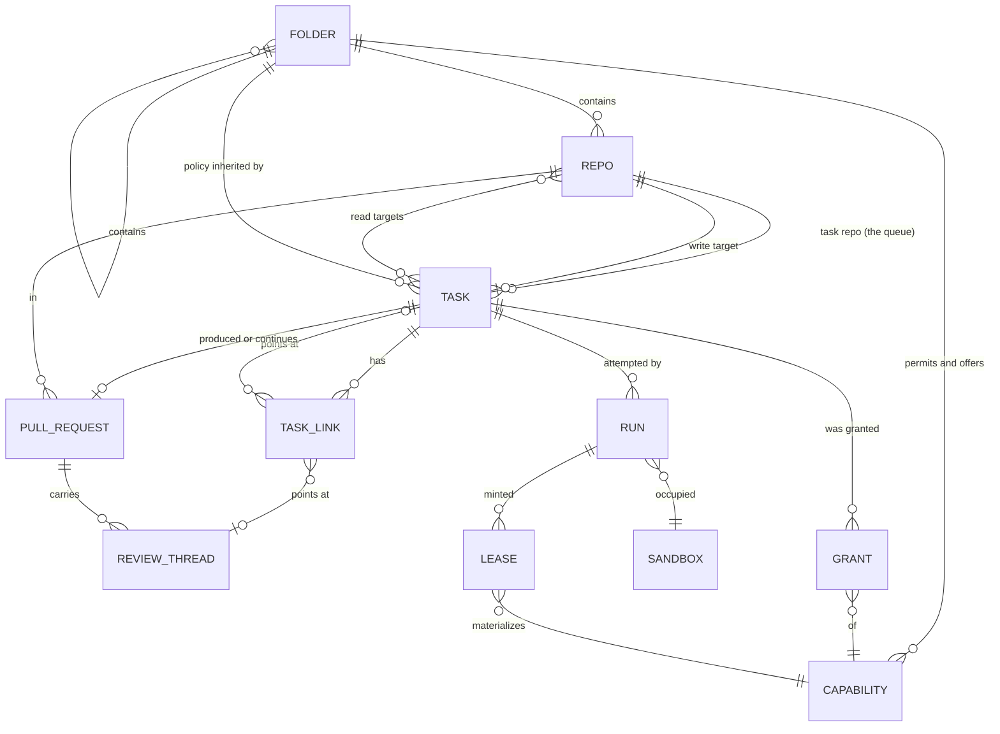

# The task data model

## Status

A design, not an implementation. Nothing in `grain/` changes with this
document. One question is
[decided](#decided-the-store-is-authoritative) — grain's store wins over
GitHub's labels — and one
[direction](#direction-the-declaration-moves-into-a-repo) is stated but
not settled: the declared half of the model moving out of issues and into
a repo. Everything below is written for tasks-as-issues and stays correct
for that; it names the entities the automation loop already manipulates,
states the invariants it already relies on, and proposes a shape that
makes the next few features cost less than the last few did. The
[migration](#migration) at the end is staged so that each stage is
shippable on its own and none of them changes what an operator sees on
GitHub.

The model covers **tasks and everything hanging off one**: the repos a
task reads and writes, the folder tree whose policy it inherits, the
capabilities it is granted, the pull requests it produces or continues,
the review threads it answers, the sub-tasks it spawns, and the runs it
takes to get there. It deliberately does not cover the VM layer (`grain/adapter/`),
the git proxy, or the credential files — those have their own designs and
no task ever names one directly.

## The problem: the model is real, but it is not written down

Grain already has a task data model. It is spread across four places that
each hold a piece of it:

- **GitHub labels** hold a task's state — `trigger_label`,
  `in_progress_label`, `awaiting_reply_label`, `needs_approval_label`,
  `completed_label` — and its capability grants: `gemini_key_label`,
  `self_debug_label`, `self_repair_label`, `scratch_repo_label`,
  `grain-github-<name>`. `labels.py` is explicit that these are two
  different tiers and that a task is in exactly one state at a time, but
  that invariant is prose and a colour-lightness test, not a type.
- **The issue body** holds the rest, as slash directives: `/repo`, `/pr`,
  `/base`, `/auto-merge`, `/review`, `/depends` (`directives.py`).
- **`AutomationState`** holds what only grain knows: which sandbox is
  working which task, what got minted for it, what a poll should compare
  against next cycle.
- **`ResolvedTask`** holds the joined-up answer for exactly as long as one
  `_dispatch` call, and is then flattened onto an `Assignment`.

That arrangement works, and much of it is right for good reasons this
model keeps. What it costs is visible in the shape of the code:

**A new capability costs five edits in four files.** `gemini_key_label`
needed a field on `AutomationConfig`, a row in `labels._STYLES`, a branch
in `_resolve_target`, a field on `ResolvedTask`, a field on `Assignment`
*plus* its hand-written `load`/`save` pair, a revoke branch in
`sweeper._release`, and a reaper of its own in `core.py`. `gcp_key_id`
then repeated every one of those steps for a value that means the same
thing — *something was minted for this task and must be revoked when the
slot frees* — which is why `core.py` now carries `_reap_expired_gcp_keys`
and `_reap_expired_gemini_keys` side by side, two loops that differ only
in which client they call.

**One task is spread across five parallel dicts.** `AutomationState` keys
`assignments`, `pending_questions`, `open_pull_requests`,
`completed_issues`, and `proposed_task_issues` separately, each with its
own `record_*`/`clear_*` pair. They are five views of one entity, and
nothing structurally prevents two of them from disagreeing about the same
issue number.

**Relationships between tasks exist but are not represented.** Three of
them already do, and each is tracked differently:

| Relationship | How it exists today | Where it is stored |
|---|---|---|
| *blocked by* | `/depends 12,34` | re-parsed from the body every cycle |
| *fixes this PR* | `_suggest_fix` files a task | `OpenPullRequest.fix_issue` |
| *proposed while working on* | `_file_proposed_tasks` | an English sentence in the issue body |

The third is the sharpest example: `_file_proposed_tasks` writes
"Proposed by `owner/repo#N` while working on that task" into the body as
prose. The edge is real, grain created it deliberately, and nothing can
query it.

**A bare issue number is not an identity.** `Assignment.issue` is an
`int`, implicitly in whatever `AutomationConfig` currently names as the
task repo. `docs/next-session.md` records what that cost: repointing a
live controller at a different task repo left a stale `sandbox-0 → #201`
assignment that made `_requeue` throw an uncaught 404 and abort
`run_once` entirely. The fix caught the 404. The reason it was possible
is that the record could not tell anyone which repo its number belonged
to.

None of this is urgent. All of it gets worse with sub-tasks, which
multiply every one of the above by the number of children a task has.

## The one decision the rest follows from

**What is a record, and what is a derivation.** Grain already has a
doctrine here, stated in fragments across four module docstrings. Written
out, it is four rules, and the model is mostly just the consequence of
taking them seriously:

1. **GitHub is the system of record for anything a human touches.** A
   task exists because an issue exists. Its text, its state pill, its
   capability grants, and the approval that lets it run are all things a
   human reads and edits on GitHub. Grain never invents a task with no
   issue behind it — which is exactly why `_suggest_fix` and
   `_file_proposed_tasks` file real issues rather than queueing something
   internal.
2. **Grain's store is the record for what only grain knows.** Which
   sandbox holds which task, which key was minted, which comment id a
   poll is comparing against. None of that has a home on GitHub, and none
   of it is a human's to edit.
3. **Anything derivable is derived, never stored.** `branch_name(issue)`,
   `repo_for_sandbox(sandbox)`, `agent_label(sandbox)` are pure
   functions of something already in hand. `Assignment` records
   `branch` only for the PR-continuation case, where the name is the PR
   author's choice and there is nothing to derive it from. This is
   `docs/roadmap.md` item 2's "deterministic, not self-reported."
4. **Anything read from editable text is pinned once, at dispatch, and
   never re-read.** `Assignment.target_owner`, `.base`, `.auto_merge` are
   all on that dataclass for this one reason: an issue body can be edited
   mid-run, and an edit landing between dispatch and finish must not be
   able to redirect where the work lands.

Rule 4 has one deliberate exception, and it is worth naming because the
model has to keep it: **`/depends` is re-read every cycle on purpose.**
Whether a dependency is still open changes with nothing about the task
itself changing, so pinning it at dispatch would mean a task stayed
blocked after its blocker closed. Pinned-at-dispatch is the default;
"evaluated fresh" is a property some relationships have.

### Decided: the store is authoritative

Where grain's own store and GitHub's labels disagree, **the store wins**.
Labels are a projection, reconciled every cycle by reasserting what the
store believes — the self-healing shape `_refresh_agent_labels` already
uses, where a label knocked off by hand comes back on the next pass
rather than staying wrong.

The trigger label is the one exception, and it is not really an
exception: a human applying it is an *input*, not a claim about state, so
the store follows it. Every other label is an output.

### Direction: the declaration moves into a repo

**A stated direction, not yet a decision.** Everything below in this
document is written for tasks-as-issues and stays correct for that. This
section is what changes when the model moves into a repo instead, so
that the decisions still open are made with it in view.

The change is narrower than it sounds, because it splits one thing the
current model conflates:

- **The declaration** — what this task is: intent, target, reads, folder,
  capabilities requested, links, base. Written by a human (or proposed by
  grain), changed rarely, and worth reviewing when it changes.
- **The observation** — what is true about it right now: which sandbox
  holds it, what leases are outstanding, which PR it opened, how many
  attempts it has taken. Written by grain, changed many times an hour,
  and worth reviewing never.

Today both live half in GitHub and half in the store. The direction puts
the declaration in a git repo as files and leaves the observation in the
store — which is the same line rules 1 and 2 already draw, sharpened
from "what a human touches" to "what a human *authors*."

Answering "the store is authoritative" and moving the declaration into a
repo are the same decision arriving from two directions. Once labels stop
being an input, there is nothing left to reconcile: the repo is
authoritative for declaration, the store for observation, and the two
never describe the same fact.

**What gets simpler.** Five things this document currently works around:

- **`TaskLink` stops needing prose.** `_file_proposed_tasks` writes
  "Proposed by `owner/repo#N`" into an issue body as English because a
  body is the only place it has. In a file it is a field.
- **Approval becomes code review.** `needs_approval_label` exists so
  grain can suggest work without starting it. If grain proposes a task by
  opening a *pull request* against the task repo, approval is merging it
  — reviewed, attributable, revertible, with a diff. The whole
  `PROPOSED` state and the `/lgtm` promotion path collapse into
  machinery GitHub already has.
- **The folder tree comes home.** This document puts it in
  `/data/config` and then spends a subsection on why an in-repo
  `.grain/` file may narrow but never widen. That rule exists because
  agents can write *target* repo content. A folder tree in the *task*
  repo, which no agent can write, needs no such rule — it is just a file
  next to the tasks it governs. There is precedent: a deployment already
  has an operator-owned config repo forked from `templates/gcp/`, and
  `labels.py` already treats it as the place deployment-wide decisions
  live.
- **A task changes atomically.** Retargeting a task today means editing a
  body and moving a label, with a window where they disagree. In a repo
  it is one commit.
- **Reading the queue stops being an API call.** A `git pull` gives the
  whole declared state, offline, with no pagination and no rate limit.
  `runs_per_hour` does not disappear — PRs, review threads and merges are
  still API work — but the polling pressure moves off the critical path.

**The trust gate gets stronger, with one hard requirement.** Today the
gate is "a human applied a label." It becomes "a human merged a commit to
the task repo," which is better in every way that matters: reviewed
rather than clicked, attributable to a commit author, and revertible.

It holds only if **no agent can write to the task repo, ever.** Not
through the git proxy's allowlist, not through a named credential, not
through a `/repo` directive naming it. A task repo an agent can push to
is a task repo an agent can grant itself capabilities in, which is the
whole gate in one commit. That is one allowlist entry to never add and
one invariant to test, but it is absolute — and it argues for the task
repo being a repo that appears nowhere in `repo-allowlist.json` at all.

**What gets harder: conversation.** Issues are good at the thing files
are worst at. `ask_question` posts a comment and waits for a trusted
reply; `_finish_no_changes` posts an analysis; a parked task explains
itself in a comment a human answers. None of that has a home in a file.

Three ways out, none obviously right:

1. **Hybrid** — files are the declaration, an issue is opened per task
   purely as its conversation thread. Keeps everything that works today
   and pays for it with two objects per task that can drift.
2. **PR threads** — a task's conversation is the review thread on the PR
   that introduced or last amended its file. Elegant for proposal and
   approval; awkward for a question asked days into a running task whose
   file has long since merged.
3. **Conversation moves to the target PR** — questions and analyses land
   on the work's own pull request rather than on the task. Right for a
   question about the code; wrong for a task parked before it ever
   produced a PR to ask on.

This is the question the direction actually turns on, and it is worth
answering before anything is built rather than discovering it in the
middle.

**Identity changes shape.** `TaskRef(repo, number)` borrows GitHub's
issue numbering. Files need their own — a slug, a path, or a monotonic id
assigned at creation — and `branch_name()` derives from the number, so it
follows. This is a small change but it touches rule 3: whatever replaces
the number must still make a branch name *derivable*, not self-reported.

**Consequences for the migration.** Stage 1 becomes more valuable, not
less: if the store holds the whole of runtime state, getting its identity
and shape right is the foundation rather than a cleanup. Stage 2 is
unaffected — a capability registry is a registry wherever grants are
declared. Stage 6's folder work gets cheaper by roughly the whole
narrow-never-widen subsection. Nothing in stages 1–4 is wasted work if
the direction is taken, which is the main reason it is safe to keep
building while this stays open.

## Entities



Nine things. Four of them exist today under other names; the rest
(`Folder`, `TaskLink`, `Grant`, `Lease`, `ReviewThread`) are the ones
that turn repeated special cases into rows.

### `RepoRef` and repo roles

`RepoRef` stays exactly as `directives.py` already defines it — an
`owner`/`name` pair kept together because nothing ever wants one half.
What the model adds is that a repo is always in a *role* relative to a
task, and the roles have genuinely different rules:

```python
class RepoRole(Enum):
    TASK = "task"        # the queue. One per deployment. Grain writes
                         # labels and comments here and nowhere else.
    TARGET = "target"    # where the clone, branch, and PR happen. Many.
                         # Must be allow-listed; never written to by the
                         # API side except to open and merge a PR.
    SCRATCH = "scratch"  # per-sandbox, derived from the sandbox name,
                         # resolvable only once a slot is assigned.
```

The task/target split is `config.py`'s existing distinction and this
changes nothing about it. Naming `SCRATCH` as a role rather than a
special case is what buys something: `_resolve_target` currently has to
handle "this task's target cannot be known until a sandbox exists" as an
exception to its own pinning discipline, because `repo_for_sandbox`
needs a sandbox name that dispatch has not chosen yet. Recording *how*
a target was bound makes that ordering explicit instead of implicit:

```python
class RepoBinding(Enum):
    DIRECTIVE = "directive"   # /repo owner/name — pinned before dispatch
    DEFAULT = "default"       # config.default_target_repo
    SCRATCH = "scratch"       # resolved at assignment, from the sandbox
    INHERITED = "inherited"   # a sub-task taking its parent's target
```

The allowlist is unchanged and stays where it is
(`/data/config/repo-allowlist.json`, enforced on both the API and
git-transport sides). It is a property of the deployment, not of a task,
and the model has no business copying it.

### `Folder` — one containment tree, around and inside repos

A repo is not the right granularity for everything a deployment wants to
say. "Every task in the payments area may mint a GCP key" is about a
group of repos; "tasks under `services/billing/` need the deploy
credential" is about a path inside one. Both are the same shape — a node
in a containment tree that carries policy its descendants inherit — so
both are the same entity:

```
deployment                                  (root; the implicit folder)
└── folder  "payments"                      around: a group of repos
    ├── repo    owner/payments-api
    │   ├── folder  "services/billing"      inside: a path in that repo
    │   └── folder  "services/ledger"
    └── repo    owner/payments-web
```

```python
@dataclass(frozen=True)
class FolderRef:
    path: tuple[str, ...]     # ("payments", "owner/payments-api",
                              #  "services/billing")

@dataclass(frozen=True)
class Folder:
    ref: FolderRef
    repos: tuple[RepoRef, ...]        # for an "around" folder
    permits: frozenset[str] | None    # ceiling: capabilities allowed here
    offers: frozenset[str]            # floor: capabilities granted here
    base: str | None                  # default base branch for tasks here
    preamble: str | None              # prompt text every task here carries
    max_concurrent: int | None        # cap on simultaneous runs here
```

The tree is **operator config**, hot-reloaded from `/data/config` the way
the allowlist already is, and it is not a persisted entity — a task
records the `FolderRef` it resolved to, never a copy of the folder's
contents.

Capabilities are the first use and the one this document works through,
but the entity is deliberately general: `base`, `preamble`, and
`max_concurrent` are the obvious next three, and each of them is
currently either a global or a per-task directive with no middle ground.

### Attaching capabilities to repos and folders

Yes — with one asymmetry that is the whole of the safety argument.
A node can say two different things, and they are not mirror images:

- **`permits` is a ceiling.** "No task under this node may use anything
  outside this set." Purely reducing.
- **`offers` is a floor.** "Every task under this node gets these without
  asking." Widening.

They compose down the tree in opposite directions:

```
permitted(node) = ∩ permits(n) for n in ancestors(node) + [node]
offered(node)   = ∪ offers(n)  for n in ancestors(node) + [node]

effective(task) = (requested(task) ∪ offered(folder)) ∩ permitted(folder)
```

Intersection for ceilings means a deeper folder can only ever narrow what
its parent allows, so reading the tree top-down never has a surprise in
it. Union for floors means a deeper folder can add a convenience its
parent did not. The intersection is applied last, so a ceiling always
beats a floor: a node cannot offer what an ancestor does not permit, and
a misconfigured pair fails closed.

**Ceilings are safe; floors need a guard.** A ceiling cannot grant
anything, so it is worth having unconditionally and worth having first.
A floor is a real escalation surface, because a task chooses its own
target repo through `/repo` — text in an issue body. If `owner/deploy`
offers `gcp-key`, then getting a task pointed at `owner/deploy` is
equivalent to being granted a GCP key. Three rules keep that bounded:

1. **A capability is floor-grantable only if its registry row says so.**
   `Capability.auto_grantable` is false by default and stays false for
   the mutating ones — `self-repair` and named GitHub credentials are
   requested per task, by a human, or not at all.
2. **A floor grant is recorded and visible.** It is pinned onto the task
   at dispatch like every other resolved value, written into the audit
   line, and applied to the issue as a label grain adds itself — the same
   self-healing "grain applies this one, not a human" pattern
   `waiting_on_dependency_label` already established. A capability nobody
   can see on the issue is a capability nobody reviews.
3. **`/repo` is still trusted text.** It is read only from authors who
   could have applied the trigger label, and the target must still be
   allow-listed. Floors do not widen that gate; they ride on it.

**Where the tree lives, and why not in the repo.** A `.grain/` file in
the target repo is the tempting design — it is how `CODEOWNERS` works,
and it puts the policy next to the code it governs. It is also exactly
the file a task with write access to that repo can edit. A task that
could widen its own folder's `offers` would convert one human grant into
a permanent one on the next run.

So the tree is operator config, with one exception that is safe by
construction: **an in-repo file may narrow, never widen.** A
`.grain/folder.toml` that sets `permits` is honoured; one that sets
`offers` is ignored with a warning. The worst an agent can do by writing
that file is take capabilities away from itself and from later tasks,
which is visible in the diff, caught by the human PR review the threat
model already relies on, and takes effect only after a merge.

**Why this is not a second allowlist.** `config.py` argues against two
lists that can disagree, and the argument holds. It is answered by
direction rather than by merging the files: `repo-allowlist.json` stays
exactly as it is — flat, default-deny, the one thing the git proxy reads
on every operation, and deliberately simple because it is in the path of
every fetch and push. The folder tree can only narrow what the allowlist
already permits. Two files, one direction of authority, and no way for
them to disagree in the direction that grants something.

One thing the allowlist genuinely lacks and folders could supply: it has
**no read/write axis**. `grain/proxy/core.py` checks `allows()` before
`git-upload-pack` and `git-receive-pack` identically, so allow-listing a
repo for reading also allow-lists it for pushing. A `permits` set
containing a `push` capability is the natural place to fix that, and it
is the strongest argument for building the ceiling half first.

### One write target, many read targets

A task frequently needs to *read* a second repo to change the first — a
shared library's source, an API schema, a sibling service's client. That
is a different problem from a change that *spans* repos, and conflating
them is what makes multi-repo support look hard. Three cases:

| | Shape | Answer |
|---|---|---|
| Read-many, write-one | change A, needs to read B | `/reads`, below |
| Write-many, coordinated | A and B must land together | a merge group |
| Sequential | change A, then change B after it merges | `/depends`, today |

**Read-many is cheap, and the transport already allows it.** A `/reads
owner/name` directive (repeatable) adds a repo to `Task.reads`; those
repos are cloned read-only into the sandbox alongside the target. This
needs nothing new below the orchestrator: the proxy's allowlist check
does not distinguish fetch from push, so a repo that is allow-listed at
all is already fetchable by any sandbox that can authenticate. The whole
feature is a directive, an allowlist check per named repo, and a clone
line in the dispatch script.

**A read target grants nothing.** The folder capabilities a task inherits
come from its *write* target's chain only. Without that rule, `/reads
owner/deploy` becomes a capability-laundering channel: name a
capability-offering repo as a read dependency, inherit its grants, do the
work somewhere else entirely. This is the single most important rule in
this subsection and it needs to be a test, not a convention.

**So: exactly one write target per task, any number of read targets.**
That invariant is what keeps the rest of the model intact, and the next
subsection is what happens when a change genuinely does not fit inside
it.

### `TaskRef` — identity

```python
@dataclass(frozen=True)
class TaskRef:
    repo: RepoRef   # the *task* repo — the queue, never the target
    number: int
```

Every stored reference to a task carries the repo its number is in. This
is a small change with one specific payoff: a record left over from a
different task repo becomes self-identifying. It does not 404, it does
not match anything current, and a reconciliation pass can drop it —
rather than the 404-catching workaround `_requeue` needs today.

Issues and PRs share one number sequence per repo on GitHub, so a
`TaskRef` is unambiguous even though a PR is also an issue. That is the
same property `Assignment.issue`'s comment already relies on.

### `Task` — the aggregate

```python
@dataclass(frozen=True)
class Task:
    ref: TaskRef
    intent: TaskIntent
    state: TaskState
    origin: TaskOrigin

    target: RepoRef | None          # the one *write* target; None until a
                                    # SCRATCH binding resolves
    binding: RepoBinding
    base: str | None                # /base, else the folder's, else the
                                    # target's own default branch
    folder: FolderRef | None        # the node whose policy this inherits
    reads: tuple[RepoRef, ...]      # read-only clones. Grant nothing.

    grants: frozenset[Grant]
    links: tuple[TaskLink, ...]

    pull_request: PullRequestRef | None   # produced, continued, or reviewed
    auto_merge: bool

    tags: frozenset[str]            # e.g. a scheduled job's marker label

    created_at: datetime
    state_since: datetime
```

Four of those fields need their own vocabulary.

**`TaskIntent` — what finishing means.** This is `TriggerKind` widened
from three cases to four and moved onto the task, where it belongs: it is
a property of what was asked for, not of the run that attempts it.

```python
class TaskIntent(Enum):
    IMPLEMENT = "implement"  # fresh branch -> a new PR
    CONTINUE  = "continue"   # /pr — more commits on an existing branch
    REVIEW    = "review"     # /review — post a draft review, push nothing
    ANALYZE   = "analyze"    # answer in a comment; no branch expected
```

The first three are today's `TriggerKind.ISSUE`/`PR`/`REVIEW` and carry
their existing meaning: a successful finish is a new PR, new commits on
the named branch, or a posted draft review respectively.

`ANALYZE` is new *as a declaration*, though the behaviour is old. Grain
already supports analysis-only tasks, but it detects them after the fact:
`_finish_no_changes` runs when the branch never appeared and the agent
called `comment_on_issue`. That makes "no branch appeared" ambiguous
between *this was never going to produce one* and *the agent failed to
push*, which is the ambiguity `docs/roadmap.md` item 21 ("stop letting an
agent's own signal decide whether a PR opens") is about. A declared
intent resolves it from the other end: an `IMPLEMENT` task that produced
no branch has failed, and an `ANALYZE` task that produced one is a
surprise worth surfacing. The existing behaviour stays the default for a
task that declares nothing, so this costs no compatibility.

**`TaskState` — one at a time.**

```python
class TaskState(Enum):
    PROPOSED = "proposed"              # needs_approval_label
    QUEUED = "queued"                  # trigger_label
    RUNNING = "running"                # in_progress_label + agent_label
    AWAITING_REPLY = "awaiting_reply"  # awaiting_reply_label
    COMPLETED = "completed"            # completed_label
    CLOSED = "closed"                  # the issue itself is closed
```

`labels.py` already asserts that a task is in exactly one state, and
`_dispatch` already strips the old label as it applies the new one. As an
enum with a projection onto labels, that invariant is enforced by
construction: there is one place that writes state, and it cannot leave
two pills on an issue because it does not have a way to express that.

**Blocked is deliberately not a state.** `waiting_on_dependency_label` is
in the capability tier today, and `labels.py` gives the reason: a blocked
task is still queued, it is just visibly not runnable yet, so the label
must read as an annotation beside the state pill rather than replacing
it. The model keeps that exactly — `is_blocked` is derived from the
task's own links (`any(link.unresolved for link in task.links if
link.blocks)`), and the label is a projection of that derivation. No new
state, no change to what an operator sees.

**`TaskOrigin` — who asked.** Today this is inferable only from which
label a task was filed with, and only for two of the four cases.

```python
class TaskOrigin(Enum):
    HUMAN = "human"          # somebody filed and labelled an issue
    SCHEDULED = "scheduled"  # scheduled_jobs.py filed it from a template
    FIX = "fix"              # _suggest_fix filed it for a broken PR
    REVIEW = "review"        # human review threads on a PR asked for it
    PROPOSED = "proposed"    # propose_task, or a parent decomposing
```

Origin matters because it decides the *default* landing state, which is
the whole trust model in one line: a `HUMAN` task lands `QUEUED`; `FIX`
and `PROPOSED` tasks land `PROPOSED` and wait for a human to apply
`trigger_label` or comment `/lgtm`. That is precisely the rule
`_suggest_fix` and `_file_proposed_tasks` each implement separately
today, and stating it once means a fifth origin cannot forget it.
`REVIEW` is `FIX`'s sibling and shares its machinery: both mean *a pull
request needs more work*, both produce a `CONTINUE` task on that PR's own
branch, and both land `PROPOSED`. See
[tasks from review comments](#tasks-from-review-comments).

`SCHEDULED` is the one origin that chooses per instance —
`ScheduledJob.needs_approval` already decides whether a firing lands
queued or waiting — which the model keeps as an override on the origin's
default rather than a fifth code path.

A scheduled job also carries a `marker_label` derived from its name,
which is neither a state nor a capability: it is an idempotency tag, the
thing `_scheduled_jobs` lists by to find out whether the previous firing
has finished. The model keeps it exactly as it is, as a `tags` set on the
task, precisely so it is not mistaken for either tier.

### `Capability`, `Grant`, `Lease`

The part with the most repetition to collapse, and the part where the
existing rules are most worth keeping intact.

A capability travels through four distinct moments, and today only the
Gemini key travels all four with code written for it at each step:

1. **Requested** — a label on the issue, or a directive in trusted text.
2. **Resolved** — can this deployment honour it? If not, the task parks
   with an explanation rather than running without it.
3. **Materialized** — something is minted, placed in the sandbox, and
   named in the agent's prompt.
4. **Revoked** — when the slot frees, or when a deadline passes.

```python
class GrantSource(Enum):
    LABEL = "label"          # a human applied it. The trust gate.
    DIRECTIVE = "directive"  # a trusted author wrote it in the body
    FOLDER = "folder"        # a folder's `offers` granted it automatically
    GRAIN = "grain"          # grain applies it to itself (blocked marker)

@dataclass(frozen=True)
class Capability:
    name: str                     # "gemini-key", "self-repair", ...
    label: str                    # the label that requests it
    source: GrantSource           # how it may be asked for
    requires: str | None          # the deployment config it needs, if any
    materializes: bool            # does honouring it mint something?
    max_lease: timedelta | None   # revoke unconditionally after this
    auto_grantable: bool = False  # may a folder's `offers` grant it?

@dataclass(frozen=True)
class Grant:
    capability: str
    via: GrantSource              # how *this* task actually got it
    folder: FolderRef | None      # which node, when `via` is FOLDER
```

`Grant.via` records how this particular task came by the capability,
which `Capability.source` cannot: the same capability can be requested by
label on one task and inherited from a folder on another, and an audit
line that cannot tell those apart is not much of an audit line.

The registry replaces both `labels._STYLES`'s capability tier and the
per-capability branches in `_resolve_target`. Four properties are worth
stating as properties of the *model*, because each is a rule the current
code follows by convention and could stop following by accident:

- **A grant is never inferred from untrusted text.** `source` is `LABEL`
  for everything that carries no value, because applying a label already
  requires the write access that the trigger gate itself depends on. This
  is bwsalmon/agents#49's reasoning, unchanged: `/gemini-key` was
  rejected as a directive precisely because a label carries the same
  trust with less machinery. `DIRECTIVE` is reserved for grants that
  carry a *value* a label cannot (`/base`, `/pr`), and those are read only
  from authors in `_TRUSTED_REPLY_ASSOCIATIONS`.
- **Unhonourable means parked, never silently downgraded.** `requires`
  names the deployment config — `gemini_key_config`, `scratch_repo_config`,
  a `<name>.token` — whose absence parks the task with a comment saying
  what an operator would have to configure. Three capabilities do this
  today, each with its own hand-written message; the difference between
  them is which config is missing, which is a field, not a code path.
- **A grant is not a state.** The two-tier palette exists to keep a
  modifier from out-shouting the state pill, and `Grant` being a separate
  field from `state` is that same separation in the type.
- **Capabilities do not travel down.** A sub-task inherits its parent's
  *repo*, never its grants. See [sub-tasks](#sub-tasks-are-tasks). The
  one exception is not an exception: a child sitting in the same folder
  as its parent inherits that *folder's* offers, because they are the
  folder's to give and would have applied to a task filed there by hand.
- **`auto_grantable` is the floor's guard.** False by default, and false
  for anything mutating, so
  [a folder's `offers`](#attaching-capabilities-to-repos-and-folders)
  cannot hand out `self-repair` or a named GitHub credential however it
  is configured.

A `Lease` is what materialization produced:

```python
@dataclass(frozen=True)
class Lease:
    capability: str          # which capability minted this
    resource: str            # gemini key name, gcp key id, ...
    issued_at: datetime
    expires_at: datetime | None
```

`Assignment.gemini_key_name` and `Assignment.gcp_key_id` both become
rows in `run.leases`. That single change collapses three pieces of
duplication: the two branches in `sweeper._release` become one loop, the
two reapers in `core.py` become one pass over leases with an
`expires_at`, and the two hand-written `load`/`save` field pairs in
`state.py` become one list. Revocation stays idempotent — a lease
revoked twice, or revoked for a resource already gone, is not an error —
because the reaper and the release path can both reach the same lease and
today already have to tolerate that.

### `TaskLink` — relationships, including sub-tasks

```python
class LinkKind(Enum):
    DEPENDS_ON = "depends-on"    # /depends. Blocks. Evaluated every cycle.
    CHILD_OF = "child-of"        # decomposition. Blocks the parent.
    FIXES = "fixes"              # -> a PullRequestRef, not a task
    MERGE_WITH = "merge-with"    # symmetric. Blocks the *merge*, not the run.
    ADDRESSES = "addresses"      # -> a ReviewThreadRef
    PROPOSED_BY = "proposed-by"  # provenance only. Never blocks.

@dataclass(frozen=True)
class TaskLink:
    kind: LinkKind
    target: TaskRef | PullRequestRef | ReviewThreadRef
    blocks: bool          # derived from kind; stored for the projection
```

`MERGE_WITH` is the one link that blocks something other than dispatch —
see [coordinated changes](#coordinated-changes-across-repos). `ADDRESSES`
points at a review thread rather than a task or a PR, which is why
`TaskLink.target` is a union of three reference types rather than two.

`DEPENDS_ON` is `/depends` with its existing semantics, including the
deliberate exception to pinning: it is evaluated fresh every cycle so a
task unblocks the moment its last dependency closes, with no reply
needed. `FIXES` is `OpenPullRequest.fix_issue` read from the other
direction. `PROPOSED_BY` is the English sentence `_file_proposed_tasks`
writes today, made queryable — it never blocks anything, it just answers
"where did this task come from" without parsing prose.

One rule the model adds because its absence is currently a silent trap:
**links form a DAG.** `/depends 12` on an issue that #12 already depends
on deadlocks both, forever, with no signal anywhere. A cycle should be
refused at the point the link is created, with the same parking comment
every other unusable directive gets.

### Sub-tasks are tasks

**A sub-task is an ordinary `Task` with a `CHILD_OF` link.** Not a new
entity, not a row in a parent's body, not an internal work item.

The reason is the same one that made `_suggest_fix` and
`_file_proposed_tasks` file real GitHub issues rather than queueing
something internal: a task that is not an issue is invisible to exactly
the people whose approval the entire trust model rests on. A human cannot
label it, comment on it, `/lgtm` it, or close it to cancel it — and every
one of those is a control grain depends on. The cost is real (a busy
decomposition fills the queue with issues) and it is the right cost.

Five rules, each of which is a decision that could go the other way:

**Children inherit the target repo and base, not the grants.** The common
decomposition is "same repo, smaller piece", so `RepoBinding.INHERITED`
is the default and an explicit `/repo` on the child overrides it.
Capabilities do *not* inherit, and this is the load-bearing one: an agent
granted `self-repair` once, whose children inherited it, would have
converted a single human grant into an unbounded number of uses of that
grant. Every child asks for its capabilities on its own issue, where a
human can see the request and decide — which is the same reason
`propose_task` files with `needs_approval_label` instead of
`trigger_label`.

**A parent is not complete while a child is open.** Otherwise the
completion signal means nothing: a parent could report done with the
majority of its work unstarted. This needs no new machinery — an open
child is an unresolved blocking link, which is exactly what `/depends`
already knows how to evaluate every cycle, so the parent simply stays
blocked and unblocks itself when the last child closes.

**Children land in `PROPOSED`, like every other grain-filed task.**
`TaskOrigin.PROPOSED`, `needs_approval_label`, promoted by a human or a
`/lgtm`. A deployment that finds this too slow can opt into
auto-approving children that request no capabilities and target the same
repo as their parent — but the safe default is the one that already
exists, and it should stay the default.

**Depth and fan-out are bounded.** A child of a child of a child is
almost always an agent looping, and the cheapest place to discover that
is at creation, as a refusal with an explanation, rather than in the
queue. A limit of 2 levels and a small fan-out cap per parent, both
configurable, are enough — the failure this prevents is a runaway, not a
legitimate deep tree.

**The parent's own PR is not the children's.** Each child that implements
something opens its own PR against the same base. Serializing children
onto one branch would make them undispatchable in parallel, which is the
entire reason to decompose in the first place.

### Coordinated changes across repos

The case the one-write-target rule does not cover: a change that must
land in two repos *together* — rename an endpoint and update its two
callers, bump a schema and the services that read it.

**This is not one task with several pull requests.** A task with two
write targets breaks nearly every invariant the model has: `branch_name`
derives one branch from one issue number, `Task.base` is one base,
`auto_merge` is one decision, `TrackedPullRequest` tracks one PR, and
"did the branch appear" is one question with one answer. Widening all of
them to lists would double the surface of every finish path to serve a
minority of tasks.

It is also the wrong shape for a deeper reason: GitHub has no atomic
cross-repo merge, so grain would be building distributed-transaction
machinery — two-phase commit over pull requests, with rollback — for a
problem human teams solve by merging the library first. That is a large
amount of machinery to get subtly wrong.

**A coordinated change is a parent task with one child per repo**, which
is the sub-task model already, plus one new link:

```
#500  "Rename /v1/charge to /v2/charge"   parent, ANALYZE, opens no PR
 ├── #501  payments-api    CHILD_OF #500, MERGE_WITH #502, #503
 ├── #502  payments-web    CHILD_OF #500, MERGE_WITH #501, #503
 └── #503  billing-worker  CHILD_OF #500, MERGE_WITH #501, #502
```

Each child keeps exactly one write target, one branch, one PR, and every
invariant it already had. What the group adds is a **merge gate**: no
member of a `MERGE_WITH` group merges until every member is clean.
`_close_finished_prs` already reads each PR's health and already knows
about `auto_merge`; the change is that a PR in a group asks about its
siblings before merging rather than only about itself.

Two properties follow, and both are wanted:

- **The children dispatch in parallel.** `MERGE_WITH` blocks the merge,
  not the run — that is the whole reason it is a distinct kind rather
  than a `DEPENDS_ON`. Three repos are worked simultaneously in three
  sandboxes.
- **Ordering, where it matters, is still expressible.** If the library
  genuinely must merge first, that is a `DEPENDS_ON` between the
  children, which already exists and already means what it says.

Grain does not attempt to make the merges atomic. It makes them *ready*
together and then merges them in dependency order, which is what a human
would do and what is actually achievable. If one member goes red after
its siblings merged, that is an ordinary broken PR and the existing
`_suggest_fix` path handles it.

**Why a parent at all.** The group needs somewhere to hold the intent, an
issue a human can close to cancel the whole thing, and a single thing to
report status on. An `ANALYZE`-intent parent that opens no PR of its own
is exactly that, and it is already blocked until its children close by
the parent-blocked-by-children rule above.

### `PullRequestRef` and the tracked PR

```python
@dataclass(frozen=True)
class PullRequestRef:
    repo: RepoRef        # the *target* repo, never the task repo
    number: int

class PrHealth(Enum):
    UNKNOWN = "unknown"        # GitHub hasn't computed mergeability yet
    CLEAN = "clean"
    CONFLICTED = "conflicted"
    FAILING = "failing"
    MERGED = "merged"
    CLOSED = "closed"

@dataclass(frozen=True)
class TrackedPullRequest:
    ref: PullRequestRef
    task: TaskRef
    branch: str
    base: str
    auto_merge: bool
    health: PrHealth
    fix_task: TaskRef | None
```

This is `OpenPullRequest` with a repo-qualified identity and `_PrHealth`
folded in as an enum instead of a tri-state of booleans. `UNKNOWN` keeps
the distinction that matters and that `_close_finished_prs` already
depends on: GitHub computes mergeability asynchronously, so `None` right
after a push means *check again next cycle*, never *conflicted*.

**The wire types stay separate.** `PullRequestDetail`, `Issue`, and
`Comment` in `github.py` are projections of GitHub's records, shaped by
what GitHub's endpoints return, and `github.py`'s own docstrings already
argue for keeping `PullRequest` and `PullRequestDetail` apart rather than
widening one. Nothing here merges them: `TrackedPullRequest` is grain's
record *about* a PR, and it is refreshed from a `PullRequestDetail` read.

**A PR is an artifact, not a task.** The three PR-shaped relationships a
task can have — produced one, continues one (`/pr`), reviews one
(`/review`) — are `TaskIntent`, above. `TrackedPullRequest` exists for
the fourth thing: a PR grain opened and is still watching, so it can
close the task when the PR closes, merge it if `auto_merge`, or file a
fix task when it goes red.

### Tasks from review comments

Review runs in two directions, and only one of them exists. Grain can
already be told to *author* a review — `/review` on a task with a `/pr`
dispatches an agent to read the diff and leave inline comments, which
`_finish_succeeded_review` posts as one draft review
(bwsalmon/agents#154). What does not exist is the other direction:
**human review comments becoming tasks.** That is what this section
designs.

#### The unit is a thread, and the task is a `CONTINUE`

```python
@dataclass(frozen=True)
class ReviewThreadRef:
    pr: PullRequestRef
    thread_id: int        # the root comment's id
```

A thread, not a comment: a thread is what a human resolves, so thread
resolution is the natural completion signal, and a reply inside one is
part of the same request rather than a second one.

`github.py` already has most of what this needs — `ReviewComment` is the
read shape and `list_review_comments` already fetches them, since the
`/review` dispatch shows an agent what has already been said. One
widening is required: `ReviewComment` carries no thread linkage today, so
it needs GitHub's `in_reply_to_id` (and the review id) to group comments
into threads at all.

**The resulting task is a `CONTINUE` task on the PR's own branch**, and
this is forced rather than chosen. Every thread on a PR points at the
same branch, so review-derived work cannot be parallelised across
children the way a decomposition can — two sandboxes pushing to one
branch is a race. One task, one dispatch, one push, addressing every
selected thread, with the threads listed as a checklist in its body.

That means the feature reuses machinery that already works: `CONTINUE` is
today's `TriggerKind.PR`, `_finish_succeeded_pr` already means "new
commits landed on the branch it was pointed at," and `_suggest_fix`
already files exactly this shape of task for a PR that has gone red.
`TaskOrigin.REVIEW` and the `ADDRESSES` links are the only genuinely new
parts.

#### Three gates, and why each is needed

**Trust.** Review comments are text from whoever can comment on the PR.
On a public repo that is anyone, and treating a comment as a work order
would reopen precisely the prompt-injection hole the trigger label
exists to close. So: only threads whose author is in
`_TRUSTED_REPLY_ASSOCIATIONS` — owner, member, collaborator — are
eligible, the same tier that already gates `/lgtm` and directive-bearing
replies. Everyone else's comments are still shown to the agent as
context; they just cannot start anything.

**Grain's own comments never qualify.** Grain posts as a credential
GitHub reports as `OWNER`, which is inside the trusted tier — a hazard
`_is_automation_comment` already exists to handle. Without subtracting
grain's own threads here, a `/review` dispatch would review a PR, task
itself from its own review, push, review again, forever. The
`_AUTOMATION_SIGNATURE` check closes it, and this is the second place
that check earns its keep.

**Explicit opt-in, not every comment.** A thirty-comment review should
not produce thirty issues — nor one unrequested issue for a review that
was just discussion. So a thread becomes work only when a trusted author
says so, either per thread (a `/fix` reply in the thread) or for the
whole PR at once (a label on the PR meaning *turn every unresolved
trusted thread into a task*). The affirmative act is the point: it is the
same gate as applying the trigger label, expressed where the reviewer is
already typing.

A deployment that wants the automatic version can have it as a knob, but
it should not be the default. The failure mode is immediate, noisy, and
lands in the queue.

#### Completion, and not looping

The task is done when it has pushed. It then **replies** in each
addressed thread — a `🤖`-signed "addressed in `<sha>`", posted by
`core.py` like every other comment, since the agent has no GitHub API
access of its own. It does **not** resolve the threads: resolution is the
reviewer's judgement that the reply is adequate, and grain marking its
own work resolved would remove the one checkpoint the whole review is
for.

Two bounds keep the cycle from running away, since addressing review
comments produces a push, which invites another review:

- A thread already named by an `ADDRESSES` link on an open or completed
  task is never tasked again. The links are the record; the same
  "reconcile against what we already know" shape that stops
  `_suggest_fix` filing a second fix task for the same PR.
- A per-PR cap on review-sourced tasks. Reviews converging is normal;
  four rounds without the health signal improving is a conversation for a
  human, not a fifth dispatch.

### `Run` — one attempt

```python
@dataclass(frozen=True)
class Run:
    id: str
    task: TaskRef
    sandbox: str
    unit: str
    started_at: datetime
    finished_at: datetime | None    # None = live. This is the assignment.
    outcome: str | None
    leases: tuple[Lease, ...]
    attempt: int
```

`Assignment` and `SessionHistory`'s record are two shapes of the same
thing separated by whether it has finished. Making a live run a `Run`
with no `finished_at` — and `assignments` a `sandbox -> run_id` index
rather than a second copy of the data — removes the need to copy fields
from one into the other at release time, which is what `sweeper._release`
spends most of its length doing.

It also makes something answerable that is not answerable today: **how
many times has this task been attempted.** `_requeue` puts a task back in
the queue on a timeout, a lost sandbox, or an orphaned in-progress
label, and nothing counts. A task that has failed four times is almost
certainly not going to succeed on the fifth, and today the only way to
notice is for a human to read the issue's history.

## Invariants

Each of these is a rule the current code follows, and each is a test in
the model:

1. A task is in exactly one `TaskState`. Blocked is derived, not a state.
2. A task's target repo and base are pinned before its first push and not
   re-read from editable text afterwards.
3. `/depends` and child links are evaluated fresh every cycle — the one
   deliberate exception to (2), because their truth changes with nothing
   about the task changing.
4. Every lease has exactly one owning run; revocation is idempotent and
   happens on every path that frees a slot.
5. Task links form a DAG.
6. Every stored reference names its repo. A record from a repo this
   deployment no longer polls is droppable, not a 404.
7. Derived values are never stored: branch names, scratch repo names,
   agent labels.
8. A capability this deployment cannot honour parks the task with an
   explanation. It never runs the task without the capability.
9. A grain-filed task lands in `PROPOSED`, whatever filed it.
10. A task has exactly one write target and any number of read targets.
11. Folder capabilities are inherited from the **write** target's chain
    only. A read target grants nothing.
12. Ceilings intersect down the folder tree, floors union down it, and
    the intersection is applied last — a node can never offer what an
    ancestor does not permit.
13. An in-repo folder file may narrow, never widen.
14. Only a trusted, non-automation review thread can source a task, and
    only one already carrying an explicit request.

## What maps to what

| Today | In the model |
|---|---|
| `Assignment.issue` (bare int) | `TaskRef(repo, number)` |
| `Assignment` (live) | `Run` with `finished_at is None` |
| `SessionHistory` record | `Run` with `finished_at` set |
| `TriggerKind` | `TaskIntent`, on the task |
| `Assignment.gemini_key_name`, `.gcp_key_id` | `Run.leases` |
| `Assignment.target_owner/.target_repo/.base` | `Task.target`, `Task.base` |
| `ResolvedTask` | `Task`, persisted rather than per-dispatch |
| `OpenPullRequest` | `TrackedPullRequest` |
| `_PrHealth` | `PrHealth` |
| `PendingQuestion` | `Task` in `AWAITING_REPLY` + its baseline comment id |
| `CompletedIssue` | `Task` in `COMPLETED` + its baseline comment id |
| `proposed_task_issues` | `Task` in `PROPOSED` |
| `OpenPullRequest.fix_issue` | a `FIXES` link |
| "Proposed by X" prose in a body | a `PROPOSED_BY` link |
| `/depends` re-parsed each cycle | `DEPENDS_ON` links, still re-evaluated |
| `labels._STYLES` capability rows | the `Capability` registry |
| `_resolve_target`'s per-label branches | `Capability.requires` |
| `labels._STYLES` state rows | `TaskState`'s projection |
| `ScheduledJob.marker_label` | `Task.tags` — neither tier |
| `repo_for_sandbox`, `branch_name`, `agent_label` | unchanged, still derived |
| `repo-allowlist.json` | unchanged; folders may only narrow it |
| (nothing — one target repo) | `Task.target` + `Task.reads` |
| (nothing — no cross-repo grouping) | `MERGE_WITH` links |
| (nothing — no folder concept) | the `Folder` tree, operator config |
| `ReviewComment` (post-only shape) | widened with thread linkage |
| (nothing — reviews are authored, not read) | `ADDRESSES` links, `TaskOrigin.REVIEW` |

The five state dicts become one store keyed by `TaskRef`, with the
existing durability discipline unchanged: atomic temp-file-and-rename,
written incrementally as the loop mutates it rather than once at the end
of `run_once`. A `version` field and the established
`.get()`-with-a-default convention carry an on-disk file forward.

## Migration

Four stages. Each ships on its own, and none changes a label, a
directive, or anything an operator sees.

1. **Identity and the store.** `TaskRef` everywhere, five dicts collapsed
   into one keyed store, behind the existing `AutomationState` method
   names so no call site moves. Load migrates an old file in place. This
   is the stage that pays for itself immediately — it retires the
   404-catching workaround and makes every later stage a local change.
2. **The capability registry.** `Capability` rows, `Grant`, `Lease`.
   `_resolve_target`'s per-label branches become a loop; `_release`'s two
   revoke branches become one; the two reapers become one. Behaviour
   identical, including every parking message.
3. **Links.** `DEPENDS_ON` and `FIXES` migrated off their current
   representations, `PROPOSED_BY` recorded instead of written as prose,
   DAG check added. Still no sub-tasks — this is the stage that makes
   them cheap.
4. **Sub-tasks and runs.** `CHILD_OF`, the depth and fan-out bounds, the
   parent-blocked-by-children rule, and `Run` replacing the
   assignment/history split with an attempt count.

Three features then sit on top of those four, in the order their
dependencies allow:

5. **Read targets** (`/reads`). Independent of everything above and the
   cheapest thing here — a directive, an allowlist check per repo, and a
   clone line. Worth doing early precisely because it needs none of the
   rest.
6. **Folders.** The tree, then ceilings, then floors, in that order:
   ceilings cannot grant anything, so they are safe to ship before the
   `auto_grantable` machinery that makes floors safe. Needs stage 2's
   capability registry to have anything to attach to.
7. **Review-sourced tasks and merge groups.** Both need stage 3's links.
   Review-sourced tasks additionally need `ReviewComment` widened with
   thread linkage; merge groups need stage 4's sub-tasks.

## What this does not change

- **Labels stay the human interface.** Every state and grant is still
  visible on the issue, in the same two-tier palette, with the same
  colours and the same meanings.
- **GitHub stays the system of record** for as long as tasks are issues.
  If the [declaration moves into a
  repo](#direction-the-declaration-moves-into-a-repo), GitHub stays the
  record for pull requests, review threads and target repos — the queue
  is what moves, and nothing else does.
- **No new service, no database.** One JSON file under `/data/state`,
  written the same atomic way. The folder tree is one more operator-owned
  file under `/data/config`, read the same hot-reloaded way as the
  allowlist it can only narrow.
- **The trust gate is untouched.** A task runs because a human labelled
  it. Directives are read only from authors who could have applied that
  label. Agents get no GitHub API access.

## Open questions

- **When does one JSON file stop working?** The store is rewritten whole
  on every save. At a few hundred tasks that is nothing; sub-tasks are
  the first feature that could multiply the count by an order of
  magnitude. Worth measuring before stage 4, not before stage 1.
- **Where does conversation live once the declaration is in a repo?**
  The one that the [repo direction](#direction-the-declaration-moves-into-a-repo)
  turns on — a per-task issue kept purely as a thread, the task file's own
  PR review thread, or the target PR. Worth answering before building,
  not during.
- **Should an approved parent auto-approve its children?** Recommendation
  above is no by default, with an opt-in for children that request no
  capabilities and inherit their parent's repo. If decomposition turns
  out to be common, this is the first knob to revisit.
- **How does a task name a folder inside a repo?** A path has to come
  from somewhere, and there are three candidates: an extension to
  `/repo owner/name:services/billing`, a separate `/folder` directive, or
  inference from the paths the task's own diff touches. The third is the
  most convenient and the least usable, because a folder's capabilities
  must be resolved *before* dispatch and the diff does not exist yet. A
  separate directive is the recommendation; the extended `/repo` form is
  terser but overloads a directive that is already load-bearing.
- **Does a merge group need a merge order, or is dependency order
  enough?** The recommendation above says `DEPENDS_ON` between children
  covers it. The case that would force something more is a genuine cycle
  — A's tests need B merged and B's tests need A — which is a sign the
  change should be one repo, not three, and is probably worth refusing
  rather than supporting.
- **One task per review, or per thread?** The recommendation is per
  review, forced by the shared branch. The case it serves badly is a
  review whose threads are genuinely independent and large enough to want
  separate PRs — which is really a decomposition, and is better expressed
  as a parent with children targeting fresh branches than as N tasks
  racing on one.
- **Does `ANALYZE` need to be declarable, or is a fourth intent enough
  inferred?** Declaring it resolves roadmap item 21's ambiguity from the
  task's end; inferring it is what happens today and costs nothing new.
  The model supports both; the directive to declare it is a separate,
  smaller decision.
