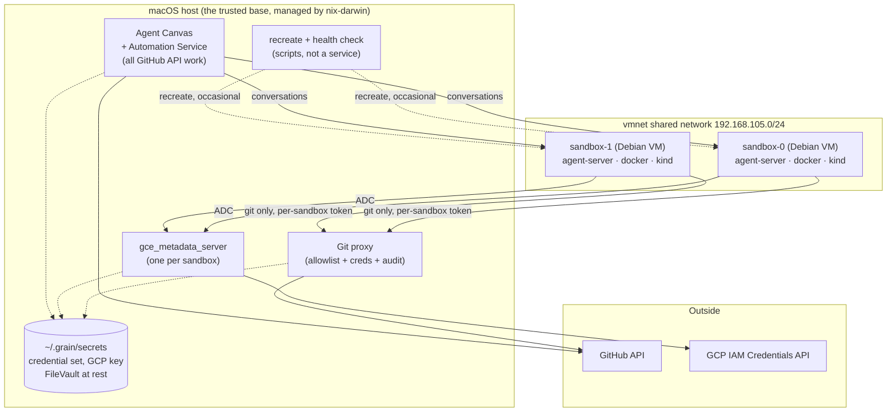

# Grain: an agent cluster on an Intel Mac

## Status

Revision 4. Rewritten for a **macOS host on Intel hardware** (8 cores,
32 GB) after revisions 1–3 targeted a NixOS host using
[`microvm.nix`](https://github.com/microvm-nix/microvm.nix).

Two deliberate simplifications since: sandboxes are **long-lived rather
than reset per task**, which removes the lease service revision 4 had made
mandatory; and the guests are **Debian rather than NixOS**, which removes
the Linux builder and the `nix-ld` shim, and lets agents work in an
environment their training data actually matches. What it trades away is isolation between *sequential* tasks; see
[what it costs](#what-it-costs).

The security architecture, the GitHub and GCP credential models, the
OpenHands integration and the sandbox guest configuration all carry over
essentially unchanged. **The host layer does not** — microvm.nix requires
KVM, which macOS does not have — and one security property is genuinely
lost in the move. Both are covered below; the Linux design is preserved in
[what changed and why](#what-changed-from-the-linux-design) rather than
deleted, since it remains the better production target.

## Goals

- One Intel Mac runs the whole system: an orchestrator and a small pool of
  isolated agent sandboxes.
- OpenHands picks up labelled issues from a target GitHub repo and drives
  an agent in a sandbox.
- Agents can read and write allow-listed GitHub repos, but **hold no
  GitHub credentials** — their only route out is a git proxy.
- Agents can obtain short-lived GCP tokens without ever touching the
  service-account key.
- Each agent gets a **whole VM**, because the workload runs `docker` and
  `kind`, which do not nest into containers.
- Sandboxes are long-lived for simplicity, with an explicit recreate that
  clears them; isolation between *concurrent* agents is the property that
  matters and it is preserved.
- Configuration and credentials survive rebuilds and are managed
  declaratively.

## Non-goals

- Running this as always-on production infrastructure. It is a laptop; see
  [operations](#operations).
- Multi-host clustering, autoscaling, HA.
- Defending against malicious *agent output*. Human PR review is that
  control.

## Build vs. reuse

Default to existing solutions; write code only where nothing fits. Two of
the three reuse decisions in revision 3 did not survive investigation, so
these are stated with what was actually verified.

| Need | Approach |
|---|---|
| Agent execution | **`openhands-agent-server`** per sandbox VM, registered as an Agent Canvas backend — [no provisioning API to build](#openhands-integration) |
| Issue intake | **[`OpenHands/automation`](#issue-intake)** — cron triggers and filter expressions |
| GCP credentials | **[`gce_metadata_server`](#gcp-credentials)** — ADC works with no client code |
| Sandbox VMs | **[Lima](#the-sandbox-vms) + stock Debian guests** |
| Host configuration | **nix-darwin** — Nix where config is stable, Debian where it is disposable |
| Git access control | **Custom** — small smart-HTTP proxy; [FINOS Git Proxy evaluated and rejected](#the-git-proxy-write-it) |
| GitHub API access | **none from sandboxes** — the orchestrator does API work, so there is nothing to filter |
| Branch and workflow protection | **[GitHub rulesets and withheld scopes](#scopes-to-withhold)** — enforced server-side |

### What is left to write

Essentially one thing: the [git proxy](#the-git-proxy-write-it), which is
small and unavoidable. Keeping
[sandboxes long-lived](#sandbox-lifecycle-long-lived-recreated-on-demand)
removes the lease service that revision 4 had made mandatory, leaving a
`recreate` script and a health check in its place.

## High-level architecture



Properties this preserves from the Linux design:

- Sandboxes never hold GitHub or GCP credentials — only two narrow local
  endpoints, allowlist-checked and audit-logged.
- Sandbox VMs cannot read the macOS filesystem, so the credential boundary
  is intact even though the orchestrator is no longer its own VM.
- Concurrent agents cannot reach each other; each has its own kernel,
  Docker daemon and port space.

## Host layer: macOS

### Why microvm.nix is gone

microvm.nix is a NixOS-host module and its hypervisors need `/dev/kvm`.
macOS has no KVM. There is no adaptation — it simply cannot be the base.

The obvious rescue is to nest: run one Linux VM under VMware Fusion or
Parallels with VT-x passthrough, and run the entire Linux design inside it
unchanged. That works and is the right way to *validate* the Linux design
on this hardware. It is not the right base to build on, for one specific
reason: VMware's own documentation states that **KVM performs relatively
poorly as a guest hypervisor on Intel using virtualized VT-x**. Paying a
nesting tax on every operation, plus a third virtualization layer to debug
through, in exchange for preserving a host layer we can replace, is the
wrong trade. (Revision 4 also cited fast microVM boots for per-task reset;
with sandboxes now long-lived that argument no longer applies, but the
performance and complexity ones stand on their own.)

So: **macOS is the base, and the sandboxes are ordinary Linux VMs.** Note
the asymmetry that makes this work — `kind` and Docker are containers, so
they need no nested virtualization at all. Only microvm.nix did.

### The sandbox VMs

[Lima](https://lima-vm.io) manages them. On Intel it uses QEMU with the HVF
accelerator, which is the native macOS path. **Guests are Debian**, from
Lima's stock template.

Revision 4 specified NixOS guests, for consistency with the host. That was
the wrong instinct, and the tell was in the design itself: a whole section
existed to explain NixOS's peculiarities *to the agent* — no `apt`, use
`nix shell`, and a `nix-ld` shim so downloaded binaries would run at all.
When a platform choice needs a README aimed at the thing using it, it is
the wrong choice for that layer.

Debian is the better fit here for reasons that compound:

- **`apt-get install` works.** This was the single likeliest thing to waste
  agent turns, and most agent training data assumes Debian. Now it is
  right.
- **No `nix-ld` shim.** Debian is FHS, so a downloaded release tarball, a
  `pip` wheel with a native extension, or a `curl | sh` installer simply
  runs. An entire class of opaque failure disappears.
- **Docker and `kind` are the documented path** — official apt repo, stock
  kernel, and every tutorial the agent has read matches what it finds.
- **`openhands-agent-server` installs the way upstream installs it**:
  `uvx --from openhands-agent-server==1.42.1 …`, which is exactly what
  upstream's own launcher runs. On NixOS that same command needs `nix-ld`
  to load its wheels.
- **It removes the Linux builder entirely** — see below.

Nix keeps the job it is good at: the **host**, which is long-lived, stable,
and worth configuring exactly. It gives up the job it is bad at: a
disposable machine that an agent is supposed to feel at home in.

The base image is built by a **version-controlled provisioning script** —
Lima `provision` blocks in the instance template, kept in this repo. That
is weaker than a Nix derivation, and honestly so: rebuilding the base in
six months yields whatever the Debian archive holds then. Pin the point
release, and reach for `snapshot.debian.org` if reproducibility ever
matters more than convenience. For a sandbox an agent immediately mutates
anyway, it mostly does not.

Still to verify: Lima's networking must give VMs addresses the host and
each other can reach, which means `socket_vmnet` shared mode rather than
the default user-mode NAT. See [open questions](#open-questions).

### No Linux builder needed

Revision 4 required nix-darwin's `nix.linux-builder`: an Intel Mac is
`x86_64-darwin`, the NixOS guest images were `x86_64-linux`, and Nix cannot
cross that boundary natively. It cost a VM, 4–6 GB while building, and a
build path documented as slow.

With Debian guests there is **nothing to cross-build**. Every orchestrator
service runs natively on macOS — Agent Canvas is Node, the Automation
Service is Python, `gce_metadata_server` is Go, and the git proxy is ours
to write in whatever builds for Darwin. The guests are provisioned from
Debian packages, not Nix closures.

So the builder VM, its memory contention, and its open question all
disappear. This is the largest single simplification in the revision.

### Networking

`socket_vmnet` puts the VMs on a shared bridge with host-reachable
addresses (typically `192.168.105.0/24`, with the host at `.1`).

The orchestrator's services — git proxy and metadata servers —
**bind to the vmnet address only**, never `0.0.0.0`. This matters more on a
laptop than on a server: `0.0.0.0` would expose the git proxy on whatever
café WiFi the machine is joined to. Back it with a `pf` rule denying those
ports on the physical interfaces, so a binding mistake fails closed.

What macOS cannot give us is the per-interface source-address pinning that
the Linux design relied on. The VMs share one host-side bridge; there is no
per-VM tap to attach a filter to. That is the one real loss, and it is
handled in [sandbox identity](#sandbox-identity-per-sandbox-tokens).

Sandbox egress: agents need the internet for dependencies, so the default
is open, with the same honest caveat as before — a sandbox with general
egress can exfiltrate anything it can read, and no firewall rule short of a
domain allowlist changes that. A `pf`-based allowlist is the opt-in
tightening; note that in-guest `nix` then needs `cache.nixos.org` allowed
or it silently breaks.

### Persistence and secrets

This gets *simpler* on macOS, which is worth noting because most of the
move is a loss.

There is no `/persist` volume and no virtiofs share. Credentials and
configuration live in a plain directory on the Mac:

```
~/.grain/
  secrets/
    github/            # credential set + credentials.json
    gcp-service-account.json
  config/
    repo-allowlist.json
  state/
    git-proxy/audit.log
    metadata-server/audit.log
```

Owned by the user, mode `0600`, encrypted at rest by **FileVault** — which
is a straight improvement over the unencrypted raw disk image the Linux
design used. Backup is Time Machine or an `rsync`, not image snapshots.

The invariant holds unchanged: **no secret is ever a Nix string literal or
a derivation input.** nix-darwin encodes paths and how services consume
them; values are placed by hand.

## Sandbox identity: per-sandbox tokens

Both local services need to know which sandbox is calling — for allowlist
decisions, per-caller audit, and rate limiting.

The Linux design authenticated by **source IP**, made trustworthy by
per-tap nftables rules that dropped any packet whose source address was not
the one assigned to that interface. A forged source address could not leave
the VM, and there was no secret to distribute at all.

**macOS cannot do this.** Under `vmnet` the VMs share a bridge and take
DHCP addresses; there is no per-VM interface to pin. A source address
becomes a claim rather than a fact, and stops being authentication.

So identity is a **random bearer token per sandbox**, generated and
injected when the sandbox is provisioned. Because
[sandboxes are long-lived](#sandbox-lifecycle-long-lived-recreated-on-demand),
provisioning is a natural place to put it — the token lives as long as the
sandbox generation does, and is replaced when the sandbox is recreated.

This is where an earlier version of this design went wrong. It assumed
per-*lease* tokens, which required something to mint and deliver one at
every lease, which made a lease service mandatory. Long-lived sandboxes
dissolve that: there is no lease, so there is nothing to mint per lease,
and the token is delivered once by the same step that creates the VM.

Properties:

- **Not an SSH key.** Both consumers speak HTTP. An SSH endpoint would
  cover only the git side, and would mean brokering `git-upload-pack` and
  `git-receive-pack` rather than passing smart-HTTP through.
- **Git consumes it via a credential helper**, so agents never handle it.
- **Rotation is now explicit**, not free. A per-lease token died with the
  lease; a per-sandbox token lives until the sandbox is recreated. Fold
  rotation into [recreate](#recreating-a-sandbox) so it happens on the same
  cadence rather than never.
- **Exfiltration is low-impact**: the token is only useful against a vmnet
  address not routable from outside the Mac. But note it is now worth more
  than a per-lease token was, because it lasts longer.

**The GCP path does not work this way**, which is easy to miss. A metadata
server is authenticated *by network position* — that is exactly what lets
ADC work with no client configuration — and Google's client libraries will
not attach a custom header to metadata requests. A token cannot be handed
to ADC. So run **one `gce_metadata_server` instance per sandbox**, each
bound to that sandbox's address, making network position per-VM by
construction. It costs a small process per sandbox and preserves
attribution exactly.

## Sandbox lifecycle: long-lived, recreated on demand

Sandboxes are **created once and serve many agent runs**. They stay
running; there is no per-task reset. Recreating one is an explicit,
occasional operation that may take a reboot.

This is a deliberate simplification, and it buys a lot: no lease service,
no per-task token minting, no copy-on-write overlay juggling, no reset step
that can fail silently, and a mental model that fits in a sentence. Given a
pool of two, most of that machinery was ceremony.

### What it costs

Worth stating precisely, because the property being traded is real.

**Isolation between *concurrent* agents is unchanged** — that is what the
VM-per-agent design provides, and it is the important one. What is given up
is isolation between *sequential* tasks on the same sandbox: task B
inherits whatever task A left behind.

Concretely, that means:

- A previously cloned private repo is readable by the next task.
- Containers, `kind` clusters, and stray background processes accumulate.
- Package caches persist, so a poisoned npm or pip entry outlives the task
  that fetched it.
- Disk grows monotonically until something is done about it.

The **correctness** consequence is probably larger than the security one: a
task that inherits a half-finished worktree, a container already bound to
the port it wants, or a `kind` cluster named `kind` fails in ways that look
like agent incompetence.

The security consequence is judged acceptable *here* because tasks come
from the same repo allowlist and run under the same credential set — they
are not mutually distrusting. That reasoning stops holding if the allowlist
ever spans repos of genuinely different sensitivity, which is the trigger
to revisit this.

### Between-task hygiene

Most of the accumulation is cheap to clear without recreating anything. Run
a cleanup between runs — a systemd unit in the guest, or a hook the agent
server calls:

```sh
kind delete clusters --all
docker system prune -af --volumes
rm -rf "$WORKDIR"
```

Be clear about what this is: **hygiene, not isolation.** It stops the
disk filling and stops the most common cross-task collisions. It does not
make the previous task's data unrecoverable, and it is not a security
boundary. Recreate is the boundary.

### Recreating a sandbox

The real reset, as an explicit operation:

```sh
grain sandbox recreate sandbox-0
```

which stops the VM, discards its disk, recreates it from the pristine base
image, starts it, and injects a fresh
[token](#sandbox-identity-per-sandbox-tokens). Downtime is a boot, and at a
pool of two it means running at half capacity for a minute.

Recreate when:

- **the base image changed** — this is the deploy path for
  [image changes](#the-sandbox-image), replacing the old design's
  reset-on-next-lease convergence;
- **disk crosses a watermark**, which is the failure this design is most
  likely to hit in practice;
- **a sandbox is wedged** — cheaper to recreate than to debug;
- **on a schedule** — weekly is a reasonable default, and it doubles as
  token rotation;
- **before or after anything sensitive**, if the allowlist ever mixes
  sensitivity levels.

### What is left of the lease service

Very little, which is the point. With long-lived sandboxes there is no
assignment to broker, no token to mint per task, and no reset to sequence.
What remains is a couple of scripts — `recreate`, and a health check that
flags a sandbox as unusable rather than letting Agent Canvas dispatch into
it.

That drops the custom-code inventory to **the git proxy plus scripts**.

One thing to confirm: whether Agent Canvas distributes conversations across
registered backends on its own, or expects a human to pick one. At a pool
of two, picking by hand is fine either way — but if it needs orchestrating,
that small assigner is the one piece that comes back. See
[open questions](#open-questions).

## Memory budget

Memory is the binding resource, and on this machine the number is small
enough to state exactly.

| Consumer | Budget |
|---|---|
| macOS itself | ~8 GB |
| Orchestrator services (Canvas, Automation, proxy, metadata servers) | ~3 GB |
| Each sandbox (kind control plane + build + test) | ~8 GB |

`32 − 8 − 3 ≈ 21 GB` → **two concurrent agents**, with more headroom than
revision 4 had, since dropping the Linux builder removed a VM that took
4–6 GB whenever anything was built. Three agents only if the laptop is
doing nothing else and the sandboxes are lightly loaded. `sandboxCount`
should be derived from that arithmetic, not from how many issues you would
like worked at once.

This is the main reason the orchestrator runs **natively on macOS rather
than in its own VM**: a fourth VM would cost a sandbox. The trade is
honest — macOS is a larger and less reproducible attack surface than a
minimal NixOS VM — but the boundary that matters is preserved, because
sandbox VMs cannot read the host filesystem either way.

Two host-level tactics that helped on Linux do not transfer: virtio-mem
free-page-reporting reclaim, and KSM page merging across near-identical
guests. macOS gives back neither, which makes the per-sandbox 8 GB a harder
floor than it was.

Because sandboxes are now long-lived, they simply stay resident — there is
no start-on-lease to amortise idle memory. At a pool of two that is the
simpler arrangement and costs nothing that stopping them would recover;
stopping an idle sandbox remains possible, but it buys back 8 GB you have
no second use for.

## The sandbox image

Because each sandbox is [recreated from a pristine base](#recreating-a-sandbox),
whatever agents need should be *in the base image* rather than reinstalled
per task. Shaping it is a provisioning script in this repo, applied by
Lima:

```yaml
provision:
  - mode: system
    script: |
      #!/bin/bash
      set -eux
      apt-get update
      apt-get install -y --no-install-recommends \
        git curl jq ripgrep fd-find build-essential python3 python3-venv \
        pipx tmux unzip ca-certificates
      # Docker from the official repo, plus kind
      install -m0755 -d /etc/apt/keyrings
      curl -fsSL https://download.docker.com/linux/debian/gpg \
        -o /etc/apt/keyrings/docker.asc
      ...
```

Keep the package list in one place so "what agents get" is a single
reviewable diff. `tmux` is not optional —
[the agent server hard-requires it](#openhands-integration).

### Docker and kind

Since [agents cannot run in containers](#why-a-vm-per-agent), the sandbox
has to host `docker` and `kind` comfortably. On Debian in a full VM this is
the ordinary, documented path: the official Docker apt repository, the
stock Debian kernel, and no kernel-config question at all — which is what
dominated the Linux design's risk and is now simply gone.

Two things still need doing, and both are easy to miss:

**Raise the inotify limits.** kind's own guidance is explicit that common
defaults (8192 watches, 128 instances) cannot bring up a cluster, and the
failures are opaque — `too many open files`, `failed to create fsnotify
watcher` — and look nothing like their cause:

```
fs.inotify.max_user_watches   = 524288
fs.inotify.max_user_instances = 8192
```

**Pre-load the kind node image** into the base. It is on the order of a
gigabyte, and both [recreate](#recreating-a-sandbox) and the between-task
`docker system prune` discard it — so `docker pull` it during provisioning
and `docker save`/`docker load` it, or accept re-pulling on every cleanup.

Also: passwordless sudo, safe precisely because the VM is disposable and
the boundary is the VM rather than the unix user.

### Runtime installs

This section used to be long. On Debian it is short: **everything works the
way an agent expects.** `apt-get install`, `pip`, `npm -g`, `cargo`,
downloaded binaries, `curl | sh` installers — all of it behaves as the
agent's training data assumes.

The one thing to keep from the NixOS version is the feedback loop: when
agents repeatedly install the same package by hand, add it to the
provisioning script. Cheap to fix, and it silently taxes every run until
you do.

### Telling the agent

Still worth a short `/etc/agent-tools/README`, referenced from the
OpenHands system prompt — but it is now about *this system*, not about the
operating system:

- git pushes go through a proxy automatically; GitHub API calls are not
  available from here,
- GCP works through ADC with no setup,
- the sandbox is shared across tasks and cleaned between them, so do not
  leave long-running services behind.

The NixOS version of this file also had to explain that `apt` did not
exist and that downloaded binaries needed a shim. Not needing to say that
is the point.

## Why a VM per agent

Worth keeping, because it is the reason the design does not collapse into
something much simpler.

Agent tasks run `docker` and `kind` themselves. Nesting those inside an
agent *container* means Docker-in-Docker and kind-in-a-container:
privileged containers, storage-driver contortions, cgroup fights — and
failures that present as the agent being incompetent rather than the
platform being wrong, which is the worst kind to debug.

Running agents in separate *directories* on one machine trades that for a
shared Docker daemon, colliding `kind` cluster names and host ports, one
set of global tool versions, and shared caches.

### Doesn't NixOS make the dependency problem moot?

Half right, and the half that is right is real: with flakes and devShells,
agents in separate directories get exact non-colliding toolchains. That
dissolves the versioning and packaging problem entirely.

But dependency isolation is not the isolation this workload needs. Nix
scopes what is on `PATH` and what a build links against. It does not
virtualize the Docker daemon (a singleton with one image store — and agents
really do run `docker rm -f $(docker ps -aq)` when tidying up), the host
port space, kind's cluster and network namespace, or the kernel-global
iptables and conntrack state that Docker and kind rewrite.

Each has a workaround, and each is a step toward reimplementing a VM less
well, in a place where the failure mode is one agent silently corrupting
another's run.

## GitHub access

### Split the surface: sandboxes get git, the orchestrator gets the API

The most useful simplification available. Sandboxes do not need the GitHub
API — OpenHands runs on the orchestrator, where it holds a credential
directly and does all the API work: reading issues, commenting, opening
PRs. What an agent inside a sandbox needs is `git clone`, `fetch`, `push`.

- **Sandboxes: git transport only.** No REST, no GraphQL. This removes an
  entire class of API-filtering bypasses rather than defending against
  them.
- **Orchestrator: API operations**, on the machine that already holds every
  other secret.

The cost is that agents cannot run `gh pr create`; PR and comment creation
happens through OpenHands. Worth accepting — the alternative reintroduces
the full REST attack surface into the least trusted component.

### Auth model: a broad credential behind a narrow proxy

Installing a GitHub App on every needed repo is often impossible — it
generally requires admin on the repo or org. So the working assumption is a
broadly-scoped user credential held by the proxy, with repos and operations
restricted there.

This is a legitimate pattern; the [GCP path](#gcp-credentials) does the same
thing. But it moves the proxy from *second lock* to *only lock*: a proxy bug
now reaches everything the credential reaches, and every agent action is
attributed to the human.

**The highest-value mitigation, and it sidesteps the App problem: use a
dedicated machine account** and invite it as a collaborator to the repos
agents need. A token on that account reaches exactly those repos, restoring
GitHub-side scoping with no App installs — and inviting a collaborator needs
repo admin, not org admin, which clears the bar that usually blocks
installation. It also fixes attribution: agent commits show as
`grain-agent-bot`.

It is not universal, so the proxy holds a **credential set** selected per
target repo:

```
~/.grain/secrets/github/
  credentials.json     # repo/owner pattern -> credential
  bot.token            # machine account, most repos
  personal.token       # last resort, only what nothing else reaches
```

The proxy picks the narrowest credential covering the target and **records
which one served each request**, keeping the powerful token off most
traffic and making its use visible rather than assumed.

Ladder, in order: GitHub App where installable → fine-grained PAT scoped to
selected repos (one per resource owner; note orgs must opt in to
fine-grained PATs at all) → machine-account classic PAT → personal token
for the remainder.

### Scopes to withhold

`delete_repo` is a separate classic scope — never grant it. No `admin:*`,
no `write:org`, no webhook or deploy-key management.

**Do not grant `workflow`** (or `workflows: write`). This is a
privilege-escalation path that is not obvious: an agent that can modify
`.github/workflows/**` can make CI run code of its choosing with whatever
secrets that workflow holds. Withholding the scope makes GitHub itself
reject such a push — *"refusing to allow a Personal Access Token to create
or update workflow … without `workflow` scope"* — and the same applies to
Apps.

That is the enforce-at-GitHub principle: a server-side control, immune to
bugs in our code. Branch protection on the default branch is the other
half. Both matter more now that they do work the App installation scope
used to.

### Write safety: enforce at GitHub, not in a pack parser

Agents must not push to `main`, force-push, or delete branches. The
tempting place to enforce that is the proxy — resist it. Doing so means
parsing ref-update commands out of the `git-receive-pack` body, and getting
that subtly wrong fails *open*.

Instead use branch protection / repository rulesets on each allow-listed
repo: no direct pushes to the default branch from the agent credential, no
force-push, no deletion, PRs required. Enforced by GitHub, declarative, and
unbypassable by our bugs. The proxy adds the coarse check it *can* do
reliably — reject pushes to repos not on the allowlist — and leaves
ref-level policy to GitHub.

Applying these rules is part of onboarding a repo, and the proxy should
refuse to serve a repo whose protections it cannot verify. Failing closed at
onboarding is cheap and prevents the allowlist and the rulesets from
drifting apart.

### The git proxy: write it

[FINOS Git Proxy](https://github.com/finos/git-proxy) was the obvious
candidate and is a good project — actively maintained, default-deny repo
allowlist covering fetch and push. It was evaluated properly: source read,
software installed and run.

**It is architecturally inverted for this design.** Git Proxy is a
credential **pass-through**, not a credential holder — it requires the
*client* to present the GitHub token:

```ts
// src/proxy/processors/push-action/PullRemoteHTTPS.ts
const credentials = this.decodeBasicAuth(req.headers?.authorization);
if (!credentials) throw new Error('Missing Authorization header for HTTPS clone');
```

`authorization` is deliberately absent from its upstream header blocklist,
so the client's credential is forwarded verbatim. Its manual confirms the
intent. That is the opposite of this design's premise. Adding injection
would mean forking two independent code paths to obtain a capability the
project was designed not to have.

The rest of the fit was poor anyway, recorded so nobody reopens it:
auto-approval works via a pre-receive hook but costs **a second `git push`
for every push**; there is no source-IP or anonymous authentication, so
pushes need per-user accounts for entities that have none; fetches are
never written to the audit database and re-pushes overwrite prior records;
dynamic config reload is **broken at HEAD**, calling a `proxy.stop()` the
module does not export; and it is ~800 MB of `node_modules` with an
undisableable React dashboard.

**So write it.** It is small, because the surface is git-only:

- match the four legal smart-HTTP paths —
  `/{owner}/{repo}.git/{info/refs,git-upload-pack,git-receive-pack}`,
- canonicalize and check `(owner, repo)` against the allowlist,
  default-deny,
- authenticate the caller by [per-sandbox token](#sandbox-identity-per-sandbox-tokens),
- select the credential for that repo and set `Authorization`,
- stream the body through, and log the tuple.

No pack parsing, no server-side clones, no database, no user accounts. The
allowlist is read from `~/.grain/config/repo-allowlist.json` and watched, so
an admin edits a file with no restart.

Two things worth stealing rather than reinventing: Git Proxy's
`validGitRequest()` (a tight path whitelist cross-checked against a `git/*`
User-Agent and `application/x-git-*` Accept header, ~20 lines), and its
git-protocol-correct rejection encoding — a `PKT-LINE("ERR …")` for
`/info/refs`, a sideband packet plus flush for pack POSTs — without which a
refused client just prints *"the remote end hung up unexpectedly"*.

### Issue intake

`openhands-resolver` no longer exists; it was deleted in the V0→V1
transition. Its successor is **`OpenHands/automation`**, with a cron
scheduler, webhook triggers, filter expressions and run history.

On a laptop the choice is made for us: **cron only**. Webhooks require
GitHub to reach the host, and this machine has no inbound path at all —
which is a security improvement, not a limitation. Polling also keeps every
GitHub call flowing outward through our own credential path.

What remains ours, because it is about protecting a two-VM pool and the LLM
budget rather than issue semantics:

- **Rate limiting** — a cap on runs started per hour, so bulk-labelling
  forty issues cannot consume the pool and a month of spend at once.
- **A stranded-work sweeper** — if the laptop sleeps or a lease dies
  mid-flight, issues need returning to the queue rather than stalling
  silently.

One caution carried forward: the old resolver embedded the GitHub token
directly in the clone URL, so it landed in `.git/config` inside the
sandbox. If anything in the new stack does the same it silently defeats the
split surface. Verify what ends up in the sandbox's `origin` remote.

## GCP credentials

**Don't build a token service — emulate GCE's metadata server.**
[`gce_metadata_server`](https://github.com/salrashid123/gce_metadata_server)
serves the real metadata contract from a service-account file or
**service-account impersonation**, which is the shape this needs.

The payoff is that it eliminates the client side entirely. Every Google SDK
finds credentials through ADC, which probes the metadata server
automatically. Point a sandbox at its instance and GCP access just works —
no wrapper script, no environment plumbing, nothing for the agent to get
wrong.

- The key lives at `~/.grain/secrets/gcp-service-account.json`, `0600`,
  readable only by the metadata service.
- It is configured to **impersonate a second, minimally-privileged service
  account** rather than serve the primary key's own tokens.
- **One instance per sandbox**, each bound to that sandbox's vmnet address
  — see [sandbox identity](#sandbox-identity-per-sandbox-tokens) for why this
  is what preserves per-caller attribution on macOS.
- Every mint is audit-logged.

### What a short lifetime actually buys

A sandbox can re-mint the moment a token expires, indefinitely. Short
lifetimes therefore do **not** limit what a compromised sandbox can do
while compromised. What they buy:

- **Revocability**: cut a sandbox off and its GCP access dies in minutes,
  with no key to rotate.
- **Leak containment**: a token in a log, an LLM context, or a PR diff is
  worthless within minutes.

Both real. Neither is "the agent only has five minutes of access." To
reduce steady-state privilege you must downscope the token itself:
impersonating a narrow second service account is the whole game, and costs
one service account and one IAM binding. Optionally add a
[Credential Access Boundary](https://cloud.google.com/iam/docs/downscoping-short-lived-credentials)
to restrict to specific resources.

## OpenHands integration

The architecture described in revisions 1–2 no longer exists. Verified
against the repositories:

| Component | Status |
|---|---|
| V0 Python monolith — `openhands/runtime/*`, `SANDBOX_*` env vars | Ended at 0.62.0. `openhands/runtime/__init__.py` is **404 on main** |
| V1 Python app (`openhands-ai`) | Froze at 1.11.0, removed from main |
| `OpenHands/OpenHands` main | Now **Agent Canvas**, a TypeScript control centre |
| Sandbox-side component | **`openhands-agent-server`**, from `OpenHands/software-agent-sdk` |
| `openhands-resolver` | **Gone**. Successor is `OpenHands/automation` |

### No provisioning API to build

```python
# software-agent-sdk/openhands-sdk/openhands/sdk/workspace/workspace.py
class Workspace:
    """Factory entrypoint that returns a LocalWorkspace or RemoteWorkspace.
    Usage:
        - Workspace(working_dir=...) -> LocalWorkspace
        - Workspace(working_dir=..., host="http://...") -> RemoteWorkspace
    """
```

`RemoteWorkspace` attaches to an already-running agent server at a fixed
URL — no provisioning, no image, no lifecycle — and Agent Canvas registers
a backend as `{host, apiKey, kind}`. So **N sandbox VMs each running
`openhands-agent-server`, registered as backends, is the supported
deployment.** Nothing to reimplement.

What upstream does *not* give us is per-task reset: Canvas treats backends
as long-lived and one server takes many concurrent conversations
(`max_concurrent_runs`, default 10). Hence the
[deliberate trade](#sandbox-lifecycle-long-lived-recreated-on-demand) —
long-lived backends are exactly what upstream expects, so this is one place
where simplifying moved *toward* the grain rather than against it. Set
`max_concurrent_runs = 1` per sandbox so one task has a VM to itself.

### Version pinning

`config/defaults.json` on Canvas main is upstream's source of truth:

```json
"versions":      { "agentServer": "1.42.1", "agentCanvas": "1.14.0", "automation": "1.8.0" },
"compatibility": { "minimumAgentServer": "1.28.0" },
"constraints":   { "agentClientProtocol": "agent-client-protocol<0.11" }
```

Pin `openhands-agent-server`, `openhands-sdk`, `openhands-tools` and
`openhands-workspace` to one identical version — upstream CI enforces this
and inter-package APIs are not expected to survive a mismatch. Carry the
`agent-client-protocol<0.11` constraint. Nothing enforces the pin at
runtime; `GET /server_info` reports versions for debugging only, so skew
fails late and confusingly.

### Gotchas before the first boot

- **The agent server binds loopback unless authentication is configured.**
  Without `SESSION_API_KEY` / `OH_SESSION_API_KEYS_0` it defaults to
  `127.0.0.1`, so a sandbox comes up looking healthy and is unreachable.
- **Set `OH_SECRET_KEY`**, or secrets are redacted and lost across restart.
- **`tmux` is a hard dependency**, imported at module load.
- Upstream's own full agent-server image ships Docker CE, buildx and
  compose — independent confirmation that running docker inside the sandbox
  is the expected shape.

## Threat model

**Defended:**

- A compromised sandbox cannot read GitHub or GCP credentials; they are not
  on the machine, and a VM cannot read the host filesystem.
- It cannot touch repos outside the allowlist (proxy check, plus GitHub-side
  scoping when a machine account or App is used).
- It cannot push to protected branches or modify workflows — enforced by
  GitHub, not by our code.
- It cannot reach a *concurrently running* agent: separate VMs, separate
  kernels, separate Docker daemons.
- It cannot persist past a [recreate](#recreating-a-sandbox) — but note it
  **does** persist between sequential tasks on the same sandbox, which is
  the deliberate trade described above and is listed again under what is
  not defended.
- Its access is revocable in minutes and fully audit-logged.

**Not defended:**

- **Sequential tasks on one sandbox.** Sandboxes are long-lived, so a
  task inherits the previous task's filesystem — cloned repos, caches,
  containers. Accepted because tasks share a repo allowlist and credential
  set; revisit if the allowlist ever mixes sensitivity levels. See
  [what it costs](#what-it-costs).
- **Abuse of legitimate access while compromised.** It can do anything the
  agent may do, for as long as it is running. The proxy narrows scope and
  provides audit and a kill switch; it does not distinguish a well-behaved
  agent from a hostile one making the same calls.
- **Exfiltration**, under the default open-egress policy.
- **Malicious code in agent output.** Human PR review is the control, which
  is why the no-push-to-`main` rules are load-bearing.
- **A compromised host.** On macOS this is now the laptop itself, which
  holds every credential. It is a larger and less controlled surface than
  the minimal NixOS orchestrator VM the Linux design used — an accepted
  cost of the RAM budget, and the clearest argument for moving to a Linux
  box if this ever becomes more than a personal tool.
- **Prompt injection via issue content.** Anyone who can file an issue can
  put text in front of the agent. Requiring a human to label each issue is
  the mitigation, not a guarantee.

## Operations

- **It is a laptop.** It sleeps, closes, travels, thermally throttles and
  takes OS updates. Use `caffeinate` while agents run, and expect the
  stranded-work sweeper to earn its keep. Do not treat this as always-on
  infrastructure; the design's premise was a server, and that mismatch is
  real rather than cosmetic.
- **Two concurrent agents.** Derive `sandboxCount` from
  [the memory budget](#memory-budget), and alarm on pool exhaustion — with
  a pool this small it is a routine condition, not an edge case.
- **Backup** is `~/.grain` — the only stateful thing. Time Machine or
  `rsync`; FileVault covers at-rest.
- **Rotation**: replace a file in `~/.grain/secrets` and restart the one
  service that reads it.
- **Adding a repo**: edit the allowlist, install the App or invite the bot,
  apply branch protection. Hot-reloaded.
- **Recreating a sandbox** is the routine maintenance operation, and the one
  most likely to be forgotten until something breaks. Watch disk, and put it
  on a schedule — weekly also rotates the per-sandbox token, which otherwise
  never rotates at all. See
  [recreating a sandbox](#recreating-a-sandbox).
- **Observability**: the signals that matter are pool free/busy/quarantined,
  lease durations, proxy denial rate, token mint rate, intake outcomes. A
  quarantined sandbox and an issue stuck mid-flight are the silent failure
  modes.

## What changed from the Linux design

Recorded rather than deleted, because the Linux design remains the better
production target and this is the ledger of what the Mac costs.

**Carried over unchanged:** the credential model and ladder, withheld
scopes, branch protection, split surface, the git proxy design, the GCP
metadata-server approach and impersonation, the whole OpenHands
integration, the sandbox guest configuration, and the reasoning for a VM
per agent.

**Lost:**

| Property | Linux | macOS |
|---|---|---|
| Sandbox identity | source IP, pinned per tap — no secret at all | per-sandbox bearer token, injected at provisioning |
| GCP attribution | one metadata server, callers distinguished by IP | one instance per sandbox |
| Reset | ephemeral dm-crypt volume per lease | explicit recreate; no per-task reset |
| Boot | ~1s microVM | tens of seconds |
| Store | one read-only host store shared by all guests | per-VM store; more disk |
| Memory reclaim | virtio-mem free page reporting, KSM | neither |
| Guest OS | NixOS, declarative, shared host store | Debian, provisioning script |
| Orchestrator isolation | its own minimal NixOS VM | native on macOS |
| Reproducibility | one flake, whole cluster | nix-darwin + guest flakes + Lima config |

**Gained:** simpler persistence (a directory, not a volume), FileVault at
rest, no inbound network surface at all, and no nested virtualization.

The Linux artifacts — `flake.nix`, `hosts/spike/`, `modules/sandbox-spike.nix`
— are kept. They evaluate cleanly and remain the fastest way to stand this
up on a Linux box later, or to validate the Linux design under VMware
Fusion with VT-x passthrough.

## Open questions

1. **Does `socket_vmnet` give VM↔VM and VM↔host reachability** with stable
   enough addressing for the proxy and per-sandbox metadata servers? This
   is now the only host-layer unknown.
3. **Does Agent Canvas distribute conversations across backends**, or does
   it expect a human to pick one? At a pool of two, picking by hand is
   fine — but if orchestration is needed, a small assigner is the one piece
   of the lease service that comes back. See
   [what is left of the lease service](#what-is-left-of-the-lease-service).
4. **Does the Automation Service work in cron-only mode**, and what are its
   trigger and dedupe semantics? Also whether anything writes a GitHub
   token into the sandbox's `origin` remote.
5. **How far down the credential ladder can each owner go** — App, machine
   account, or personal token?
6. **Real peak memory** for a sandbox under a kind cluster plus a build.
   `sandboxCount` follows directly, and at this budget the difference
   between 6 GB and 10 GB is the difference between two agents and one.

## Implementation plan

1. **Host baseline**: nix-darwin managing the Mac and the orchestrator
   services. No Linux builder needed.
2. **One sandbox VM**: Debian guest under Lima with docker and kind, from
   the provisioning script. Confirm `kind create cluster` works, and
   measure peak memory and boot time while there.
3. **Networking**: `socket_vmnet`, services bound to the vmnet address
   only, `pf` denying those ports on physical interfaces. Verify the
   negative cases explicitly — a silently-permissive binding on a laptop is
   the failure that matters most.
4. **OpenHands end to end**: `openhands-agent-server` as a systemd unit in
   the sandbox (remember the session key), registered as a backend in Agent
   Canvas on the Mac. No custom code yet.
5. **Git proxy**: the custom smart-HTTP proxy — path whitelist,
   canonicalize, allowlist, token auth, credential selection, stream
   through, audit. Verify allow-listed repos clone and push, un-listed ones
   are refused *with a legible git error*, and no credential is ever
   visible inside the sandbox.
6. **Metadata server**: one instance per sandbox, impersonating the narrow
   service account. Verify ADC works unmodified and the key is unreachable.
7. **Lifecycle scripts**: `grain sandbox recreate`, the between-task
   cleanup hook, a health check, and a disk watermark alarm. Small, but
   this is what keeps a long-lived pool from silently degrading.
8. **Automation Service**: cron-mode intake, rate limit, stranded-work
   sweeper. First full issue-to-PR run.
9. **Hardening**: move repos down the credential ladder, apply branch
   protection, confirm no credential carries `workflow` scope, write the
   runbook.

Scale to `sandboxCount = 2` once 1–8 work at one, and expect that to be the
ceiling.

## Sources

- [`OpenHands/software-agent-sdk`](https://github.com/OpenHands/software-agent-sdk)
  — `openhands-agent-server`, `Workspace`/`RemoteWorkspace`
- [`OpenHands/automation`](https://github.com/OpenHands/automation)
- [FINOS Git Proxy](https://github.com/finos/git-proxy) — evaluated and
  rejected for this role, but worth reading for `validGitRequest()` and its
  git-protocol error encoding
- [`gce_metadata_server`](https://github.com/salrashid123/gce_metadata_server)
- [Lima](https://lima-vm.io)
- [nix-darwin](https://github.com/nix-darwin/nix-darwin) — host configuration
- [GCP downscoping with credential access boundaries](https://cloud.google.com/iam/docs/downscoping-short-lived-credentials)
- [microvm.nix](https://github.com/microvm-nix/microvm.nix) — the Linux
  design's foundation, retained in the repo's spike artifacts
