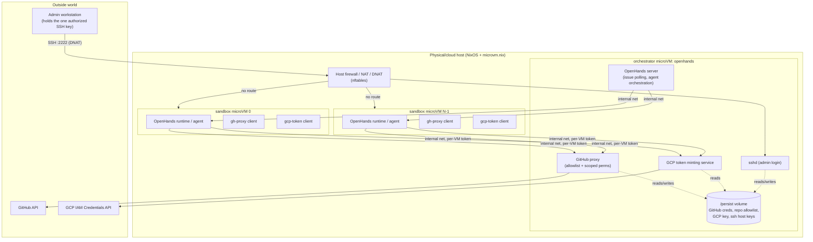

# Agent Cluster: NixOS + microvm.nix Design

## Status

Draft. This is the first design pass for a NixOS configuration that runs a
small cluster of `microvm.nix` virtual machines: one orchestrator VM running
[OpenHands](https://github.com/All-Hands-AI/OpenHands) plus a GitHub proxy,
and a fixed number of ephemeral agent sandbox VMs. Open questions are called
out explicitly in [Open Questions](#open-questions) and should be resolved
(or explicitly deferred) before implementation starts.

## Goals

- A single physical/cloud host runs a `microvm.nix`-based cluster:
  - **1x orchestrator VM** (`openhands`): runs OpenHands, a GitHub proxy,
    and a GCP short-lived-token minting service.
  - **Nx sandbox VMs** (`sandbox-0..N-1`): fixed count, ephemeral, run the
    actual coding-agent workload that OpenHands dispatches to.
- OpenHands pulls issues from a target GitHub repo and drives agents that
  run inside the sandbox VMs.
- Agents in sandbox VMs can read/write allow-listed GitHub repos (branches,
  issues, PRs) only through a proxy — they never hold GitHub credentials.
- The orchestrator VM holds a GCP service-account key. Sandboxes cannot
  reach the key directly; they can request short-lived (~5 min) GCP access
  tokens via a minting service on the orchestrator.
- Only the orchestrator VM is reachable from outside the host, over SSH,
  for admin configuration (setting up GitHub credentials, editing the repo
  allowlist, etc). Sandbox VMs are not reachable from outside the host at
  all.
- Credentials and configuration (GitHub credentials, repo allowlist, GCP
  key) survive `nixos-rebuild`/flake updates — they live outside the Nix
  store, on a persistent volume.
- SSH access to the orchestrator VM is keyed to a specific public key
  supplied as Nix configuration, so only a specific admin machine can log
  in.

## Non-goals (for this pass)

- Multi-host / multi-node clustering. This design is single physical host,
  multiple VMs on it.
- Autoscaling the sandbox count. It's a fixed number set in Nix config.
- Building OpenHands' own GitHub/issue-tracking integration from scratch —
  we configure OpenHands' existing GitHub integration to talk to our proxy
  instead of `api.github.com` directly (see [Open Questions](#open-questions)
  on whether OpenHands supports this cleanly).
- High availability / failover of the orchestrator VM.

## High-level architecture



Key properties this gives us:

- The host's firewall only DNATs one external port, to the orchestrator
  VM's sshd. Sandbox VMs have no path in from outside the host.
- Sandbox VMs never see raw GitHub credentials or the GCP key — only proxy
  endpoints on the internal network, reachable with per-sandbox tokens.
- Everything that must outlive a `nixos-rebuild` (creds, allowlist, ssh
  host keys) lives on a `/persist` volume that isn't part of the
  ephemeral, Nix-store-derived VM root filesystem.

## Host layer

### microvm.nix wiring

The host imports `microvm.nix` and declares each VM as a
`microvm.vms.<name>` entry (via the `microvm.nix` flake module), each with
its own `nixosConfiguration`. Default hypervisor: `qemu` (broadest
compatibility, works without nested-virt surprises); revisit
`cloud-hypervisor` once the design is validated (see Open Questions).

Two VM classes:

- `openhands` — the orchestrator, defined once.
- `sandbox-0` .. `sandbox-{N-1}` — generated via a `builtins.genList` /
  NixOS module function over `agentCluster.sandboxCount`, so adding
  sandboxes is a single config-number change, not copy-pasted modules.

### Networking

A dedicated Linux bridge on the host, e.g. `br-agents`, subnet
`10.100.0.0/24` (configurable):

- host: `10.100.0.1`
- orchestrator VM: `10.100.0.2`
- sandbox VMs: `10.100.0.10 + i`

Bridged (tap) networking is used rather than per-VM user-mode/slirp
networking, because sandboxes need to reach the orchestrator's proxy
services, and the host needs uniform firewall control over every VM's
traffic.

Host-level `nftables` rules:

- **Inbound (WAN → host)**: DNAT `tcp/2222` → `10.100.0.2:22` (orchestrator
  sshd) only. No other inbound ports are forwarded to any VM.
- **VM ↔ VM**: sandbox VMs may reach the orchestrator's proxy ports
  (GitHub proxy, GCP token service) and nothing else on the orchestrator;
  sandbox-to-sandbox traffic is dropped (agents shouldn't be able to reach
  each other).
- **Outbound (VM → WAN)**: orchestrator gets full outbound NAT (needs to
  reach GitHub, GCP). Sandboxes get outbound NAT too (agents need to
  install deps / run builds / tests), but egress to GitHub's own IP ranges
  over 443/22 is blocked so that `git`/`gh` traffic is forced through the
  proxy rather than able to bypass it directly. (This egress block is a
  defense-in-depth measure, not the primary control — the primary control
  is that sandboxes are never given GitHub credentials in the first
  place.)

### Persistent storage strategy

`microvm.nix` VM root filesystems are built from the host's Nix store and
are treated as disposable — a config/flake update effectively gives the VM
a fresh root. That's exactly what we want for sandbox VMs, but the
orchestrator needs some state to survive updates:

- GitHub credentials (however OpenHands/the proxy authenticate — App
  private key or PAT)
- The repo allowlist
- The GCP service-account key
- SSH host keys (so the admin's `known_hosts` doesn't break on every
  rebuild)
- OpenHands' own state (issue-tracking cursor, conversation history) —
  nice-to-have, not critical path

This is handled with a `microvm.volumes` entry: a raw/qcow2 disk image
living on the **host**, at e.g. `/var/lib/microvms/openhands/persist.img`,
attached to the orchestrator VM and mounted at `/persist`. The image file
is created once (`autoCreate = true`) and is untouched by subsequent
`nixos-rebuild`/flake-update cycles — only deleting the file on the host
would lose it. Sandbox VMs get no such volume; they're fully ephemeral by
design (a compromised or wedged agent sandbox is a wipe-and-restart
problem, not a data-recovery problem).

`/persist` layout on the orchestrator:

```
/persist/
  ssh/                  # host ssh keys (0700, root)
  secrets/
    gcp-service-account.json   # 0600, dedicated service user
    github/                    # PAT or GitHub App private key, 0600
  config/
    repo-allowlist.json         # editable by admin, no rebuild required
  state/
    openhands/                  # OpenHands working state
```

**Critical rule**: nothing under `/persist/secrets` or `/persist/config`
is ever written into the Nix store or committed to this repo. Nix config
only encodes *paths* to these files and *how services consume them* — the
values are provisioned out-of-band by an admin over SSH after first boot
(see [Bootstrapping secrets](#bootstrapping-secrets-first-login)).

## The orchestrator VM (`openhands`)

### Components

1. **OpenHands** — polls the target GitHub repo for issues (through the
   GitHub proxy, not directly), and for each task dispatches an agent run
   to one of the sandbox VMs.
2. **GitHub proxy** — the only thing in the whole cluster that holds real
   GitHub credentials. See [below](#github-proxy).
3. **GCP token minting service** — the only thing that touches the GCP
   service-account key. See [below](#gcp-short-lived-tokens).
4. **Admin sshd** — the single externally-reachable login for the whole
   cluster.

### GitHub proxy

**Auth model (recommended): GitHub App, not a personal access token.** A
GitHub App is installed only on the allow-listed repositories; its
installation access tokens are therefore *naturally* scoped to just those
repos by GitHub itself, on top of whatever the proxy enforces in software.
This means the allowlist isn't only a config file we hope the code
respects — it's also enforced at the GitHub API level via the App
installation. Fall back to a fine-grained PAT (repo-scoped) if standing up
a GitHub App is out of scope for a first pass; the rest of the design is
unaffected either way (see [Open Questions](#open-questions)).

Permissions granted to the App/PAT are exactly: read/write repository
contents (for branches/commits), read/write issues, read/write pull
requests. No admin, no webhooks, no delete-repo, no collaborator
management.

The proxy is a small internal HTTP service (e.g. FastAPI or Go) on the
`10.100.0.2` internal address, reachable only from sandbox VMs and the
OpenHands process, each with a distinct per-VM bearer token (also on
`/persist`, generated at bootstrap). Responsibilities:

- **REST passthrough** for the subset of the GitHub API agents need
  (branches, commits/contents, issues, PRs) — forwards to `api.github.com`
  using the App installation token / PAT, injecting real auth, after
  checking the request's target repo against `repo-allowlist.json` and the
  requested operation against a fixed allow-list of endpoints (no
  passthrough of arbitrary GitHub API paths).
- **Git smart-HTTP proxy** so that `git clone/fetch/push` against
  `http://10.100.0.2:<port>/<owner>/<repo>.git` works transparently and is
  the *only* way sandboxes do git operations against GitHub — they are
  never given a token they could use to hit `github.com` directly.
- **Token lifecycle**: refreshes GitHub App installation tokens itself
  (1h lifetime) — this is invisible to callers.
- **Audit log** of every request: caller (which sandbox), repo, operation,
  outcome. Written under `/persist/state/github-proxy/audit.log` (or
  forwarded to host journal).
- **Allowlist source of truth**: `/persist/config/repo-allowlist.json`,
  hot-reloaded (watched for changes) so an admin can add/remove a repo
  over SSH without a rebuild. A Nix option
  (`agentCluster.github.allowlistedReposDefault`) seeds this file on first
  boot only; after that, the file on `/persist` is authoritative.

### GCP short-lived tokens

- The GCP service-account key JSON lives at
  `/persist/secrets/gcp-service-account.json`, `0600`, readable only by
  the token-minting service's dedicated user (not by OpenHands, not by
  sshd's admin user).
- The minting service exposes one internal endpoint,
  `POST /token {sandbox_id}`, authenticated with the caller's per-sandbox
  bearer token, and returns a short-lived OAuth2 access token
  (`agentCluster.gcp.tokenLifetimeSeconds`, default `300`) minted via the
  [IAM Credentials API `generateAccessToken`](https://cloud.google.com/iam/docs/reference/credentials/rest/v1/projects.serviceAccounts/generateAccessToken)
  rather than handing out the key itself.
- Consider (flagged as an open question) whether to downscope further with
  [Credential Access Boundaries](https://cloud.google.com/iam/docs/downscoping-short-lived-credentials)
  for GCS-only use cases, or a lower-privileged *second* service account
  that the primary key is only used to impersonate — either tightens the
  blast radius of a compromised sandbox beyond "5 minutes of the primary
  SA's full permissions."
- Every mint is audit-logged the same way as the GitHub proxy.

### Admin SSH access

- A dedicated `admin` user (not `root`) on the orchestrator VM.
  `PasswordAuthentication no`, `PermitRootLogin no`, `AuthorizedKeysFile`
  set to a single public key supplied via
  `agentCluster.adminSshPublicKey` (a Nix string option — the *public*
  key only; it's fine for this to live in the repo/Nix store since it's
  not a secret).
- SSH host keys for the VM live on `/persist/ssh` so they don't rotate on
  every rebuild (which would otherwise retrigger host-key-changed warnings
  for the admin on every deploy).
- This is the **only** login path into the entire cluster from outside the
  host. There is deliberately no path to sandbox VMs from outside — an
  admin who needs to poke at a sandbox does so by hopping through the
  orchestrator VM's internal network access (e.g. `ssh` from inside the
  orchestrator VM to a sandbox, for one-off debugging), not via any
  standing external route.
- Host-level SSH access (to the physical machine itself, as opposed to the
  orchestrator VM) is out of scope for this doc — assumed to be handled by
  whatever mechanism already provisions/deploys the host.

### Bootstrapping secrets (first login)

Nix config brings up the orchestrator VM with empty
`/persist/secrets/`. On first boot the admin:

1. SSHes in as `admin@<host>:2222`.
2. Places the GCP service-account JSON at
   `/persist/secrets/gcp-service-account.json` (`scp`, then the service
   picks it up).
3. Sets up GitHub credentials — either drops a GitHub App private key at
   `/persist/secrets/github/app-private-key.pem` (App id/installation id
   via a small config file alongside it), or runs an interactive
   `gh auth login`-style device flow if we go the PAT route, storing the
   resulting token under `/persist/secrets/github/`.
4. Edits `/persist/config/repo-allowlist.json` to the desired starting
   set of repos.

None of this requires a rebuild, and none of it is lost on the next
`nixos-rebuild switch` / flake update, because it never lived in the Nix
store to begin with.

## Sandbox VMs (`sandbox-0..N-1`)

- Count fixed via `agentCluster.sandboxCount` (default TBD, e.g. `4`).
- **Fully ephemeral**: no persistent volume. A rebuild or restart gives a
  clean sandbox; that's a feature (any agent-caused mess disappears) not a
  gap.
- Runs whatever lets OpenHands dispatch an agent to execute there. OpenHands'
  usual model is a Docker-based "runtime" (action-execution sandbox) rather
  than many independent pre-existing remote hosts — reconciling that with
  "one persistent microVM per sandbox slot" needs a concrete integration
  decision, flagged in [Open Questions](#open-questions). The two
  candidates:
  - Run OpenHands' action-execution server *inside* each sandbox VM,
    exposed on the internal network, and point the orchestrator's
    OpenHands controller at each sandbox's fixed internal IP as a "remote
    runtime."
  - Have the orchestrator SSH into each sandbox VM to execute actions,
    using OpenHands' pluggable runtime interface with a thin custom
    SSH-backed runtime.
- Each sandbox gets:
  - A **GitHub proxy client**: either a wrapper script (`gh-proxy git ...`,
    installed on `$PATH`) that rewrites `github.com` remotes to the
    orchestrator's git-smart-HTTP proxy endpoint and injects the sandbox's
    bearer token, or (simpler) an `/etc/gitconfig` `insteadOf` rewrite plus
    a documented `GH_PROXY_TOKEN` env var agents are told to use with
    `curl`/`gh` for issue/PR API calls. Ship both a script and short
    instructions so agents (and humans debugging them) have either option.
  - A **GCP token client**: a script, e.g. `gcp-token`, that calls the
    orchestrator's minting endpoint and prints a short-lived access token
    (or writes it to a well-known path `gcloud`/`gsutil` picks up via
    `GOOGLE_OAUTH_ACCESS_TOKEN` / `CLOUDSDK_AUTH_ACCESS_TOKEN`) — agents
    run this immediately before any `gcloud`/`gsutil`/API call that needs
    GCP access, rather than ever holding a standing credential.
  - Its own bearer token (baked in at VM build time from
    `/persist`-derived per-sandbox secrets — see Open Questions on exactly
    how a rebuilt-from-scratch ephemeral VM gets a stable-enough identity
    to keep its token valid).
- No inbound connectivity from outside the host, and none from other
  sandboxes (host firewall, see [Networking](#networking)).

## Repo / module layout (proposed)

```
flake.nix
flake.lock
hosts/
  cluster-host/
    configuration.nix        # host: imports microvm.nix, network, agentCluster module
modules/
  agent-cluster/
    default.nix               # agentCluster.* option definitions
    network.nix                # bridge + nftables rules
    orchestrator/
      default.nix              # openhands VM's nixosConfiguration
      openhands.nix             # OpenHands service
      github-proxy.nix          # github proxy service module
      gcp-token-service.nix     # token minting service module
      admin-ssh.nix             # sshd hardening + authorized key
      persist.nix               # /persist volume + directory layout
    sandbox/
      default.nix               # sandbox VM's nixosConfiguration (parameterized by index)
      runtime.nix                # OpenHands runtime / agent execution
      github-proxy-client.nix    # client script + gitconfig rewrite
      gcp-token-client.nix       # client script
packages/
  github-proxy/                 # source for the proxy service
  gcp-token-service/             # source for the minting service
docs/
  design.md                     # this document
```

## Configuration surface (`agentCluster.*` options, draft)

| Option | Type | Default | Notes |
|---|---|---|---|
| `agentCluster.adminSshPublicKey` | `str` | — (required) | Public key allowed to SSH into the orchestrator VM. |
| `agentCluster.sandboxCount` | `int` | `4` | Fixed number of sandbox VMs. |
| `agentCluster.network.bridge` | `str` | `br-agents` | Host bridge name. |
| `agentCluster.network.subnet` | `str` | `10.100.0.0/24` | Internal VM subnet. |
| `agentCluster.network.externalSshPort` | `port` | `2222` | Host port DNAT'd to orchestrator sshd. |
| `agentCluster.github.targetRepo` | `str` | — (required) | `owner/repo` OpenHands polls for issues. |
| `agentCluster.github.allowlistedReposDefault` | `list of str` | `[]` | Seeds `/persist/config/repo-allowlist.json` on first boot only. |
| `agentCluster.gcp.projectId` | `str` | — (required) | GCP project the minted tokens belong to. |
| `agentCluster.gcp.tokenLifetimeSeconds` | `int` | `300` | Lifetime of minted access tokens. |
| `agentCluster.persist.volumeSize` | `str` | `4G` | Size of the orchestrator's persistent volume. |

## Security considerations

- **Nix store is world-readable.** No secret value (GitHub token/key, GCP
  key, per-sandbox bearer tokens) is ever a Nix string literal in this
  repo or a derivation output — only paths on `/persist` are, and
  `/persist` is populated out-of-band.
- **Least privilege by construction**: sandboxes physically cannot reach
  GitHub or GCP credentials — they can only reach two narrow internal
  proxy endpoints, each independently allowlist/scope-checked, each
  audit-logged.
- **Blast radius of a compromised sandbox**: no standing GitHub
  credential to steal; at most one still-valid 5-minute GCP token; no
  path to other sandboxes; no path to the outside world's SSH surface.
  Ephemeral root means a wipe/restart fully resets it.
- **Blast radius of a compromised orchestrator**: this is the one VM that
  matters most, since it holds real credentials — hardening its own attack
  surface (minimal packages, no unnecessary listening services beyond
  sshd + the two internal proxies) matters more there than anywhere else
  in the cluster.
- **Audit logging** on both proxies is the primary mechanism for noticing
  a misbehaving or compromised agent after the fact.

## Open questions

These need an answer (or an explicit "defer, use the reasonable default")
before implementation:

1. **OpenHands ↔ sandbox integration mechanism.** Does OpenHands support
   pointing at a fixed set of pre-existing remote execution hosts, or is
   its runtime abstraction Docker-container-shaped in a way that needs a
   custom `Runtime` implementation (SSH-backed or HTTP-backed) to treat a
   microVM as a runtime target? This is the single biggest implementation
   risk in this design and needs a spike against OpenHands' actual
   `openhands.runtime` interface before the rest of the plan is
   finalized.
2. **GitHub auth model**: GitHub App (recommended, scoped by installation)
   vs. fine-grained PAT (simpler to bootstrap, weaker scoping guarantee).
3. **Hypervisor**: default to `qemu` for compatibility, or `cloud-hypervisor`
   for lower overhead, on the actual target host?
4. **Sandbox identity/token provisioning**: sandbox VMs are ephemeral (no
   persistent volume) but need a stable-enough per-sandbox bearer token
   for the proxies to attribute/rate-limit by caller. Likely answer: the
   orchestrator (which does have persistent storage) generates and stores
   per-sandbox tokens on `/persist`, and injects them into each sandbox at
   boot via the internal network (a fetch-on-boot step) rather than baking
   them into the sandbox's Nix-store-derived root. Confirm this is
   acceptable vs. wanting sandboxes to carry no bootstrap dependency on the
   orchestrator being up first.
5. **Default `sandboxCount`.**
6. **GCP downscoping**: plain short-lived token vs. Credential Access
   Boundary–downscoped token vs. impersonating a second, narrower service
   account.
7. **Host external exposure model**: is this host directly on the public
   internet (needs the DNAT/port-2222 approach as designed), or sitting
   behind an existing bastion/VPN (in which case the orchestrator's sshd
   might not need to be internet-facing at all)?

## Implementation plan (phased)

1. **Flake + host scaffold**: `flake.nix` wiring `microvm.nix`; host
   `configuration.nix` defining the bridge network and an empty
   `agentCluster` module; one orchestrator VM and `sandboxCount = 1` to
   prove the plumbing.
2. **Networking + persistence**: bridge, nftables rules, `/persist`
   volume; verify VMs boot, can reach each other per the intended matrix,
   and `/persist` survives a `nixos-rebuild switch`.
3. **Admin SSH**: hardened sshd on the orchestrator, single authorized
   key, host keys on `/persist`; verify external login via the DNAT'd
   port and that host keys don't change across rebuilds.
4. **GitHub proxy v1**: allowlist enforcement + PAT-based passthrough for
   branches/issues/PRs + git smart-HTTP; test end-to-end against a
   throwaway allow-listed repo from a sandbox.
5. **GCP token service**: minting endpoint + client script; verify tokens
   expire on schedule and sandboxes can't reach the key file.
6. **OpenHands integration**: install OpenHands on the orchestrator,
   resolve the runtime-integration open question, wire it to poll the
   target repo through the GitHub proxy and dispatch to sandboxes.
7. **GitHub App migration** (if adopted) + **hardening pass**: tighten
   proxy endpoint allowlist, add audit log shipping, review firewall
   rules, document the admin runbook (bootstrapping secrets, rotating the
   GCP key, adding/removing allow-listed repos).

Scale to `sandboxCount = N` once phases 1–6 are validated at
`sandboxCount = 1`.
