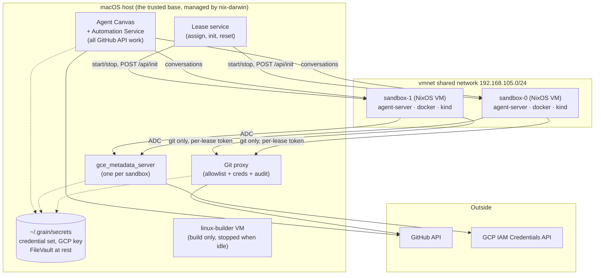

# Grain: an agent cluster on an Intel Mac

## Status

Revision 4. Rewritten for a **macOS host on Intel hardware** (8 cores,
32 GB) after revisions 1–3 targeted a NixOS host using
[`microvm.nix`](https://github.com/microvm-nix/microvm.nix).

The security architecture, the GitHub and GCP credential models, the
OpenHands integration and the sandbox guest configuration all carry over
essentially unchanged. **The host layer does not** — microvm.nix requires
KVM, which macOS does not have — and one security property is genuinely
lost in the move. Both are covered below; the Linux design is preserved in
[what changed and why](#what-changed-from-the-linux-design) rather than
deleted, since it remains the better production target.

## Goals

- One Intel Mac runs the whole system: an orchestrator and a small pool of
  isolated agent sandboxes.
- OpenHands picks up labelled issues from a target GitHub repo and drives
  an agent in a sandbox.
- Agents can read and write allow-listed GitHub repos, but **hold no
  GitHub credentials** — their only route out is a git proxy.
- Agents can obtain short-lived GCP tokens without ever touching the
  service-account key.
- Each agent gets a **whole VM**, because the workload runs `docker` and
  `kind`, which do not nest into containers.
- Sandboxes are reset between tasks; nothing an agent does outlives its
  lease.
- Configuration and credentials survive rebuilds and are managed
  declaratively.

## Non-goals

- Running this as always-on production infrastructure. It is a laptop; see
  [operations](#operations).
- Multi-host clustering, autoscaling, HA.
- Defending against malicious *agent output*. Human PR review is that
  control.

## Build vs. reuse

Default to existing solutions; write code only where nothing fits. Two of
the three reuse decisions in revision 3 did not survive investigation, so
these are stated with what was actually verified.

| Need | Approach |
|---|---|
| Agent execution | **`openhands-agent-server`** per sandbox VM, registered as an Agent Canvas backend — [no provisioning API to build](#openhands-integration) |
| Issue intake | **[`OpenHands/automation`](#issue-intake)** — cron triggers and filter expressions |
| GCP credentials | **[`gce_metadata_server`](#gcp-credentials)** — ADC works with no client code |
| Sandbox VMs | **[Lima](#the-sandbox-vms) + [nixos-lima](https://github.com/nixos-lima/nixos-lima)** — NixOS guests on macOS |
| Building Linux closures | **[nix-darwin `linux-builder`](#building-linux-on-a-mac)** |
| Host configuration | **nix-darwin** |
| Git access control | **Custom** — small smart-HTTP proxy; [FINOS Git Proxy evaluated and rejected](#the-git-proxy-write-it) |
| GitHub API access | **none from sandboxes** — the orchestrator does API work, so there is nothing to filter |
| Branch and workflow protection | **[GitHub rulesets and withheld scopes](#scopes-to-withhold)** — enforced server-side |
| Dynamic binaries in guests | **[`nix-ld`](#nix-ld-the-nixos-specific-trap)** |

### What is left to write

Two things: the [git proxy](#the-git-proxy-write-it), small and
unavoidable, and the [lease service](#the-lease-service), which on macOS is
**mandatory rather than optional** — see
[sandbox identity](#sandbox-identity-per-lease-tokens).

## High-level architecture



Properties this preserves from the Linux design:

- Sandboxes never hold GitHub or GCP credentials — only two narrow local
  endpoints, allowlist-checked and audit-logged.
- Sandbox VMs cannot read the macOS filesystem, so the credential boundary
  is intact even though the orchestrator is no longer its own VM.
- Nothing an agent writes outlives its lease.

## Host layer: macOS

### Why microvm.nix is gone

microvm.nix is a NixOS-host module and its hypervisors need `/dev/kvm`.
macOS has no KVM. There is no adaptation — it simply cannot be the base.

The obvious rescue is to nest: run one Linux VM under VMware Fusion or
Parallels with VT-x passthrough, and run the entire Linux design inside it
unchanged. That works and is the right way to *validate* the Linux design
on this hardware. It is not the right base to build on, for one specific
reason: VMware's own documentation states that **KVM performs relatively
poorly as a guest hypervisor on Intel using virtualized VT-x**, and this
design leans on sub-second microVM boots for per-task reset. Paying a
nesting tax on the operation performed most often, in exchange for
preserving a host layer we can replace, is the wrong trade.

So: **macOS is the base, and the sandboxes are ordinary Linux VMs.** Note
the asymmetry that makes this work — `kind` and Docker are containers, so
they need no nested virtualization at all. Only microvm.nix did.

### The sandbox VMs

[Lima](https://lima-vm.io) manages them. On Intel it uses QEMU with the HVF
accelerator, which is the native macOS path. Guests are NixOS, via
[nixos-lima](https://github.com/nixos-lima/nixos-lima), which builds
Lima-compatible NixOS images — so the entire sandbox guest configuration
from the Linux design carries over as a NixOS module.

Two things to verify early, both flagged in
[open questions](#open-questions): nixos-lima is written primarily for
`aarch64` guests on Apple Silicon hosts, so **x86_64 support needs
confirming**; and Lima's networking must give VMs addresses the host and
each other can reach, which means `socket_vmnet` shared mode rather than
the default user-mode NAT.

If nixos-lima does not work out on Intel, the fallback is to build a NixOS
qcow2 with [`nixos-generators`](https://github.com/nix-community/nixos-generators)
and drive QEMU directly. That loses Lima's conveniences and costs some
scripting, but nothing architectural — the guest configuration is the same
either way, and the [lease service](#the-lease-service) already owns VM
lifecycle.

### Building Linux on a Mac

An Intel Mac is `x86_64-darwin`; the sandbox images are `x86_64-linux`. Nix
cannot cross that boundary natively, so a Linux builder is required.
nix-darwin's `nix.linux-builder` provides one — a small NixOS VM registered
as a remote builder, with `systems = [ "x86_64-linux" ]` on Intel.

Two practical notes. It is documented as slow at default settings, so give
it cores and memory deliberately. And it is a **build-time** dependency
only: stop it during normal operation, which matters because it is
competing for the same 32 GB as the sandboxes.

### Networking

`socket_vmnet` puts the VMs on a shared bridge with host-reachable
addresses (typically `192.168.105.0/24`, with the host at `.1`).

The orchestrator's services — git proxy, metadata servers, lease service —
**bind to the vmnet address only**, never `0.0.0.0`. This matters more on a
laptop than on a server: `0.0.0.0` would expose the git proxy on whatever
café WiFi the machine is joined to. Back it with a `pf` rule denying those
ports on the physical interfaces, so a binding mistake fails closed.

What macOS cannot give us is the per-interface source-address pinning that
the Linux design relied on. The VMs share one host-side bridge; there is no
per-VM tap to attach a filter to. That is the one real loss, and it is
handled in [sandbox identity](#sandbox-identity-per-lease-tokens).

Sandbox egress: agents need the internet for dependencies, so the default
is open, with the same honest caveat as before — a sandbox with general
egress can exfiltrate anything it can read, and no firewall rule short of a
domain allowlist changes that. A `pf`-based allowlist is the opt-in
tightening; note that in-guest `nix` then needs `cache.nixos.org` allowed
or it silently breaks.

### Persistence and secrets

This gets *simpler* on macOS, which is worth noting because most of the
move is a loss.

There is no `/persist` volume and no virtiofs share. Credentials and
configuration live in a plain directory on the Mac:

```
~/.grain/
  secrets/
    github/            # credential set + credentials.json
    gcp-service-account.json
  config/
    repo-allowlist.json
  state/
    git-proxy/audit.log
    metadata-server/audit.log
```

Owned by the user, mode `0600`, encrypted at rest by **FileVault** — which
is a straight improvement over the unencrypted raw disk image the Linux
design used. Backup is Time Machine or an `rsync`, not image snapshots.

The invariant holds unchanged: **no secret is ever a Nix string literal or
a derivation input.** nix-darwin encodes paths and how services consume
them; values are placed by hand.

## Sandbox identity: per-lease tokens

Both local services need to know which sandbox is calling — for allowlist
decisions, per-caller audit, and rate limiting.

The Linux design authenticated by **source IP**, made trustworthy by
per-tap nftables rules that dropped any packet whose source address was not
the one assigned to that interface. A forged source address could not
leave the VM. There was no secret to distribute, rotate, or leak, and the
bootstrap problem for ephemeral VMs did not exist.

**macOS cannot do this.** Under `vmnet` the VMs share a bridge and take
DHCP addresses; there is no per-VM interface to pin. A source address
becomes a claim rather than a fact, and stops being authentication.

So identity moves to a **random per-lease bearer token**, and the reason
that is now workable is the [lease service](#the-lease-service). The
original objection to tokens was bootstrap: an unattended ephemeral VM
cannot obtain a secret without either baking it into the world-readable Nix
store or authenticating a fetch for which it has no credential. A lease
service dissolves that from the other side — it starts the VM, so it can
parameterise that start with a token, and it already knows which VM it just
started. Delivery is a lease-time step, not a bootstrap problem.

Properties:

- **Not an SSH key.** Both consumers speak HTTP. An SSH endpoint would
  cover only the git side, and would mean brokering `git-upload-pack` and
  `git-receive-pack` rather than passing smart-HTTP through.
- **Git consumes it via a credential helper**, so agents never handle it.
- **It rotates for free**, dying with the lease.
- **Exfiltration is low-impact**: the token is only useful against a vmnet
  address that is not routable from outside the Mac.

**The GCP path does not fall back the same way**, which is easy to miss.
A metadata server is authenticated *by network position* — that is exactly
what lets ADC work with no client configuration — and Google's client
libraries will not attach a custom header to metadata requests. A token
cannot be handed to ADC. The resolution here is to run **one
`gce_metadata_server` instance per sandbox**, each bound to that sandbox's
address, so network position is per-VM by construction. It costs a small
process per sandbox and preserves attribution exactly.

**The coupling, stated plainly:** on macOS the identity model and the lease
service are a package deal. The lease service is not optional.

## The lease service

Small, ours, and now load-bearing. Responsibilities:

- **Assign** a free sandbox to a task and mark it busy.
- **Initialise** it: mint a per-lease token, hand it to the VM at start,
  and configure the agent server. OpenHands' `deferred_init` and
  `POST /api/init` exist precisely for warm-pool deployments where servers
  are pre-started and per-task configuration arrives at lease time.
- **Reset** it on release (below).
- **Health-check and quarantine.** A sandbox failing its post-reset check
  is excluded rather than handed to a task — a stuck sandbox silently
  shrinking a two-VM pool is exactly the failure that otherwise goes
  unnoticed for weeks.

### Lease, reset, and what a reset actually clears

Reset is **stop, discard, start**. Each lease runs from a fresh
copy-on-write overlay over a pristine base image:

```sh
qemu-img create -f qcow2 -b sandbox-base.qcow2 -F qcow2 lease-0.qcow2
```

Creating the overlay is O(1); deleting it on release destroys everything
the agent wrote — cloned repos, `node_modules`, Docker images, leaked
`kind` clusters, stray processes. The base image is never modified.

This replaces the Linux design's ephemeral dm-crypt volume, and it is
simpler: there is no key to manage because the data is deleted rather than
made unreadable, and FileVault covers whatever remains on disk until it is
overwritten.

The cost is boot time. A Lima VM starts in tens of seconds, not the ~1s of
a microVM. That sounds bad and mostly is not: agent tasks run for minutes
to hours, so a 30-second reset between them is noise. What it *does* change
is [on-demand start](#memory-budget) — at this pool size, keeping the VMs
running and resetting between leases is likely simpler than stopping them.

## Memory budget

Memory is the binding resource, and on this machine the number is small
enough to state exactly.

| Consumer | Budget |
|---|---|
| macOS itself | ~8 GB |
| Orchestrator services (Canvas, Automation, proxy, metadata, lease) | ~3 GB |
| `linux-builder` | 4–6 GB **while building**; stopped otherwise |
| Each sandbox (kind control plane + build + test) | ~8 GB |

`32 − 8 − 3 ≈ 21 GB` → **two concurrent agents**, three only if the laptop
is doing nothing else and the sandboxes are lightly loaded. `sandboxCount`
should be derived from that arithmetic, not from how many issues you would
like worked at once.

This is the main reason the orchestrator runs **natively on macOS rather
than in its own VM**: a fourth VM would cost a sandbox. The trade is
honest — macOS is a larger and less reproducible attack surface than a
minimal NixOS VM — but the boundary that matters is preserved, because
sandbox VMs cannot read the host filesystem either way.

Two host-level tactics that helped on Linux do not transfer: virtio-mem
free-page-reporting reclaim, and KSM page merging across near-identical
guests. macOS gives back neither, which makes the per-sandbox 8 GB a harder
floor than it was.

## The sandbox image

Because each lease starts from a pristine image, whatever an agent needs
must be *in the image* or re-installed every task. Making the image easy to
shape is what keeps agents from re-solving environment setup on every run.

```nix
grain.sandbox = {
  extraPackages = with pkgs; [ go terraform postgresql ];
  extraConfig = { pkgs, ... }: {          # escape hatch
    services.redis.servers."".enable = true;
    environment.variables.GOFLAGS = "-mod=vendor";
  };
};
```

`extraConfig` matters more than it looks: "what's pre-installed" becomes "a
service the test suite needs" or "an env var the build wants" quickly, and
without a raw-module hatch each becomes a change to this repo instead of
the deployment's config.

Default set: `git`, `openssh`, `cacert`, `curl`, `jq`, `ripgrep`, `fd`,
coreutils, `gnutar`/`gzip`/`unzip`, `gnumake`, `gcc`, `python3` with `uv`,
`nodejs` with `pnpm` — plus `tmux`, which
[the agent server hard-requires](#openhands-integration).

### nix-ld: the NixOS-specific trap

NixOS has no FHS library paths, so a downloaded dynamically-linked binary —
a release tarball, a `pip` wheel with a native extension, a `curl | sh`
installer — fails with `cannot execute: required file not found`. That
error is opaque, agents burn turns on it, and it looks like a broken
sandbox rather than a platform difference.

Enable [`nix-ld`](https://github.com/nix-community/nix-ld) with a generous
library set. This is invisible until agents are running, and then it
accounts for a surprising share of their failures.

### Can an agent install packages at runtime?

Mostly yes, and the answer needs stating precisely because NixOS changes
it.

**Works normally:** `uv`/`pip` into a venv, `pnpm install`, `cargo`, `go`
modules, building from source, and — thanks to `nix-ld` — downloaded
binaries.

**Does not work, and will be tried anyway:** `apt-get install`. There is no
system package manager on NixOS and much agent training data assumes
Debian. No design prevents the first attempt; only
[telling the agent](#telling-the-agent) does.

**In-guest `nix` needs a writable store.** A read-only store would leave
the agent with neither `apt` nor `nix`. Give the guest a normal writable
Nix store — on a full VM this is just the disk, which is one incidental
simplification over the microVM design's overlay arrangement.

Small friction removers, all in the sandbox module: point `npm` and `pip`
global prefixes at `$HOME` so `npm install -g` behaves as expected;
passwordless sudo, safe precisely because the VM is disposable and the
boundary is the VM rather than the unix user.

### Docker and kind inside sandboxes

Since [agents cannot run in containers](#why-a-vm-per-agent), the sandbox
must host `docker` and `kind` comfortably. In a full Linux VM this is
ordinary, and the kernel question that dominated the Linux design is
largely settled: a NixOS VM runs nixpkgs' stock kernel, whose config
carries `OVERLAY_FS`, `BRIDGE_NETFILTER`, `VETH`, `NF_CONNTRACK`, `NF_NAT`,
every namespace symbol and cgroup v2. (One caveat found by inspection: the
legacy `IP_NF_FILTER`/`IP_NF_NAT`/`IP_NF_TARGET_MASQUERADE` symbols are
absent while the `nf_tables` stack is present, so anything expecting legacy
iptables needs the nftables backend.)

**Raise the inotify limits.** kind's own guidance is explicit that common
defaults (8192 watches, 128 instances) cannot bring up a cluster, and the
failures are opaque — `too many open files`, `failed to create fsnotify
watcher` — and look nothing like their cause:

```nix
boot.kernel.sysctl = {
  "fs.inotify.max_user_watches"   = 524288;
  "fs.inotify.max_user_instances" = 8192;
};
```

**Pre-load images into the base image.** A kind node image is on the order
of a gigabyte and the overlay is discarded every lease, so a naive setup
re-pulls it every task. Bake what the workload needs into the pristine base
and `docker load` at boot. This is the Docker analogue of baking
dependencies into the image, and unlike a *writable* shared cache it cannot
become a channel between tasks.

### Telling the agent

Ship a short `/etc/agent-tools/README`, referenced from the OpenHands
system prompt: no `apt`, use `nix shell nixpkgs#pkg`; project-local package
managers work normally; downloaded binaries work; git pushes go through the
proxy automatically and GitHub API calls are not available here; GCP works
through ADC with no setup; everything outside the repo is discarded at task
end.

Cheap, and disproportionately effective — the failure it prevents is an
agent concluding the sandbox is broken and working around it.

## Why a VM per agent

Worth keeping, because it is the reason the design does not collapse into
something much simpler.

Agent tasks run `docker` and `kind` themselves. Nesting those inside an
agent *container* means Docker-in-Docker and kind-in-a-container:
privileged containers, storage-driver contortions, cgroup fights — and
failures that present as the agent being incompetent rather than the
platform being wrong, which is the worst kind to debug.

Running agents in separate *directories* on one machine trades that for a
shared Docker daemon, colliding `kind` cluster names and host ports, one
set of global tool versions, and shared caches.

### Doesn't NixOS make the dependency problem moot?

Half right, and the half that is right is real: with flakes and devShells,
agents in separate directories get exact non-colliding toolchains. That
dissolves the versioning and packaging problem entirely.

But dependency isolation is not the isolation this workload needs. Nix
scopes what is on `PATH` and what a build links against. It does not
virtualize the Docker daemon (a singleton with one image store — and agents
really do run `docker rm -f $(docker ps -aq)` when tidying up), the host
port space, kind's cluster and network namespace, or the kernel-global
iptables and conntrack state that Docker and kind rewrite.

Each has a workaround, and each is a step toward reimplementing a VM less
well, in a place where the failure mode is one agent silently corrupting
another's run.

## GitHub access

### Split the surface: sandboxes get git, the orchestrator gets the API

The most useful simplification available. Sandboxes do not need the GitHub
API — OpenHands runs on the orchestrator, where it holds a credential
directly and does all the API work: reading issues, commenting, opening
PRs. What an agent inside a sandbox needs is `git clone`, `fetch`, `push`.

- **Sandboxes: git transport only.** No REST, no GraphQL. This removes an
  entire class of API-filtering bypasses rather than defending against
  them.
- **Orchestrator: API operations**, on the machine that already holds every
  other secret.

The cost is that agents cannot run `gh pr create`; PR and comment creation
happens through OpenHands. Worth accepting — the alternative reintroduces
the full REST attack surface into the least trusted component.

### Auth model: a broad credential behind a narrow proxy

Installing a GitHub App on every needed repo is often impossible — it
generally requires admin on the repo or org. So the working assumption is a
broadly-scoped user credential held by the proxy, with repos and operations
restricted there.

This is a legitimate pattern; the [GCP path](#gcp-credentials) does the same
thing. But it moves the proxy from *second lock* to *only lock*: a proxy bug
now reaches everything the credential reaches, and every agent action is
attributed to the human.

**The highest-value mitigation, and it sidesteps the App problem: use a
dedicated machine account** and invite it as a collaborator to the repos
agents need. A token on that account reaches exactly those repos, restoring
GitHub-side scoping with no App installs — and inviting a collaborator needs
repo admin, not org admin, which clears the bar that usually blocks
installation. It also fixes attribution: agent commits show as
`grain-agent-bot`.

It is not universal, so the proxy holds a **credential set** selected per
target repo:

```
~/.grain/secrets/github/
  credentials.json     # repo/owner pattern -> credential
  bot.token            # machine account, most repos
  personal.token       # last resort, only what nothing else reaches
```

The proxy picks the narrowest credential covering the target and **records
which one served each request**, keeping the powerful token off most
traffic and making its use visible rather than assumed.

Ladder, in order: GitHub App where installable → fine-grained PAT scoped to
selected repos (one per resource owner; note orgs must opt in to
fine-grained PATs at all) → machine-account classic PAT → personal token
for the remainder.

### Scopes to withhold

`delete_repo` is a separate classic scope — never grant it. No `admin:*`,
no `write:org`, no webhook or deploy-key management.

**Do not grant `workflow`** (or `workflows: write`). This is a
privilege-escalation path that is not obvious: an agent that can modify
`.github/workflows/**` can make CI run code of its choosing with whatever
secrets that workflow holds. Withholding the scope makes GitHub itself
reject such a push — *"refusing to allow a Personal Access Token to create
or update workflow … without `workflow` scope"* — and the same applies to
Apps.

That is the enforce-at-GitHub principle: a server-side control, immune to
bugs in our code. Branch protection on the default branch is the other
half. Both matter more now that they do work the App installation scope
used to.

### Write safety: enforce at GitHub, not in a pack parser

Agents must not push to `main`, force-push, or delete branches. The
tempting place to enforce that is the proxy — resist it. Doing so means
parsing ref-update commands out of the `git-receive-pack` body, and getting
that subtly wrong fails *open*.

Instead use branch protection / repository rulesets on each allow-listed
repo: no direct pushes to the default branch from the agent credential, no
force-push, no deletion, PRs required. Enforced by GitHub, declarative, and
unbypassable by our bugs. The proxy adds the coarse check it *can* do
reliably — reject pushes to repos not on the allowlist — and leaves
ref-level policy to GitHub.

Applying these rules is part of onboarding a repo, and the proxy should
refuse to serve a repo whose protections it cannot verify. Failing closed at
onboarding is cheap and prevents the allowlist and the rulesets from
drifting apart.

### The git proxy: write it

[FINOS Git Proxy](https://github.com/finos/git-proxy) was the obvious
candidate and is a good project — actively maintained, default-deny repo
allowlist covering fetch and push. It was evaluated properly: source read,
software installed and run.

**It is architecturally inverted for this design.** Git Proxy is a
credential **pass-through**, not a credential holder — it requires the
*client* to present the GitHub token:

```ts
// src/proxy/processors/push-action/PullRemoteHTTPS.ts
const credentials = this.decodeBasicAuth(req.headers?.authorization);
if (!credentials) throw new Error('Missing Authorization header for HTTPS clone');
```

`authorization` is deliberately absent from its upstream header blocklist,
so the client's credential is forwarded verbatim. Its manual confirms the
intent. That is the opposite of this design's premise. Adding injection
would mean forking two independent code paths to obtain a capability the
project was designed not to have.

The rest of the fit was poor anyway, recorded so nobody reopens it:
auto-approval works via a pre-receive hook but costs **a second `git push`
for every push**; there is no source-IP or anonymous authentication, so
pushes need per-user accounts for entities that have none; fetches are
never written to the audit database and re-pushes overwrite prior records;
dynamic config reload is **broken at HEAD**, calling a `proxy.stop()` the
module does not export; and it is ~800 MB of `node_modules` with an
undisableable React dashboard.

**So write it.** It is small, because the surface is git-only:

- match the four legal smart-HTTP paths —
  `/{owner}/{repo}.git/{info/refs,git-upload-pack,git-receive-pack}`,
- canonicalize and check `(owner, repo)` against the allowlist,
  default-deny,
- authenticate the caller by [per-lease token](#sandbox-identity-per-lease-tokens),
- select the credential for that repo and set `Authorization`,
- stream the body through, and log the tuple.

No pack parsing, no server-side clones, no database, no user accounts. The
allowlist is read from `~/.grain/config/repo-allowlist.json` and watched, so
an admin edits a file with no restart.

Two things worth stealing rather than reinventing: Git Proxy's
`validGitRequest()` (a tight path whitelist cross-checked against a `git/*`
User-Agent and `application/x-git-*` Accept header, ~20 lines), and its
git-protocol-correct rejection encoding — a `PKT-LINE("ERR …")` for
`/info/refs`, a sideband packet plus flush for pack POSTs — without which a
refused client just prints *"the remote end hung up unexpectedly"*.

### Issue intake

`openhands-resolver` no longer exists; it was deleted in the V0→V1
transition. Its successor is **`OpenHands/automation`**, with a cron
scheduler, webhook triggers, filter expressions and run history.

On a laptop the choice is made for us: **cron only**. Webhooks require
GitHub to reach the host, and this machine has no inbound path at all —
which is a security improvement, not a limitation. Polling also keeps every
GitHub call flowing outward through our own credential path.

What remains ours, because it is about protecting a two-VM pool and the LLM
budget rather than issue semantics:

- **Rate limiting** — a cap on runs started per hour, so bulk-labelling
  forty issues cannot consume the pool and a month of spend at once.
- **A stranded-work sweeper** — if the laptop sleeps or a lease dies
  mid-flight, issues need returning to the queue rather than stalling
  silently.

One caution carried forward: the old resolver embedded the GitHub token
directly in the clone URL, so it landed in `.git/config` inside the
sandbox. If anything in the new stack does the same it silently defeats the
split surface. Verify what ends up in the sandbox's `origin` remote.

## GCP credentials

**Don't build a token service — emulate GCE's metadata server.**
[`gce_metadata_server`](https://github.com/salrashid123/gce_metadata_server)
serves the real metadata contract from a service-account file or
**service-account impersonation**, which is the shape this needs.

The payoff is that it eliminates the client side entirely. Every Google SDK
finds credentials through ADC, which probes the metadata server
automatically. Point a sandbox at its instance and GCP access just works —
no wrapper script, no environment plumbing, nothing for the agent to get
wrong.

- The key lives at `~/.grain/secrets/gcp-service-account.json`, `0600`,
  readable only by the metadata service.
- It is configured to **impersonate a second, minimally-privileged service
  account** rather than serve the primary key's own tokens.
- **One instance per sandbox**, each bound to that sandbox's vmnet address
  — see [sandbox identity](#sandbox-identity-per-lease-tokens) for why this
  is what preserves per-caller attribution on macOS.
- Every mint is audit-logged.

### What a short lifetime actually buys

A sandbox can re-mint the moment a token expires, indefinitely. Short
lifetimes therefore do **not** limit what a compromised sandbox can do
while compromised. What they buy:

- **Revocability**: cut a sandbox off and its GCP access dies in minutes,
  with no key to rotate.
- **Leak containment**: a token in a log, an LLM context, or a PR diff is
  worthless within minutes.

Both real. Neither is "the agent only has five minutes of access." To
reduce steady-state privilege you must downscope the token itself:
impersonating a narrow second service account is the whole game, and costs
one service account and one IAM binding. Optionally add a
[Credential Access Boundary](https://cloud.google.com/iam/docs/downscoping-short-lived-credentials)
to restrict to specific resources.

## OpenHands integration

The architecture described in revisions 1–2 no longer exists. Verified
against the repositories:

| Component | Status |
|---|---|
| V0 Python monolith — `openhands/runtime/*`, `SANDBOX_*` env vars | Ended at 0.62.0. `openhands/runtime/__init__.py` is **404 on main** |
| V1 Python app (`openhands-ai`) | Froze at 1.11.0, removed from main |
| `OpenHands/OpenHands` main | Now **Agent Canvas**, a TypeScript control centre |
| Sandbox-side component | **`openhands-agent-server`**, from `OpenHands/software-agent-sdk` |
| `openhands-resolver` | **Gone**. Successor is `OpenHands/automation` |

### No provisioning API to build

```python
# software-agent-sdk/openhands-sdk/openhands/sdk/workspace/workspace.py
class Workspace:
    """Factory entrypoint that returns a LocalWorkspace or RemoteWorkspace.
    Usage:
        - Workspace(working_dir=...) -> LocalWorkspace
        - Workspace(working_dir=..., host="http://...") -> RemoteWorkspace
    """
```

`RemoteWorkspace` attaches to an already-running agent server at a fixed
URL — no provisioning, no image, no lifecycle — and Agent Canvas registers
a backend as `{host, apiKey, kind}`. So **N sandbox VMs each running
`openhands-agent-server`, registered as backends, is the supported
deployment.** Nothing to reimplement.

What upstream does *not* give us is per-task reset: Canvas treats backends
as long-lived and one server takes many concurrent conversations
(`max_concurrent_runs`, default 10). Hence the
[lease service](#the-lease-service), and `max_concurrent_runs = 1` per
sandbox.

### Version pinning

`config/defaults.json` on Canvas main is upstream's source of truth:

```json
"versions":      { "agentServer": "1.42.1", "agentCanvas": "1.14.0", "automation": "1.8.0" },
"compatibility": { "minimumAgentServer": "1.28.0" },
"constraints":   { "agentClientProtocol": "agent-client-protocol<0.11" }
```

Pin `openhands-agent-server`, `openhands-sdk`, `openhands-tools` and
`openhands-workspace` to one identical version — upstream CI enforces this
and inter-package APIs are not expected to survive a mismatch. Carry the
`agent-client-protocol<0.11` constraint. Nothing enforces the pin at
runtime; `GET /server_info` reports versions for debugging only, so skew
fails late and confusingly.

### Gotchas before the first boot

- **The agent server binds loopback unless authentication is configured.**
  Without `SESSION_API_KEY` / `OH_SESSION_API_KEYS_0` it defaults to
  `127.0.0.1`, so a sandbox comes up looking healthy and is unreachable.
- **Set `OH_SECRET_KEY`**, or secrets are redacted and lost across restart.
- **`tmux` is a hard dependency**, imported at module load.
- Upstream's own full agent-server image ships Docker CE, buildx and
  compose — independent confirmation that running docker inside the sandbox
  is the expected shape.

## Threat model

**Defended:**

- A compromised sandbox cannot read GitHub or GCP credentials; they are not
  on the machine, and a VM cannot read the host filesystem.
- It cannot touch repos outside the allowlist (proxy check, plus GitHub-side
  scoping when a machine account or App is used).
- It cannot push to protected branches or modify workflows — enforced by
  GitHub, not by our code.
- It cannot persist: the overlay is discarded every lease.
- Its access is revocable in minutes and fully audit-logged.

**Not defended:**

- **Abuse of legitimate access while compromised.** It can do anything the
  agent may do, for as long as it holds a lease. The proxy narrows scope and
  provides audit and a kill switch; it does not distinguish a well-behaved
  agent from a hostile one making the same calls.
- **Exfiltration**, under the default open-egress policy.
- **Malicious code in agent output.** Human PR review is the control, which
  is why the no-push-to-`main` rules are load-bearing.
- **A compromised host.** On macOS this is now the laptop itself, which
  holds every credential. It is a larger and less controlled surface than
  the minimal NixOS orchestrator VM the Linux design used — an accepted
  cost of the RAM budget, and the clearest argument for moving to a Linux
  box if this ever becomes more than a personal tool.
- **Prompt injection via issue content.** Anyone who can file an issue can
  put text in front of the agent. Requiring a human to label each issue is
  the mitigation, not a guarantee.

## Operations

- **It is a laptop.** It sleeps, closes, travels, thermally throttles and
  takes OS updates. Use `caffeinate` while agents run, and expect the
  stranded-work sweeper to earn its keep. Do not treat this as always-on
  infrastructure; the design's premise was a server, and that mismatch is
  real rather than cosmetic.
- **Two concurrent agents.** Derive `sandboxCount` from
  [the memory budget](#memory-budget), and alarm on pool exhaustion — with
  a pool this small it is a routine condition, not an edge case.
- **Stop `linux-builder` when not building.** It competes directly with a
  sandbox for RAM.
- **Backup** is `~/.grain` — the only stateful thing. Time Machine or
  `rsync`; FileVault covers at-rest.
- **Rotation**: replace a file in `~/.grain/secrets` and restart the one
  service that reads it.
- **Adding a repo**: edit the allowlist, install the App or invite the bot,
  apply branch protection. Hot-reloaded.
- **Observability**: the signals that matter are pool free/busy/quarantined,
  lease durations, proxy denial rate, token mint rate, intake outcomes. A
  quarantined sandbox and an issue stuck mid-flight are the silent failure
  modes.

## What changed from the Linux design

Recorded rather than deleted, because the Linux design remains the better
production target and this is the ledger of what the Mac costs.

**Carried over unchanged:** the credential model and ladder, withheld
scopes, branch protection, split surface, the git proxy design, the GCP
metadata-server approach and impersonation, the whole OpenHands
integration, the sandbox guest configuration, and the reasoning for a VM
per agent.

**Lost:**

| Property | Linux | macOS |
|---|---|---|
| Sandbox identity | source IP, pinned per tap — no secret at all | per-lease bearer token; lease service becomes mandatory |
| GCP attribution | one metadata server, callers distinguished by IP | one instance per sandbox |
| Reset | ephemeral dm-crypt volume, key discarded | qcow2 overlay discarded |
| Boot | ~1s microVM | tens of seconds |
| Store | one read-only host store shared by all guests | per-VM store; more disk |
| Memory reclaim | virtio-mem free page reporting, KSM | neither |
| Orchestrator isolation | its own minimal NixOS VM | native on macOS |
| Reproducibility | one flake, whole cluster | nix-darwin + guest flakes + Lima config |

**Gained:** simpler persistence (a directory, not a volume), FileVault at
rest, no inbound network surface at all, and no nested virtualization.

The Linux artifacts — `flake.nix`, `hosts/spike/`, `modules/sandbox-spike.nix`
— are kept. They evaluate cleanly and remain the fastest way to stand this
up on a Linux box later, or to validate the Linux design under VMware
Fusion with VT-x passthrough.

## Open questions

1. **Does nixos-lima work for x86_64 guests on an Intel host?** It is
   written primarily for `aarch64` guests on Apple Silicon. If not, fall
   back to `nixos-generators` plus direct QEMU — no architectural change,
   some scripting.
2. **Does `socket_vmnet` give VM↔VM and VM↔host reachability** with stable
   enough addressing for the proxy and per-sandbox metadata servers?
3. **Does `POST /api/init` carry what a lease needs?** `deferred_init` is
   documented for warm pools; confirm what it can set per lease and whether
   a sandbox can be re-initialised without a restart.
4. **Does the Automation Service work in cron-only mode**, and what are its
   trigger and dedupe semantics? Also whether anything writes a GitHub
   token into the sandbox's `origin` remote.
5. **How far down the credential ladder can each owner go** — App, machine
   account, or personal token?
6. **Real peak memory** for a sandbox under a kind cluster plus a build.
   `sandboxCount` follows directly, and at this budget the difference
   between 6 GB and 10 GB is the difference between two agents and one.

## Implementation plan

1. **Host baseline**: nix-darwin managing the Mac; `linux-builder` enabled
   with `x86_64-linux` and enough cores and memory to be usable.
2. **One sandbox VM**: NixOS guest under Lima with docker and kind. Answers
   open questions 1 and 2 — and if either fails, that is known before
   anything is built on top. Confirm `kind create cluster` works, and
   measure peak memory and boot time while there.
3. **Networking**: `socket_vmnet`, services bound to the vmnet address
   only, `pf` denying those ports on physical interfaces. Verify the
   negative cases explicitly — a silently-permissive binding on a laptop is
   the failure that matters most.
4. **OpenHands end to end**: `openhands-agent-server` as a systemd unit in
   the sandbox (remember the session key), registered as a backend in Agent
   Canvas on the Mac. No custom code yet.
5. **Git proxy**: the custom smart-HTTP proxy — path whitelist,
   canonicalize, allowlist, token auth, credential selection, stream
   through, audit. Verify allow-listed repos clone and push, un-listed ones
   are refused *with a legible git error*, and no credential is ever
   visible inside the sandbox.
6. **Metadata server**: one instance per sandbox, impersonating the narrow
   service account. Verify ADC works unmodified and the key is unreachable.
7. **Lease service**: assign, mint token, `POST /api/init`, overlay reset,
   health check, quarantine. This is where per-task isolation actually
   arrives.
8. **Automation Service**: cron-mode intake, rate limit, stranded-work
   sweeper. First full issue-to-PR run.
9. **Hardening**: move repos down the credential ladder, apply branch
   protection, confirm no credential carries `workflow` scope, write the
   runbook.

Scale to `sandboxCount = 2` once 1–8 work at one, and expect that to be the
ceiling.

## Sources

- [`OpenHands/software-agent-sdk`](https://github.com/OpenHands/software-agent-sdk)
  — `openhands-agent-server`, `Workspace`/`RemoteWorkspace`
- [`OpenHands/automation`](https://github.com/OpenHands/automation)
- [FINOS Git Proxy](https://github.com/finos/git-proxy) — evaluated and
  rejected for this role, but worth reading for `validGitRequest()` and its
  git-protocol error encoding
- [`gce_metadata_server`](https://github.com/salrashid123/gce_metadata_server)
- [Lima](https://lima-vm.io), [nixos-lima](https://github.com/nixos-lima/nixos-lima),
  [nixos-generators](https://github.com/nix-community/nixos-generators)
- [nix-darwin `linux-builder`](https://github.com/nix-darwin/nix-darwin/blob/master/modules/nix/linux-builder.nix)
- [`nix-ld`](https://github.com/nix-community/nix-ld)
- [GCP downscoping with credential access boundaries](https://cloud.google.com/iam/docs/downscoping-short-lived-credentials)
- [microvm.nix](https://github.com/microvm-nix/microvm.nix) — the Linux
  design's foundation, retained in the repo's spike artifacts
