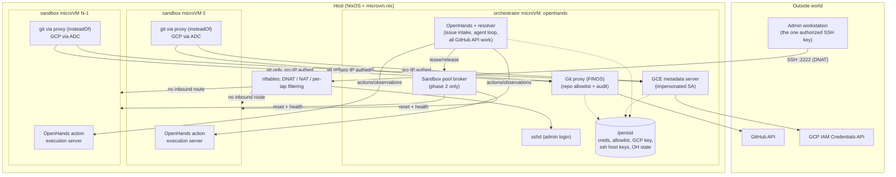

# Agent Cluster: NixOS + microvm.nix Design

## Status

Draft, revision 2. A NixOS configuration that runs a small cluster of
[`microvm.nix`](https://github.com/microvm-nix/microvm.nix) virtual machines:
one orchestrator VM running [OpenHands](https://github.com/OpenHands/OpenHands)
plus a GitHub proxy, and a fixed pool of agent sandbox VMs.

Changes from revision 1, after research into OpenHands' runtime interface and
a critical pass over the security claims:

- **Resolved** the OpenHands↔sandbox integration question: use OpenHands'
  `remote` runtime and implement its runtime-API on the orchestrator as a
  pool broker over the fixed microVM set. See
  [OpenHands integration](#openhands-integration-resolved).
- **Resolved** sandbox identity: authenticate sandboxes by source IP with
  per-tap anti-spoofing rules, eliminating the bearer-token distribution
  problem entirely. See [Sandbox identity](#sandbox-identity-and-proxy-auth).
- **Corrected two overstated security claims** about 5-minute GCP tokens and
  "no standing GitHub credential." Both were wrong in the same way. See
  [Threat model](#threat-model-and-what-this-does-not-defend-against).
- **Added** the sandbox lease/reset lifecycle, issue intake semantics,
  write-safety (protected-branch) enforcement, and operations sections —
  all genuinely missing in revision 1.
- **Added** a configurable sandbox image — package set, `nix-ld`, store
  sharing, a writable store overlay so in-guest `nix` works — and a precise
  account of what a sandbox reboot does and does not reset. See
  [Sandbox image](#sandbox-image-packages-and-toolchains).
- **Audited the design for build-vs-reuse**, which removed most of the
  custom code: issue intake becomes the OpenHands resolver, the GCP token
  service becomes a GCE metadata-server emulator, the git proxy becomes
  FINOS Git Proxy, and the REST-filtering proxy disappears entirely by
  keeping API work on the orchestrator. See
  [build vs. reuse](#build-vs-reuse).
- **Chose** `cloud-hypervisor` over `qemu`, on the strength of its
  virtio-mem memory reclaim under the RAM constraint, keeping the
  hypervisor a config option so qemu stays a one-line fallback.
- **Revised** the GitHub auth model for the case where an App cannot be
  installed everywhere: a per-repo credential set behind the proxy, a
  machine account to restore GitHub-side scoping, and the hardening the
  proxy needs once it is the only lock. See
  [auth model](#auth-model-a-broad-credential-behind-a-narrow-proxy).
- **Added** a [memory budget](#memory-budget) for a RAM-constrained host:
  the agent's writable working set moves to an ephemeral encrypted disk
  volume rather than tmpfs, and the broker starts sandboxes on demand so
  RAM scales with active agents rather than pool size.

## Goals

- A single host runs a `microvm.nix`-based cluster:
  - **1x orchestrator VM** (`openhands`): OpenHands, a GitHub proxy, a
    sandbox-pool broker, and a GCP short-lived-token service.
  - **Nx sandbox VMs** (`sandbox-0..N-1`): fixed count, reset between
    tasks, running the actual coding-agent workload.
- OpenHands picks up issues from a target GitHub repo and drives agents
  inside the sandbox VMs.
- Agents can read/write allow-listed GitHub repos (branches, issues, PRs)
  only through a proxy — they never hold GitHub credentials.
- The orchestrator holds a GCP service-account key. Sandboxes cannot reach
  the key; they request short-lived (~5 min) access tokens from a minting
  service.
- Only the orchestrator is reachable from outside the host, over SSH, for
  admin configuration.
- Credentials and configuration survive `nixos-rebuild` and flake updates:
  they live outside the Nix store.
- SSH access is restricted to a specific admin public key set in Nix config.

## Non-goals

- Multi-host clustering; autoscaling the sandbox count; HA/failover of the
  orchestrator.
- Defending against a malicious *agent output* (e.g. a PR containing
  malicious code). Human PR review is that control — see
  [Threat model](#threat-model-and-what-this-does-not-defend-against).

## Build vs. reuse

Default to existing solutions; write code only where nothing fits. Several
things revision 2 specified as custom turn out to be solved problems, and
one of them — issue intake — was reinventing a feature of the tool this
cluster is built around.

| Need | Approach |
|---|---|
| Issue intake | **[openhands-resolver](#issue-intake-use-the-openhands-resolver)** — label-driven pickup, already built |
| Agent execution | **OpenHands `docker` runtime** in phase 1; custom pool broker only if per-task VM isolation is required |
| GCP credentials | **[`gce_metadata_server`](#gcp-short-lived-tokens)** — ADC works with no client code at all |
| Git access control | **[FINOS Git Proxy](#the-git-proxy)** — repo allowlist and push policy |
| GitHub API access | **none from sandboxes** — the orchestrator does API work, so there is nothing to filter |
| Branch and workflow protection | **[GitHub rulesets + withheld scopes](#scopes-to-withhold)** — enforced server-side |
| Ephemeral root, persistence | **microvm.nix volumes/shares**; [`impermanence`](https://github.com/nix-community/impermanence) if `/persist` grows complicated |
| Secrets at rest | **`sops-nix`/`agenix`** for config-time secrets; `/persist` for admin-provided ones |
| Dynamic binaries in guests | **[`nix-ld`](#nix-ld-the-nixos-specific-trap)** |
| Egress allowlist (optional) | **squid or Envoy**, not a bespoke filter |
| Firewalling, NAT, anti-spoofing | **nftables** |
| Log shipping, metrics | **`systemd-journal-upload`/promtail, Prometheus exporters** |

### The one genuinely custom component

After that audit, the only substantial thing left to write is the **sandbox
pool broker** — and it's worth asking whether phase 1 needs it at all.

OpenHands' standard `docker` runtime already does pool management: a
container per session, created and torn down by code that is already
maintained and tested. Running that inside a *single* sandbox VM gives:

- zero custom orchestration code,
- the [lease/reset problem](#sandbox-lifecycle-lease-and-reset) solved by
  container lifecycle rather than by our broker,
- the credential boundary preserved intact — agents still cannot reach
  GitHub or GCP credentials, because those live on a different VM.

What it gives up is VM-level isolation *between concurrent agent tasks*: a
container escape reaches other agents' work, where separate microVMs would
not. That is precisely what the microVM pool buys, and whether it's worth a
custom broker depends on whether concurrent tasks are mutually distrusting
— agents working issues in the same repo, from the same credential set,
mostly are not.

**Recommendation: phase it.** Build phase 1 on the Docker runtime in one
sandbox VM. That validates the networking, the git proxy, the metadata
server, the resolver, and the whole credential model with no custom
orchestration, and it sidesteps the largest open question — remote-runtime
API compatibility — entirely. Add the broker and the microVM pool in phase
2 if per-task VM isolation turns out to be required, at which point
everything else is known-good and the broker is the only variable.

This does deviate from the original "fixed number of sandbox VMs" shape, so
it's a call worth making deliberately rather than by default. If per-task
VM isolation is a hard requirement, skip phase 1 and build the broker — and
use the
[Kubernetes remote runtime](https://github.com/zparnold/openhands-kubernetes-remote-runtime)
as a working reference for the API contract rather than reverse-engineering
it.

## High-level architecture



Properties this buys:

- One externally-reachable port on the host, DNAT'd to the orchestrator's
  sshd. No inbound path to any sandbox.
- Sandboxes never see GitHub credentials or the GCP key — only two narrow
  internal endpoints, each allowlist-checked and audit-logged.
- Everything that must outlive a rebuild lives on `/persist`, never in the
  Nix store.

## Host layer

### microvm.nix wiring

The host imports the `microvm.nix` flake's host module and declares each VM
under `microvm.vms.<name>`.

**Hypervisor: `cloud-hypervisor`.** microvm.nix supports several; this one
fits the constraints best:

- **Memory reclaim is its strength, and memory is the binding resource
  here.** microvm.nix's cloud-hypervisor runner wires up
  `hotplug_method=virtio-mem` with `free_page_reporting=on` and
  `deflate_on_oom=on`, so a guest returns pages after a build instead of
  holding its peak allocation for the rest of its lease. See
  [Memory budget](#memory-budget).
- A minimal device model — less to boot, less attack surface.
- Fast boot, which [on-demand start](#start-sandboxes-on-demand) leans on.

Two consequences worth knowing up front:

- **Shares must be virtiofs — cloud-hypervisor does not support 9p.** That
  is already the choice for `/persist` on performance grounds, so nothing
  changes; it does remove 9p as a fallback if virtiofs ever misbehaves.
- **qemu is the better-trodden path** in microvm.nix, so a
  cloud-hypervisor-specific problem is likelier to be one you debug
  yourself. The mitigation is cheap and worth keeping: `microvm.hypervisor`
  is a per-VM option, so `agentCluster.hypervisor` can flip the cluster
  back to qemu wholesale, or run the orchestrator on qemu and sandboxes on
  cloud-hypervisor if only one of them gives trouble. Don't hardcode it.

Two VM classes: `openhands` defined once, and `sandbox-0..{N-1}` generated
by mapping over `agentCluster.sandboxCount`, so changing the pool size is a
one-number edit rather than copy-pasted modules — see
[Generating the pool](#generating-the-pool-from-sandboxcount).

microVM guests get a tmpfs root over a read-only `/nix/store` supplied by
the host, with any writable storage attached explicitly — which is exactly
the ephemerality we want for sandboxes, and exactly what forces the
orchestrator's state onto `/persist`.

### Generating the pool from `sandboxCount`

No preprocessing step, templating layer, or codegen is involved: a NixOS
configuration is a Nix expression, so N VM definitions are a `map` over a
range, evaluated at build time. This is the case where Nix's
config-is-code property actually earns its keep — the equivalent in a
YAML-based system is what drives people to Helm or jsonnet.

The important part isn't that the VM list is generated; it's that
**everything index-dependent is derived from the same list**, so the
pieces cannot drift apart:

```nix
let
  cfg     = config.agentCluster;
  indices = lib.range 0 (cfg.sandboxCount - 1);

  nameOf = i: "sandbox-${toString i}";
  ipOf   = i: "10.100.0.${toString (10 + i)}";
  tapOf  = i: "vm-sb${toString i}";
  macOf  = i: "02:00:00:00:01:${lib.fixedWidthString 2 "0" (lib.toHexString i)}";
in {
  # The VMs themselves.
  microvm.vms = lib.listToAttrs (lib.forEach indices (i:
    lib.nameValuePair (nameOf i) {
      config = import ../sandbox {
        inherit (cfg) sandbox;
        index   = i;
        address = ipOf i;
      };
    }));

  # The anti-spoofing rules that make source-IP auth trustworthy.
  networking.nftables.ruleset = lib.concatMapStringsSep "\n" (i: ''
    iifname "${tapOf i}" ip saddr != ${ipOf i} drop
  '') indices;

  # The broker's view of the pool.
  services.sandbox-broker.pool =
    lib.forEach indices (i: { name = nameOf i; address = ipOf i; });
}
```

One edit to `sandboxCount` therefore moves the VM set, the address
assignments, the per-tap firewall rules, and the broker's pool roster
together. That property is load-bearing rather than tidy: a sandbox that
got an address without its matching anti-spoof rule would silently
undermine the [identity model](#sandbox-identity-and-proxy-auth), and
hand-maintained parallel lists are exactly how that happens.

Changing the count is a host `nixos-rebuild switch` plus a pool drain — the
same deploy path as a [package change](#deploying-a-change), not a hot
reload. And since the pool is a hard concurrency ceiling, sizing it is
really a question of host RAM against desired parallelism.

**Scaling note.** Each VM is a full NixOS module-system evaluation, so eval
time grows linearly with the count — unnoticeable at 4, noticeable in the
tens. Disk is not the constraint (the closures differ by a file or two and
share the host store almost entirely); evaluation is. If the pool ever
needs to be large, the escape valve is to make the guests *byte-identical*
by moving per-VM identity out of the guest closure: assign addresses by
DHCP reservation keyed on MAC, so the host-side config varies per VM while
all N guests share a single evaluation and a single system closure. That's
overkill at the sizes this design targets, so the default is static
addressing — but it's worth keeping index-dependence confined to one small
module so the switch stays cheap if it's ever wanted.

### Networking

A host bridge `br-agents` on `10.100.0.0/24` (both configurable):

| Node | Address |
|---|---|
| host | `10.100.0.1` |
| orchestrator | `10.100.0.2` |
| `sandbox-i` | `10.100.0.10 + i` |

Tap-backed bridged networking, not user-mode/slirp: sandboxes must reach
the orchestrator's services, and the host needs uniform firewall control
over every VM's traffic.

Host `nftables` policy:

- **Inbound (WAN → host)**: DNAT `tcp/2222` → `10.100.0.2:22` only. Nothing
  else is forwarded to any VM.
- **Anti-spoofing (per tap)**: each sandbox's tap interface accepts only
  its own assigned source IP. This is what makes source-IP authentication
  trustworthy — see [Sandbox identity](#sandbox-identity-and-proxy-auth).
- **Sandbox → orchestrator**: permitted only to the GitHub proxy port, the
  GCP token service port, and the broker's health port. Notably *not* to
  the orchestrator's sshd or OpenHands web UI.
- **Orchestrator → sandbox**: permitted (the agent loop and broker drive
  the sandboxes).
- **Sandbox ↔ sandbox**: dropped. Agents cannot reach each other.
- **Outbound (VM → WAN)**: see below.

### Sandbox egress: an explicit trade-off

Agents need to install dependencies, fetch packages, and run builds, which
means general outbound internet access. That has a consequence worth
stating plainly rather than burying: **a sandbox with general internet
egress can exfiltrate anything it can read**, including the source of any
allow-listed repo it has legitimately cloned. No firewall rule short of a
domain allowlist changes that.

Revision 1 proposed blocking GitHub's IP ranges to "force" git through the
proxy. That is close to worthless as a security control — GitHub's ranges
change, and an agent with arbitrary egress has countless other paths — and
it is worth being honest that its actual value is *hygiene*: it makes
accidental direct-GitHub usage fail loudly instead of silently doing
something inconsistent with the proxy's policy. Keep it for that reason, at
that weight, and not as a security boundary.

Two options for what egress policy actually is:

1. **Open egress with NAT** (recommended to start). Agents work without
   friction. Exfiltration of allow-listed repo contents is accepted as
   in-scope-of-trust — the agent is being handed that code to work on
   anyway.
2. **Forced HTTP(S) egress proxy with a domain allowlist** on the
   orchestrator (package registries, the proxy itself, and nothing else).
   A real control, and the thing to adopt if agents ever handle code more
   sensitive than what they're already trusted with. It reliably breaks
   some agent workflows, so it's a deliberate later step, not a default.

Recommendation: ship (1), design the module so (2) is a config flag rather
than a rewrite.

### Persistent storage

The orchestrator needs state that survives rebuilds:

- GitHub credentials (the credential set — see [auth model](#auth-model-a-broad-credential-behind-a-narrow-proxy))
- The repo allowlist
- The GCP service-account key
- SSH host keys (so the admin's `known_hosts` isn't invalidated per deploy)
- OpenHands' own state (conversation history, issue-intake cursor)

microvm.nix offers two mechanisms: `microvm.volumes` (a block image with
`autoCreate`) and `microvm.shares` with `proto = "virtiofs"` (a host
directory passed through — and the only share protocol cloud-hypervisor
supports, so this is settled by the
[hypervisor choice](#microvmnix-wiring) anyway). **Use a virtiofs share**
at
`/var/lib/microvms/openhands/persist` → `/persist`. Revision 1 specified a
block volume; a share is better here for operational reasons that matter
more than the marginal performance difference:

- The admin can inspect, back up, and repair the files from the host
  without booting the VM — which is precisely the situation you're in when
  a bad credential is what's keeping the VM from coming up.
- Backups are `tar`/`rsync` of a directory, not image-level snapshots.
- No fixed size to outgrow.

Sandbox VMs get no share and no *persistent* volume — only an ephemeral
scratch volume that is cryptographically discarded on every boot (see
[Keeping a disk-backed scratch volume ephemeral](#keeping-a-disk-backed-scratch-volume-ephemeral)).
Nothing an agent writes outlives its lease.

`/persist` layout:

```
/persist/
  ssh/                             # VM host keys (0700 root)
  secrets/
    gcp-service-account.json       # 0600, owned by metadata-server
    github/                        # credential set, 0600, owned by git-proxy
  config/
    repo-allowlist.json            # admin-editable, hot-reloaded, no rebuild
  state/
    openhands/                     # OpenHands working state
    git-proxy/audit.log
    metadata-server/audit.log
```

**Invariant**: no secret value is ever a Nix string literal, a derivation
input, or committed to this repo. Nix encodes only *paths* and *how
services consume them*. Values are provisioned out-of-band over SSH — see
[Bootstrapping](#bootstrapping-first-login).

Note the corollary: `/persist` on the host is unencrypted at rest. Host
disk encryption is the answer if the deployment needs it; that's a host
provisioning concern outside this doc.

## OpenHands integration (resolved)

This was revision 1's largest open risk. Research resolves it.

OpenHands' runtime layer is a client/server split: the agent loop sends
actions to an **action execution server** over HTTP and receives
observations back, in a tight loop. Which *runtime* implementation is used
determines only how that server gets provisioned and where it lives. The
built-in options are `docker` (default, one container per session),
`local` (same host, no isolation), `kubernetes`, and `remote`.

The `remote` runtime is the one that fits. It does not manage containers
itself — it calls out to an external HTTP API to create, pause, resume, and
stop runtimes, then talks to whatever endpoint that API hands back. The
surface is small and has been implemented by third parties against
non-Docker backends; the
[Kubernetes remote runtime](https://github.com/zparnold/openhands-kubernetes-remote-runtime)
implements it to spawn Pods, which is structurally the same problem as
spawning from a fixed microVM pool. Its documented routes:

| Route | Method | Purpose |
|---|---|---|
| `/start` | POST | allocate a runtime for a session |
| `/stop` | POST | release it |
| `/pause` | POST | release compute, keep state |
| `/resume` | POST | bring a paused runtime back |
| `/list` | GET | enumerate runtimes |
| `/runtime/{runtime_id}` | GET | runtime detail |
| `/sessions/{session_id}` | GET | look up by session |
| `/sessions/batch` | GET | batch session lookup |
| `/registry_prefix`, `/image_exists` | GET | container-image plumbing |
| `/health` | GET | health check (unauthenticated) |

All authenticated with an `X-API-Key` header. OpenHands is pointed at it
with `SANDBOX_REMOTE_RUNTIME_API_URL` and `SANDBOX_API_KEY` (plus
`SANDBOX_RUNTIME_CONTAINER_IMAGE`), settable via env or `config.toml`'s
`[sandbox]` section.

**Design: the pool broker.** We implement this API on the orchestrator,
backed by the fixed set of sandbox VMs instead of a container scheduler:

- `/start` **leases** a free sandbox from the pool and returns its
  action-execution-server URL on the internal network. If none is free, it
  applies backpressure (see [Capacity](#capacity-and-backpressure)).
- `/stop` **releases** the lease and triggers a reset (see
  [Sandbox lifecycle](#sandbox-lifecycle-lease-and-reset)).
- `/pause`/`/resume` map to marking a lease idle vs. active. Since our VMs
  are a fixed pool rather than elastic compute, "pause" can either hold the
  lease (simple, wastes a slot) or release-with-state-loss. Hold the lease;
  the pool is small and sessions are short.
- `/registry_prefix` and `/image_exists` are container-shaped concepts with
  no meaning for microVMs. Stub them with static affirmative responses.
  **This is the one integration wrinkle to verify early**: confirm
  OpenHands is satisfied by stubs and doesn't do anything else
  image-specific before starting a session.

Each sandbox VM runs the OpenHands action execution server as a systemd
service bound to its internal IP, from the same pinned OpenHands version as
the orchestrator (a Nix-level version pin, so client and server can't
drift).

Why this over the alternative (subclassing `Runtime`/`ActionExecutionClient`
in Python to point at fixed endpoints): the broker is a separate service
speaking a stable HTTP contract, so we never carry a patch against
OpenHands' internals across upgrades. The custom-subclass route is smaller
code but means maintaining a fork.

**Residual risk**: the remote-runtime API is defined by OpenHands' client
implementation rather than by a published spec, so it can change across
versions. Mitigations: pin the OpenHands version in Nix, and treat broker
compatibility as something to re-verify on upgrade. This is materially
smaller than revision 1's "unknown whether this is possible at all."

## Sandbox lifecycle: lease and reset

Revision 1 called sandboxes "fully ephemeral," which was **false between
tasks**: they're persistent VMs, so without an explicit reset, agent B
inherits whatever agent A left in `/tmp`, `$HOME`, the git worktree, and
any background process still running. That's both a correctness problem
(mysterious cross-task interference) and a security one (task A's cloned
private repo readable by task B).

The broker owns the reset. On `/stop`, a sandbox is **stopped and started
again** rather than cleaned up in place — which also releases its memory,
so idle sandboxes cost nothing (see
[Start sandboxes on demand](#start-sandboxes-on-demand)). microVM boot is
on the order of a second, so this is cheap enough to do between every task,
and it is far more robust than userspace cleanup, where the failure mode is
a forgotten directory or a surviving background process rather than an
obvious error.

### What a reboot actually resets

Being precise about this, because the whole isolation story rests on it. A
sandbox VM's filesystem is:

- **`/` — a small tmpfs**, holding only `/run` and the `/etc` overlay.
  Discarded on every boot.
- **An ephemeral scratch volume** carrying everything the agent actually
  writes: `$HOME`, the cloned repo, `/tmp`, and the writable store
  overlay. Disk-backed rather than RAM-backed, and made fresh on every boot
  by a random-key dm-crypt setup — see
  [Keeping a disk-backed scratch volume ephemeral](#keeping-a-disk-backed-scratch-volume-ephemeral).
- **`/nix/store` — a read-only lower layer** supplied by the host (see
  [store sharing](#store-sharing)), with the scratch volume as its
  writable upper layer.
- **No share and no persistent volume.** The scratch volume is the only
  block device, and it is ephemeral by construction: its encryption key
  lives only in RAM and dies with the VM.

So yes — **a restarted sandbox comes back with nothing the previous agent
did.** There is no accumulated drift to clean up, and no reachable state
for one task to leak into the next; the previous lease's data is not just
unlinked but cryptographically unrecoverable.

One correction to the natural mental model, though: it is not recreated
from a *base image* that was fixed when the VM first started. It is
recreated from **the sandbox definition in the host's currently-activated
Nix configuration**. Usually those are identical, but they diverge exactly
when you care — after a `nixos-rebuild switch` that changed the sandbox
config, the next reboot brings the sandbox up with the *new* definition.
That is the deploy mechanism for
[package changes](#sandbox-image-packages-and-toolchains), and it's why
draining the pool is part of the deploy runbook rather than an
afterthought.

Lease states: `free` → `leased` (session bound) → `resetting` → `free`. The
broker persists lease state in memory only; on broker restart, reset every
sandbox and start from an all-free pool. A sandbox that fails its
post-reset health check goes to `quarantined` and is excluded from the pool
rather than handed to a session — with an alert, since a stuck sandbox
silently shrinking the pool is exactly the kind of failure that otherwise
goes unnoticed for weeks.

### Capacity and backpressure

With a fixed pool, `sandboxCount` is a hard concurrency ceiling. If
OpenHands requests a runtime when none is free, the broker must not
silently fail: return a retryable error and have OpenHands queue, or block
with a bounded timeout. Verify which behavior OpenHands' remote-runtime
client handles gracefully, and match it. Metric to expose: free vs. leased
vs. quarantined counts, so pool exhaustion is visible rather than
experienced as "agents seem slow today."

## GitHub access

### Auth model: a broad credential behind a narrow proxy

Installing a GitHub App on every repository the agents need isn't always
possible — App installation generally needs admin on the repo or org, and
plenty of useful repos are ones you're merely a collaborator on. So the
working assumption is a **broadly-scoped user credential held by the
proxy, with repos and operations restricted by the proxy itself**.

This is a legitimate pattern, and the design already uses it once: the
[GCP token service](#gcp-short-lived-tokens) holds one powerful key behind
a narrow minting interface. There's no principled objection to doing the
same for GitHub. But it changes the proxy's role from *second lock* to
*only lock*, and that has consequences worth being deliberate about:

- Defense in depth collapses. Previously a proxy bug meant "the agent
  reaches a repo it shouldn't, within an App installation that only covers
  a handful of repos." Now a proxy bug means the agent reaches **anything
  the credential can reach** — every private repo the account can see.
- Blast radius of an orchestrator compromise grows correspondingly. It was
  already the highest-value target; now it holds the keys to the whole
  account.
- Every agent action is attributed to the human. Commits, comments, and
  PRs show up as you, and neither GitHub's audit log nor your collaborators
  can distinguish agent activity from yours.

None of that makes the approach wrong. It makes two things worth doing:
lower the ceiling where it's cheap, and hold the proxy to a higher standard
where it isn't.

### Lowering the ceiling: a machine account

**The highest-value change, and it sidesteps the App-installation problem
entirely: don't use your own account — create a dedicated machine account
and invite it as a collaborator to the repos the agents need.**

A classic PAT on that account then reaches exactly the repos it was invited
to, which restores GitHub-side scoping without any App installs. Inviting a
collaborator needs repo admin, not org admin, so it clears the bar that
blocks App installation in many cases. It also fixes attribution: agent
commits and comments show as `<project>-agent-bot`, which makes the GitHub
audit log useful and stops collaborators from thinking you personally
opened forty PRs overnight.

It isn't universal. Some orgs prohibit outside collaborators or charge a
seat; and for a repo where you're a non-admin collaborator yourself, you
can invite nobody. So support a **credential set rather than a single
token**, selected per request by target repo:

```
/persist/secrets/github/
  credentials.json     # ordered rules: repo/owner pattern -> credential
  bot.token            # machine account, covers most repos
  personal.token       # last resort, only the repos nothing else can reach
```

The proxy picks the narrowest credential that covers the target repo, and
**records which credential served each request** in the audit log. This
keeps the powerful token off the majority of traffic and makes its actual
usage visible rather than assumed. If the set is later replaced by an App
for some owners, that's a `credentials.json` edit, not a redesign.

Ordering matters, and the ladder is worth walking in order: GitHub App
where you can install one → fine-grained PAT scoped to selected repos
(one per resource owner, since a fine-grained PAT has exactly one owner,
and note orgs must opt in to fine-grained PATs at all) → machine-account
classic PAT → personal classic PAT for the remainder.

### Scopes to withhold

Whatever credential type, withhold everything not needed. `delete_repo` is
a separate classic scope — never grant it. No `admin:*`, no
`write:org`, no webhook or deploy-key management.

**Do not grant `workflow`** (or `workflows: write` on a fine-grained PAT or
App). This one is worth calling out because it's a privilege-escalation
path that isn't obvious: an agent that can modify `.github/workflows/**`
can make CI run code of its choosing, with whatever secrets the workflow
has access to and on whatever runner executes it. Withholding the scope
means GitHub itself rejects such a push — *"refusing to allow a Personal
Access Token to create or update workflow ... without `workflow` scope"* —
and the same restriction applies to Apps.

That's the [enforce-at-GitHub principle](#write-safety-enforce-at-github-not-in-a-pack-parser)
again: a reliable server-side control, requiring no packfile inspection on
our side, and immune to bugs in our code. Branch protection on the default
branch is the other half, and both matter more now that they're doing work
the App installation scope used to do.

### When the proxy is the only control

With a broad credential, these stop being hardening niceties and become the
security model. Each one is a way an endpoint allowlist gets bypassed in
practice:

- **Allowlist by parsed route, never by regex over the raw path.** Match
  `(method, route template)` against a fixed table and extract
  `{owner}/{repo}` from the parsed result. A regex over a raw URL is how
  `..`, `%2F`, and unexpected prefixes get through.
- **Canonicalize before checking**: percent-decode, resolve `.` and `..`,
  normalize case (GitHub owner/repo are case-insensitive), strip a trailing
  `.git`. Compare against the allowlist in canonical form, and reject
  anything that doesn't round-trip cleanly rather than trying to repair it.
- **Block GraphQL outright.** `POST /graphql` is a single endpoint that
  expresses arbitrary reads and mutations across the whole account. It
  cannot be path-filtered, so allowing it makes the entire REST allowlist
  decorative. If agents ever need it, that's a separate, much harder
  design problem — query allowlisting — not a config toggle.
- **Never follow redirects with credentials attached.** GitHub redirects on
  renamed or transferred repos, and a followed redirect can carry the
  credential to a resource that was never allowlist-checked. Return the
  redirect to the caller, or reject it.
- **Deny by default.** Unknown path, unknown method, unparseable body:
  reject. Never forward "just in case" — with this credential, the cost of
  a false allow is unbounded and the cost of a false deny is an error
  message.
- **Withhold token-introspection and account endpoints** (`/user`,
  `/user/repos`, and friends) so a sandbox can't enumerate what the
  credential can reach. Minor, but free.
- **Set an expiry on the token** and diary the rotation. A non-expiring
  credential of this power outliving the project is a bad end state; the
  rotation path is already a file swap on `/persist` and a service restart.

Permissions to grant, unchanged from before: repository contents
read/write, issues read/write, pull requests read/write — nothing else.

### Split the surface: sandboxes get git, the orchestrator gets the API

The single most useful simplification available here. Revision 2 had the
proxy filtering both git transport *and* a REST allowlist, which is what
made the [only-lock hardening](#when-the-proxy-is-the-only-control) list so
long — GraphQL, route parsing, redirect handling, canonicalization are all
REST-surface problems.

But sandboxes don't need the GitHub API. **OpenHands runs on the
orchestrator**, where it can hold a credential directly and do all the API
work itself: reading issues, commenting, opening PRs. What an agent inside
a sandbox actually needs is `git clone`, `git fetch`, and `git push`.

So draw the line there:

- **Sandboxes: git transport only.** No REST, no GraphQL, no `gh` against
  the API. The proxy exposes git smart-HTTP and nothing else, which removes
  the entire class of API-filtering bypasses rather than defending against
  them.
- **Orchestrator: API operations**, performed by OpenHands with a
  credential the sandboxes cannot reach, on the machine that already holds
  every other secret.

The cost is that agents can't run `gh pr create` themselves; PR and comment
creation happens through OpenHands instead. That is a real constraint, and
it's worth accepting: the alternative reintroduces the full REST attack
surface into the least trusted machine in the cluster, and the resolver
already creates PRs as part of its normal flow.

### The git proxy

**Reuse [FINOS Git Proxy](https://github.com/finos/git-proxy) rather than
writing one.** It is purpose-built for exactly this — sitting between
clients and GitHub, intercepting pushes, and applying configurable policy —
it's a FINOS graduated project in production at several large banks, and it
already provides:

- a repository allowlist in its config (default-deny: an un-listed repo is
  blocked),
- push interception with pluggable policy processors, which is precisely
  the packfile-inspection work
  [I argued we shouldn't hand-roll](#write-safety-enforce-at-github-not-in-a-pack-parser),
- dynamic configuration loading from files, HTTP, or a git repo — which
  covers the hot-reloaded allowlist requirement without a bespoke watcher,
- an audit trail of intercepted pushes.

Reading its shipped `proxy.config.json` confirms part of the fit and
sharpens the doubts:

- `authorisedList` is exactly the repo allowlist this design needs, keyed
  by project/name/URL — default-deny, no bespoke watcher required.
- `commitConfig` filters pushes by author email, commit message, and *diff
  content* patterns, so it does the packfile inspection we didn't want to
  write.
- `attestationConfig`, though, is a human attestation question — *"I am
  happy for this to be pushed to the upstream repository"*. The
  approval-by-a-person step looks central to the tool rather than
  incidental to it, which is the opposite of what an autonomous agent
  needs.

So two things to settle before committing:

- **Can it auto-approve?** Either a config/plugin path that approves on
  rule match, or its approval REST API driven by something on the
  orchestrator. If neither exists, it is the wrong shape, and this reverts
  to a small custom git proxy — still a far smaller thing to build than the
  REST-filtering version, since the surface is now git-only.
- **Weight.** It's a web application — sessions, CSRF, OIDC/AD auth, a UI,
  and MongoDB or filesystem storage. That's a lot to run on a
  [RAM-constrained orchestrator](#memory-budget) for what we actually want
  from it. Configure filesystem storage rather than Mongo, and measure its
  footprint before assuming it fits.
- **Credential injection.** We need per-repo credential selection from the
  [credential set](#lowering-the-ceiling-a-machine-account) on the way out
  to GitHub. Check whether that's configuration or a plugin.

Whatever serves this role keeps the responsibilities the design needs: repo
allowlist enforcement, credential selection and injection, per-request
audit (caller sandbox, repo, operation, outcome), and the allowlist read
from `/persist/config/repo-allowlist.json` so an admin can change it over
SSH with no rebuild. A Nix option seeds that file on first boot only;
thereafter the file is authoritative.

### Write safety: enforce at GitHub, not in a pack parser

Agents can push branches and open PRs, so the cluster needs to guarantee
they cannot push to `main`, force-push over history, or delete branches.

The tempting place to enforce this is the proxy. Resist it: doing so means
parsing the ref-update commands out of the `git-receive-pack` request body
before the packfile, and getting that subtly wrong fails *open*. Instead,
enforce server-side with **GitHub branch protection / repository rulesets**
on each allow-listed repo:

- default branch: no direct pushes from the agent credential, no
  force-push, no deletion
- require PRs for changes to protected branches
- optionally restrict the agent credential to creating branches under an
  `agent/*` prefix

This is enforced by GitHub, cannot be bypassed by a bug in our code, and is
declarative. The proxy adds a coarse complementary check it *can* do
reliably — reject pushes whose target repo isn't allow-listed at all — and
leaves ref-level policy to GitHub.

Setting up these rulesets is part of onboarding a repo to the allowlist,
which makes it a documented runbook step, not an implicit assumption. The
proxy should refuse to serve a repo whose protection rules it cannot verify
are in place — failing closed on onboarding is cheap, and it prevents the
allowlist and the rulesets from silently drifting apart.

### Issue intake: use the OpenHands resolver

Revision 2 designed a label-driven intake from scratch. It shouldn't have:
**OpenHands ships one**. The
[resolver](https://www.openhands.dev/blog/open-source-coding-agents-in-your-github-fixing-your-issues)
picks up issues tagged with a label (`fix-me` by default), works them, and
opens a PR or reports that it couldn't — the same opt-in-per-issue design
arrived at independently, already built and already exercised.

Its usual deployment is a GitHub Action running on GitHub's runners, which
is the opposite of what this cluster is for. The relevant mode is the local
one — it can also be run against a repository directly — so the
orchestrator runs the resolver locally and points it at
`agentCluster.github.targetRepo`.

To verify: whether local mode polls continuously or runs as a one-shot
batch. If one-shot, wrap it in a systemd timer at
`github.pollIntervalSeconds` — still far less work than building intake.

What remains ours, because it's about protecting a small fixed pool and the
LLM budget rather than about issue semantics:

- **Rate limiting**: a cap on runs started per hour, so bulk-labelling
  forty issues can't consume the whole pool and a month of LLM spend at
  once.
- **A stranded-work sweeper**: if a rebuild kills in-flight runs, issues
  left mid-flight need returning to the queue rather than silently
  stalling (see [Operations](#operations)).

Adopt the resolver's label vocabulary rather than the invented
`agent-ready`/`agent-working` one, so the config surface matches what the
tool actually does.

## GCP short-lived tokens

**Don't build this service — emulate GCE's metadata server.**
[`gce_metadata_server`](https://github.com/salrashid123/gce_metadata_server)
serves the real metadata-server contract from a service-account file,
workload identity federation, or **service-account impersonation**, which
is exactly the shape this design needs.

The payoff is that it eliminates the client side entirely. Every Google SDK
— `gcloud`, `gsutil`, the Python/Go/Java libraries — discovers credentials
through Application Default Credentials, which probes the metadata server
automatically. Point a sandbox at the orchestrator (`GCE_METADATA_HOST`, or
a hosts entry for `metadata.google.internal`) and GCP access *just works*
with no wrapper script, no environment plumbing, and nothing for the agent
to learn or get wrong. A custom `POST /token` endpoint plus a `gcp-token`
client script would have been strictly more code doing strictly less.

- The key lives at `/persist/secrets/gcp-service-account.json`, `0600`,
  owned by the metadata service's dedicated user — readable by neither
  OpenHands nor the broker.
- The emulator is configured to **impersonate a second, minimally-
  privileged service account** rather than serve the primary key's own
  tokens (see below for why this matters more than the lifetime does).
- Reachable only from sandbox VMs, authenticated by source IP, every mint
  audit-logged.
- Verify: whether the emulator lets the impersonated token's lifetime be
  set down to `agentCluster.gcp.tokenLifetimeSeconds`, or whether it serves
  the default hour. If it's fixed at an hour, that weakens revocation
  speed but not the privilege ceiling — which is the part that matters.

**What a short lifetime actually buys** — this is where revision 1 was
wrong, and it matters. A sandbox can call `/token` again the moment a token
expires, indefinitely. Short lifetimes therefore do **not** limit what a
compromised sandbox can do while it is compromised. What they do buy:

- **Revocability**: cut a sandbox off at the proxy, and its GCP access dies
  within 5 minutes, with no key to rotate and no token to hunt down.
- **Containment of leakage**: a token that leaks into a log, an LLM
  context, or a PR diff is worthless within minutes.

Both are real and worth having. Neither is "the agent only has 5 minutes of
access." To actually reduce steady-state privilege, downscope the token
itself:

1. **Impersonate a second, minimally-privileged service account**, so the
   sandbox's ceiling is that account's permissions rather than the
   primary's. The emulator supports this natively, so it costs one extra
   service account and one IAM binding — do it from the start. It is the
   difference between "the primary SA's full permissions, renewable
   forever" and a genuinely bounded capability.
2. Optionally add a
   [Credential Access Boundary](https://cloud.google.com/iam/docs/downscoping-short-lived-credentials)
   to restrict tokens further to specific buckets or resources.

## Sandbox identity and proxy auth

Both proxies need to know which sandbox is calling, to allowlist-check,
audit, and rate-limit per caller. Revision 1 proposed per-sandbox bearer
tokens and then had to leave an open question about how ephemeral VMs
obtain them without either baking secrets into the Nix store or acquiring a
boot-time dependency on the orchestrator.

That problem dissolves: **authenticate by source IP.** Sandboxes sit on a
host-controlled bridge with static addresses, and the host's per-tap
nftables rules (see [Networking](#networking)) drop any packet whose source
address isn't the one assigned to that tap. A sandbox therefore cannot
impersonate another, and there is no secret to distribute, rotate, or leak.

This holds only as long as the anti-spoofing rules do, so they are a
load-bearing part of the design, not a hardening nicety: they belong in the
same Nix module as the address assignments, generated from one source of
truth so an added sandbox can't get an address without also getting its
filter rule.

Bearer tokens remain available as defense-in-depth if the host firewall is
ever not fully trusted (e.g. if a future revision puts sandboxes on a
network shared with something else). At that point the broker — which runs
on the orchestrator with access to `/persist` — is the natural place to
issue a token to each sandbox at lease time, over the already-authenticated
internal channel, avoiding the bootstrap problem entirely.

## Admin access

- A dedicated `admin` user (not root) on the orchestrator, with sudo.
  `PasswordAuthentication no`, `PermitRootLogin no`, and an
  `AuthorizedKeysFile` containing exactly one key from
  `agentCluster.adminSshPublicKey`. A public key in the repo is fine; it
  isn't a secret.
- SSH host keys on `/persist/ssh`, so they survive rebuilds and don't
  trigger host-key-changed warnings on every deploy.
- To be precise about a claim revision 1 fumbled: the admin *does* have
  sudo and therefore can read every secret on `/persist`. The per-service
  user separation exists so that **services** can't read each other's
  credentials — a bug in OpenHands or the broker doesn't yield the GCP key.
  It is not, and cannot be, a boundary against the human administrator.
- This is the only external login to the cluster. Sandboxes have no
  external route; debugging one means hopping through the orchestrator over
  the internal network.
- Host-level access (to the physical machine, as opposed to the
  orchestrator VM) is out of scope, assumed handled by whatever provisions
  the host.

### Bootstrapping (first login)

Nix brings the orchestrator up with an empty `/persist/secrets`. Services
that need credentials start in a degraded, clearly-logged state rather than
crash-looping. The admin then:

1. SSHes to `admin@<host>:2222`.
2. Places the GCP service-account JSON at
   `/persist/secrets/gcp-service-account.json`.
3. Installs the GitHub credential set under `/persist/secrets/github/` —
   at minimum one token plus a `credentials.json` mapping repos to it. See
   [auth model](#auth-model-a-broad-credential-behind-a-narrow-proxy) for
   which credential type to reach for first.
4. Edits `/persist/config/repo-allowlist.json` and applies branch
   protection to each newly allow-listed repo (see
   [Write safety](#write-safety-enforce-at-github-not-in-a-pack-parser)).

None of this requires a rebuild, and none of it is lost on the next one,
because it never entered the Nix store.

## Sandbox VMs

- Count fixed by `agentCluster.sandboxCount` (default `4` — a starting
  point tied to host RAM, revisited after measuring real agent memory use).
- Small tmpfs root, read-only shared store, one ephemeral encrypted scratch
  volume; stopped and restarted between leases. See
  [What a reboot actually resets](#what-a-reboot-actually-resets).
- Runs the OpenHands action execution server, version-pinned in lockstep
  with the orchestrator.
- Reaches git through an `/etc/gitconfig` `insteadOf` rewrite, so
  `github.com` URLs resolve to the proxy transparently and agents' existing
  git habits — and any tooling that hardcodes GitHub URLs — just work. No
  client script needed. There is deliberately no API client, per
  [the split surface](#split-the-surface-sandboxes-get-git-the-orchestrator-gets-the-api).
- Needs no GCP client tooling at all: Application Default Credentials
  finds the orchestrator's [metadata server](#gcp-short-lived-tokens) on
  its own.
- No inbound connectivity from outside the host and none from other
  sandboxes.

## Sandbox image: packages and toolchains

Because the root is discarded on every reboot, whatever an agent needs has
to either be **in the image** or be re-installed by the agent on every
task. Making the image easy to shape is therefore not a convenience — it's
what keeps agents from burning their first several minutes (and a chunk of
context) re-solving environment setup on every run.

### Configuration surface

```nix
agentCluster.sandbox = {
  # Replace the default toolchain wholesale.
  packages = with pkgs; [ ... ];

  # Or, more commonly: keep the defaults and add to them.
  extraPackages = with pkgs; [ go terraform postgresql ];

  # Escape hatch: an arbitrary NixOS module merged into every sandbox,
  # for the cases a package list can't express.
  extraConfig = { pkgs, ... }: {
    environment.variables.GOFLAGS = "-mod=vendor";
    services.redis.servers."".enable = true;
    environment.etc."agent-tools/PROJECT.md".source = ./project-notes.md;
  };
};
```

`extraPackages` is the option to reach for; `packages` exists for the rare
case of wanting a deliberately minimal image. `extraConfig` matters more
than it looks: "what's pre-installed" generalises quickly into "a service
the test suite needs," "an env var the build wants," or "a file the agent
should read," and without a raw-module escape hatch every one of those
becomes a change to this repo's modules instead of a change to the
deployment's config.

Default set, aimed at "an agent can start working without installing
anything": `git`, `openssh`, `cacert`, `curl`, `jq`, `ripgrep`, `fd`,
`coreutils`/`findutils`/`gnused`/`gawk`, `gnutar`/`gzip`/`unzip`, `less`,
`vim`, `gnumake`, `gcc`, `python3` with `uv`, `nodejs` with `pnpm`. Plus
the `/etc/agent-tools/README` described below.

### nix-ld: the NixOS-specific trap

NixOS has no `/lib64/ld-linux-x86-64.so.2` and no FHS library paths, so a
dynamically-linked binary that an agent downloads — a release tarball, a
`pip` wheel with a native extension, a language-server binary, a
`curl | sh` installer — fails with `cannot execute: required file not
found`. That error is opaque, agents burn a lot of turns on it, and it
looks like a broken sandbox rather than a platform difference.

Enable [`nix-ld`](https://github.com/nix-community/nix-ld) in every
sandbox, with a reasonably generous library set (`stdenv.cc.cc.lib`,
`zlib`, `openssl`, `curl`, `glibc`, `libxml2`, `sqlite`, and the usual
graphics/X stubs that headless test suites nonetheless link against). This
makes downloaded binaries work the way they do on Debian, and it's exposed
as `agentCluster.sandbox.nixLd.extraLibraries` for the cases it misses.

This is worth calling out at design time because it is invisible until
agents are actually running, and then it accounts for a surprising share of
their failures.

### Store sharing

With a generous package set, a per-VM store image would mean N copies of a
large closure — wasteful in disk and in rebuild time. Instead, mount the
**host's `/nix/store` read-only** into every sandbox, so the marginal cost
of the Nth sandbox is approximately zero and adding a package to the image
costs one host build rather than N.

The confidentiality question this raises is already answered by an
invariant we hold anyway: [no secret is ever in the Nix
store](#persistent-storage). What a sandbox gains is the ability to
enumerate what else the host has built — mild information disclosure, no
credential exposure — and it cannot write to the store. If even that
disclosure is unacceptable for a given deployment, `storeOnDisk` builds a
per-VM image containing only that VM's closure, at the cost of disk and
build time; make it a config flag rather than a decision baked into the
modules.

### Can an agent install packages at runtime?

Mostly yes, but NixOS changes the answer enough that it needs stating
precisely — and the read-only store specified above has a consequence
worth being explicit about.

**Works against the scratch volume, unchanged from any Linux box:** `uv`/`pip`
into a venv, `pnpm install` into `node_modules`, `cargo` into a project
dir, `go` modules, `bundle`, `mvn`. Building from source with the
toolchain in the image. And — thanks to
[`nix-ld`](#nix-ld-the-nixos-specific-trap) — downloading and running a
dynamically-linked binary.

**Does not work, and will be tried anyway:** `apt-get install`. There is no
system package manager on NixOS, and a large share of agent training data
assumes Debian. This is the single most likely thing to waste an agent's
turns, and no amount of design prevents the first attempt — only telling
the agent up front does. See [Telling the agent](#telling-the-agent).

**The one I got wrong initially:** a read-only `/nix/store` means `nix`
itself doesn't work either. `nix shell`, `nix profile install`,
`nix-shell -p`, `nix develop` all need to realise paths into the store. So
the naive version of this design gives the agent a NixOS box with *neither*
`apt` nor `nix` — a fixed appliance, where the only recourse for a missing
tool is a language-level package manager or a downloaded binary. That's a
worse environment than it needs to be.

### A writable store overlay

microvm.nix solves this directly:
[`microvm.writableStoreOverlay`](https://microvm-nix.github.io/microvm.nix/shares.html)
mounts `/nix/store` as an overlayfs — the shared host store as the
read-only lower layer, a writable upper layer on top — so the guest can
realise new store paths and `nix` works normally.

The upper layer can be tmpfs or a block volume — not a share, since
overlayfs won't accept virtiofs/9p as an upper layer. **Use a block
volume**, which is also microvm.nix's own documented pattern:

```nix
microvm.writableStoreOverlay = "/nix/.rw-store";
microvm.volumes = [{
  image      = "sandbox-${toString index}-scratch.img";
  mountPoint = config.microvm.writableStoreOverlay;
  size       = cfg.sandbox.scratchSizeMb;
}];
```

tmpfs looks attractive because it's discarded on reboot for free, which
matches the reset design exactly. But everything the agent realises into
the store would be **resident in guest RAM**, and a single `nix build` of
anything substantial can be gigabytes. On a memory-constrained host that
trades a manageable disk cost for the scarcest resource, and turns a
routine agent action into an OOM. Disk is the right medium here; the reset
property has to be re-established another way.

### Keeping a disk-backed scratch volume ephemeral

A volume persists across reboots by default, which would silently break
[the reset guarantee](#what-a-reboot-actually-resets) — an agent with root
can write into the overlay's upper directory at a path shadowing a
legitimate store path, and that would survive into the next lease.

The fix is to make freshness an invariant of the guest's own boot rather
than a step the broker has to remember: at boot, set up **dm-crypt over
the raw volume with a randomly generated key** (the same trick NixOS's
`swapDevices.*.randomEncryption` uses), then `mkfs` and mount. The key
exists only in RAM and is discarded on shutdown, so the previous lease's
contents are not merely unlinked but cryptographically unreachable.

This is worth the small cost for three reasons:

- **It fails closed.** If the setup doesn't run, the mount fails, the VM
  comes up unhealthy, and the broker quarantines it. A missed *wipe* step,
  by contrast, fails open and silently.
- **`mkfs` alone is not enough.** It makes old data unreachable through the
  filesystem, but an agent with root can read the raw block device and
  recover the previous task's working tree. Cheap attack, cheap defence.
- **No broker involvement**, so there's no reset step to get wrong.

Two practical notes: enable `discard` through dm-crypt and on the guest
filesystem, or the sparse image grows monotonically to its high-water mark
and never gives blocks back — the kind of thing that fills the host disk
six months in. And crypto overhead is modest with AES-NI, but if it ever
measures badly the fallback is the broker deleting the image on release
and letting `autoCreate` rebuild it, accepting the fails-open risk.

Cap the volume with `sandbox.scratchSizeMb` so a runaway build hits a clear
`ENOSPC` instead of taking the host's disk with it. And note that N sparse
images can overcommit host disk: either keep `sandboxCount ×
scratchSizeMb` within real capacity, or monitor for it — a guest that
thinks it has space while the host has none fails in confusing ways.

Two things make this cheaper than it sounds:

- The shared host store already contains every package the host has built,
  not just this guest's closure. A generously-provisioned host means many
  `nix shell` requests resolve to paths that are *already present and
  read-only*, costing no RAM and no download. This argues for pre-building
  a broad package set on the host even beyond the sandbox image's own set.
  (Worth verifying empirically: whether the guest's Nix database treats
  pre-existing host store paths as valid, or re-downloads them anyway. If
  it re-downloads, the cost is time, not correctness.)
- Pin the guest's flake registry to the same nixpkgs the image was built
  from, so `nix shell nixpkgs#foo` resolves without fetching a channel and
  matches the image's versions.

Under the default open-egress policy this all just works. Under the
[allowlist egress policy](#sandbox-egress-an-explicit-trade-off),
`cache.nixos.org` has to be on the allowlist or in-guest Nix stops working
— an easy interaction to miss, since it turns a working sandbox into a
mysteriously broken one at the moment egress is tightened.

### Making conventional installs work

Small things that remove a lot of friction, all in the sandbox module:

- **Global-install prefixes pointed at `$HOME`.** By default `npm -g` and
  `pip install --user` try to write into the store and fail. Set
  `npm_config_prefix=$HOME/.npm-global`, keep `PIP_USER` working against
  `~/.local`, and put `~/.local/bin` and `~/.npm-global/bin` on `PATH`.
  Then `npm install -g` behaves the way the agent expects.
- **Passwordless sudo.** Reasonable here specifically *because* the VM is
  disposable: the security boundary is the microVM and the absence of
  credentials, not the guest's unix user. Root in a sandbox buys the agent
  the ability to bind low ports, mount things, and start services, and the
  worst case is a broken VM that the next reset repairs. Note that sudo
  still doesn't make the store's lower layer writable — that's the
  overlay's job.
- **Docker, when a test suite needs it** (testcontainers and friends).
  Namespaces and cgroups work fine inside the guest, so
  `virtualisation.docker.enable = true` via
  [`extraConfig`](#configuration-surface) is enough; it's left opt-in
  rather than default because it's a meaningful chunk of image size and
  boot time for something most tasks don't use.

### Telling the agent

An agent that knows the rules doesn't burn turns discovering them. Ship a
short `/etc/agent-tools/README` — and reference it from the OpenHands
system prompt — covering: no `apt`, use `nix shell nixpkgs#pkg` for
one-offs; project-local package managers work normally; downloaded
binaries work; git pushes go through the proxy automatically and GitHub
API calls are not available from here; GCP works through ADC with no setup;
everything outside the repo is discarded at task end.

This is cheap and disproportionately effective — the failure it prevents
is an agent concluding the sandbox is broken and working around it.

### Deliberately not shared

A **persistent shared package cache** across sandboxes is deliberately
rejected, despite the obvious appeal of not re-downloading the same
dependencies every task. A writable cache shared between leases is a
channel between tasks: task A poisons an npm or pip cache entry, task B
silently builds against it, and the isolation that the whole reset design
exists to provide is gone. If dependency fetch time becomes a real cost,
the answer is to bake the dependencies into the image — which is what the
package options above are for, and which is fast, shared, and read-only by
construction.

The feedback loop is the point: when agents repeatedly install the same
thing, that's the signal to add it to `extraPackages` and stop paying for
it. Worth watching for during early operation, since it's cheap to fix and
otherwise silently taxes every run.

### Deploying a change

Package changes are **not** hot-reloadable the way the repo allowlist is.
The sequence is: edit config → `nixos-rebuild switch` on the host → drain
the pool → sandboxes pick up the new definition on their next reboot. Since
the reset between leases is a reboot anyway, a drained pool converges
without any extra mechanism. Plan for it as a deploy, not a config tweak.

## Memory budget

The target host is RAM-constrained, which makes memory the binding
resource for the whole design — it sets the real ceiling on
`sandboxCount`, not any of the policy above. Worth treating deliberately
rather than discovering under load.

### Get the writable working set off RAM entirely

The store overlay is not the only thing that would otherwise live in RAM.
A stock microVM's **tmpfs root** holds the cloned repo, `node_modules`,
build artifacts, and `/tmp` — for a real project, easily more than the
store overlay. Moving only the overlay to disk would fix the smaller half
of the problem.

Put the whole writable working set on the same ephemeral scratch volume —
`/nix/.rw-store`, the agent's home, `/tmp`, and `/var/tmp` — and leave `/`
as a small tmpfs holding only `/run` and the `/etc` overlay. The
random-key encryption then covers the agent's working tree as well as the
store overlay, which is where the more sensitive material was anyway.

Guest RAM after that is just the kernel, the action execution server, and
whatever the agent's own processes need — compilers and test suites,
sized by workload rather than by accumulated files. Page cache over the
scratch volume uses whatever is free and is reclaimable under pressure,
which is the behaviour we want.

### Start sandboxes on demand

The larger win: **idle sandboxes need not be running at all.** microVM boot
is on the order of a second, so the broker can `systemctl start` a sandbox
when it leases one and `systemctl stop` it on release. Baseline RAM then
scales with *concurrently active agents* rather than with pool size, and
`sandboxCount` becomes purely a concurrency ceiling that costs nothing when
unused.

This also **simplifies the reset**: stop-then-start is a stronger reset
than a reboot (fresh hypervisor process, fresh scratch volume, fresh
encryption key) and it's the same mechanism, so there's no separate reset
path to maintain. The cost is a second or two of lease latency, invisible
against the length of an agent task. Optionally keep one sandbox warm to
absorb that for the first task; not worth doing until it's measured.

With on-demand start, the honest RAM formula is
`orchestrator + (concurrent agents × sandbox.memoryMb)`, and pool
exhaustion — already surfaced as a metric in
[Capacity](#capacity-and-backpressure) — becomes the signal for whether
the host needs more RAM or the ceiling needs lowering.

### Host-level tactics

- **KSM** (`hardware.ksm.enable`). N sandboxes are near-identical NixOS
  guests running the same binaries, which is close to the ideal case for
  same-page merging. Costs some CPU scanning; worth measuring here
  specifically because the workload is so uniform.
- **virtio-mem / free page reporting.** microvm.nix exposes a `balloon`
  option (which replaced the older `balloonMem`), and its cloud-hypervisor
  runner wires up `hotplug_method=virtio-mem` with `free_page_reporting=on`
  and `deflate_on_oom=on`. That lets a guest hand back memory it isn't
  using rather than holding its full allocation — directly useful for
  sandboxes that spike during a build and then subside, and the main reason
  [cloud-hypervisor is the default](#microvmnix-wiring).
- **Reconsider store sharing under memory pressure.** A virtiofs share
  costs one `virtiofsd` process per *running* VM on the host, and each
  guest page-caches the shared store separately unless virtiofs DAX is in
  play (worth checking whether microvm.nix exposes it). The alternative is
  `storeOnDisk`: a read-only erofs image, no virtiofsd at all, and — if the
  sandbox guests are made byte-identical, per the
  [scaling note](#generating-the-pool-from-sandboxcount) — the *same* image
  file attached to every sandbox, so the host page-caches one copy for all
  of them. The cost is that only the guest's own closure is present, so
  `nix shell` downloads more. These two ideas compound, and both cut
  against the current `shareHostStore = true` default: worth measuring
  early rather than treating as settled.

### Sizing

Start from measurement, not guesswork: run one sandbox through a
representative task, watch peak RSS, and set `sandbox.memoryMb` from that
with headroom. The default of 8 GB in revision 2 assumed a RAM-rich host
and a tmpfs-backed store overlay; with the working set on disk, something
in the 2–4 GB range is a more realistic starting point, and
`sandboxCount` follows from what the host can actually hold concurrently.

## Repo layout (proposed)

```
flake.nix / flake.lock
hosts/cluster-host/configuration.nix   # host: microvm.nix, network, agentCluster
modules/agent-cluster/
  default.nix                          # agentCluster.* options
  network.nix                          # bridge, nftables, per-tap anti-spoof
  orchestrator/
    default.nix  openhands.nix  resolver.nix
    git-proxy.nix                      # FINOS Git Proxy service + config
    metadata-server.nix                # gce_metadata_server service
    broker.nix                         # phase 2 only
    admin-ssh.nix  persist.nix
  sandbox/
    default.nix  image.nix                    # packages, nix-ld, store sharing
    action-execution-server.nix
    git-access.nix                     # insteadOf rewrite + agent README
packages/
  sandbox-broker/                      # phase 2 only; see build vs. reuse
docs/design.md
```

## Configuration surface (`agentCluster.*`, draft)

| Option | Type | Default | Notes |
|---|---|---|---|
| `adminSshPublicKey` | `str` | — required | Key allowed to SSH to the orchestrator. |
| `sandboxCount` | `int` | `4` | Fixed pool size; hard concurrency ceiling. |
| `sandbox.packages` | `list of package` | see defaults | Full override of the sandbox toolchain. |
| `sandbox.extraPackages` | `list of package` | `[]` | Added to the defaults — the usual knob. |
| `sandbox.extraConfig` | `module` | `{}` | Arbitrary NixOS module merged into every sandbox. |
| `sandbox.nixLd.enable` | `bool` | `true` | Make downloaded dynamic binaries runnable. |
| `sandbox.nixLd.extraLibraries` | `list of package` | `[]` | Extra libs for `nix-ld`'s search path. |
| `sandbox.shareHostStore` | `bool` | `true` | Share host `/nix/store` vs. per-VM `storeOnDisk`. |
| `sandbox.writableStore.enable` | `bool` | `true` | Store overlay, so in-guest `nix` works. |
| `sandbox.scratchSizeMb` | `int` | `20480` | Ephemeral disk volume: store overlay, `$HOME`, `/tmp`. |
| `sandbox.memoryMb` | `int` | `3072` | Guest RAM; set from measured peak, not guessed. |
| `sandbox.onDemandStart` | `bool` | `true` | Stop idle sandboxes; RAM scales with active agents. |
| `sandbox.passwordlessSudo` | `bool` | `true` | Safe because the VM, not the user, is the boundary. |
| `hypervisor` | `enum` | `cloud-hypervisor` | Per-VM overridable; `qemu` is the fallback. |
| `network.bridge` | `str` | `br-agents` | Host bridge name. |
| `network.subnet` | `str` | `10.100.0.0/24` | Internal subnet. |
| `network.externalSshPort` | `port` | `2222` | Host port DNAT'd to orchestrator sshd. |
| `network.egressPolicy` | `enum` | `open` | `open` \| `allowlist` (see egress trade-off). |
| `github.targetRepo` | `str` | — required | `owner/repo` scanned for labeled issues. |
| `github.intakeLabel` | `str` | `fix-me` | Resolver's label that opts an issue in. |
| `github.pollIntervalSeconds` | `int` | `60` | Issue poll cadence. |
| `github.maxRunsPerHour` | `int` | `10` | Guard against bulk-label runaway. |
| `github.allowlistedReposDefault` | `list of str` | `[]` | Seeds the allowlist on first boot only. |
| `gcp.projectId` | `str` | — required | Project the minted tokens belong to. |
| `gcp.impersonateServiceAccount` | `str` | — | Narrow SA the key impersonates (recommended). |
| `gcp.tokenLifetimeSeconds` | `int` | `300` | Minted token lifetime. |
| `openhands.version` | `str` | pinned | Pinned for orchestrator and sandboxes together. |

## Threat model, and what this does *not* defend against

Being explicit here is more useful than a list of reassurances. Revision 1
made two claims that sounded strong and were not; both are corrected above,
and both came from the same error — treating a *narrowed* capability as an
*absent* one.

**Defended:**

- A compromised sandbox cannot read GitHub credentials or the GCP key; they
  aren't on the machine.
- It cannot touch repos outside the allowlist. How much this rests on the
  proxy alone depends on the credential: an App installation or a
  machine-account token is independently scoped by GitHub, a personal token
  is not. See
  [when the proxy is the only control](#when-the-proxy-is-the-only-control).
- It cannot push to protected branches or rewrite history (enforced by
  GitHub, not by our code).
- It cannot reach other sandboxes, or be reached from outside the host.
- It cannot persist: a reboot between leases discards everything.
- Its GitHub and GCP access is revocable in minutes, and fully audit-logged.

**Not defended, by design or by limitation:**

- **Abuse of legitimate access while compromised.** A compromised sandbox
  can do anything the agent is allowed to do — read allow-listed repos,
  open PRs, comment on issues, mint GCP tokens — for as long as it holds a
  lease. The proxy narrows *scope* and provides audit and a kill switch; it
  does not distinguish a well-behaved agent from a hostile one making the
  same API calls.
- **Exfiltration**, under the default open-egress policy. See
  [Sandbox egress](#sandbox-egress-an-explicit-trade-off).
- **Malicious code in agent output.** Nothing here inspects what the agent
  writes. Human review of every PR is the control, which is precisely why
  the no-push-to-`main` rules are load-bearing and belong at GitHub.
- **A compromised orchestrator**, which holds every real credential. It is
  the highest-value target in the cluster, and its hardening — minimal
  package set, no listening services beyond sshd and the internal APIs —
  matters more than anything else here. Compromise there is total, and
  proportionally worse the broader the GitHub credential it holds, which is
  the main argument for a
  [machine account](#lowering-the-ceiling-a-machine-account) over a
  personal token.
- **A malicious or buggy LLM provider / prompt injection via issue
  content.** An attacker who can file an issue in the target repo can put
  text in front of the agent. The intake label requirement means a human
  opts each issue in, which is the mitigation; it is not a guarantee.

## Operations

- **Rebuilds interrupt work.** `nixos-rebuild switch` on the host restarts
  VMs, killing in-flight agent runs. The broker should expose a drain mode
  (stop granting leases, wait for actives to finish, bounded by a timeout)
  and the deploy runbook should use it. Issues the resolver had picked up
  need a sweeper that returns them to the intake label after a timeout, or
  they silently strand.
- **Observability.** Forward VM journals to the host. The signals that
  matter: pool free/leased/quarantined counts, lease durations, proxy
  request rate and denial rate, token mint rate, issue intake outcomes. A
  quarantined sandbox and an issue stuck mid-flight are the two silent
  failure modes to alarm on.
- **Backup.** `/persist` is the only stateful thing in the cluster; back up
  the host directory. Recovery is restoring the directory and rebuilding.
- **Rotation.** GCP key and GitHub credentials rotate by replacing the file on
  `/persist` and restarting the one service that reads it. No rebuild.
- **Adding a repo.** Edit the allowlist, install the App on the repo, apply
  branch protection. Hot-reloaded, no rebuild.
- **Changing sandbox packages.** A rebuild and a pool drain, not a config
  tweak — see [Deploying a change](#deploying-a-change). Track which
  packages agents keep installing by hand; each one is a cheap image change
  that pays back on every subsequent run.

## Open questions

Substantially shorter than revision 1 — its two biggest are resolved above.

1. **Does phase 2 happen at all?** Whether concurrent agent tasks need
   VM-level isolation from each other decides whether the pool broker is
   built. See [build vs. reuse](#the-one-genuinely-custom-component).
2. **Phase 2, if it happens**: confirm OpenHands accepts stubbed
   `/registry_prefix` and `/image_exists` responses; and determine what its
   remote-runtime client does when the API reports no capacity, which
   decides whether the broker queues or errors.
3. **OpenHands V0 vs V1 configuration.** The remote-runtime API surface and
   `config.toml`/`SANDBOX_*` settings documented here appear to belong to
   the V0 configuration model, which newer versions treat as legacy. Pin a
   version early and confirm which model it uses before building anything
   against those settings.
4. **Cloud-hypervisor feature coverage**: confirm the pinned microvm.nix
   drives everything this design needs on cloud-hypervisor — the virtiofs
   `/persist` share, `autoCreate` volumes, tap networking, and virtio-mem
   reclaim actually returning memory under load. qemu is the fallback and
   `agentCluster.hypervisor` makes the switch a one-line change, including
   per-VM if only one class of VM has trouble.
5. **`sandboxCount` default**, pending measurement of real agent memory
   footprint against host RAM.
6. **Host exposure**: is the host directly internet-facing (as the DNAT
   design assumes), or behind an existing bastion/VPN — in which case the
   orchestrator's sshd needn't be internet-reachable at all?
7. **How far down the credential ladder can each owner go?** Which repos
   admit an App install, which admit a machine-account collaborator
   invite, and which genuinely need the personal token. Worth answering per
   repo at onboarding, since it decides how much traffic the broad
   credential ever sees.

## Implementation plan

1. **Scaffold**: flake wiring `microvm.nix`; host config with bridge
   network and an `agentCluster` module; orchestrator plus
   `sandboxCount = 1` to prove the plumbing. Includes the sandbox image
   module — default toolchain, `nix-ld`, shared host store — since the
   sandbox has to be defined here anyway and `nix-ld` is much cheaper to
   have from the start than to diagnose later.
2. **Network + persistence**: nftables (DNAT, per-tap anti-spoofing,
   inter-VM matrix), `/persist` virtiofs share. Verify the reachability
   matrix explicitly — including the negative cases, since a
   silently-permissive firewall is the failure that invalidates the whole
   security model — and that `/persist` survives `nixos-rebuild switch`.
3. **Admin SSH**: hardened sshd, single key, host keys on `/persist`.
   Verify external login and stable host keys across rebuilds.
4. **OpenHands end to end, no custom code**: OpenHands on the
   orchestrator driving its stock `docker` runtime inside one sandbox VM.
   Proves the shape works before anything bespoke exists.
5. **Git proxy**: stand up FINOS Git Proxy, answer the
   [auto-approve and credential-injection questions](#the-git-proxy)
   early — they decide build-vs-reuse for this piece. Verify from a
   sandbox that allow-listed repos clone and push and un-listed ones are
   refused.
6. **Metadata server**: `gce_metadata_server` impersonating the narrow
   service account. Verify ADC works unmodified in a sandbox, tokens carry
   only the narrow SA's permissions, and sandboxes cannot reach the key
   file.
7. **Resolver**: run openhands-resolver locally against the target repo;
   add the rate limit and the stranded-work sweeper. First full
   issue-to-PR run.
8. **Hardening**: move as many repos as possible down the credential
   ladder (machine account, or an App where installable), apply branch
   protection to allow-listed repos, confirm no credential carries
   `workflow` scope, ship journals to the host, write the admin runbook.

At that point the system is useful. **Phase 2, only if per-task VM
isolation is required**: build the pool broker (lease, release,
stop/start reset, health check, quarantine, drain), spike the
[remote-runtime API question](#open-questions) against it, and scale to
`sandboxCount = N`.

## Sources

- [OpenHands runtime architecture](https://docs.openhands.dev/openhands/usage/architecture/runtime)
- [OpenHands runtime source](https://github.com/OpenHands/OpenHands)
- [openhands-kubernetes-remote-runtime](https://github.com/zparnold/openhands-kubernetes-remote-runtime)
  — third-party implementation of the remote-runtime API
- [microvm.nix](https://github.com/microvm-nix/microvm.nix),
  [options reference](https://microvm-nix.github.io/microvm.nix/microvm-options.html),
  [shared directories](https://microvm-nix.github.io/microvm.nix/shares.html)
- [GCP generateAccessToken](https://cloud.google.com/iam/docs/reference/credentials/rest/v1/projects.serviceAccounts/generateAccessToken),
  [downscoping with credential access boundaries](https://cloud.google.com/iam/docs/downscoping-short-lived-credentials)

- [openhands-resolver](https://www.openhands.dev/blog/open-source-coding-agents-in-your-github-fixing-your-issues)
  — label-driven issue intake, already built
- [FINOS Git Proxy](https://github.com/finos/git-proxy) and its
  [configuration docs](https://git-proxy.finos.org/docs/configuration/overview/)
- [`gce_metadata_server`](https://github.com/salrashid123/gce_metadata_server)
  — metadata-server emulator with service-account impersonation
- [`nix-ld`](https://github.com/nix-community/nix-ld),
  [`impermanence`](https://github.com/nix-community/impermanence)
- [GitHub PAT `workflow` scope restriction](https://docs.github.com/en/authentication/keeping-your-account-and-data-secure/managing-your-personal-access-tokens)

**Prior art worth reading before implementation** (noted, not consulted —
it was unreachable from the environment this doc was drafted in):
Michael Stapelberg, ["Coding Agent VMs on NixOS with
microvm.nix"](https://michael.stapelberg.ch/posts/2026-02-01-coding-agent-microvm-nix/),
which appears to cover substantially the same problem and may well have
already hit the gotchas listed under
[open questions](#open-questions).
