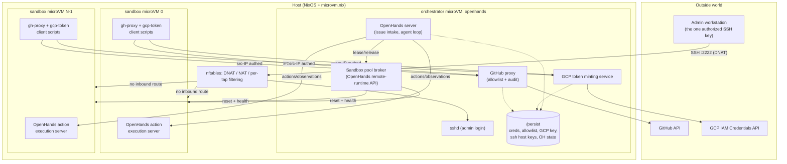

# Agent Cluster: NixOS + microvm.nix Design

## Status

Draft, revision 2. A NixOS configuration that runs a small cluster of
[`microvm.nix`](https://github.com/microvm-nix/microvm.nix) virtual machines:
one orchestrator VM running [OpenHands](https://github.com/OpenHands/OpenHands)
plus a GitHub proxy, and a fixed pool of agent sandbox VMs.

Changes from revision 1, after research into OpenHands' runtime interface and
a critical pass over the security claims:

- **Resolved** the OpenHands↔sandbox integration question: use OpenHands'
  `remote` runtime and implement its runtime-API on the orchestrator as a
  pool broker over the fixed microVM set. See
  [OpenHands integration](#openhands-integration-resolved).
- **Resolved** sandbox identity: authenticate sandboxes by source IP with
  per-tap anti-spoofing rules, eliminating the bearer-token distribution
  problem entirely. See [Sandbox identity](#sandbox-identity-and-proxy-auth).
- **Corrected two overstated security claims** about 5-minute GCP tokens and
  "no standing GitHub credential." Both were wrong in the same way. See
  [Threat model](#threat-model-and-what-this-does-not-defend-against).
- **Added** the sandbox lease/reset lifecycle, issue intake semantics,
  write-safety (protected-branch) enforcement, and operations sections —
  all genuinely missing in revision 1.
- **Added** a configurable sandbox image — package set, `nix-ld`, store
  sharing — and a precise account of what a sandbox reboot does and does
  not reset. See
  [Sandbox image](#sandbox-image-packages-and-toolchains).

## Goals

- A single host runs a `microvm.nix`-based cluster:
  - **1x orchestrator VM** (`openhands`): OpenHands, a GitHub proxy, a
    sandbox-pool broker, and a GCP short-lived-token service.
  - **Nx sandbox VMs** (`sandbox-0..N-1`): fixed count, reset between
    tasks, running the actual coding-agent workload.
- OpenHands picks up issues from a target GitHub repo and drives agents
  inside the sandbox VMs.
- Agents can read/write allow-listed GitHub repos (branches, issues, PRs)
  only through a proxy — they never hold GitHub credentials.
- The orchestrator holds a GCP service-account key. Sandboxes cannot reach
  the key; they request short-lived (~5 min) access tokens from a minting
  service.
- Only the orchestrator is reachable from outside the host, over SSH, for
  admin configuration.
- Credentials and configuration survive `nixos-rebuild` and flake updates:
  they live outside the Nix store.
- SSH access is restricted to a specific admin public key set in Nix config.

## Non-goals

- Multi-host clustering; autoscaling the sandbox count; HA/failover of the
  orchestrator.
- Defending against a malicious *agent output* (e.g. a PR containing
  malicious code). Human PR review is that control — see
  [Threat model](#threat-model-and-what-this-does-not-defend-against).

## High-level architecture



Properties this buys:

- One externally-reachable port on the host, DNAT'd to the orchestrator's
  sshd. No inbound path to any sandbox.
- Sandboxes never see GitHub credentials or the GCP key — only two narrow
  internal endpoints, each allowlist-checked and audit-logged.
- Everything that must outlive a rebuild lives on `/persist`, never in the
  Nix store.

## Host layer

### microvm.nix wiring

The host imports the `microvm.nix` flake's host module and declares each VM
under `microvm.vms.<name>`. Default hypervisor: `qemu` — broadest device
support and the best-debugged path; `cloud-hypervisor` is a later
optimization once the design is validated.

Two VM classes: `openhands` defined once, and `sandbox-0..{N-1}` generated
by mapping over `agentCluster.sandboxCount`, so changing the pool size is a
one-number edit rather than copy-pasted modules — see
[Generating the pool](#generating-the-pool-from-sandboxcount).

microVM guests get a tmpfs root over a read-only `/nix/store` supplied by
the host — which is exactly the ephemerality we want for sandboxes, and
exactly what forces the orchestrator's state onto `/persist`.

### Generating the pool from `sandboxCount`

No preprocessing step, templating layer, or codegen is involved: a NixOS
configuration is a Nix expression, so N VM definitions are a `map` over a
range, evaluated at build time. This is the case where Nix's
config-is-code property actually earns its keep — the equivalent in a
YAML-based system is what drives people to Helm or jsonnet.

The important part isn't that the VM list is generated; it's that
**everything index-dependent is derived from the same list**, so the
pieces cannot drift apart:

```nix
let
  cfg     = config.agentCluster;
  indices = lib.range 0 (cfg.sandboxCount - 1);

  nameOf = i: "sandbox-${toString i}";
  ipOf   = i: "10.100.0.${toString (10 + i)}";
  tapOf  = i: "vm-sb${toString i}";
  macOf  = i: "02:00:00:00:01:${lib.fixedWidthString 2 "0" (lib.toHexString i)}";
in {
  # The VMs themselves.
  microvm.vms = lib.listToAttrs (lib.forEach indices (i:
    lib.nameValuePair (nameOf i) {
      config = import ../sandbox {
        inherit (cfg) sandbox;
        index   = i;
        address = ipOf i;
      };
    }));

  # The anti-spoofing rules that make source-IP auth trustworthy.
  networking.nftables.ruleset = lib.concatMapStringsSep "\n" (i: ''
    iifname "${tapOf i}" ip saddr != ${ipOf i} drop
  '') indices;

  # The broker's view of the pool.
  services.sandbox-broker.pool =
    lib.forEach indices (i: { name = nameOf i; address = ipOf i; });
}
```

One edit to `sandboxCount` therefore moves the VM set, the address
assignments, the per-tap firewall rules, and the broker's pool roster
together. That property is load-bearing rather than tidy: a sandbox that
got an address without its matching anti-spoof rule would silently
undermine the [identity model](#sandbox-identity-and-proxy-auth), and
hand-maintained parallel lists are exactly how that happens.

Changing the count is a host `nixos-rebuild switch` plus a pool drain — the
same deploy path as a [package change](#deploying-a-change), not a hot
reload. And since the pool is a hard concurrency ceiling, sizing it is
really a question of host RAM against desired parallelism.

**Scaling note.** Each VM is a full NixOS module-system evaluation, so eval
time grows linearly with the count — unnoticeable at 4, noticeable in the
tens. Disk is not the constraint (the closures differ by a file or two and
share the host store almost entirely); evaluation is. If the pool ever
needs to be large, the escape valve is to make the guests *byte-identical*
by moving per-VM identity out of the guest closure: assign addresses by
DHCP reservation keyed on MAC, so the host-side config varies per VM while
all N guests share a single evaluation and a single system closure. That's
overkill at the sizes this design targets, so the default is static
addressing — but it's worth keeping index-dependence confined to one small
module so the switch stays cheap if it's ever wanted.

### Networking

A host bridge `br-agents` on `10.100.0.0/24` (both configurable):

| Node | Address |
|---|---|
| host | `10.100.0.1` |
| orchestrator | `10.100.0.2` |
| `sandbox-i` | `10.100.0.10 + i` |

Tap-backed bridged networking, not user-mode/slirp: sandboxes must reach
the orchestrator's services, and the host needs uniform firewall control
over every VM's traffic.

Host `nftables` policy:

- **Inbound (WAN → host)**: DNAT `tcp/2222` → `10.100.0.2:22` only. Nothing
  else is forwarded to any VM.
- **Anti-spoofing (per tap)**: each sandbox's tap interface accepts only
  its own assigned source IP. This is what makes source-IP authentication
  trustworthy — see [Sandbox identity](#sandbox-identity-and-proxy-auth).
- **Sandbox → orchestrator**: permitted only to the GitHub proxy port, the
  GCP token service port, and the broker's health port. Notably *not* to
  the orchestrator's sshd or OpenHands web UI.
- **Orchestrator → sandbox**: permitted (the agent loop and broker drive
  the sandboxes).
- **Sandbox ↔ sandbox**: dropped. Agents cannot reach each other.
- **Outbound (VM → WAN)**: see below.

### Sandbox egress: an explicit trade-off

Agents need to install dependencies, fetch packages, and run builds, which
means general outbound internet access. That has a consequence worth
stating plainly rather than burying: **a sandbox with general internet
egress can exfiltrate anything it can read**, including the source of any
allow-listed repo it has legitimately cloned. No firewall rule short of a
domain allowlist changes that.

Revision 1 proposed blocking GitHub's IP ranges to "force" git through the
proxy. That is close to worthless as a security control — GitHub's ranges
change, and an agent with arbitrary egress has countless other paths — and
it is worth being honest that its actual value is *hygiene*: it makes
accidental direct-GitHub usage fail loudly instead of silently doing
something inconsistent with the proxy's policy. Keep it for that reason, at
that weight, and not as a security boundary.

Two options for what egress policy actually is:

1. **Open egress with NAT** (recommended to start). Agents work without
   friction. Exfiltration of allow-listed repo contents is accepted as
   in-scope-of-trust — the agent is being handed that code to work on
   anyway.
2. **Forced HTTP(S) egress proxy with a domain allowlist** on the
   orchestrator (package registries, the proxy itself, and nothing else).
   A real control, and the thing to adopt if agents ever handle code more
   sensitive than what they're already trusted with. It reliably breaks
   some agent workflows, so it's a deliberate later step, not a default.

Recommendation: ship (1), design the module so (2) is a config flag rather
than a rewrite.

### Persistent storage

The orchestrator needs state that survives rebuilds:

- GitHub credentials (App private key, or PAT)
- The repo allowlist
- The GCP service-account key
- SSH host keys (so the admin's `known_hosts` isn't invalidated per deploy)
- OpenHands' own state (conversation history, issue-intake cursor)

microvm.nix offers two mechanisms: `microvm.volumes` (a block image with
`autoCreate`) and `microvm.shares` with `proto = "virtiofs"` (a host
directory passed through). **Use a virtiofs share** at
`/var/lib/microvms/openhands/persist` → `/persist`. Revision 1 specified a
block volume; a share is better here for operational reasons that matter
more than the marginal performance difference:

- The admin can inspect, back up, and repair the files from the host
  without booting the VM — which is precisely the situation you're in when
  a bad credential is what's keeping the VM from coming up.
- Backups are `tar`/`rsync` of a directory, not image-level snapshots.
- No fixed size to outgrow.

Sandbox VMs get no share and no volume. They are fully ephemeral by design.

`/persist` layout:

```
/persist/
  ssh/                             # VM host keys (0700 root)
  secrets/
    gcp-service-account.json       # 0600, owned by gcp-token-svc
    github/                        # App private key or PAT, 0600, owned by github-proxy
  config/
    repo-allowlist.json            # admin-editable, hot-reloaded, no rebuild
  state/
    openhands/                     # OpenHands working state
    github-proxy/audit.log
    gcp-token-svc/audit.log
```

**Invariant**: no secret value is ever a Nix string literal, a derivation
input, or committed to this repo. Nix encodes only *paths* and *how
services consume them*. Values are provisioned out-of-band over SSH — see
[Bootstrapping](#bootstrapping-first-login).

Note the corollary: `/persist` on the host is unencrypted at rest. Host
disk encryption is the answer if the deployment needs it; that's a host
provisioning concern outside this doc.

## OpenHands integration (resolved)

This was revision 1's largest open risk. Research resolves it.

OpenHands' runtime layer is a client/server split: the agent loop sends
actions to an **action execution server** over HTTP and receives
observations back, in a tight loop. Which *runtime* implementation is used
determines only how that server gets provisioned and where it lives. The
built-in options are `docker` (default, one container per session),
`local` (same host, no isolation), `kubernetes`, and `remote`.

The `remote` runtime is the one that fits. It does not manage containers
itself — it calls out to an external HTTP API to create, pause, resume, and
stop runtimes, then talks to whatever endpoint that API hands back. The
surface is small and has been implemented by third parties against
non-Docker backends; the
[Kubernetes remote runtime](https://github.com/zparnold/openhands-kubernetes-remote-runtime)
implements it to spawn Pods, which is structurally the same problem as
spawning from a fixed microVM pool. Its documented routes:

| Route | Method | Purpose |
|---|---|---|
| `/start` | POST | allocate a runtime for a session |
| `/stop` | POST | release it |
| `/pause` | POST | release compute, keep state |
| `/resume` | POST | bring a paused runtime back |
| `/list` | GET | enumerate runtimes |
| `/runtime/{runtime_id}` | GET | runtime detail |
| `/sessions/{session_id}` | GET | look up by session |
| `/sessions/batch` | GET | batch session lookup |
| `/registry_prefix`, `/image_exists` | GET | container-image plumbing |
| `/health` | GET | health check (unauthenticated) |

All authenticated with an `X-API-Key` header. OpenHands is pointed at it
with `SANDBOX_REMOTE_RUNTIME_API_URL` and `SANDBOX_API_KEY` (plus
`SANDBOX_RUNTIME_CONTAINER_IMAGE`), settable via env or `config.toml`'s
`[sandbox]` section.

**Design: the pool broker.** We implement this API on the orchestrator,
backed by the fixed set of sandbox VMs instead of a container scheduler:

- `/start` **leases** a free sandbox from the pool and returns its
  action-execution-server URL on the internal network. If none is free, it
  applies backpressure (see [Capacity](#capacity-and-backpressure)).
- `/stop` **releases** the lease and triggers a reset (see
  [Sandbox lifecycle](#sandbox-lifecycle-lease-and-reset)).
- `/pause`/`/resume` map to marking a lease idle vs. active. Since our VMs
  are a fixed pool rather than elastic compute, "pause" can either hold the
  lease (simple, wastes a slot) or release-with-state-loss. Hold the lease;
  the pool is small and sessions are short.
- `/registry_prefix` and `/image_exists` are container-shaped concepts with
  no meaning for microVMs. Stub them with static affirmative responses.
  **This is the one integration wrinkle to verify early**: confirm
  OpenHands is satisfied by stubs and doesn't do anything else
  image-specific before starting a session.

Each sandbox VM runs the OpenHands action execution server as a systemd
service bound to its internal IP, from the same pinned OpenHands version as
the orchestrator (a Nix-level version pin, so client and server can't
drift).

Why this over the alternative (subclassing `Runtime`/`ActionExecutionClient`
in Python to point at fixed endpoints): the broker is a separate service
speaking a stable HTTP contract, so we never carry a patch against
OpenHands' internals across upgrades. The custom-subclass route is smaller
code but means maintaining a fork.

**Residual risk**: the remote-runtime API is defined by OpenHands' client
implementation rather than by a published spec, so it can change across
versions. Mitigations: pin the OpenHands version in Nix, and treat broker
compatibility as something to re-verify on upgrade. This is materially
smaller than revision 1's "unknown whether this is possible at all."

## Sandbox lifecycle: lease and reset

Revision 1 called sandboxes "fully ephemeral," which was **false between
tasks**: they're persistent VMs, so without an explicit reset, agent B
inherits whatever agent A left in `/tmp`, `$HOME`, the git worktree, and
any background process still running. That's both a correctness problem
(mysterious cross-task interference) and a security one (task A's cloned
private repo readable by task B).

The broker owns the reset. On `/stop`, before a sandbox returns to the free
pool, it is **rebooted**. microVM boots are fast (order of a second or two),
so this is cheap enough to do between every task — and it is far more
robust than trying to clean up in userspace, where the failure mode is a
forgotten directory or a surviving background process rather than an
obvious error.

### What a reboot actually resets

Being precise about this, because the whole isolation story rests on it. A
sandbox VM's filesystem is:

- **`/` — tmpfs**, RAM-backed and writable. Everything an agent does lives
  here: `$HOME`, `/tmp`, cloned repos, `node_modules`, pip venvs, any
  binary it downloaded. Discarded completely on every boot.
- **`/nix/store` — read-only**, supplied by the host (see
  [store sharing](#sandbox-image-packages-and-toolchains)). The agent
  cannot modify it.
- **No volume, no share.** Deliberately: there is nowhere for a sandbox to
  write anything that outlives it.

So yes — **a restarted sandbox comes back with nothing the previous agent
did.** There is no accumulated drift to clean up, and no reachable state
for one task to leak into the next.

One correction to the natural mental model, though: it is not recreated
from a *base image* that was fixed when the VM first started. It is
recreated from **the sandbox definition in the host's currently-activated
Nix configuration**. Usually those are identical, but they diverge exactly
when you care — after a `nixos-rebuild switch` that changed the sandbox
config, the next reboot brings the sandbox up with the *new* definition.
That is the deploy mechanism for
[package changes](#sandbox-image-packages-and-toolchains), and it's why
draining the pool is part of the deploy runbook rather than an
afterthought.

Lease states: `free` → `leased` (session bound) → `resetting` → `free`. The
broker persists lease state in memory only; on broker restart, reset every
sandbox and start from an all-free pool. A sandbox that fails its
post-reset health check goes to `quarantined` and is excluded from the pool
rather than handed to a session — with an alert, since a stuck sandbox
silently shrinking the pool is exactly the kind of failure that otherwise
goes unnoticed for weeks.

### Capacity and backpressure

With a fixed pool, `sandboxCount` is a hard concurrency ceiling. If
OpenHands requests a runtime when none is free, the broker must not
silently fail: return a retryable error and have OpenHands queue, or block
with a bounded timeout. Verify which behavior OpenHands' remote-runtime
client handles gracefully, and match it. Metric to expose: free vs. leased
vs. quarantined counts, so pool exhaustion is visible rather than
experienced as "agents seem slow today."

## GitHub access

### Auth model

**A GitHub App, not a PAT** (recommended). An App is installed on exactly
the allow-listed repositories, so its installation tokens are scoped by
GitHub itself — the allowlist is then enforced in two independent places
(our proxy's check, and GitHub's own installation scoping) rather than
resting entirely on our code being correct. A fine-grained PAT is the
fallback if standing up an App is too much for a first pass; nothing else
in the design changes.

Permissions: repository contents read/write, issues read/write, pull
requests read/write. Nothing else — no admin, no webhook management, no
collaborator management, no delete.

### The proxy

A small internal HTTP service on `10.100.0.2`, reachable only by sandboxes
and the OpenHands process:

- **REST passthrough** for a *fixed allow-list of endpoints* (branches,
  contents/commits, issues, PRs) — not arbitrary GitHub API paths —
  forwarding to `api.github.com` with real credentials injected, after
  checking the target repo against `repo-allowlist.json`.
- **Git smart-HTTP** so `git clone/fetch/push` against
  `http://10.100.0.2:<port>/<owner>/<repo>.git` works transparently. This
  is the only way sandboxes reach git.
- **Installation token refresh** (1h lifetime) handled internally,
  invisible to callers.
- **Audit log** per request: caller sandbox, repo, operation, outcome.
- **Hot-reloaded allowlist** from `/persist/config/repo-allowlist.json`, so
  an admin adds or removes a repo over SSH with no rebuild. A Nix option
  seeds the file on first boot only; thereafter the file is authoritative.

### Write safety: enforce at GitHub, not in a pack parser

Agents can push branches and open PRs, so the cluster needs to guarantee
they cannot push to `main`, force-push over history, or delete branches.

The tempting place to enforce this is the proxy. Resist it: doing so means
parsing the ref-update commands out of the `git-receive-pack` request body
before the packfile, and getting that subtly wrong fails *open*. Instead,
enforce server-side with **GitHub branch protection / repository rulesets**
on each allow-listed repo:

- default branch: no direct pushes from the App, no force-push, no deletion
- require PRs for changes to protected branches
- optionally restrict the App to creating branches under an `agent/*` prefix

This is enforced by GitHub, cannot be bypassed by a bug in our code, and is
declarative. The proxy adds a coarse complementary check it *can* do
reliably — reject pushes whose target repo isn't allow-listed at all — and
leaves ref-level policy to GitHub.

Setting up these rulesets is part of onboarding a repo to the allowlist,
which makes it a documented runbook step, not an implicit assumption. The
proxy should refuse to serve a repo whose protection rules it cannot verify
are in place — failing closed on onboarding is cheap, and it prevents the
allowlist and the rulesets from silently drifting apart.

### Issue intake semantics

Revision 1 said "OpenHands polls the target repo for issues" and left the
actual behavior undefined, which hides several decisions that determine
whether this thing is usable or a runaway:

- **Trigger**: only issues carrying a specific label (e.g.
  `agent-ready`), never all open issues. Opt-in per issue is the difference
  between a tool and a machine that opens PRs on every bug report ever
  filed.
- **Dedupe**: on pickup, the agent removes `agent-ready` and applies
  `agent-working`, then comments with a link to the run. Label transitions
  are the lock; without one, a poll cycle overlapping a slow run starts a
  second agent on the same issue.
- **Completion**: on success, `agent-working` → `agent-done` plus the PR
  link; on failure, → `agent-failed` with the error. A human re-labels to
  retry, which keeps retry an explicit human decision.
- **Poll interval**: 60s default. GitHub's rate limits are not a concern
  at this scale, and polling through our own proxy keeps the audit trail
  complete.
- **Rate limiting**: a cap on runs started per hour, so a bulk labeling
  action can't consume the entire pool and the LLM budget at once.

## GCP short-lived tokens

- The key lives at `/persist/secrets/gcp-service-account.json`, `0600`,
  owned by the token service's dedicated user — readable by neither
  OpenHands nor the broker.
- One internal endpoint, `POST /token`, authenticated by source IP, returns
  an OAuth2 access token with `agentCluster.gcp.tokenLifetimeSeconds`
  (default 300) minted via the IAM Credentials API's
  [`generateAccessToken`](https://cloud.google.com/iam/docs/reference/credentials/rest/v1/projects.serviceAccounts/generateAccessToken),
  rather than ever handing out the key.
- A client script `gcp-token` on each sandbox fetches one and exports it as
  `CLOUDSDK_AUTH_ACCESS_TOKEN`/`GOOGLE_OAUTH_ACCESS_TOKEN`, so agents run
  it immediately before a `gcloud`/`gsutil`/API call rather than holding a
  standing credential.
- Every mint is audit-logged.

**What the 5-minute lifetime actually buys** — this is where revision 1 was
wrong, and it matters. A sandbox can call `/token` again the moment a token
expires, indefinitely. Short lifetimes therefore do **not** limit what a
compromised sandbox can do while it is compromised. What they do buy:

- **Revocability**: cut a sandbox off at the proxy, and its GCP access dies
  within 5 minutes, with no key to rotate and no token to hunt down.
- **Containment of leakage**: a token that leaks into a log, an LLM
  context, or a PR diff is worthless within minutes.

Both are real and worth having. Neither is "the agent only has 5 minutes of
access." To actually reduce steady-state privilege, downscope the token
itself. Options, in increasing order of effort:

1. Mint for a **second, minimally-privileged service account** that the
   primary key only impersonates, so the sandbox's ceiling is that
   account's permissions rather than the primary's.
2. Apply a
   [Credential Access Boundary](https://cloud.google.com/iam/docs/downscoping-short-lived-credentials)
   to restrict tokens to specific buckets/resources.

Recommendation: do (1) from the start. It costs one extra service account
and one IAM binding, and it is the difference between "5 minutes of the
primary SA's full permissions, renewable forever" and a genuinely bounded
capability.

## Sandbox identity and proxy auth

Both proxies need to know which sandbox is calling, to allowlist-check,
audit, and rate-limit per caller. Revision 1 proposed per-sandbox bearer
tokens and then had to leave an open question about how ephemeral VMs
obtain them without either baking secrets into the Nix store or acquiring a
boot-time dependency on the orchestrator.

That problem dissolves: **authenticate by source IP.** Sandboxes sit on a
host-controlled bridge with static addresses, and the host's per-tap
nftables rules (see [Networking](#networking)) drop any packet whose source
address isn't the one assigned to that tap. A sandbox therefore cannot
impersonate another, and there is no secret to distribute, rotate, or leak.

This holds only as long as the anti-spoofing rules do, so they are a
load-bearing part of the design, not a hardening nicety: they belong in the
same Nix module as the address assignments, generated from one source of
truth so an added sandbox can't get an address without also getting its
filter rule.

Bearer tokens remain available as defense-in-depth if the host firewall is
ever not fully trusted (e.g. if a future revision puts sandboxes on a
network shared with something else). At that point the broker — which runs
on the orchestrator with access to `/persist` — is the natural place to
issue a token to each sandbox at lease time, over the already-authenticated
internal channel, avoiding the bootstrap problem entirely.

## Admin access

- A dedicated `admin` user (not root) on the orchestrator, with sudo.
  `PasswordAuthentication no`, `PermitRootLogin no`, and an
  `AuthorizedKeysFile` containing exactly one key from
  `agentCluster.adminSshPublicKey`. A public key in the repo is fine; it
  isn't a secret.
- SSH host keys on `/persist/ssh`, so they survive rebuilds and don't
  trigger host-key-changed warnings on every deploy.
- To be precise about a claim revision 1 fumbled: the admin *does* have
  sudo and therefore can read every secret on `/persist`. The per-service
  user separation exists so that **services** can't read each other's
  credentials — a bug in OpenHands or the broker doesn't yield the GCP key.
  It is not, and cannot be, a boundary against the human administrator.
- This is the only external login to the cluster. Sandboxes have no
  external route; debugging one means hopping through the orchestrator over
  the internal network.
- Host-level access (to the physical machine, as opposed to the
  orchestrator VM) is out of scope, assumed handled by whatever provisions
  the host.

### Bootstrapping (first login)

Nix brings the orchestrator up with an empty `/persist/secrets`. Services
that need credentials start in a degraded, clearly-logged state rather than
crash-looping. The admin then:

1. SSHes to `admin@<host>:2222`.
2. Places the GCP service-account JSON at
   `/persist/secrets/gcp-service-account.json`.
3. Installs GitHub credentials — the App private key at
   `/persist/secrets/github/app-private-key.pem` with its app/installation
   ids alongside, or a PAT if going that route.
4. Edits `/persist/config/repo-allowlist.json` and applies branch
   protection to each newly allow-listed repo (see
   [Write safety](#write-safety-enforce-at-github-not-in-a-pack-parser)).

None of this requires a rebuild, and none of it is lost on the next one,
because it never entered the Nix store.

## Sandbox VMs

- Count fixed by `agentCluster.sandboxCount` (default `4` — a starting
  point tied to host RAM, revisited after measuring real agent memory use).
- tmpfs root, read-only store, no share, no volume; rebooted between
  leases. See [What a reboot actually resets](#what-a-reboot-actually-resets).
- Runs the OpenHands action execution server, version-pinned in lockstep
  with the orchestrator.
- Ships a `gh-proxy` client: an `/etc/gitconfig` `insteadOf` rewrite so
  `github.com` URLs transparently resolve to the proxy (agents' existing
  git habits and any tooling that hardcodes GitHub URLs just work), plus a
  small wrapper for issue/PR API calls. Ship both the script and short
  written instructions in the sandbox image, since an agent that can read
  `/etc/agent-tools/README` recovers from a confusing git error on its own.
- Ships the `gcp-token` client described above.
- No inbound connectivity from outside the host and none from other
  sandboxes.

## Sandbox image: packages and toolchains

Because the root is discarded on every reboot, whatever an agent needs has
to either be **in the image** or be re-installed by the agent on every
task. Making the image easy to shape is therefore not a convenience — it's
what keeps agents from burning their first several minutes (and a chunk of
context) re-solving environment setup on every run.

### Configuration surface

```nix
agentCluster.sandbox = {
  # Replace the default toolchain wholesale.
  packages = with pkgs; [ ... ];

  # Or, more commonly: keep the defaults and add to them.
  extraPackages = with pkgs; [ go terraform postgresql ];

  # Escape hatch: an arbitrary NixOS module merged into every sandbox,
  # for the cases a package list can't express.
  extraConfig = { pkgs, ... }: {
    environment.variables.GOFLAGS = "-mod=vendor";
    services.redis.servers."".enable = true;
    environment.etc."agent-tools/PROJECT.md".source = ./project-notes.md;
  };
};
```

`extraPackages` is the option to reach for; `packages` exists for the rare
case of wanting a deliberately minimal image. `extraConfig` matters more
than it looks: "what's pre-installed" generalises quickly into "a service
the test suite needs," "an env var the build wants," or "a file the agent
should read," and without a raw-module escape hatch every one of those
becomes a change to this repo's modules instead of a change to the
deployment's config.

Default set, aimed at "an agent can start working without installing
anything": `git`, `openssh`, `cacert`, `curl`, `jq`, `ripgrep`, `fd`,
`coreutils`/`findutils`/`gnused`/`gawk`, `gnutar`/`gzip`/`unzip`, `less`,
`vim`, `gnumake`, `gcc`, `python3` with `uv`, `nodejs` with `pnpm`. Plus
the `gh-proxy` and `gcp-token` clients and their README.

### nix-ld: the NixOS-specific trap

NixOS has no `/lib64/ld-linux-x86-64.so.2` and no FHS library paths, so a
dynamically-linked binary that an agent downloads — a release tarball, a
`pip` wheel with a native extension, a language-server binary, a
`curl | sh` installer — fails with `cannot execute: required file not
found`. That error is opaque, agents burn a lot of turns on it, and it
looks like a broken sandbox rather than a platform difference.

Enable [`nix-ld`](https://github.com/nix-community/nix-ld) in every
sandbox, with a reasonably generous library set (`stdenv.cc.cc.lib`,
`zlib`, `openssl`, `curl`, `glibc`, `libxml2`, `sqlite`, and the usual
graphics/X stubs that headless test suites nonetheless link against). This
makes downloaded binaries work the way they do on Debian, and it's exposed
as `agentCluster.sandbox.nixLd.extraLibraries` for the cases it misses.

This is worth calling out at design time because it is invisible until
agents are actually running, and then it accounts for a surprising share of
their failures.

### Store sharing

With a generous package set, a per-VM store image would mean N copies of a
large closure — wasteful in disk and in rebuild time. Instead, mount the
**host's `/nix/store` read-only** into every sandbox, so the marginal cost
of the Nth sandbox is approximately zero and adding a package to the image
costs one host build rather than N.

The confidentiality question this raises is already answered by an
invariant we hold anyway: [no secret is ever in the Nix
store](#persistent-storage). What a sandbox gains is the ability to
enumerate what else the host has built — mild information disclosure, no
credential exposure — and it cannot write to the store. If even that
disclosure is unacceptable for a given deployment, `storeOnDisk` builds a
per-VM image containing only that VM's closure, at the cost of disk and
build time; make it a config flag rather than a decision baked into the
modules.

### Runtime installs

Agents can still install things per-task, and should be able to: `uv`/`pip`
into a venv, `pnpm install` into `node_modules`, `cargo` into a project
dir, and (with `nix-ld`) downloaded binaries all work fine against the
tmpfs root. What does *not* work is anything wanting to write to
`/nix/store` or mutate system state globally — the right mental model for
an agent is "a normal Linux box where you don't have a system package
manager, but your project-local tooling is all fine."

A **persistent shared package cache** across sandboxes is deliberately
rejected, despite the obvious appeal of not re-downloading the same
dependencies every task. A writable cache shared between leases is a
channel between tasks: task A poisons an npm or pip cache entry, task B
silently builds against it, and the isolation that the whole reset design
exists to provide is gone. If dependency fetch time becomes a real cost,
the answer is to bake the dependencies into the image — which is what the
package options above are for, and which is fast, shared, and read-only by
construction.

The feedback loop is the point: when agents repeatedly install the same
thing, that's the signal to add it to `extraPackages` and stop paying for
it. Worth watching for during early operation, since it's cheap to fix and
otherwise silently taxes every run.

### Deploying a change

Package changes are **not** hot-reloadable the way the repo allowlist is.
The sequence is: edit config → `nixos-rebuild switch` on the host → drain
the pool → sandboxes pick up the new definition on their next reboot. Since
the reset between leases is a reboot anyway, a drained pool converges
without any extra mechanism. Plan for it as a deploy, not a config tweak.

## Repo layout (proposed)

```
flake.nix / flake.lock
hosts/cluster-host/configuration.nix   # host: microvm.nix, network, agentCluster
modules/agent-cluster/
  default.nix                          # agentCluster.* options
  network.nix                          # bridge, nftables, per-tap anti-spoof
  orchestrator/
    default.nix  openhands.nix  broker.nix
    github-proxy.nix  gcp-token-service.nix
    admin-ssh.nix  persist.nix
  sandbox/
    default.nix  image.nix                    # packages, nix-ld, store sharing
    action-execution-server.nix
    github-proxy-client.nix  gcp-token-client.nix
packages/
  github-proxy/  gcp-token-service/  sandbox-broker/
docs/design.md
```

## Configuration surface (`agentCluster.*`, draft)

| Option | Type | Default | Notes |
|---|---|---|---|
| `adminSshPublicKey` | `str` | — required | Key allowed to SSH to the orchestrator. |
| `sandboxCount` | `int` | `4` | Fixed pool size; hard concurrency ceiling. |
| `sandbox.packages` | `list of package` | see defaults | Full override of the sandbox toolchain. |
| `sandbox.extraPackages` | `list of package` | `[]` | Added to the defaults — the usual knob. |
| `sandbox.extraConfig` | `module` | `{}` | Arbitrary NixOS module merged into every sandbox. |
| `sandbox.nixLd.enable` | `bool` | `true` | Make downloaded dynamic binaries runnable. |
| `sandbox.nixLd.extraLibraries` | `list of package` | `[]` | Extra libs for `nix-ld`'s search path. |
| `sandbox.shareHostStore` | `bool` | `true` | Share host `/nix/store` vs. per-VM `storeOnDisk`. |
| `network.bridge` | `str` | `br-agents` | Host bridge name. |
| `network.subnet` | `str` | `10.100.0.0/24` | Internal subnet. |
| `network.externalSshPort` | `port` | `2222` | Host port DNAT'd to orchestrator sshd. |
| `network.egressPolicy` | `enum` | `open` | `open` \| `allowlist` (see egress trade-off). |
| `github.targetRepo` | `str` | — required | `owner/repo` scanned for labeled issues. |
| `github.intakeLabel` | `str` | `agent-ready` | Label that opts an issue in. |
| `github.pollIntervalSeconds` | `int` | `60` | Issue poll cadence. |
| `github.maxRunsPerHour` | `int` | `10` | Guard against bulk-label runaway. |
| `github.allowlistedReposDefault` | `list of str` | `[]` | Seeds the allowlist on first boot only. |
| `gcp.projectId` | `str` | — required | Project the minted tokens belong to. |
| `gcp.impersonateServiceAccount` | `str` | — | Narrow SA the key impersonates (recommended). |
| `gcp.tokenLifetimeSeconds` | `int` | `300` | Minted token lifetime. |
| `openhands.version` | `str` | pinned | Pinned for orchestrator and sandboxes together. |

## Threat model, and what this does *not* defend against

Being explicit here is more useful than a list of reassurances. Revision 1
made two claims that sounded strong and were not; both are corrected above,
and both came from the same error — treating a *narrowed* capability as an
*absent* one.

**Defended:**

- A compromised sandbox cannot read GitHub credentials or the GCP key; they
  aren't on the machine.
- It cannot touch repos outside the allowlist (checked by the proxy, and
  independently scoped by the GitHub App installation).
- It cannot push to protected branches or rewrite history (enforced by
  GitHub, not by our code).
- It cannot reach other sandboxes, or be reached from outside the host.
- It cannot persist: a reboot between leases discards everything.
- Its GitHub and GCP access is revocable in minutes, and fully audit-logged.

**Not defended, by design or by limitation:**

- **Abuse of legitimate access while compromised.** A compromised sandbox
  can do anything the agent is allowed to do — read allow-listed repos,
  open PRs, comment on issues, mint GCP tokens — for as long as it holds a
  lease. The proxy narrows *scope* and provides audit and a kill switch; it
  does not distinguish a well-behaved agent from a hostile one making the
  same API calls.
- **Exfiltration**, under the default open-egress policy. See
  [Sandbox egress](#sandbox-egress-an-explicit-trade-off).
- **Malicious code in agent output.** Nothing here inspects what the agent
  writes. Human review of every PR is the control, which is precisely why
  the no-push-to-`main` rules are load-bearing and belong at GitHub.
- **A compromised orchestrator**, which holds every real credential. It is
  the highest-value target in the cluster, and its hardening — minimal
  package set, no listening services beyond sshd and the internal APIs —
  matters more than anything else here. Compromise there is total.
- **A malicious or buggy LLM provider / prompt injection via issue
  content.** An attacker who can file an issue in the target repo can put
  text in front of the agent. The intake label requirement means a human
  opts each issue in, which is the mitigation; it is not a guarantee.

## Operations

- **Rebuilds interrupt work.** `nixos-rebuild switch` on the host restarts
  VMs, killing in-flight agent runs. The broker should expose a drain mode
  (stop granting leases, wait for actives to finish, bounded by a timeout)
  and the deploy runbook should use it. Issues left in `agent-working` need
  a sweeper that returns them to `agent-ready` after a timeout, or they
  silently strand.
- **Observability.** Forward VM journals to the host. The signals that
  matter: pool free/leased/quarantined counts, lease durations, proxy
  request rate and denial rate, token mint rate, issue intake outcomes. A
  quarantined sandbox and a stuck `agent-working` label are the two silent
  failure modes to alarm on.
- **Backup.** `/persist` is the only stateful thing in the cluster; back up
  the host directory. Recovery is restoring the directory and rebuilding.
- **Rotation.** GCP key and GitHub App key rotate by replacing the file on
  `/persist` and restarting the one service that reads it. No rebuild.
- **Adding a repo.** Edit the allowlist, install the App on the repo, apply
  branch protection. Hot-reloaded, no rebuild.
- **Changing sandbox packages.** A rebuild and a pool drain, not a config
  tweak — see [Deploying a change](#deploying-a-change). Track which
  packages agents keep installing by hand; each one is a cheap image change
  that pays back on every subsequent run.

## Open questions

Substantially shorter than revision 1 — the two biggest are resolved above.

1. **Remote-runtime API stub compatibility**: confirm OpenHands accepts
   stubbed `/registry_prefix` and `/image_exists` responses and does
   nothing else image-specific before starting a session. This is the first
   thing to spike; it's the last real unknown in the integration.
2. **Backpressure behavior**: what does OpenHands' remote-runtime client do
   when the API reports no capacity? Determines whether the broker queues
   or errors.
3. **Hypervisor**: stay on `qemu`, or move to `cloud-hypervisor` for lower
   per-VM overhead once things work?
4. **`sandboxCount` default**, pending measurement of real agent memory
   footprint against host RAM.
5. **Host exposure**: is the host directly internet-facing (as the DNAT
   design assumes), or behind an existing bastion/VPN — in which case the
   orchestrator's sshd needn't be internet-reachable at all?

## Implementation plan

1. **Scaffold**: flake wiring `microvm.nix`; host config with bridge
   network and an `agentCluster` module; orchestrator plus
   `sandboxCount = 1` to prove the plumbing. Includes the sandbox image
   module — default toolchain, `nix-ld`, shared host store — since the
   sandbox has to be defined here anyway and `nix-ld` is much cheaper to
   have from the start than to diagnose later.
2. **Network + persistence**: nftables (DNAT, per-tap anti-spoofing,
   inter-VM matrix), `/persist` virtiofs share. Verify the reachability
   matrix explicitly — including the negative cases, since a
   silently-permissive firewall is the failure that invalidates the whole
   security model — and that `/persist` survives `nixos-rebuild switch`.
3. **Admin SSH**: hardened sshd, single key, host keys on `/persist`.
   Verify external login and stable host keys across rebuilds.
4. **Spike open question 1**: stub broker returning a hand-run action
   execution server's URL; confirm OpenHands drives a session end to end.
   *Everything downstream depends on this, so it comes before real work on
   the proxy.*
5. **Broker**: full pool management — lease, release, reboot-reset, health
   check, quarantine, drain.
6. **GitHub proxy v1**: allowlist enforcement, PAT-based REST passthrough,
   git smart-HTTP, audit log. Test end to end from a sandbox against a
   throwaway repo.
7. **GCP token service**: minting with impersonation of the narrow SA,
   client script, audit log. Verify expiry and that sandboxes cannot reach
   the key file.
8. **Issue intake**: label-driven pickup, dedupe transitions, rate limit,
   stranded-label sweeper.
9. **Hardening**: migrate to a GitHub App, apply branch protection to
   allow-listed repos, tighten the endpoint allowlist, ship journals to the
   host, write the admin runbook.

Scale to `sandboxCount = N` once 1–8 are validated at `sandboxCount = 1`.

## Sources

- [OpenHands runtime architecture](https://docs.openhands.dev/openhands/usage/architecture/runtime)
- [OpenHands runtime source](https://github.com/OpenHands/OpenHands)
- [openhands-kubernetes-remote-runtime](https://github.com/zparnold/openhands-kubernetes-remote-runtime)
  — third-party implementation of the remote-runtime API
- [microvm.nix](https://github.com/microvm-nix/microvm.nix),
  [options reference](https://microvm-nix.github.io/microvm.nix/microvm-options.html),
  [shared directories](https://microvm-nix.github.io/microvm.nix/shares.html)
- [GCP generateAccessToken](https://cloud.google.com/iam/docs/reference/credentials/rest/v1/projects.serviceAccounts/generateAccessToken),
  [downscoping with credential access boundaries](https://cloud.google.com/iam/docs/downscoping-short-lived-credentials)
