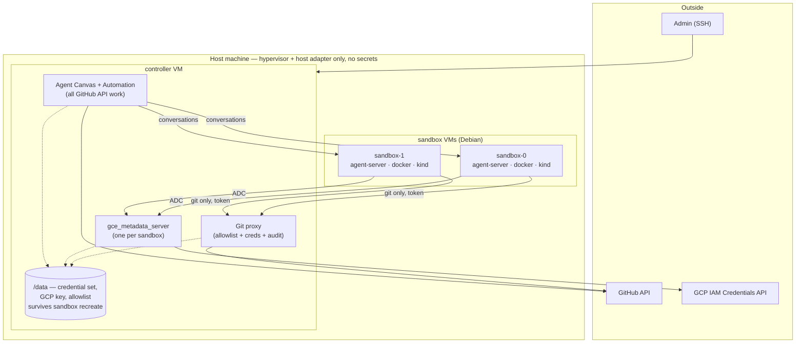

# Grain: a single-node agent cluster

## Status

Revision 5. **One host machine runs everything**: a controller VM and a
small pool of agent sandbox VMs. The host itself runs a hypervisor and
nothing else.

The immediate target is a **GCP `n2-highmem-4`** (4 vCPU, 32 GB, Debian,
nested virtualization enabled). **macOS on Intel stays supported** as a
future target, and the design is arranged so that switching costs one
module rather than a rewrite — see
[the host adapter](#the-host-adapter).

Earlier revisions targeted a NixOS host using
[`microvm.nix`](https://github.com/microvm-nix/microvm.nix) (1–3) and then
macOS with the controller running natively on the host (4). Two decisions
from those revisions carry forward, both simplifications: sandboxes are
**long-lived rather than reset per task**, and the guests are **Debian
rather than NixOS**.

Putting the controller in a VM is what makes this revision portable. It
also takes every credential off the host, which restores an isolation
property revision 4 had traded away for RAM.

## Goals

- **One machine runs the whole system.** No clustering, no cloud
  orchestration.
- OpenHands picks up labelled issues from a target GitHub repo and drives
  an agent in a sandbox.
- Agents can read and write allow-listed GitHub repos, but **hold no
  GitHub credentials** — their only route out is a git proxy.
- Agents can obtain short-lived GCP tokens without touching the
  service-account key.
- Each agent gets a **whole VM**, because the workload runs `docker` and
  `kind`, which do not nest into containers.
- Sandboxes are long-lived, with an explicit recreate that clears them.
- **The host-specific surface is one module.** Moving between Linux and
  macOS should mean replacing VM lifecycle and networking, nothing else.

## Non-goals

- Multi-host clustering, autoscaling, HA.
- Defending against malicious *agent output*. Human PR review is that
  control.
- Isolating *sequential* tasks on one sandbox from each other; see
  [what it costs](#what-it-costs).

## Build vs. reuse

Default to existing solutions; write code only where nothing fits. Two of
the three reuse decisions in revision 3 did not survive investigation, so
these are stated with what was actually verified.

| Need | Approach |
|---|---|
| Agent execution | **`openhands-agent-server`** per sandbox VM, registered as an Agent Canvas backend — [no provisioning API to build](#openhands-integration). [Claude Code is a live alternative](#alternative-agent-runtime-claude-code) |
| Issue intake | **[`OpenHands/automation`](#issue-intake)** — cron triggers and filter expressions |
| GCP credentials | **[`gce_metadata_server`](#gcp-credentials)** — ADC works with no client code |
| VM lifecycle | **[Lima](#the-host-adapter)**, which runs on both Linux and macOS — libvirt is the Linux-native fallback |
| Guest OS | **stock Debian**, provisioned by a script in this repo |
| Git access control | **Custom** — small smart-HTTP proxy; [FINOS Git Proxy evaluated and rejected](#the-git-proxy-write-it) |
| GitHub API access | **none from sandboxes** — the controller does API work, so there is nothing to filter |
| Branch and workflow protection | **[GitHub rulesets and withheld scopes](#scopes-to-withhold)** — enforced server-side |

### What is left to write

Two small things: the [git proxy](#the-git-proxy-write-it), and the
[host adapter](#the-host-adapter) — of which only the second is
platform-specific, and it is deliberately kept thin.

## High-level architecture



Properties:

- **The host holds no secrets.** Every credential lives in the controller
  VM. A host compromise is still fatal — it owns the hypervisor — but the
  credentials are not sitting in a home directory next to a browser.
- Sandboxes never hold GitHub or GCP credentials, only two narrow endpoints
  on the controller, allowlist-checked and audit-logged.
- Concurrent agents cannot reach each other: separate kernels, separate
  Docker daemons, separate port spaces.

## The host adapter

The point of this revision. Everything above the hypervisor — the
controller image, the sandbox image, the services, the credential model —
is host-agnostic. What is not, and therefore what a port has to replace, is
deliberately confined to one module with a small interface:

```
grain-host-adapter
  create(name, image, cpus, memMb, diskGb)
  start(name) / stop(name) / destroy(name)
  address(name) -> ip
  network_up()        # private network the VMs share
  egress_policy(mode) # open | allowlist
```

Two implementations:

| | Linux (now) | macOS (later) |
|---|---|---|
| Hypervisor | KVM/QEMU | HVF/QEMU |
| Driver | Lima, or libvirt | Lima |
| Private network | bridge + tap per VM | `socket_vmnet` |
| Filtering | `nftables` | `pf` |

**Prefer Lima on both.** It runs on Linux as well as macOS, so the same
templates, the same provisioning scripts, and the same `limactl` calls
serve both — which shrinks the port to *networking alone*. Lima on Linux is
less travelled than on macOS, so this needs confirming; libvirt is the
Linux-native fallback and costs a second driver implementation, not a
redesign.

The discipline that makes this hold: **nothing outside the adapter may
assume a platform.** No `nftables` in the git proxy, no `launchd` in the
controller image, no host paths in service configs. When something needs a
platform-specific fact — an interface name, an address range — it comes
through the adapter.

### What changes between Linux and macOS, concretely

- **VM lifecycle**: identical if Lima works on both; otherwise a libvirt
  driver.
- **Networking**: a Linux bridge with a tap per VM, versus `socket_vmnet`.
  This is the irreducible difference.
- **Sandbox identity**: on Linux, `nftables` can pin a source address per
  tap; macOS cannot. Handled by making tokens the single mechanism and
  treating source pinning as an extra layer where available — see
  [sandbox identity](#sandbox-identity).
- **Admin entry**: SSH to the host, then the controller. On a laptop this
  is a local console instead.

Nothing else. The controller and sandbox images, the proxy, the metadata
servers, and every credential decision are the same on both.

### Why not one cloud instance per sandbox

On GCP the obvious alternative is to skip nesting: give each sandbox its
own instance, which needs no nested virtualization, costs less
(`e2-highmem-4` is ~$132/month versus `n2-highmem-4` at ~$191), and gets
source-IP authentication for free because VPC blocks address spoofing.

Rejected for this revision because it is not one machine. It couples the
design to GCP's networking, IAM, and instance lifecycle, and it forecloses
the Mac. **Single-node is the simplifying constraint**, and it is worth
roughly $60/month and one weaker identity mechanism to keep the whole
system portable and runnable on hardware you already own.

Worth revisiting if this ever outgrows one machine — at which point the
adapter is the seam to cut along.

## The controller VM

A Debian VM running everything that holds a credential:

- **Agent Canvas** and the **Automation Service** — all GitHub API work,
  issue intake, and dispatch to sandboxes.
- **The git proxy** — the only path from a sandbox to GitHub.
- **`gce_metadata_server`, one per sandbox** — see
  [sandbox identity](#sandbox-identity) for why one each.
- **`/data`**, a disk that outlives sandbox recreates and holds the
  credential set, the GCP key, and the repo allowlist.

Revision 4 ran these natively on macOS to save a VM's worth of RAM. Moving
them into a VM costs ~3–4 GB and buys three things: the host holds no
secrets, the controller is reproducible from an image rather than
accumulated host state, and the port to macOS no longer has to reimplement
service management under `launchd`.

Admin access is SSH to the host, then to the controller — one externally
reachable port, which is the property the microvm.nix design had and
revision 4 lost.

### Secrets on `/data`

```
/data/
  secrets/
    github/            # credential set + credentials.json
    gcp-service-account.json
  config/
    repo-allowlist.json
  state/
    git-proxy/audit.log
    metadata-server/audit.log
```

Mode `0600`, owned by the service users. On GCP, `/data` is a separate
persistent disk so it survives rebuilding the controller VM itself;
encryption at rest is the provider's (or FileVault on a Mac).

**The invariant is unchanged: no secret is ever baked into an image or a
provisioning script.** Images encode paths and how services consume them;
values are placed once, by hand, on first setup.

### Where credentials should live

`/data` is the default, but two alternatives are worth having answered.

**GitHub Actions secrets on the config repo: no.** It fails mechanically
before the security argument even starts — Actions secrets are write-only
from outside, so `GET /actions/secrets/{name}` returns metadata and never a
value. Materialising one on the controller would require a **self-hosted
runner there**, executing whatever workflow code the repo contains, on the
machine holding every credential.

The security comparison is lopsided anyway:

| | `/data` | GitHub secrets |
|---|---|---|
| Who holds the GCP key | you | you *and GitHub* |
| Who can read it | root on the controller | anyone who can run a workflow — i.e. anyone with repo write |
| Masking | n/a | best-effort; base64 defeats it |
| New attack surface | none | a runner executing repo code |
| Disaster recovery | disk snapshot | automatic |

The second row is decisive *for this system specifically*. We
[withhold the `workflow` scope](#scopes-to-withhold) because an agent that
can edit `.github/workflows/**` can make CI run code of its choosing with
whatever secrets the workflow holds. Today the blast radius of that control
failing is whatever is in CI, and we put nothing there. Storing the GCP key
in Actions secrets makes the same failure hand over the cloud project — it
converts a hygiene control into a single point of catastrophe. Disaster
recovery, the one real benefit, is available from a disk snapshot instead.

**Better: on GCP, do not have a GCP key file at all.** The instance has an
attached service account, ADC works through the real metadata server, and
`gce_metadata_server` can impersonate from ADC rather than from a key.
A long-lived key never created cannot leak, be exfiltrated, or need
rotating — and it removes the most sensitive item in `/data` outright.

One wrinkle: the controller is a *nested* VM and will not reach
`169.254.169.254` by default, so the host must forward it. That is a small
piece of platform-specific plumbing, and it belongs in
[the adapter](#the-host-adapter) — on a Mac there is no instance identity,
so the key file returns and the adapter reports that. **Verify** that
`gce_metadata_server` accepts ADC as its impersonation source.

That leaves only the GitHub credentials to store. If they should be
centralised rather than on `/data`, **GCP Secret Manager read via instance
identity** beats GitHub secrets on every axis here: no third party holding
them, no runner, no coupling to repo write access, same recovery property.

## The sandbox VMs

Two of them, Debian, each running `docker`, `kind`, and
`openhands-agent-server`. They are the disposable part of the system: see
[lifecycle](#sandbox-lifecycle-long-lived-recreated-on-demand).

Revision 4 specified NixOS guests, for consistency with a Nix-managed host.
That was the wrong instinct, and the tell was in the design itself: a whole
section existed to explain NixOS's peculiarities *to the agent* — no `apt`,
use `nix shell`, and a `nix-ld` shim so downloaded binaries would run at
all. When a platform choice needs a README aimed at the thing using it, it
is the wrong choice for that layer.

Debian removes that friction outright:

- **`apt-get install` works.** This was the likeliest thing to waste agent
  turns, and most agent training data assumes Debian.
- **No `nix-ld` shim.** Debian is FHS, so downloaded release tarballs,
  `pip` wheels with native extensions, and `curl | sh` installers just run.
- **Docker and `kind` are the documented path** — official apt repo, stock
  kernel, and every tutorial the agent has read matches what it finds.
- **`openhands-agent-server` installs the way upstream installs it**:
  `uvx --from openhands-agent-server==1.42.1 …`, the same command that
  needs `nix-ld` on NixOS.
- **Nothing needs cross-building.** A NixOS guest image would have to be
  built for `x86_64-linux`; from a Mac that meant a Linux builder VM, 4–6 GB
  of contention, and a build path documented as slow. Debian images are
  provisioned from packages, so the builder disappears — and with it one of
  the two reasons the Mac port was awkward.

The base image is built by a **version-controlled provisioning script**
kept in this repo. That is weaker than a Nix derivation, and honestly so:
rebuilding in six months yields whatever the Debian archive holds then. Pin
the point release, and reach for `snapshot.debian.org` if reproducibility
ever matters more than convenience. For a sandbox an agent immediately
mutates, it mostly does not.

## Networking

One private network shared by the controller and the sandboxes, created by
the [adapter](#the-host-adapter) — a Linux bridge with a tap per VM now, a
`socket_vmnet` network on macOS later.

- **Controller services bind to the private network address only**, never
  `0.0.0.0`. Back it with a host filter rule denying those ports on the
  external interface, so a binding mistake fails closed.
- **Sandbox → controller** is permitted to the git proxy and that
  sandbox's metadata server, and nothing else.
- **Sandbox ↔ sandbox** is dropped. Agents cannot reach each other.
- **Inbound** reaches only the host's SSH port.

Sandbox egress is open by default, with the honest caveat: agents need the
internet for dependencies, and a sandbox with general egress can exfiltrate
anything it can read. No firewall rule short of a domain allowlist changes
that. `egress_policy(allowlist)` is the opt-in tightening.

## Sandbox identity

Both controller services need to know which sandbox is calling — for
allowlist decisions, per-caller audit, and rate limiting.

**A per-sandbox bearer token is the mechanism**, generated and injected
when the sandbox is provisioned, replaced when it is
[recreated](#recreating-a-sandbox). One mechanism, both platforms, one code
path in the proxy.

The alternative was source-IP authentication, which the microvm.nix design
used: `nftables` rules pinning a source address per tap, so a forged
address could not leave the VM, and no secret existed to distribute at all.
It is the stronger mechanism and **it works on Linux** — but not on macOS,
where VMs share a `vmnet` bridge with DHCP addresses and there is no
per-VM interface to pin.

Rather than carry two auth mechanisms, use tokens everywhere and apply
source pinning on Linux as **defense in depth**: the adapter's `nftables`
rules restrict which addresses may reach the proxy at all, so a stolen
token is not usable from anywhere else on the network. Linux keeps most of
the benefit; the proxy stays simple; the port stays cheap.

Properties:

- **Not an SSH key.** Both consumers speak HTTP. An SSH endpoint would
  cover only the git side and would mean brokering `git-upload-pack` and
  `git-receive-pack` rather than passing smart-HTTP through.
- **Git consumes it via a credential helper**, so agents never handle it.
- **Rotation is explicit**, folded into
  [recreate](#recreating-a-sandbox) so it happens on some cadence rather
  than never.

**The GCP path cannot use tokens at all**, which is easy to miss. A
metadata server is authenticated *by network position* — that is what lets
ADC work with no client configuration — and Google's client libraries will
not attach a custom header to metadata requests. So run **one
`gce_metadata_server` per sandbox**, each bound to that sandbox's address,
making network position per-VM by construction. It costs a small process
per sandbox and preserves attribution exactly, on both platforms.

## Sandbox lifecycle: long-lived, recreated on demand

Sandboxes are **created once and serve many agent runs**. They stay
running; there is no per-task reset. Recreating one is an explicit,
occasional operation that takes a reboot.

This is a deliberate simplification, and it buys a lot: no lease service,
no per-task token minting, no copy-on-write overlay juggling, and no reset
step that can fail silently. At a pool of two, most of that was ceremony.

### What it costs

**Isolation between *concurrent* agents is unchanged** — that is what the
VM-per-agent design provides, and it is the one that matters. What is given
up is isolation between *sequential* tasks on the same sandbox: task B
inherits whatever task A left behind.

- A previously cloned private repo is readable by the next task.
- Containers, `kind` clusters and stray processes accumulate.
- Package caches persist, so a poisoned npm or pip entry outlives the task
  that fetched it.
- Disk grows monotonically until something is done about it.

The **correctness** consequence is probably larger than the security one: a
task inheriting a half-finished worktree, a container already bound to the
port it wants, or a `kind` cluster named `kind` fails in ways that look
like agent incompetence.

The security consequence is acceptable *here* because tasks come from the
same repo allowlist and run under the same credential set — they are not
mutually distrusting. That stops holding if the allowlist ever spans repos
of genuinely different sensitivity, which is the trigger to revisit.

### Between-task hygiene

Most accumulation is cheap to clear without recreating anything:

```sh
kind delete clusters --all
docker system prune -af --volumes
rm -rf "$WORKDIR"
```

Be clear about what this is: **hygiene, not isolation.** It stops the disk
filling and stops the common cross-task collisions. It does not make the
previous task's data unrecoverable. Recreate is the boundary.

### Recreating a sandbox

```sh
grain sandbox recreate sandbox-0
```

Stops the VM, destroys it, recreates it from the base image, starts it, and
injects a fresh [token](#sandbox-identity). Downtime is a boot, and at a
pool of two it means running at half capacity for a minute.

Recreate when the base image changed (this is the deploy path for image
updates), when disk crosses a watermark (the failure this design is most
likely to actually hit), when a sandbox is wedged, or on a schedule —
weekly is reasonable and doubles as token rotation.

## Resource budget

On the target `n2-highmem-4`: **4 vCPU, 32 GB**.

| Consumer | Memory |
|---|---|
| Host (Debian, hypervisor only) | ~1–2 GB |
| Controller VM | ~3–4 GB |
| Each sandbox (kind control plane + build + test) | ~8 GB |

`32 − 2 − 4 = 26 GB` → **three sandboxes fit on memory**, two with
comfortable headroom. That is better than revision 4's laptop budget, where
macOS itself took ~8 GB.

**But CPU is likely to bind first here, not memory** — which inverts every
previous revision's conclusion. Four vCPUs across a controller and two
sandboxes each running a `kind` control plane is thin, and `kind` plus
compilation is not a bursty workload. Treat `sandboxCount = 2` as the
starting point, measure CPU saturation before memory, and note that moving
to `n2-standard-8` (8 vCPU, same 32 GB, ~$284/month versus ~$191) is a
stop-change-start away if CPU is the constraint.

Cost, for reference: ~$191/month for the instance, ~$30 for a 300 GB
balanced disk, ~$4 for the IP — about **$225/month running continuously**,
or roughly **$75/month** if it is stopped outside working hours. Nested
virtualization itself is free; it only restricts you to Intel N2, since E2
and N2D cannot do it.

## The sandbox image

Because each sandbox is [recreated from a pristine base](#recreating-a-sandbox),
whatever agents need should be *in the base image* rather than reinstalled
per task. Shaping it is a provisioning script in this repo, applied by
Lima:

```yaml
provision:
  - mode: system
    script: |
      #!/bin/bash
      set -eux
      apt-get update
      apt-get install -y --no-install-recommends \
        git curl jq ripgrep fd-find build-essential python3 python3-venv \
        pipx tmux unzip ca-certificates
      # Docker from the official repo, plus kind
      install -m0755 -d /etc/apt/keyrings
      curl -fsSL https://download.docker.com/linux/debian/gpg \
        -o /etc/apt/keyrings/docker.asc
      ...
```

Keep the package list in one place so "what agents get" is a single
reviewable diff. `tmux` is not optional —
[the agent server hard-requires it](#openhands-integration).

### Docker and kind

Since [agents cannot run in containers](#why-a-vm-per-agent), the sandbox
has to host `docker` and `kind` comfortably. On Debian in a full VM this is
the ordinary, documented path: the official Docker apt repository, the
stock Debian kernel, and no kernel-config question at all — which is what
dominated the Linux design's risk and is now simply gone.

Two things still need doing, and both are easy to miss:

**Raise the inotify limits.** kind's own guidance is explicit that common
defaults (8192 watches, 128 instances) cannot bring up a cluster, and the
failures are opaque — `too many open files`, `failed to create fsnotify
watcher` — and look nothing like their cause:

```
fs.inotify.max_user_watches   = 524288
fs.inotify.max_user_instances = 8192
```

**Pre-load the kind node image** into the base. It is on the order of a
gigabyte, and both [recreate](#recreating-a-sandbox) and the between-task
`docker system prune` discard it — so `docker pull` it during provisioning
and `docker save`/`docker load` it, or accept re-pulling on every cleanup.

Also: passwordless sudo, safe precisely because the VM is disposable and
the boundary is the VM rather than the unix user.

### Runtime installs

This section used to be long. On Debian it is short: **everything works the
way an agent expects.** `apt-get install`, `pip`, `npm -g`, `cargo`,
downloaded binaries, `curl | sh` installers — all of it behaves as the
agent's training data assumes.

The one thing to keep from the NixOS version is the feedback loop: when
agents repeatedly install the same package by hand, add it to the
provisioning script. Cheap to fix, and it silently taxes every run until
you do.

### Telling the agent

Still worth a short `/etc/agent-tools/README`, referenced from the
OpenHands system prompt — but it is now about *this system*, not about the
operating system:

- git pushes go through a proxy automatically; GitHub API calls are not
  available from here,
- GCP works through ADC with no setup,
- the sandbox is shared across tasks and cleaned between them, so do not
  leave long-running services behind.

The NixOS version of this file also had to explain that `apt` did not
exist and that downloaded binaries needed a shim. Not needing to say that
is the point.

## Why a VM per agent

Worth keeping, because it is the reason the design does not collapse into
something much simpler.

Agent tasks run `docker` and `kind` themselves. Nesting those inside an
agent *container* means Docker-in-Docker and kind-in-a-container:
privileged containers, storage-driver contortions, cgroup fights — and
failures that present as the agent being incompetent rather than the
platform being wrong, which is the worst kind to debug.

Running agents in separate *directories* on one machine trades that for a
shared Docker daemon, colliding `kind` cluster names and host ports, one
set of global tool versions, and shared caches.

### Doesn't NixOS make the dependency problem moot?

Half right, and the half that is right is real: with flakes and devShells,
agents in separate directories get exact non-colliding toolchains. That
dissolves the versioning and packaging problem entirely.

But dependency isolation is not the isolation this workload needs. Nix
scopes what is on `PATH` and what a build links against. It does not
virtualize the Docker daemon (a singleton with one image store — and agents
really do run `docker rm -f $(docker ps -aq)` when tidying up), the host
port space, kind's cluster and network namespace, or the kernel-global
iptables and conntrack state that Docker and kind rewrite.

Each has a workaround, and each is a step toward reimplementing a VM less
well, in a place where the failure mode is one agent silently corrupting
another's run.

## GitHub access

### Split the surface: sandboxes get git, the orchestrator gets the API

The most useful simplification available. Sandboxes do not need the GitHub
API — OpenHands runs on the orchestrator, where it holds a credential
directly and does all the API work: reading issues, commenting, opening
PRs. What an agent inside a sandbox needs is `git clone`, `fetch`, `push`.

- **Sandboxes: git transport only.** No REST, no GraphQL. This removes an
  entire class of API-filtering bypasses rather than defending against
  them.
- **Orchestrator: API operations**, on the machine that already holds every
  other secret.

The cost is that agents cannot run `gh pr create`; PR and comment creation
happens through OpenHands. Worth accepting — the alternative reintroduces
the full REST attack surface into the least trusted component.

### Auth model: a broad credential behind a narrow proxy

Installing a GitHub App on every needed repo is often impossible — it
generally requires admin on the repo or org. So the working assumption is a
broadly-scoped user credential held by the proxy, with repos and operations
restricted there.

This is a legitimate pattern; the [GCP path](#gcp-credentials) does the same
thing. But it moves the proxy from *second lock* to *only lock*: a proxy bug
now reaches everything the credential reaches, and every agent action is
attributed to the human.

**The highest-value mitigation, and it sidesteps the App problem: use a
dedicated machine account** and invite it as a collaborator to the repos
agents need. A token on that account reaches exactly those repos, restoring
GitHub-side scoping with no App installs — and inviting a collaborator needs
repo admin, not org admin, which clears the bar that usually blocks
installation. It also fixes attribution: agent commits show as
`grain-agent-bot`.

It is not universal, so the proxy holds a **credential set** selected per
target repo:

```
/data/secrets/github/
  credentials.json     # repo/owner pattern -> credential
  bot.token            # machine account, most repos
  personal.token       # last resort, only what nothing else reaches
```

The proxy picks the narrowest credential covering the target and **records
which one served each request**, keeping the powerful token off most
traffic and making its use visible rather than assumed.

Ladder, in order: GitHub App where installable → fine-grained PAT scoped to
selected repos (one per resource owner; note orgs must opt in to
fine-grained PATs at all) → machine-account classic PAT → personal token
for the remainder.

### Scopes to withhold

`delete_repo` is a separate classic scope — never grant it. No `admin:*`,
no `write:org`, no webhook or deploy-key management.

**Do not grant `workflow`** (or `workflows: write`). This is a
privilege-escalation path that is not obvious: an agent that can modify
`.github/workflows/**` can make CI run code of its choosing with whatever
secrets that workflow holds. Withholding the scope makes GitHub itself
reject such a push — *"refusing to allow a Personal Access Token to create
or update workflow … without `workflow` scope"* — and the same applies to
Apps.

That is the enforce-at-GitHub principle: a server-side control, immune to
bugs in our code. Branch protection on the default branch is the other
half. Both matter more now that they do work the App installation scope
used to.

### Write safety: enforce at GitHub, not in a pack parser

Agents must not push to `main`, force-push, or delete branches. The
tempting place to enforce that is the proxy — resist it. Doing so means
parsing ref-update commands out of the `git-receive-pack` body, and getting
that subtly wrong fails *open*.

Instead use branch protection / repository rulesets on each allow-listed
repo: no direct pushes to the default branch from the agent credential, no
force-push, no deletion, PRs required. Enforced by GitHub, declarative, and
unbypassable by our bugs. The proxy adds the coarse check it *can* do
reliably — reject pushes to repos not on the allowlist — and leaves
ref-level policy to GitHub.

Applying these rules is part of onboarding a repo, and the proxy should
refuse to serve a repo whose protections it cannot verify. Failing closed at
onboarding is cheap and prevents the allowlist and the rulesets from
drifting apart.

### The git proxy: write it

[FINOS Git Proxy](https://github.com/finos/git-proxy) was the obvious
candidate and is a good project — actively maintained, default-deny repo
allowlist covering fetch and push. It was evaluated properly: source read,
software installed and run.

**It is architecturally inverted for this design.** Git Proxy is a
credential **pass-through**, not a credential holder — it requires the
*client* to present the GitHub token:

```ts
// src/proxy/processors/push-action/PullRemoteHTTPS.ts
const credentials = this.decodeBasicAuth(req.headers?.authorization);
if (!credentials) throw new Error('Missing Authorization header for HTTPS clone');
```

`authorization` is deliberately absent from its upstream header blocklist,
so the client's credential is forwarded verbatim. Its manual confirms the
intent. That is the opposite of this design's premise. Adding injection
would mean forking two independent code paths to obtain a capability the
project was designed not to have.

The rest of the fit was poor anyway, recorded so nobody reopens it:
auto-approval works via a pre-receive hook but costs **a second `git push`
for every push**; there is no source-IP or anonymous authentication, so
pushes need per-user accounts for entities that have none; fetches are
never written to the audit database and re-pushes overwrite prior records;
dynamic config reload is **broken at HEAD**, calling a `proxy.stop()` the
module does not export; and it is ~800 MB of `node_modules` with an
undisableable React dashboard.

**So write it.** It is small, because the surface is git-only:

- match the four legal smart-HTTP paths —
  `/{owner}/{repo}.git/{info/refs,git-upload-pack,git-receive-pack}`,
- canonicalize and check `(owner, repo)` against the allowlist,
  default-deny,
- authenticate the caller by [per-sandbox token](#sandbox-identity),
- select the credential for that repo and set `Authorization`,
- stream the body through, and log the tuple.

No pack parsing, no server-side clones, no database, no user accounts. The
allowlist is read from `/data/config/repo-allowlist.json` and watched, so
an admin edits a file with no restart.

Two things worth stealing rather than reinventing: Git Proxy's
`validGitRequest()` (a tight path whitelist cross-checked against a `git/*`
User-Agent and `application/x-git-*` Accept header, ~20 lines), and its
git-protocol-correct rejection encoding — a `PKT-LINE("ERR …")` for
`/info/refs`, a sideband packet plus flush for pack POSTs — without which a
refused client just prints *"the remote end hung up unexpectedly"*.

### Issue intake

`openhands-resolver` no longer exists; it was deleted in the V0→V1
transition. Its successor is **`OpenHands/automation`**, with a cron
scheduler, webhook triggers, filter expressions and run history.

**Use cron, not webhooks.** Webhooks would require GitHub to reach the
controller, and the only inbound port on this host is SSH — deliberately.
Polling keeps the system closed to inbound traffic and keeps every GitHub
call flowing outward through our own credential path. It also survives the
instance being stopped overnight, which webhooks would not.

What remains ours, because it is about protecting a two-VM pool and the LLM
budget rather than issue semantics:

- **Rate limiting** — a cap on runs started per hour, so bulk-labelling
  forty issues cannot consume the pool and a month of spend at once.
- **A stranded-work sweeper** — if the host is stopped, or a run dies
  mid-flight, issues need returning to the queue rather than stalling
  silently.

One caution carried forward: the old resolver embedded the GitHub token
directly in the clone URL, so it landed in `.git/config` inside the
sandbox. If anything in the new stack does the same it silently defeats the
split surface. Verify what ends up in the sandbox's `origin` remote.

## GCP credentials

**Don't build a token service — emulate GCE's metadata server.**
[`gce_metadata_server`](https://github.com/salrashid123/gce_metadata_server)
serves the real metadata contract from a service-account file or
**service-account impersonation**, which is the shape this needs.

The payoff is that it eliminates the client side entirely. Every Google SDK
finds credentials through ADC, which probes the metadata server
automatically. Point a sandbox at its instance and GCP access just works —
no wrapper script, no environment plumbing, nothing for the agent to get
wrong.

- The key lives at `/data/secrets/gcp-service-account.json`, `0600`,
  readable only by the metadata service.
- It is configured to **impersonate a second, minimally-privileged service
  account** rather than serve the primary key's own tokens.
- **One instance per sandbox**, each bound to that sandbox's address
  — see [sandbox identity](#sandbox-identity) for why this
  is what preserves per-caller attribution on macOS.
- Every mint is audit-logged.

### What a short lifetime actually buys

A sandbox can re-mint the moment a token expires, indefinitely. Short
lifetimes therefore do **not** limit what a compromised sandbox can do
while compromised. What they buy:

- **Revocability**: cut a sandbox off and its GCP access dies in minutes,
  with no key to rotate.
- **Leak containment**: a token in a log, an LLM context, or a PR diff is
  worthless within minutes.

Both real. Neither is "the agent only has five minutes of access." To
reduce steady-state privilege you must downscope the token itself:
impersonating a narrow second service account is the whole game, and costs
one service account and one IAM binding. Optionally add a
[Credential Access Boundary](https://cloud.google.com/iam/docs/downscoping-short-lived-credentials)
to restrict to specific resources.

## OpenHands integration

The architecture described in revisions 1–2 no longer exists. Verified
against the repositories:

| Component | Status |
|---|---|
| V0 Python monolith — `openhands/runtime/*`, `SANDBOX_*` env vars | Ended at 0.62.0. `openhands/runtime/__init__.py` is **404 on main** |
| V1 Python app (`openhands-ai`) | Froze at 1.11.0, removed from main |
| `OpenHands/OpenHands` main | Now **Agent Canvas**, a TypeScript control centre |
| Sandbox-side component | **`openhands-agent-server`**, from `OpenHands/software-agent-sdk` |
| `openhands-resolver` | **Gone**. Successor is `OpenHands/automation` |

### No provisioning API to build

```python
# software-agent-sdk/openhands-sdk/openhands/sdk/workspace/workspace.py
class Workspace:
    """Factory entrypoint that returns a LocalWorkspace or RemoteWorkspace.
    Usage:
        - Workspace(working_dir=...) -> LocalWorkspace
        - Workspace(working_dir=..., host="http://...") -> RemoteWorkspace
    """
```

`RemoteWorkspace` attaches to an already-running agent server at a fixed
URL — no provisioning, no image, no lifecycle — and Agent Canvas registers
a backend as `{host, apiKey, kind}`. So **N sandbox VMs each running
`openhands-agent-server`, registered as backends, is the supported
deployment.** Nothing to reimplement.

What upstream does *not* give us is per-task reset: Canvas treats backends
as long-lived and one server takes many concurrent conversations
(`max_concurrent_runs`, default 10). Hence the
[deliberate trade](#sandbox-lifecycle-long-lived-recreated-on-demand) —
long-lived backends are exactly what upstream expects, so this is one place
where simplifying moved *toward* the grain rather than against it. Set
`max_concurrent_runs = 1` per sandbox so one task has a VM to itself.

### Version pinning

`config/defaults.json` on Canvas main is upstream's source of truth:

```json
"versions":      { "agentServer": "1.42.1", "agentCanvas": "1.14.0", "automation": "1.8.0" },
"compatibility": { "minimumAgentServer": "1.28.0" },
"constraints":   { "agentClientProtocol": "agent-client-protocol<0.11" }
```

Pin `openhands-agent-server`, `openhands-sdk`, `openhands-tools` and
`openhands-workspace` to one identical version — upstream CI enforces this
and inter-package APIs are not expected to survive a mismatch. Carry the
`agent-client-protocol<0.11` constraint. Nothing enforces the pin at
runtime; `GET /server_info` reports versions for debugging only, so skew
fails late and confusingly.

### Gotchas before the first boot

- **The agent server binds loopback unless authentication is configured.**
  Without `SESSION_API_KEY` / `OH_SESSION_API_KEYS_0` it defaults to
  `127.0.0.1`, so a sandbox comes up looking healthy and is unreachable.
- **Set `OH_SECRET_KEY`**, or secrets are redacted and lost across restart.
- **`tmux` is a hard dependency**, imported at module load.
- Upstream's own full agent-server image ships Docker CE, buildx and
  compose — independent confirmation that running docker inside the sandbox
  is the expected shape.

## Alternative agent runtime: Claude Code

Not decided. The plan of record is `openhands-agent-server` per sandbox,
but Claude Code running in the sandbox is a live option, and the findings
below are worth recording while they are cheap.

**What it would replace:** Agent Canvas, `openhands-agent-server`, the
Automation Service, and the version-pin matrix between them — with
`claude -p` and a small dispatch loop. Given how much churn upstream's
V0 → V1 → Canvas transition already caused this design, that is not a
small consideration.

**What it would cost:** issue intake becomes ours again. The Automation
Service is what currently supplies cron triggers, filter expressions and
run history; dropping OpenHands drops that too. The replacement is a
controller-side loop — poll labelled issues through the credential the
controller already holds, dispatch to a free sandbox, move labels — which
is genuinely small, but it is code we would own.

**Two things matter specifically because the agent runs in a sandbox that
clones repositories:**

- **`claude -p` executes repository content by default.** Upstream is
  explicit that a `-p` session shows no workspace-trust dialog, so it runs
  the hooks in a cloned repo's `.claude/settings.json` and connects the
  servers in its `.mcp.json` without prompting. In a disposable VM holding
  no credentials the blast radius is bounded, but it should be a decision
  rather than a discovery. `--bare` disables that auto-discovery — at the
  cost of also skipping the repo's `CLAUDE.md` and skills, which have to be
  passed back explicitly with `--append-system-prompt-file`, `--settings`
  and `--mcp-config`.
- **The sandbox must not hold an API key**, which `--bare` would otherwise
  require, since it never reads OAuth credentials. Claude Code honours
  `ANTHROPIC_BASE_URL`, so the controller can run an LLM proxy that injects
  the key — the same shape as [the git proxy](#the-git-proxy-write-it),
  the same trust boundary, and one more narrow port in the ruleset. This is
  what makes the option compatible with the credential model rather than an
  exception to it.

Also note `-p` starts in Manual permission mode on every plan, so an
autonomous run needs an explicit `--permission-mode`; `acceptEdits` fits a
disposable VM, `dontAsk` is the locked-down end.

**It would run on metered API billing, not a subscription.** The two
constraints above compound: `--bare` is what stops cloned-repo hooks from
executing, and `--bare` does not read `CLAUDE_CODE_OAUTH_TOKEN` — it
requires `ANTHROPIC_API_KEY` or an `apiKeyHelper`. Subscription credentials
rank below an API key anyway (7th versus 3rd in the precedence order), and
in `-p` a present key is used with no prompt. So agent spend here is
per-token Console billing. That is a cost model to weigh against OpenHands,
not merely a configuration detail — and it is a further argument for the
controller-side LLM proxy, which is the only place that spend can be
metered and capped.

**Nothing built so far depends on the answer.** The
[host adapter](host-adapter.md) is agent-agnostic — it manages VMs and a
network, and neither cares what runs inside. The choice only starts to bind
when the controller is built.

## Threat model

**Defended:**

- A compromised sandbox cannot read GitHub or GCP credentials; they are in
  a different VM.
- It cannot touch repos outside the allowlist (proxy check, plus
  GitHub-side scoping when a machine account or App is used).
- It cannot push to protected branches or modify workflows — enforced by
  GitHub, not by our code.
- It cannot reach a concurrently running agent: separate VMs, kernels,
  Docker daemons.
- Its access is revocable in minutes and fully audit-logged.
- **The host holds no secrets**, so credential exposure requires
  compromising the controller VM specifically, not just the machine.

**Not defended:**

- **Sequential tasks on one sandbox.** Sandboxes are long-lived, so a task
  inherits the previous task's filesystem. Accepted because tasks share a
  repo allowlist and credential set; revisit if that changes. See
  [what it costs](#what-it-costs).
- **Abuse of legitimate access while compromised.** A sandbox can do
  anything the agent may do, for as long as it runs. The proxy narrows
  scope and provides audit and a kill switch; it does not distinguish a
  well-behaved agent from a hostile one making the same calls.
- **Exfiltration**, under the default open-egress policy.
- **Malicious code in agent output.** Human PR review is the control, which
  is why the no-push-to-`main` rules are load-bearing.
- **A compromised host.** It owns the hypervisor, so it owns every VM.
  Moving the controller into a VM does not change that — it changes the
  *reach of a lesser compromise*, which is the common case.
- **Prompt injection via issue content.** Anyone who can file an issue can
  put text in front of the agent. Requiring a human to label each issue is
  the mitigation, not a guarantee.

## Operations

- **Two concurrent agents** to start. Derive `sandboxCount` from
  [the resource budget](#resource-budget), and expect CPU rather than
  memory to be the limit on `n2-highmem-4`.
- **Stop the instance when idle.** The design has no inbound dependency —
  cron polling, no webhooks — so a schedule cuts the bill roughly threefold.
  Sandboxes come back on boot; the controller's `/data` disk persists.
- **Recreate sandboxes on a cadence.** This is the routine maintenance
  operation and the one most likely to be forgotten until something breaks.
  Watch disk, and put it on a schedule — weekly also rotates the
  per-sandbox token, which otherwise never rotates. See
  [recreating a sandbox](#recreating-a-sandbox).
- **Backup** is the controller's `/data`. Provider snapshots are enough;
  nothing else in the system is stateful.
- **Rotation**: replace a file under `/data/secrets` and restart the one
  service that reads it.
- **Adding a repo**: edit the allowlist, install the App or invite the bot,
  apply branch protection. Hot-reloaded.
- **Observability**: pool health, proxy denial rate, token mint rate,
  intake outcomes. A wedged sandbox and an issue stuck mid-flight are the
  silent failure modes.

## What earlier revisions traded

Recorded rather than deleted, because the reasoning is the expensive part.

**Carried through every revision unchanged:** the credential model and
ladder, withheld scopes, branch protection, the split surface, the git
proxy design, the GCP metadata-server approach and impersonation, the
OpenHands integration, and the reasoning for a VM per agent.

| Property | microvm.nix (rev 1–3) | Now |
|---|---|---|
| Sandbox identity | source IP, pinned per tap — no secret at all | per-sandbox token; source pinning kept as an extra layer on Linux |
| Reset | ephemeral volume per lease, key discarded | explicit recreate; no per-task reset |
| Boot | ~1s microVM | tens of seconds |
| Guest OS | NixOS, declarative, shared host store | Debian, provisioning script |
| Memory reclaim | virtio-mem free page reporting, KSM | neither |
| Reproducibility | one flake, whole cluster | controller image + a provisioning script |

**Gained:** a host that holds no secrets, a host-specific surface confined
to one module, no cross-building, and an environment agents already know.

The microvm.nix artifacts — `flake.nix`, `hosts/spike/`,
`modules/sandbox-spike.nix` — are retained. They evaluate cleanly and
remain the fastest route to a microVM-based deployment if per-task reset
ever becomes worth its cost again.

## Open questions

1. ~~Does Lima run well enough on Linux~~ **Answered: no.** Verified against
   Lima 2.2.0 on the target host: `limactl create` rejects the exact
   `networks: - lima: grain` stanza `lima.py` renders, with `field
   networks[0].lima is only supported on macOS right now`. Lima's
   bridged/shared/host network modes all depend on `socket_vmnet`, a macOS
   daemon; there is no Linux path that attaches a guest to an arbitrary host
   bridge with a fixed address. `libvirt.py` is the replacement the design
   already named, and it is now written, unit-tested, and verified live on
   this host: a real KVM guest, attached to `br-grain` via the exact tap
   name (`gr-sb0`) the firewall's anti-spoofing rules expect, comes up with
   the cloud-init-assigned static address (`10.100.0.10`, matching the
   inventory exactly) and answers ping from the host. Two bugs surfaced and
   were fixed in the process — see [host-adapter.md](host-adapter.md) for
   both. `lima.py` is kept, unused for now: Lima's bridged mode is real on
   macOS, so it may still serve as that platform's driver.
2. **Does 4 vCPU hold two sandboxes plus a controller** under real `kind`
   workloads? This inverts earlier revisions: memory was the binding
   resource, and here it probably is not.
3. **Does Agent Canvas distribute conversations across backends**, or does
   it expect a human to pick one? At a pool of two, by hand is fine — but
   if orchestration is needed, a small assigner is the one piece of the
   removed lease service that comes back.
4. **Does the Automation Service work in cron-only mode**, and what are its
   trigger and dedupe semantics? Also whether anything writes a GitHub
   token into the sandbox's `origin` remote, which would silently defeat
   the split surface.
5. **How far down the credential ladder can each owner go** — App, machine
   account, or personal token?
6. **Which agent runtime**: OpenHands, or
   [Claude Code](#alternative-agent-runtime-claude-code)? The second trades
   three upstream components and their version matrix for a dispatch loop
   we own. Nothing built so far depends on the answer, so it can wait until
   the controller.
6. **Can `gce_metadata_server` impersonate using ADC** rather than a key
   file? If so, GCP deployments need no service-account key at all — see
   [where credentials should live](#where-credentials-should-live) — and
   the adapter needs to forward the real metadata endpoint into the
   controller VM.

## Implementation plan

1. **Host baseline** — *done, on the dev/test host*: Debian, nested
   virtualization enabled, KVM confirmed (`/dev/kvm` present), matches the
   `n2-highmem-4` shape (4 vCPU, 32 GB).
2. **Host adapter, first cut** — *done*: interface, Linux networking, and
   now a working VM driver (`libvirt.py`, since Lima answered open question
   1 negatively — see [notes](host-adapter.md)). A real sandbox VM has been
   created, started, reached at its assigned address, and destroyed
   end-to-end on this host.
3. **Networking** — *done*: ruleset written, tested against a real kernel,
   verified for the negative cases, and now also confirmed against a real
   VM on the bridge — the reachability matrix (host ↔ sandbox at the
   assigned address) matches what the ruleset intends.
4. **Sandbox image**: the provisioning script, `docker`, `kind`. Confirm
   `kind create cluster` works and measure peak CPU and memory. Open
   question 2 is answered here, and it may change `sandboxCount` or the
   machine type.
5. **Controller VM**: `/data` disk, Agent Canvas, and one sandbox
   registered as a backend. OpenHands end to end with no custom code.
6. **Git proxy**: path whitelist, canonicalize, allowlist, token auth,
   credential selection, stream through, audit. Verify allow-listed repos
   clone and push, un-listed ones fail *with a legible git error*, and no
   credential is ever visible inside a sandbox.
7. **Metadata servers**: one per sandbox, impersonating the narrow service
   account. Verify ADC works unmodified and the key is unreachable.
8. **Lifecycle scripts**: `grain sandbox recreate`, the between-task
   cleanup hook, a health check, a disk watermark alarm.
9. **Automation Service**: cron-mode intake, rate limit, stranded-work
   sweeper. First full issue-to-PR run.
10. **Hardening**: move repos down the credential ladder, apply branch
    protection, confirm no credential carries `workflow` scope, write the
    runbook.

Scale to a second sandbox once 1–9 work at one. The macOS adapter is a
later exercise, and the measure of whether this revision succeeded is that
it touches only steps 2 and 3.

## Sources

- [`OpenHands/software-agent-sdk`](https://github.com/OpenHands/software-agent-sdk)
  — `openhands-agent-server`, `Workspace`/`RemoteWorkspace`
- [`OpenHands/automation`](https://github.com/OpenHands/automation)
- [FINOS Git Proxy](https://github.com/finos/git-proxy) — evaluated and
  rejected for this role, but worth reading for `validGitRequest()` and its
  git-protocol error encoding
- [`gce_metadata_server`](https://github.com/salrashid123/gce_metadata_server)
- [Lima](https://lima-vm.io)
- [GCP downscoping with credential access boundaries](https://cloud.google.com/iam/docs/downscoping-short-lived-credentials)
- [microvm.nix](https://github.com/microvm-nix/microvm.nix) — the Linux
  design's foundation, retained in the repo's spike artifacts
