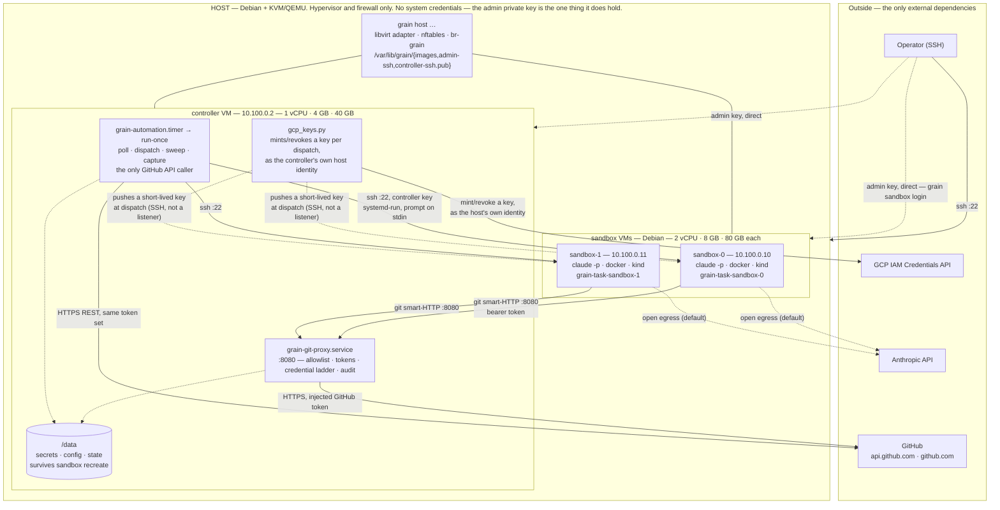
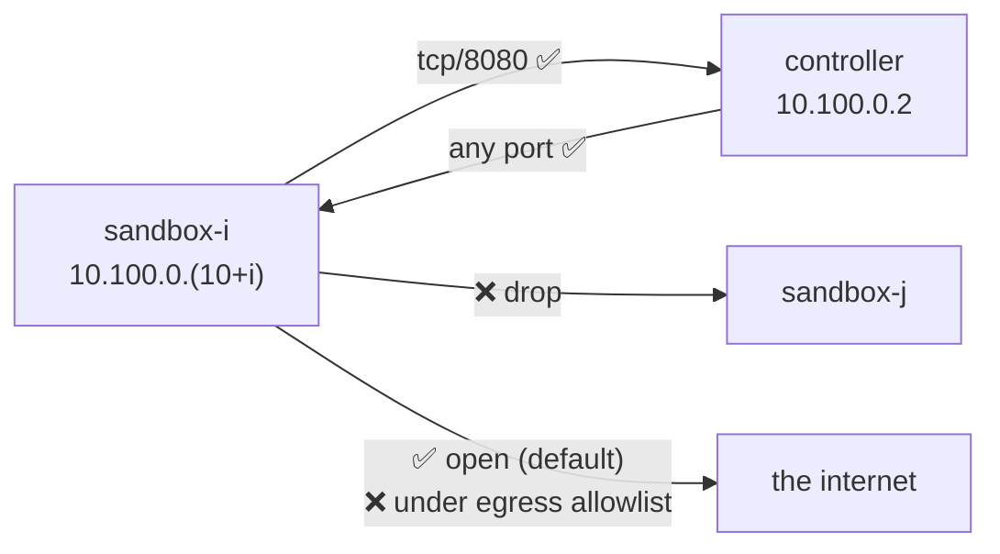
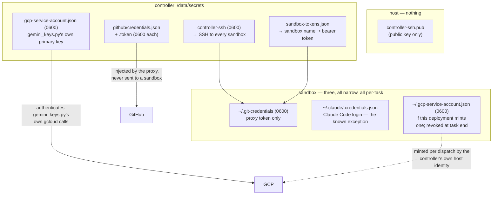
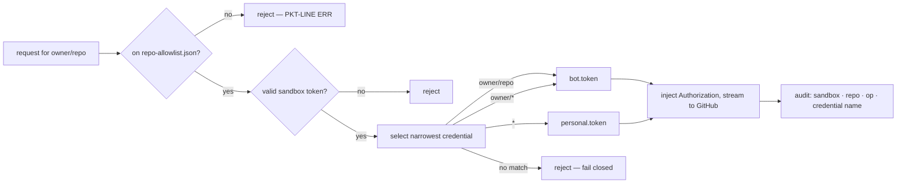
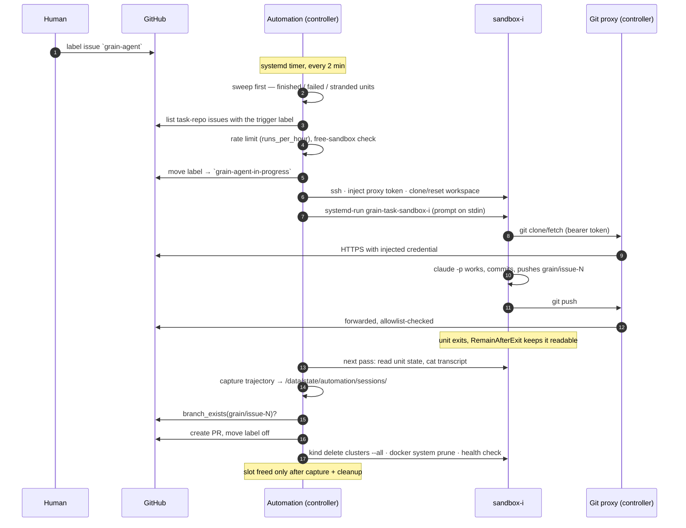

# System diagram

One page showing what runs where, which secret lives on which machine, and
which port each arrow actually uses. Everything here is derived from
`grain/inventory.py`, `grain/adapter/net_linux.py`, and the two scripts in
`provision/` — if this file and the code disagree, the code is right and
this file is a bug.

Defaults throughout: subnet `10.100.0.0/24`, bridge `br-grain`,
`sandbox_count = 2`, `--data-dir /data`.

- [Topology](#topology)
- [Machines and VMs](#machines-and-vms)
- [Components, by machine](#components-by-machine)
- [Addresses, interfaces, ports](#addresses-interfaces-ports)
- [Network policy](#network-policy)
- [Secrets](#secrets)
- [Trust boundaries](#trust-boundaries)
- [Issue to pull request, end to end](#issue-to-pull-request-end-to-end)
- [State on disk](#state-on-disk)
- [Where the diagram is aspirational](#where-the-diagram-is-aspirational)

## Topology



Read the diagram for three properties:

1. **No arrow from the host into a secret.** The host owns the hypervisor
   and the firewall; every credential is inside the controller VM.
2. **No arrow from a sandbox to GitHub or GCP directly.** A sandbox's only
   network route into the controller is `:8080`, allowlist-checked and
   audit-logged; its GCP credential (if any) arrives as a direct push at
   dispatch time over the controller's own SSH connection, not a listener
   a sandbox reaches on its own.
3. **No arrow between sandboxes.** Rule 5 of the ruleset drops it.

The dotted `sandbox → Anthropic API` arrows are the honest exception:
egress is open by default because agents need the internet, and Claude Code
currently runs *in* the sandbox with its own login credential.

## Machines and VMs

| | Kind | vCPU | RAM | Disk | Provisioned by | Holds secrets |
|---|---|---|---|---|---|---|
| host | Debian bare metal / GCP `n2-highmem-4` | 4 | 32 GB | — | by hand (see README) | no |
| `controller` | VM (KVM/QEMU) | 1 | 4 GB | 40 GB | `provision/controller.sh` | **yes — all of them** |
| `sandbox-0` | VM | 2 | 8 GB | 80 GB | `provision/sandbox.sh` | one, knowingly (below) |
| `sandbox-1` | VM | 2 | 8 GB | 80 GB | `provision/sandbox.sh` | one, knowingly (below) |

Sizes come from `Cluster` in `grain/inventory.py`; the budget reasoning
(`32 − 2 − 4 = 26 GB`, and why CPU binds before memory) is in
`docs/design.md`, "Resource budget".

## Components, by machine

### Host

| Component | Form | Notes |
|---|---|---|
| `grain host …` | `python3 -m grain.cli`, run as root | `up`, `create`, `start`, `stop`, `destroy`, `recreate`, `status`, `rules`, `egress` |
| `LibvirtAdapter` | `grain/adapter/libvirt.py` | shells out to `virsh` pinned to `qemu:///system`, `qemu-img`, `cloud-localds` |
| `LinuxNetwork` | `grain/adapter/net_linux.py` | creates `br-grain`, renders and applies the `nft` ruleset |
| base image | `/var/lib/grain/images/debian-12.qcow2` | stock Debian cloud image, fetched once |
| controller pubkey | `/var/lib/grain/controller-ssh.pub` | carried over by hand; injected as each sandbox's authorized key |

The host also runs the `lima` adapter variant (`grain/adapter/lima.py`),
which is the seam a macOS port replaces. See `docs/host-adapter.md`.

### Controller VM

| Component | Unit / entry point | Listens | Runs as | Reads |
|---|---|---|---|---|
| Automation loop | `grain-automation.timer` → `.service`, every 2 min | — (outbound only) | root | `/data/config/automation.json`, `/data/secrets/github/*`, `/data/secrets/sandbox-tokens.json`, `/data/secrets/controller-ssh` |
| Git proxy | `grain-git-proxy.service` (`python3 -m grain.proxy.server`) | `10.100.0.2:8080` | root | `/data/config/repo-allowlist.json` (hot-reloaded), `/data/secrets/github/*`, `/data/secrets/sandbox-tokens.json` |
| GCP key minting | `grain/automation/gcp_keys.py`, called from `core.py`'s dispatch/sweep | — (outbound only, `gcloud`) | root, as the host's own attached identity | `/data/config/gcp-key.json` |
| Session browser | `grain sessions list/browse` | — | operator | `/data/state/automation/sessions/` |
| Credential audit | `grain github audit` | — (outbound) | operator | `/data/secrets/github/*` |
| Sandbox ops | `grain host health/cleanup` | — | operator, over SSH | `/data/secrets/controller-ssh` |

The automation loop is `grain/automation/`: `github.py` (REST client),
`core.py` (the pass), `dispatch.py` (SSH + `systemd-run`), `sweeper.py`,
`ratelimit.py`, `state.py`, `capture.py`, `history.py`, `cleanup.py`,
`health.py`, `audit.py`, `tui.py`.

The git proxy is `grain/proxy/`: `core.py` (decide), `allowlist.py`,
`tokens.py`, `credentials.py`, `forward.py`, `protocol.py` (git-correct
rejections), `audit.py`, `server.py`.

### Sandbox VMs

| Component | Form | Notes |
|---|---|---|
| Agent task | transient unit `grain-task-<sandbox>`, `--uid=debian` | one task per sandbox at a time; `--property=RemainAfterExit=yes` so a finished unit can still be read back |
| Claude Code | `claude -p`, prompt on **stdin**, not argv | transcript redirected to `/tmp/grain-task-<sandbox>.transcript.jsonl` |
| Workspace | `/home/debian/workspace` | cloned/reset through the proxy on every dispatch |
| git credential helper | `store` → `/home/debian/.git-credentials`, `0600` | holds the sandbox's proxy token, never a GitHub token |
| Docker + kind | official apt repo; kind node image pre-pulled | `inotify` limits raised; `kernel.yama.ptrace_scope = 2` |
| Claude sandbox policy | `/home/debian/.claude/settings.json` | denies the agent's own Bash tool access to `~/.claude/.credentials.json` |

No GitHub API client, no `gh`, no `/data`. A sandbox *can* hold a GCP
service-account key at `~/.gcp-service-account.json`, `0600`, if this
deployment mints one — short-lived, revoked once the task ends (or after
24 hours regardless), and never anything capable of minting another.

## Addresses, interfaces, ports

Assigned by `grain/inventory.py`, never discovered — the firewall rules and
the VMs derive from the same numbers so they cannot drift.

| Name | Address | Host tap | Listens on | Reaches |
|---|---|---|---|---|
| host | `10.100.0.1` | `br-grain` | `:22` (external) | everything |
| `controller` | `10.100.0.2` | `gr-ctl` | `:8080` git proxy, `:22` | every sandbox, GitHub, GCP |
| `sandbox-0` | `10.100.0.10` | `gr-sb0` | `:22` (from controller only) | `10.100.0.2:8080`, open egress |
| `sandbox-1` | `10.100.0.11` | `gr-sb1` | `:22` (from controller only) | `10.100.0.2:8080`, open egress |

Before bwsalmon/agents#126, a sandbox's own default route also carried
its ADC probe to `169.254.169.254:80`, DNAT'd per source to a per-sandbox
`gce_metadata_server` instance on the controller. That rule is gone: GCP
access now arrives as a direct key push over the controller's own SSH
connection at dispatch time, not a network path a sandbox reaches on its
own at all.

## Network policy

`grain host rules` prints the ruleset; `grain host up` applies it. Rendering
is a pure function (`render_ruleset`), so it is inspectable without root or
a running kernel.



Evaluation order, from `net_linux.py`:

| # | Rule | Why |
|---|---|---|
| 1 | accept `ct state established,related` | replies need no rule of their own |
| 2 | per-tap anti-spoofing: `iifname "gr-sbN" ip saddr != <addr> drop` | makes the source address a fact, not a claim — the layer that keeps a stolen token from being usable elsewhere |
| 3 | controller → whole subnet: accept | the controller drives the sandboxes over SSH |
| 4 | sandbox → controller on `:8080` only | the one narrow endpoint, and nothing else |
| 5 | anything else subnet→subnet: drop | this is what stops sandbox↔sandbox |
| 6 | subnet → off-bridge: accept + masquerade, **open mode only** | agents need dependencies; `grain host egress allowlist` removes it |

Two deliberate omissions:

- **The host's INPUT chain is not managed.** On a cloud host the provider
  firewall is the inbound control, and a generated INPUT policy is an
  excellent way to lock yourself out of a machine whose console you may not
  have. `grain host rules --input-chain` renders one; nothing applies it.
- **No inbound path from GitHub.** Intake is cron polling, not webhooks, so
  the only externally reachable port in the system is the host's SSH.

## Secrets

### Where each one lives



### Inventory

| Secret | Path | Mode / owner | Who reads it | Rotation |
|---|---|---|---|---|
| Controller SSH key | `/data/secrets/controller-ssh` | `0600` root | automation dispatch, `health`, `cleanup` | regenerate, re-inject pubkey on the host, recreate sandboxes |
| Sandbox bearer tokens | `/data/secrets/sandbox-tokens.json` | root | git proxy (verify), automation (`ensure_token` mints one on a sandbox's first dispatch, then injects it) | replace file, restart proxy; **not** rotated by `recreate` today |
| GitHub credential set | `/data/secrets/github/<name>.token` | `0600` root | git proxy, automation loop | replace file, restart proxy and let the timer re-run |
| GitHub credential map | `/data/secrets/github/credentials.json` | `0600` root | as above | same — read once at construction, not watched |
| GCP primary service-account key | `/data/secrets/gcp-service-account.json` | `0600` root | `gemini_keys.py`'s own gcloud calls | replace file, next `automation run-once` picks it up |
| Sandbox proxy token | `/home/debian/.git-credentials` on each sandbox | `0600` `debian` | `git` via the `store` helper | re-injected on every dispatch |
| Claude Code login | `~/.claude/.credentials.json` on each sandbox | `debian` | the `claude` process | re-authenticate on sandbox recreate |
| Sandbox GCP key | `~/.gcp-service-account.json` on each sandbox | `0600` `debian` | `gcloud`/client libraries, if the agent activates it | minted fresh per dispatch, revoked at task end (or after 24h regardless) — `grain/automation/gcp_keys.py` |
| Public key (not a secret) | `/var/lib/grain/controller-ssh.pub` on the **host** | `0644` | `LibvirtAdapter`, at sandbox create | — |

Rules that hold across all of them:

- **No secret is ever baked into a provisioning script or an image.**
  `provision/*.sh` create paths, users, and units; values are placed by
  hand, once.
- **`config/` is hot-reloaded, `secrets/` is not.** The allowlist is re-read
  per request; every credential is loaded once at construction, so rotation
  is uniformly "replace the file, restart the one service that reads it".
- **The token never reaches an argv.** Both the prompt and the sandbox token
  travel to a sandbox over SSH **stdin**, so neither lands in `ps` output or
  in this project's own command logging.
- **`/data/secrets` is `0711`** — traverse, not list. `secrets/github/`
  stays `0700`, root-only.

### The credential ladder

The proxy holds a *set*, and picks the narrowest pattern covering the target
repo — exact `owner/repo`, then `owner/*`, then `*` — and records which one
served each request.



Scopes withheld from every credential: `workflow`, `delete_repo`,
`write:org`, every `admin:*`. `grain github audit` checks this and exits
nonzero on a `flagged` verdict. Write safety (no push to the default
branch, no force-push, no deletion) is enforced by **GitHub** branch
protection, not by parsing pack files — a control our bugs cannot bypass.

## Trust boundaries

| Boundary | Crossed by | What is checked |
|---|---|---|
| internet → host | operator SSH only | provider firewall / host SSH config |
| host → VMs | hypervisor | none — a host compromise owns everything below it |
| sandbox → controller `:8080` | git smart-HTTP | path shape + `git/*` UA, repo allowlist (default-deny), sandbox bearer token, source address pinned by nftables |
| controller → sandbox | SSH as `debian` with the controller key | no host-key pinning by design (a sandbox gets a new key each recreate); identity comes from the fixed address on a firewalled bridge |
| controller → GitHub | REST, and the proxy's forwarded git | credential ladder + GitHub-side scoping |
| controller → GCP | `gcloud`, as the controller's own attached host identity | `roles/iam.serviceAccountKeyAdmin`, scoped to the one narrow agent account; mint/revoke only, never impersonation |
| issue text → agent prompt | the automation loop | **a human applying the label is the gate**; nothing the agent then says is trusted as input to a GitHub write |
| issue text → which repo the work lands in | the automation loop + `repo-allowlist.json` | a task's `/repo` directive only selects from the operator's allowlist — the same file the git proxy enforces; anything else is parked with a comment, never dispatched |

That last row is the one worth restating: the branch a PR is opened from is
computed by the controller (`branch_name(issue) = grain/issue-<N>`) and
verified to exist on GitHub, never taken from the agent's own report — the
agent's prompt came from untrusted issue content.

## Issue to pull request, end to end



Failure paths land in the same place: a failed or stranded run gets the
issue re-labelled and requeued, the trajectory captured either way, and one
JSON line per decision appended to `/data/state/automation/audit.log` with
an outcome of `dispatched`, `succeeded`, `failed`, `stranded`, or
`skipped: <reason>`.

Labelling an existing **PR** takes the same path, except the workspace is
reset to that PR's head branch and the agent pushes more commits to it
instead of the controller opening anything.

## State on disk

```
/data/                              # the only stateful thing in the system
  secrets/                          # see the inventory above
  config/
    repo-allowlist.json             # hot-reloaded, default-deny
    automation.json                 # task repo, default target, labels, limits
    gcp-key.json                    # agent SA email + project id, if GCP access is on
  state/
    automation/
      state.json                    # sandbox ⇢ issue/PR assignment (carries the minted GCP key id, if any)
      audit.log                     # one JSON object per decision, including key mint/revoke/reap
      sessions/                     # captured trajectories, per dispatch
    git-proxy/audit.log             # sandbox · repo · op · credential
```

Backup is a snapshot of `/data`, and nothing else. Because intake is
polling and there is no inbound dependency, **stopping the instance when
idle is supported** — the loop resumes where it left off and the sweeper
requeues anything caught mid-flight.

## Where the diagram is aspirational

Stated here rather than buried, because a system diagram is exactly the
document that quietly claims more than the code does:

- **The sandbox is not credential-free.** Claude Code runs in-VM with a
  login credential — hardened (`ptrace_scope=2`, its own bubblewrap-backed
  credential deny rule) rather than avoided. The controller-side LLM proxy
  that would close this is designed but not built; it is the missing box on
  the controller.
- **Egress is open by default**, so the `sandbox → internet` arrows are
  wider than any of the narrow ones. `grain host egress allowlist` is the
  opt-in tightening, and no firewall rule short of a domain allowlist
  changes what a compromised sandbox can exfiltrate.
- **`recreate` does not rotate `sandbox-tokens.json`** today, despite the
  design describing rotation as folded into it. Rotate as a separate step.
- **The GCP path has never minted a key against a real project**, and the
  full pipeline has run end to end only against a mocked GitHub.
- **The host adapter has two implementations in tree** (libvirt, lima) but
  only the libvirt one is exercised; the macOS column of the topology —
  `socket_vmnet` instead of tap-per-VM, `pf` instead of `nftables`, and no
  per-tap anti-spoofing at all — is a plan, not a deployment.

See `docs/design.md` for the reasoning behind each box, `docs/runbook.md`
for the procedures, `docs/host-adapter.md` for the platform seam, and
`docs/roadmap.md` for item-by-item status.
